# 红帽认证系列工程师RHCE RH124-Chapter02：访问命令行 - P1：02-1-访问命令行

## 概述
在本节课中，我们将学习如何访问并使用命令行来管理Linux操作系统。这是本章的核心内容。我们将从本地登录开始，介绍命令行界面的基本构成，并学习如何高效地执行命令。

---

## 认识Shell 🐚
上一节我们认识了Linux发行版和红帽。本节中，我们来看看与系统交互的核心工具——Shell。

Shell，字面意思为“壳”，是用户与Linux系统内核之间的中介。它将管理人员输入的指令转换为系统能够识别并执行的命令。最常用的Shell之一是Bash Shell，它是早期Unix上Bourne Shell的改进版本。

要在Shell上输入命令，我们需要一个界面。历史上主要有三种硬件设备：
*   **终端 (Terminal)**：早期让多个用户共享昂贵主机的输入输出设备。
*   **控制台 (Console)**：直接连接并控制主机的专用设备，功能丰富。现代Linux将个人电脑的显示器视为控制台。
*   **电传打字机 (TTY)**：使用电信号和纸带传输指令的设备。

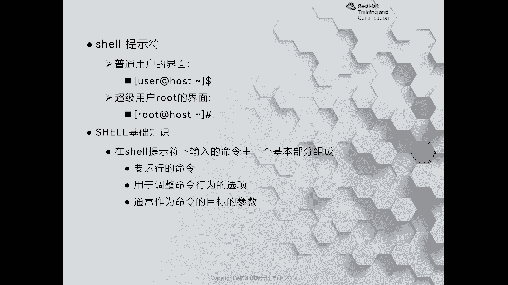

如今，这些硬件已被软件模拟。我们使用的“终端”或“控制台”窗口都是软件程序。

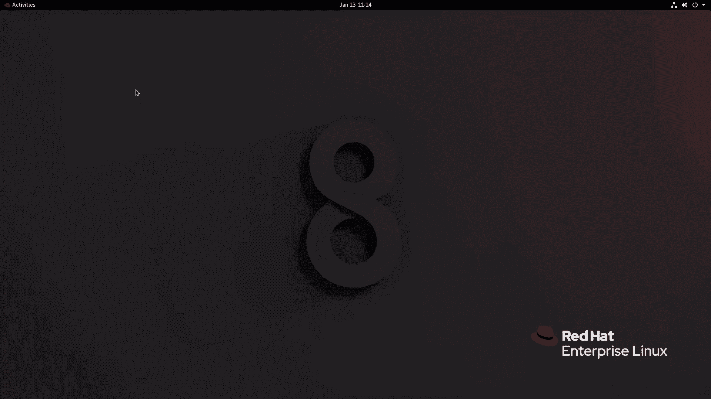

---

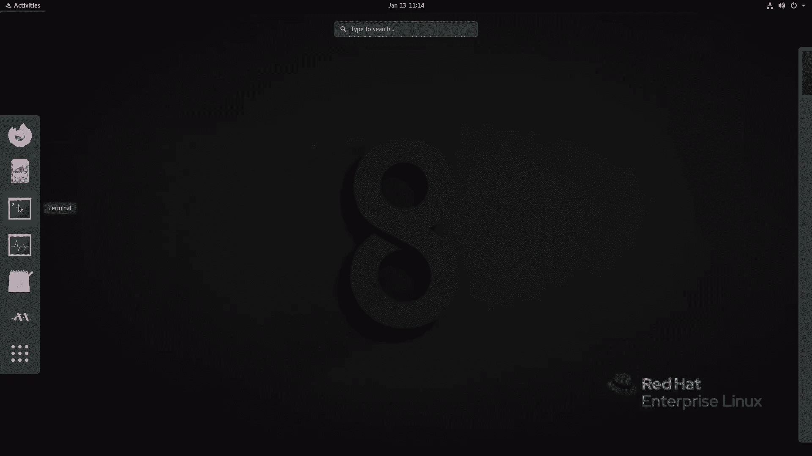

## Shell提示符与登录 💻
上一节我们了解了Shell的概念。本节中，我们来看看如何通过Shell提示符登录系统并开始工作。

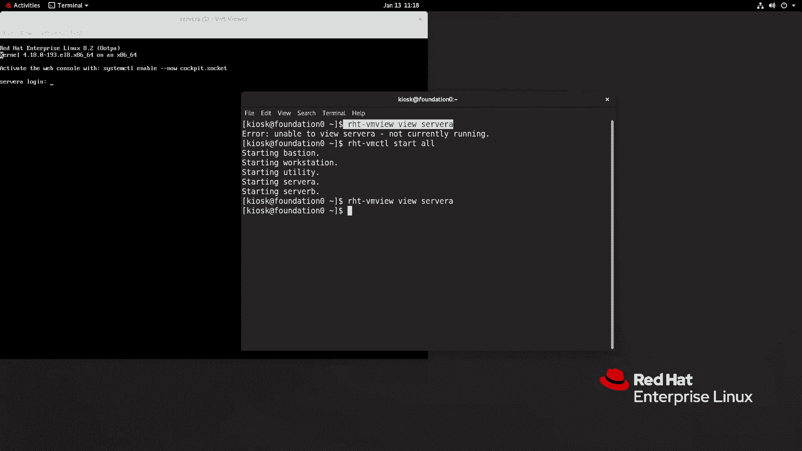

Shell提示符是等待用户输入命令的标识。主要有两种：
*   **`$` 符号**：代表当前用户是**普通用户**。
*   **`#` 符号**：代表当前用户是**超级管理员 (root)**。

### 登录Linux系统
有多种方式可以登录到Linux系统并打开命令行界面。

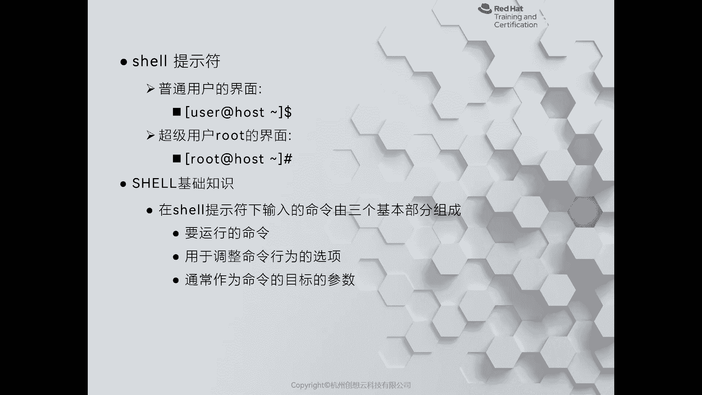

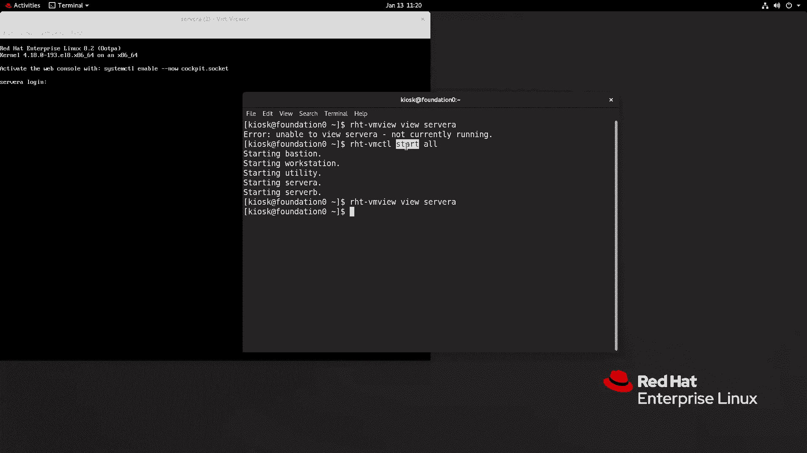

以下是常见的登录方法：
1.  **本地图形界面登录**：在桌面环境中（如GNOME）打开终端模拟器（如GNOME Terminal）。
2.  **本地文本控制台登录**：在纯粹的文本界面中直接登录。在红帽Linux 8中，可以通过 `Ctrl+Alt+F1` 到 `Ctrl+Alt+F6` 组合键切换到不同的文本控制台（tty1-tty6）。在虚拟机中，可能需要通过菜单发送组合键。
3.  **远程登录**：通过网络使用SSH等协议登录到服务器，这是管理服务器最常用的方式。例如，使用命令 `ssh student@servera`。

**注意**：在Linux系统中，`Ctrl+Alt+Delete` 组合键通常代表重启系统，操作时需谨慎。

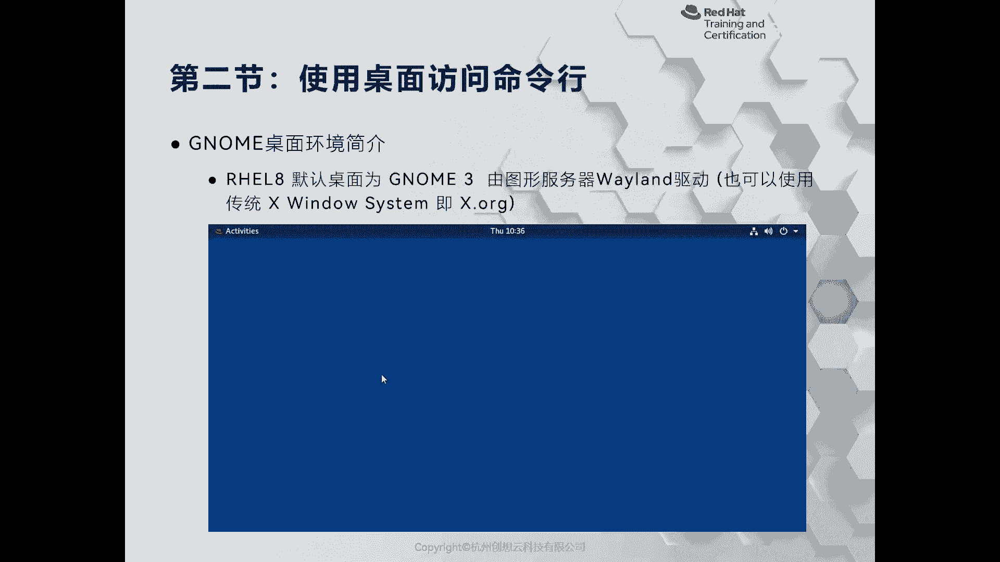

### 退出登录
完成操作后，需要正确退出会话。
*   在**命令行界面**（包括远程SSH和本地文本控制台），输入命令 `exit` 即可退出。
*   在**图形化界面**，点击屏幕右上角的用户菜单，选择“登出”或“注销”。

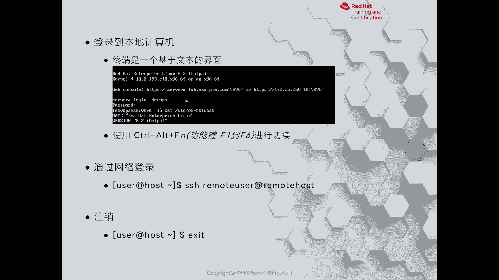

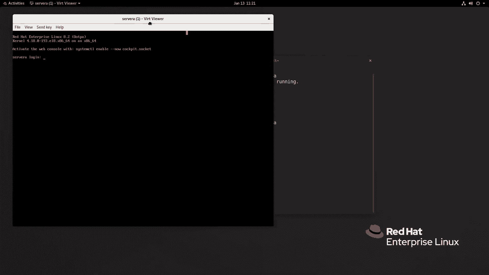

---

## 命令的组成 🛠️
上一节我们学会了如何登录系统。本节中，我们来看看在Shell中命令是如何构成的。

一条完整的Linux命令通常由三部分组成：**命令**、**选项**和**参数**。

我们可以用一个比喻来理解：
*   **命令**：就像一辆**汽车**，是执行任务的核心工具。
*   **选项**：就像车上的**导航仪**，用来调整命令的具体行为或输出格式。选项通常以 `-` 或 `--` 开头。
*   **参数**：就像**目的地**，是命令作用的对象或目标。

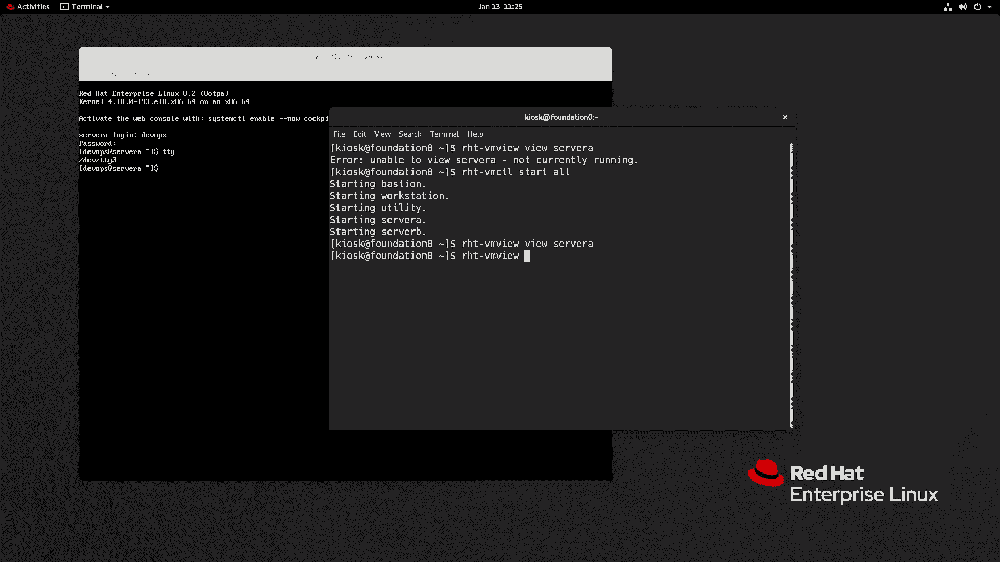

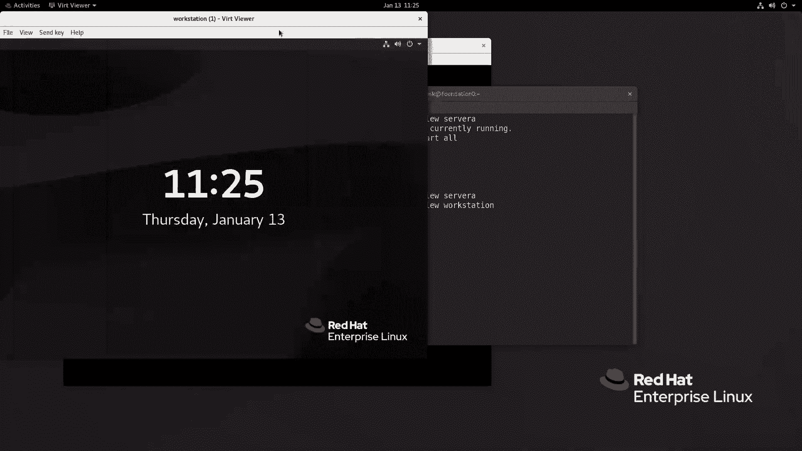

**公式**：`命令 [选项] [参数]`

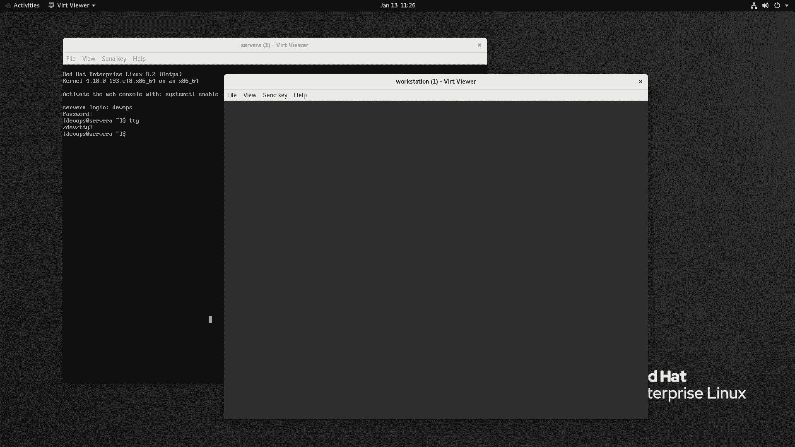

例如，在命令 `ssh student@servera` 中：
*   `ssh` 是**命令**（连接工具）。
*   此命令没有显式的**选项**。
*   `student@servera` 是**参数**（指定连接的目标用户和主机）。

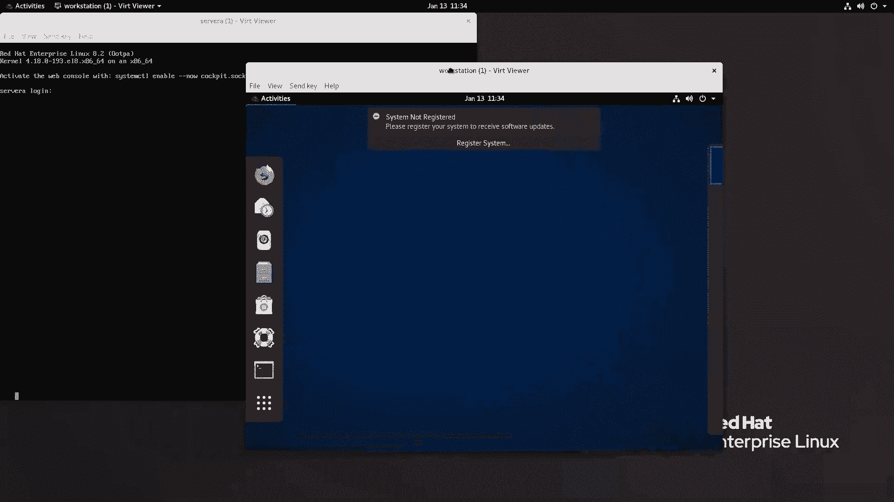

在命令 `ls -l /home` 中：
*   `ls` 是**命令**（列出目录内容）。
*   `-l` 是**选项**（以长格式显示详细信息）。
*   `/home` 是**参数**（指定要查看的目录）。

---

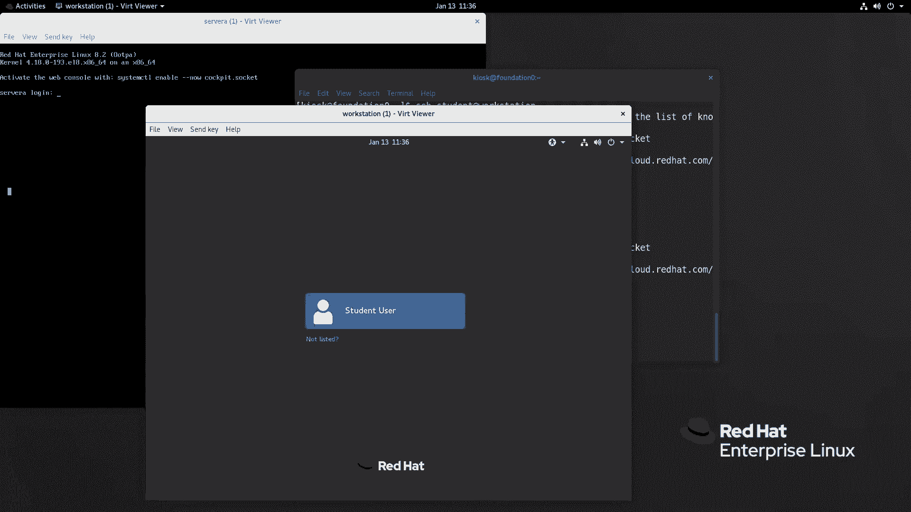

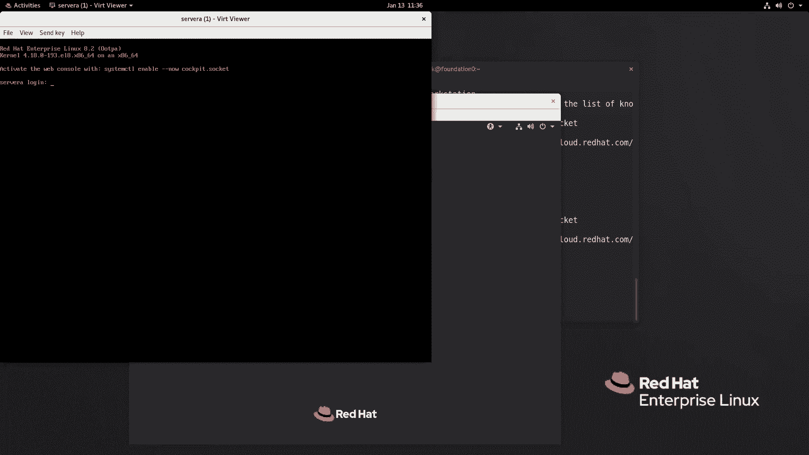

## 总结
本节课中，我们一起学习了访问Linux命令行的基础知识。我们首先认识了Shell作为用户与系统交互的桥梁。然后，我们实践了通过图形界面、文本控制台和远程SSH等多种方式登录系统，并学会了如何安全退出。最后，我们剖析了Linux命令的基本结构，理解了命令、选项和参数各自的作用与关系。掌握这些是高效使用命令行管理Linux系统的第一步。