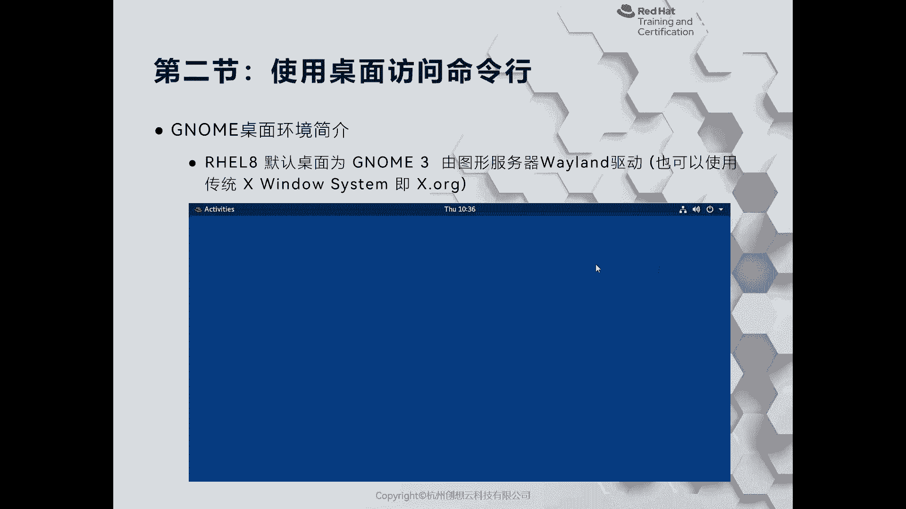
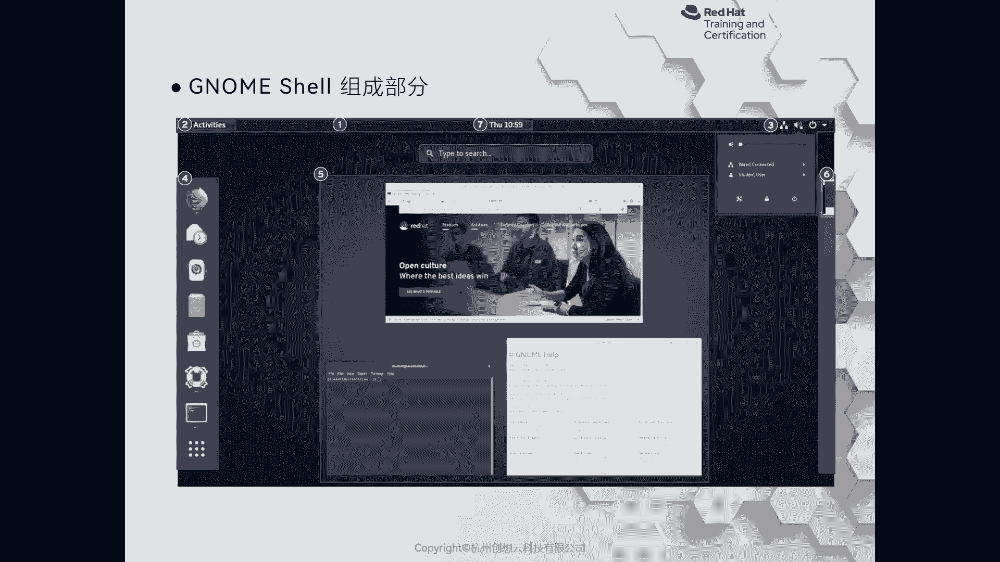
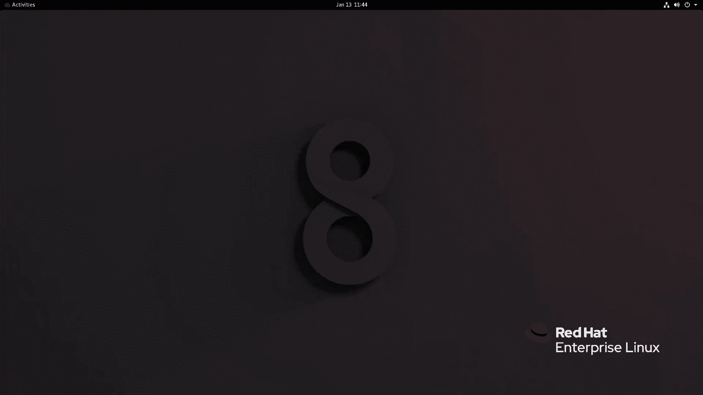
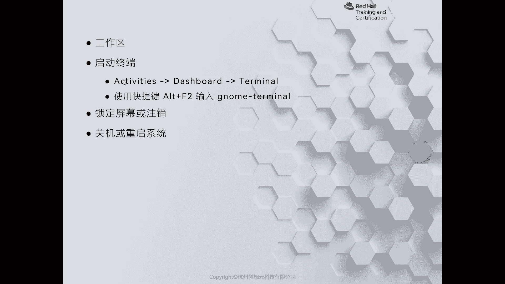
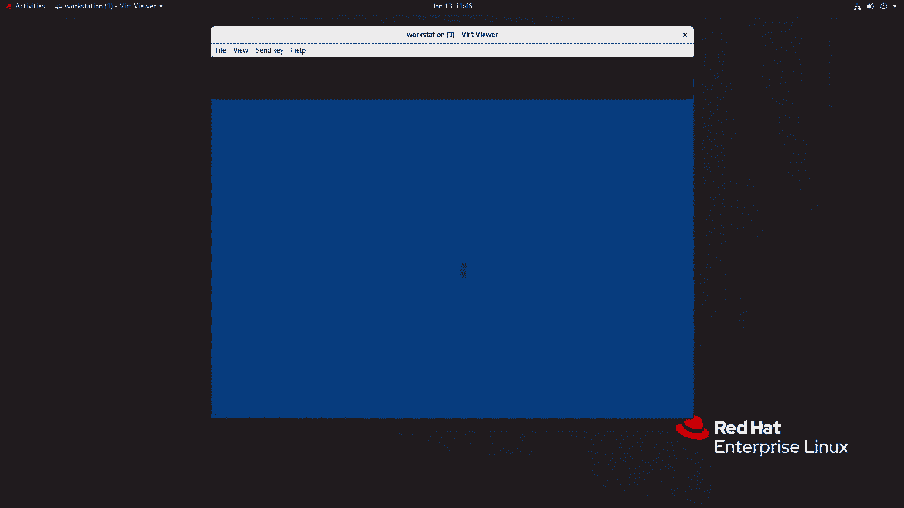
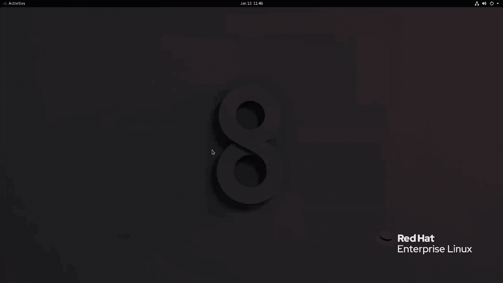

# 红帽认证系列工程师RHCE RH124-Chapter02-访问命令行 - P2：02-2-访问命令行-使用桌面访问命令行 - 杭州创想云教育 - BV1PU4y1k7ti

啊，这着刚才呢我们给大家介绍了如何通过文本控台啊，网络以及图形化界面登录到我们的服务器的方式。接着呢我们来认识一下如何使用桌面来访问我们的命令行。啊。

那么在一些特殊的需求下呢啊我们有些用户呢也会去安装图化界面啊，在我们的服务器的操系统上面。啊，那么对于红木切板八而言啊，那么从红木切板7开始，我们的红木切板linkux。

就开始使用了啊gome版本三的啊桌面环境啊桌面环境哎那么。但是呢和7的版本变化最大地方就在于我们的红帽7版8使用的是叫做vland的一个图鹰服务器的驱动啊，这是默认的。当然了。

你也可以去把它切换为早期的X window system啊，我们称为是X点ORG那这样一个啊服。OK那么对于linkux而言，它的图画界面和windows是不一样的。

因为linux呢是一种模块化的测作系统。因此啊那么图形化界面呢只是它里面的某一个应用程序而已啊。如果我们不选择安装，是不影响我们的系统正常运行的啊。就比如说刚才我们在登录到servA的时候一样。

是没有图化界面的啊。如果你想便于操作，并且你有这方面的需求，那么可以选择安装图化界面。但是要注意，安装图画界面会消耗大量的计算资源。好，我们来看一下我们的图画界面的组成部分。在我们的。

其实很丰富的啊，比如说比比如说这个什么Xface，对吧？哎，这个性能更加要比gome的性能要更好。当然呢还有这个KDE啊，那么以漂亮为著称啊，那么在红帽里面一直走的是Gome以精简为著称啊。

那么我们现在看到这个界面呢，就是针对于Gome三的啊这样一个催化界面的一个介绍。啊，在我们的标签一的地方呢是我们的上方的一个呃任务栏啊任务栏。那么在任务栏当中一般也可以称为顶栏吧。在这里面应该称为顶栏。

OK那么顶栏当中的话呢包含的有啊，我们的左边的一个什么呀activities啊，叫活动预览或活动概栏，中间呢是我们的日期和时间啊，以及日历啊，就七的部分啊。

右侧的话呢三的部分呢可以啊查看我们当前的网络连接啊，音频的连接情况啊，还可以选择什么呀啊这个。右上角挨着呃一个电源开关的图标的那个那个那个符号，还可以选择什么呀？呃切换用户啊，打开设置啊。

这里的这个打开设置锁定啊，关机锁屏重启等等操作。在次的这一块呢是我们的dashboard啊，里面显示了两个部分内容，一个呢是我们收藏的应用程序。第二部分呢是打开的应用程序啊。

在最下方的一个99个点呢是打开我们的菜单啊，菜单。okK啊，打开菜单呢类似于麦克啊，这个里面的那个二级菜单。OK那么中间的五的部分呢是我们的缩略图啊，就当前的工作空间。

你打开的应用程序右侧的六啊六部分则是我们的不同的工作区域啊工作区域。OK好，那么我这里呢同样啊以我们本地的环境来打开，让大家看下效果啊，我现在去登录。

输入账户的密码student，如果你不喜欢使用vland，那么可以在登录的左侧有一个齿轮状的图标，点击你可以去切换啊，默认走的是vland。当然可以选择X11啊。

就是我们刚才提到的啊X点ORG啊XORGOK好，我们选择默认啊登录。啊，登录成功之后呢，我们就能看到一个啊。这个最初始的G能桌面环境啊，背景色呢是蓝色的啊，蓝色的没有任何的背景啊。

那么因为是红帽写完linkux，它会提示我们系统要注册，我们可以关闭掉这个注册提示OK那么左上角呢是活动盖栏点开啊，看到左侧的但ashboard啊，上方呢顶来呢是时间日期啊。

然后呢右侧上角呢有我们的连接啊，这个声音啊，还有其他的管理啊管理。那么在左侧的但是board呢，我们可以选择打开其他内容，比如说这里提示到的一个。啊，这个show applications啊点开。啊。

就能看到我们的所有的应用程序啊，所有应用程序。那么进到我们桌面的话呢，我们也可以选择stopware进行安装软件。但是。客观的来说啊，那么目前为止。

这种links上面的这种统一的软件管理方案还不太好用啊，还不太好用啊。OK还不如windows的啊 store这个功能啊，还这个差的远，因为你需要自定义的去设置软件仓库的源等等其他的。啊。

这里面还有其他，比如说邮件啊，文件啊，这个浏览器啊，即时通信啊，一个订阅的logo啊，音频播放器啊，设置对吧？还有文本编辑，还有其他的使用工具。还有音频等等啊。

比如说我们这里呢呃可以选择一个什么其他内容啊，可以选择其他内容啊，都是可以的啊，都是可以的。因为退化界面操作起来还是不是特别的舒服啊，所以说我这边呢就给它关闭掉了啊，关闭掉了。

好，接着呢我们再往后看啊，这是刚才给大家提示的啊一个啊方这个介绍啊工作区。

好，我又把退化界面打开了啊。那么在我们的这个退化界面上啊，其实刚才给大家介绍了一种打开哎终端的方式，对吧？那么还有一种方法呢，就是当我们的键盘呃不是sorry啊，带我们的这个鼠标啊，这个不太好用的时候。

哎，我们可以利用windows呃啊，使用我们键盘上的快捷键啊，直用alt加F2。啊，它会弹出来一个快捷键的窗口，输入我们的软件的名称啊，叫JNU啊，去弄啊，横杠shall回车啊，就能打开一个终端。

那sorry agome shell要指的是我们的这个环境啊，我重新来一次叫gomepermin啊，permin啊终关啊啊就打开了啊就打开了啊。啊，然后呢我们演示结束那我们这边呢就把这个。我选择什么呢？

我选择注销啊注销啊，关闭。

寻机的consl啊即可。啊，即可。

