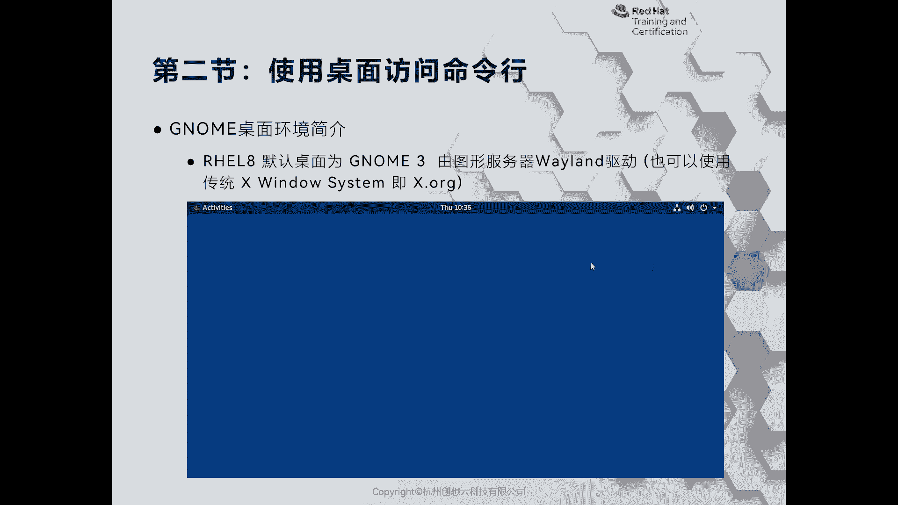
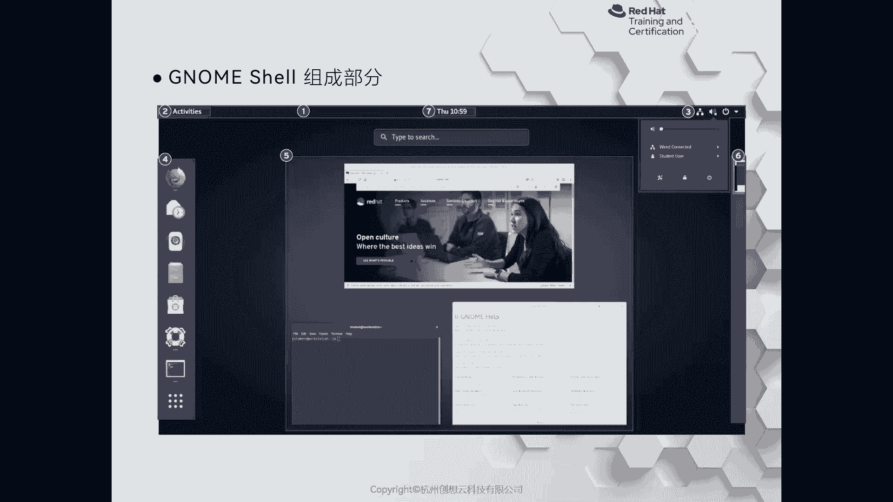
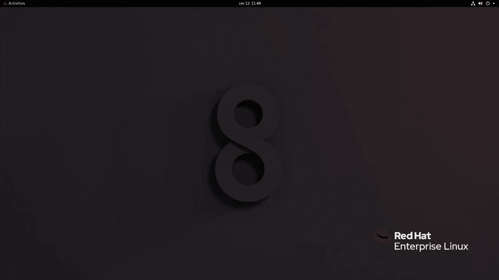
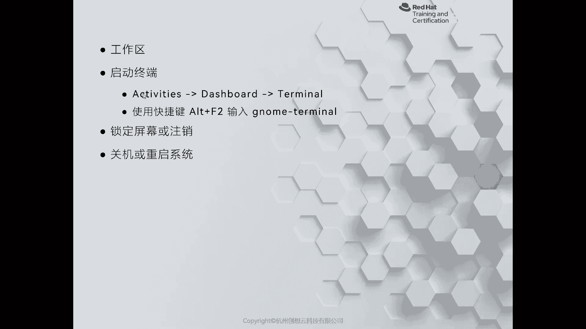
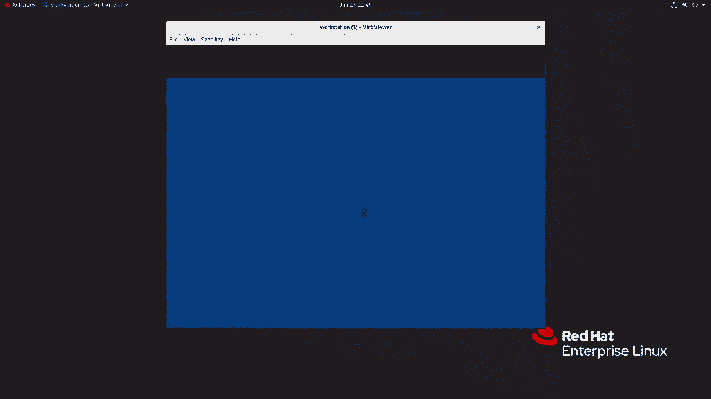
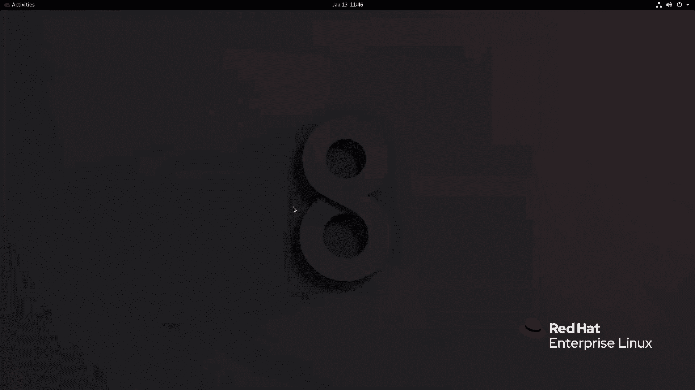

# 红帽认证系列工程师RHCE RH124-Chapter02-访问命令行：P2：02-2-访问命令行-使用桌面访问命令行 🖥️

在本节课中，我们将要学习如何在安装了图形化界面的Red Hat Enterprise Linux 8系统中，通过桌面环境来访问命令行界面。我们将了解图形化界面的基本构成，并掌握几种启动终端的方法。

上一节我们介绍了通过文本控制台、网络和图形化界面登录服务器的方式。本节中我们来看看如何具体使用桌面环境来访问命令行。

## 图形化界面概述

在一些特殊需求下，用户可能会在服务器操作系统上安装图形化界面。对于Red Hat Enterprise Linux 8而言，从RHEL 7开始，系统就默认使用了GNOME 3桌面环境。但与RHEL 7最大的不同在于，RHEL 8默认使用Wayland作为图形服务器驱动。当然，你也可以将其切换为早期的X Window System（即X.Org）。

对于Linux而言，其图形化界面与Windows不同。因为Linux是一种模块化的操作系统，图形化界面只是其中的一个应用程序。如果不选择安装，它不会影响系统的正常运行。例如，之前登录serverA时就没有图形化界面。如果你为了便于操作且有相关需求，可以选择安装图形化界面。但需要注意，安装图形化界面会消耗大量的计算资源。

## GNOME 3桌面环境组成

Red Hat Linux主要使用以精简著称的GNOME桌面环境。以下是GNOME 3图形化界面的主要组成部分介绍：

1.  **顶栏**：位于屏幕上方。左侧是“活动”概览按钮，中间是日期、时间和日历，右侧可以查看网络连接、音频状态，并进行用户切换、系统设置、锁屏、关机等操作。
2.  **仪表盘**：点击“活动”后，屏幕左侧会显示仪表盘。这里包含两个部分：收藏的应用程序和当前打开的应用程序。
3.  **应用程序菜单**：仪表盘最下方的九个点图标用于打开完整的应用程序菜单，类似于macOS的启动台。
4.  **窗口缩略图**：在“活动”视图的中间区域，会显示当前工作空间中已打开应用程序的缩略图。
5.  **工作区**：在“活动”视图的右侧，可以管理不同的工作区域，实现多任务空间的切换。

## 在桌面环境中启动终端

在图形化界面上，有多种方式可以打开命令行终端。

以下是两种常用的启动终端的方法：

*   **通过图形菜单启动**：点击“活动”按钮，在仪表盘或应用程序菜单中找到“终端”应用并点击打开。
*   **使用快捷键启动**：当鼠标不便操作时，可以使用键盘快捷键 **`Alt + F2`**，在弹出的运行对话框中输入 `gnome-terminal`，然后按回车键即可打开一个终端窗口。

## 从图形界面切换到控制台

如果你需要从图形化桌面环境切换到纯文本控制台，可以同时按下 **`Ctrl + Alt + F2`**（F2至F6均可）组合键。这将带你进入一个虚拟控制台。若要切换回图形界面，通常可以按下 **`Ctrl + Alt + F1`** 或 **`Ctrl + Alt + F7`**。

本节课中我们一起学习了在RHEL 8的GNOME桌面环境中访问命令行的方式。我们认识了图形化界面的基本结构，掌握了通过菜单和快捷键打开终端的方法，也了解了如何在图形界面与文本控制台之间进行切换。理解这些操作是高效使用Linux系统的基础。