# 红帽认证系列工程师RHCE RH124-Chapter02-访问命令行 - P3：02-3-访问命令行-使用Bash shell执行命令 - 杭州创想云教育 - BV1PU4y1k7ti

好，我们接着来看第三节啊，使用blash shell来指用命令。那么我们上一章节呢给大家已经介绍了如何通过SI区命令啊，然后呢来实现一个网络的登录啊。那么无论是从文本。啊。

这个界面还是走图形化界面以及走网络的登录啊，那么登录之后呢，我们都要使用bsh进行交互啊。那么在交互的时候呢，我们一定要严格遵循执行命令的语法结构，那么就是命令啊空格啊选项空格后面的参数啊。

其中选项和参数呢是根据你的需要进行适当的选择啊，甚至呢有些命令的选项和参数部分啊，命令的选项和参数部分是有一一对应的。就说不同的选项匹配不同的参数啊。O好。

那么现在呢我们通过远程的方式呢来登录到word station。

啊，我这里呢使用的是student的账户，来登录到for stationation。啊。😮，登录成功之后，那么我们这里呢给大家介绍一些最常见的命令。比如说我如果啊如果我的这个seel是不显示用户的。

或者说某些原因啊，这个用户信息不够健全，那么我们可以使用whoII的命令。来打印我们当前登录的用户身份。啊，然后呢如果啊如果我们在一个终端上面啊，同时啊想按照先后顺序的执行若干命令。

中间可以使用冒号那个封号隔开啊，比如说我想指用一个啊IPADDRQ来打印我的。网络信息啊，然后呢我加一个分号啊，在这一个ho name来打印主机名啊，那么我们发现在终端的这里啊。

我要比我选中的部分就是我们第一个IPER shoe来打印的结果啊，后面没有被选中的部分则是第二个指令。OK注意啊，多个命令之间可以用分号啊，这里的分号隔开啊，分号隔开。

那如果两个命令之间啊有依赖关系啊依赖关系，那么我们可以使用什么呢？使用and。啊，使用按啊，代表的是只有前面的命令执行成功，才会执行后面的命令。O比如说我前面这次来个简短一点的，比如说这一个户。A I。

啊，缓慢啊这样的一个过程啊，就是现在我给大家举的例子呢，就是结果呢是没有什么区别啊，但是他在执行的时候是有逻辑上的区分的啊。OK好，那么接着呢给大家呢做一些简单命令的事例。啊。

那么这里呢给大家介绍以下几个命令，比如说前命令。这个命令的话呢，可以来打印当前的时间日期啊。passWD呢则是用来打印当前自己的啊这个用来更改当前自己的用户的密码。O第三个指令呢就是一个fi啊。

file的话呢可以帮助我们判断文件类型啊好。

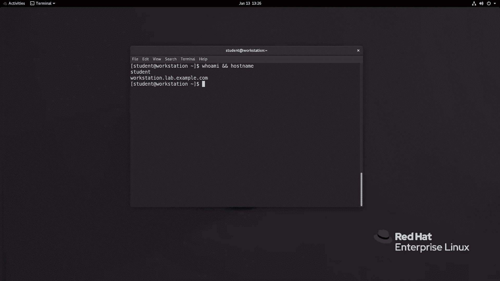

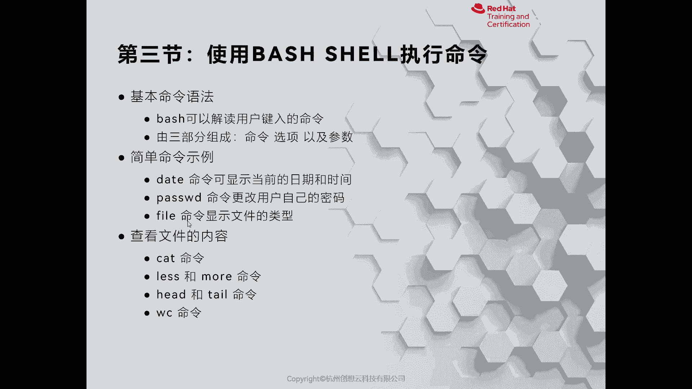

首先啊我这里呢只有一个。对啊，就打印了当前的系统时间啊，那么我们可以使用命令空格啊，大部分的命令呢都有一个长格式的选项叫做dash dash help。来获得帮助啊，我们来回撤啊。

那么在打印的报告信息当中啊，里面会有一些简要的说明啊，比如说该命令的语法格式啊，b空格啊，构命跟上选项。那这里的选项呢是由中括号括起来的，就代表的是可选。

那么如果后面有三个句点就代表的是可以多个选项进行组合。再往后呢，有一个什么呀？一个加format，那就是一个格式啊，而这里的格式呢也是我们用的频率比较高的。比如说我们往下帮助，这里面有个form。

formment里面的话呢有各种各样的格式。比如说这里的百分号F则代表了完整的日期和百分号YM和D是相同的。而白分号Y呢又代表什么意思呢？代表是年份。小写的M呢代表的是月份。啊。

然后呢还有一个单位是什么呀？还有一个单位是D啊，代表的是天啊。好，那么我们就可以有一个这样的一个语法结构啊，date啊加formit format分号F。说都可以打出来年月日。好，这个是date命令啊。

如果我们要想清空当前终端的内容，可以使用clear来清空好，回车就清除跟进啊，接着呢给大家演示第二个指令叫passWD啊。passWD的话呢，目前我们学习的啊，就是只用来更改当前用户身份的密码。

那么我当前呢是sdent啊，那我就可以执行一个passW。空格就不用加任何内容啊，就直接回车就可以了。那么首先输入当前用户的信息啊，这个时候呢是做身份的验证，输入的是自己的密码。好。

然后呢再输入新的密码，注意新的密码必须严格的符合密码的策略。你的密码长度呢要大于8个字符，且不能使用基于字典的弱密码。好，我现在呢先有个简单的密码。我们来看一看它的报错信息。我用的是12345678啊。

你会发现它会提示啊，bu the password对吧？比说我的密码呀不够好，那么我们重新的通过验证，然后呢，我们输一个新的密码，好吧，比如说一个大写的P at啊。SSW啊0RD感叹号感叹号。好吧，好。

我这边给他记一下，好像密码还不够复杂。

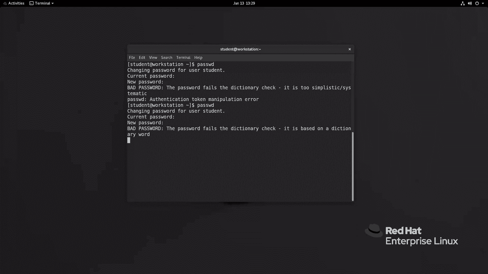

啊，好，我这边使用的是P at啊SSUO啊变成0了RD啊，感叹号小火弧啊，再来一个4啊。啊，这样的话应该会复杂一些。我们来试ctrl C复制啊啊重新。优待他。然后呢，我这边右键粘贴。呃。

看来还是不够复杂啊，那我们就在键盘上随机的啊执行一些字符串好了。啊啊这次呢应该足够复杂了。ctrol copypy。好，我们来粘贴。啊，这次呢就不再提示了，对吧？好，这行。

那这时候我的密码呢就更改完了啊，这个密码呢我就暂时先保存一下啊，防止呢我后面呢给它忘记掉啊。

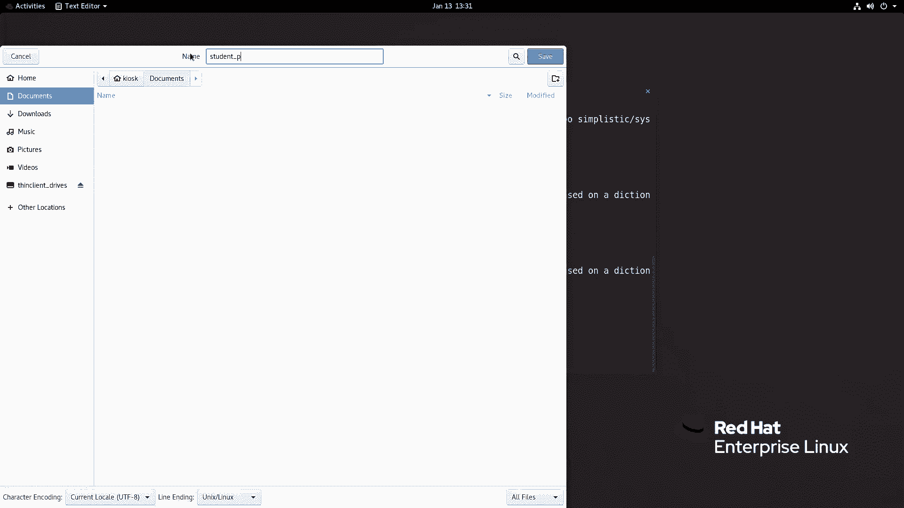

保存一下啊，那么接着啊接着啊我们再来给大家介绍一下一个命令呢，叫file啊。fill的话呢是用来判断文件类型的啊，那么为什么我们要去判断文件类型呢？是因为在linux当中啊。

我们有一句话呢叫做一切接文件，什么意思呢？就是说在我们的linux里面，我们在windows里面常说的一些术语，在这里呢是不够适用的。比如说啊我们平常说的什么文件夹呀，磁盘呀等等。

在我们的linux里面把它可以改为啊，叫做目录文件，啊，那么磁盘的话呢就是一个快设备文件，像我们的键盘那是一个输入设备，对吧？我们把它称之为是键盘文件，O那么普通的文件呢，我们称之为是常规文件。

所以说呢一切接文件就是这么来的啊。就这么来的。因此在我们linux当中啊，不同的终端可能会对打印的消息呢啊做的处理是不一样的。你像在系统当中默认的话呢，会给我们以彩色的显示出来。

但是有的时候他不会啊有的时候他不会。比如说我们使用了第三方的工具，例如secreRT啊，那么这样的工具的话呢。可能它是一个黑白的界面，我们没有办法通过肉眼直接判断文件类型。那么这种情况呢。

我们就可以使用fill进行判断。O举个例子，比如说我去判断一下DV下面的VDA啊，那么它会指示我们是一个特殊的设备文件。哪种设备呢？快设备block。比如说我再看一个是TTY3。

那么它是一个字符设备文件啊，键盘啊键盘设备文件OK。啊，那么就自库啊ok那么接着呢我们再来看一个file啊，比如说我要看一下ETC下面的FSTAB。啊，它是一个阿斯塔玛文件啊，那么如果呢我去看一个谁呢？

我看一看登录录下的啊这个B啊BO它是一个软链接文件啊，软链接文件还有比如说啊fi啊，这个home啊，那么它是一个什么呀？目录文件O不同的命令呢都会给我们反馈不同的结果啊。

所以说我们通过肉眼可能会批骗我们但fi却不会啊却不会okK。啊，如果啊如果你用的是本地的，那么完全可以使用什么呀？可以使用啊这个IOS也是能够获得对应的信息。但是呢这个信息我刚才提到了啊。

那么有时候可能会欺骗我们，比如说IOS。啊，那么这里看到的啊绿色啊，蓝色的那全是目录文件啊，全是目录文件OK。啊。这是给大家。说的fa这个命令啊，那么接着呢我们再来看一些其他的一些常见的命令。

比如说这里提到的cat对吧？哎cat。

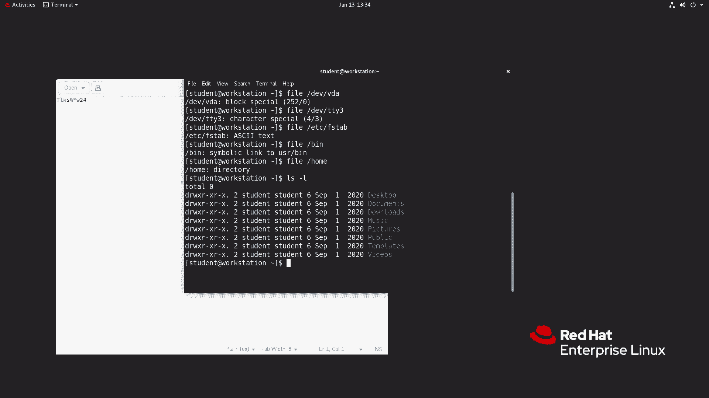

呃，last more还有handhotel以及WC啊，那么cat命令啊，那么现在呢戏称为什么呀猫是吧？其实这个是用来看东西的啊，看东西的ok那么我们来给大家举点例子。

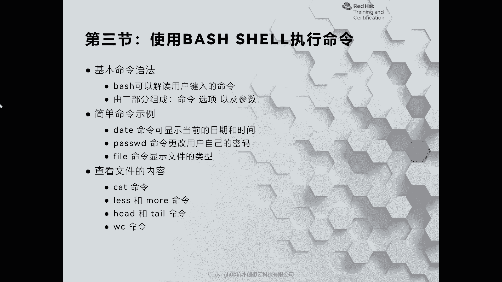

比如说我现在呢看到一个文件啊，叫什么呢？叫做啊ETC下面有一个呢叫FS type。那么我就使用cat啊，后面可以上ETCFSTAB啊，回车就能看到一个文件里面的内容啊，内容放开。

那么接着呢我再去看一个文件啊，比如说我想看一下ETC下的serv。okK啊，回车。那么这个信息量呢就太庞大了。那么当我执行一个命令之后呢，它全部给覆盖掉了。

比如说我们的屏幕上面没有办法完全的显示所有的内容，那怎么办呢？我可以使用啊less。啊，进行分页的显示ATC下面的services。啊，回车，那么我们可以使用空格进行翻屏啊，上下键呢进行什么呀？

方向键里面的上下键呀进行换行显示。OK同样也可以使用类似于less命令叫more。啊，也是可以的回车啊，那这个呢是往前查看选用空格即可啊，按一下Q是退出啊，退出啊啊。

但是呢有的时候呢我只想看文件的前几行，或者是后几行，那我可以使用前面几行的hand，后面跟上行数。默认的话呢是十行，我这里呢比如说看五行，那么ETD下面的services。好，就看到了五行内容啊。

同样我可以只看后面的若干行啊，太阳。比如说我只想看两行啊，还是刚才的文件。啊成。就可以了。啊，就可以了。那么我们如果看到一个文件之后，我想统一下多少行，那么有多少字符，有多少单词的。

我可以选WC啊来根据啊命令来打印具体的结果啊，比如说这里的啊s啊，就能够打印出来的内容。那么在这个里面能看到的是有它的行数。啊，字数和字符数量OK100011473行啊，63129个字啊。

那这里其实我们可以把它翻译成为单词，对吧？那么6呃692252个字符。当然了，如果你只想看它的行数，可以使用杠L这个选项。啊，sorry啊WC。O那么或者呢只想看它的word数量，对吧？W啊。

单词数量啊，字符数量的话呢，我们可以使用试下C啊C。啊，这是WC的命令。但是呢我们在执营的时候呀，可能会感觉。有些命令呢效率比较低，对吧？效率比较低。呃，命令很长，或者说这个这个文件呢很长。

我万一输错了怎么办，对吧？

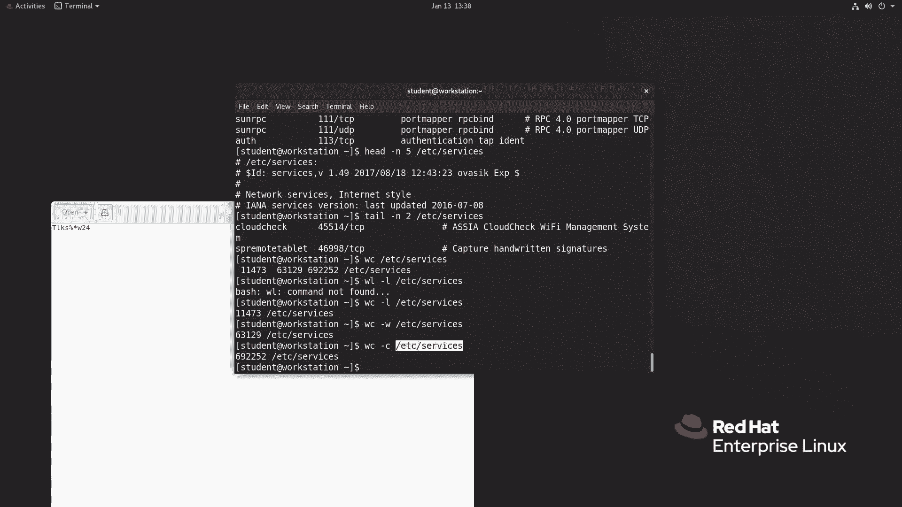

那么我们可以利用什么呢？可以利用。啊，rere8里面啊或者re7里面给你增加一个功能呢，叫做t补齐啊，t补齐O那么table补齐的话呢是对系统呢有一个要求的。就是我们的系统啊要安装一个包啊。

那么现在呢我先走一个超纲的命令啊，后面会学到叫RPM杠QE管道符啊。那么跟上一个什么呀啊COM啊，什么意思呢？就是说RPM杠QE呢是查询系统当中所有已安装的软件包，通过管道符呢去筛选一个叫做b开头的。

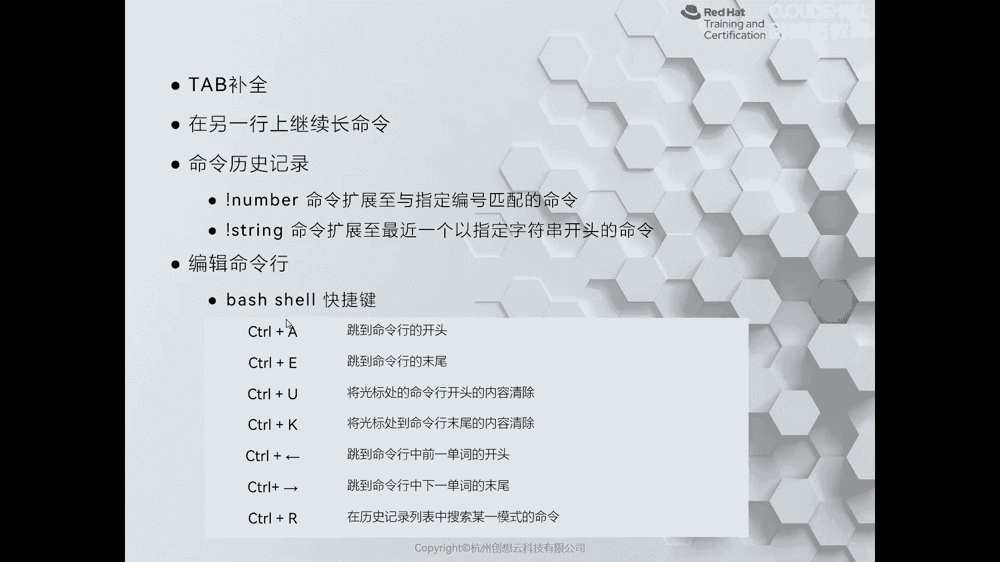

啊，一个包叫做caplations啊，那这个包一定是要安装啊，如果你没有安装，你需要把这个包安装成功之后，重新登录当前系统即可。O那么我这个是已经安装过了。

所以说呢我可以啊利用命令ETC啊斜杠ETC斜杠SEtype一次不行，摁两次，那么它会把所有。能够匹配到的关键词呢给你列出来啊，然后呢你可以选择这样的话呢可以提高我们的效率，并且呢降低出错率。啊。

善于使用t还有一些命令比较长，对吧？那么我们也可以使用tab。比如说PASS啊，我输一下tab哎，没有反应，再一次，第二次就出来了。有pa D对吧？有pa，还有种巴拉巴拉很多层命令，哎。

我们可以去选择啊车。即可啊即可okKcrl C停止输入啊，这是t指令啊，就一定要善于的使用啊，这个呢能够提高我们的效率啊，一个提高效率。OK好，接着呢我们再来给大家介绍呢就是我们的。

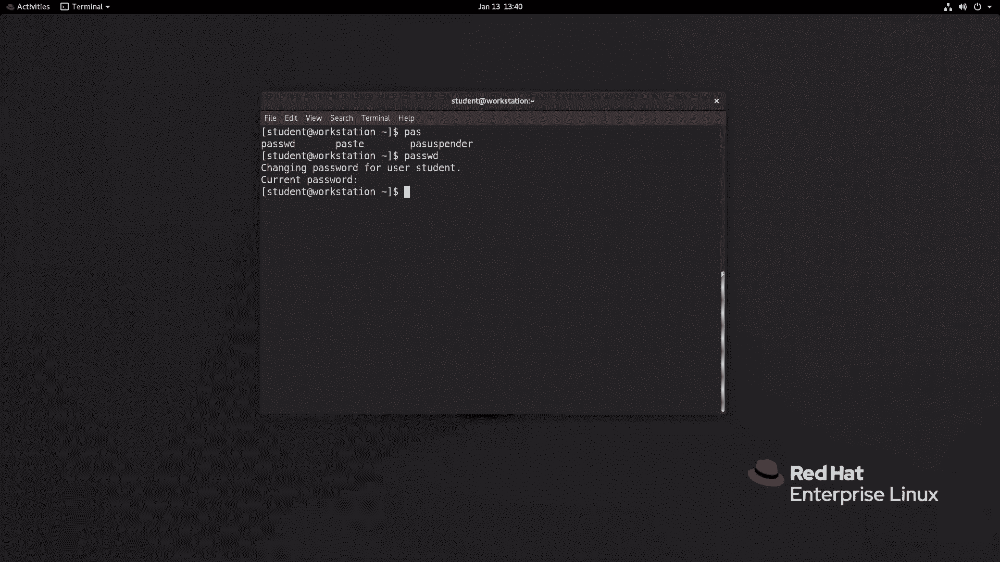

因此当中啊还有一些其他的用法，比如说啊那么在另一行上呢必须长命令啊，那么有的时候呢命令可能比较长，哎，我们可以使用啊这个换行来显示。

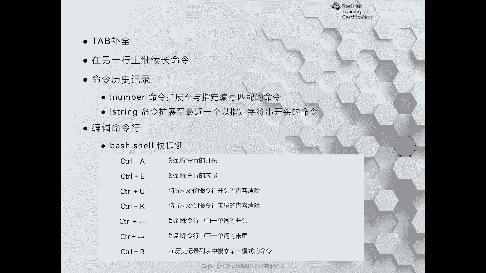

个例子，我只用一个icicle啊，我几个内容啊，ele呢打印消息对吧？写个hello word。啊，就执行了。但是呢我这次执行的时候呢，我的命令很长呀，I am什么呀啊。

这个tudentuser啊userplease啊，please什么呀？啊，哎，please什么呢？please recite my password啊，你写着起来就换行了，对不对？可能看着不舒服。哎。

那我又可以干嘛呀？提前呢加一个换行符啊，大家杠啊，please什么呀？reite my password。啊，好，据点双引号进起来回车你发现打印的消息呢就是一个什么呀？就是我们一句完整的话啊。

反斜杠代表的是换行啊，那么就是在另一行上继续长命令OK。

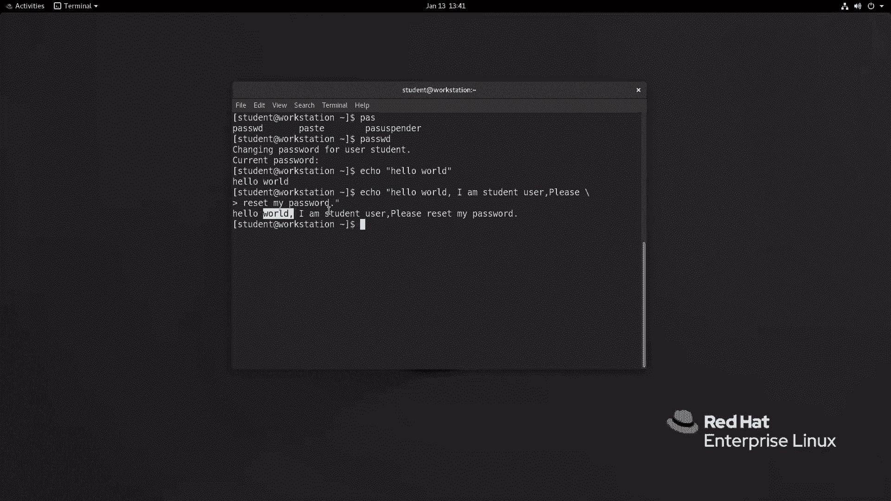

好，那么接着呢再来给大家介绍一个非常好用的工具呢，叫history。 historyistory的话呢，这个可以帮助我们查看历史记录啊，就是命令历史记录O那么我们可以整一个命令呢叫history。

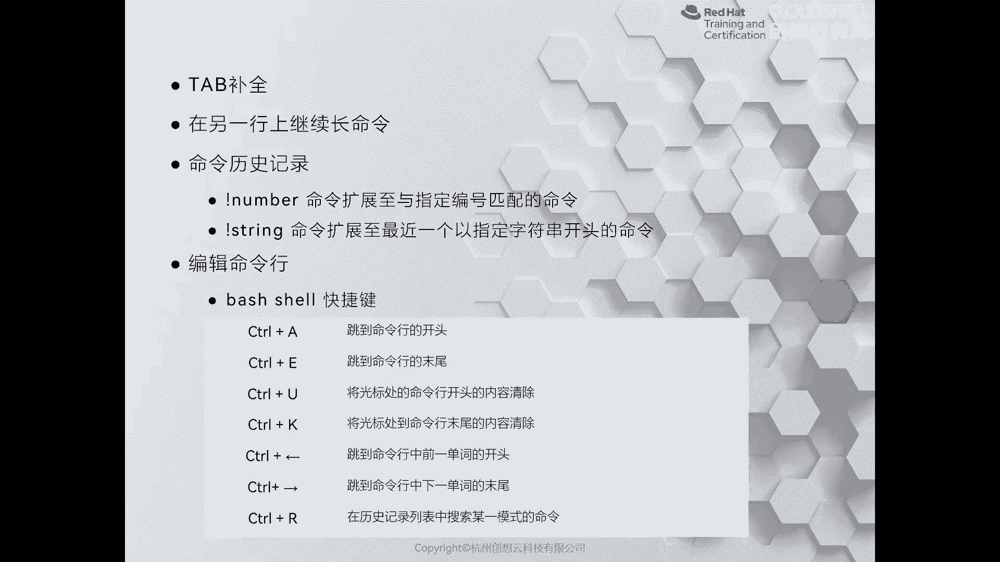

OKhistory可以打印用户的用名。那么打印的是当前用户的绘画的历史记录啊，一定要记住啊，是当前用户当前绘画的和以往。这个已经注销过的用户的历史记录啊，他按照先后顺序去执行。

那么最靠下的呢是我们刚刚输入的命令啊，那如果你想重复其中某个命令，比如说我想查看啊走第27行的这个命令，那我就可以输入一个感叹号。27即可。同样我也可以使用单词呢去匹配。

比如说呢历史记录里面有两个icical，一个呢是icical hello world，一个呢是icical hello worldmy am student什么什么的那我可以使用感叹号e。

那么它会匹配最近的一次。确定。啊，最近的一次指令。okK这个命令应该是少了什么内容啊，我加上一个感叹号，看能不能结束啊结束。OK这是大家说的这个icical这个命令。那么除此之外呀，还有些其他的命令。

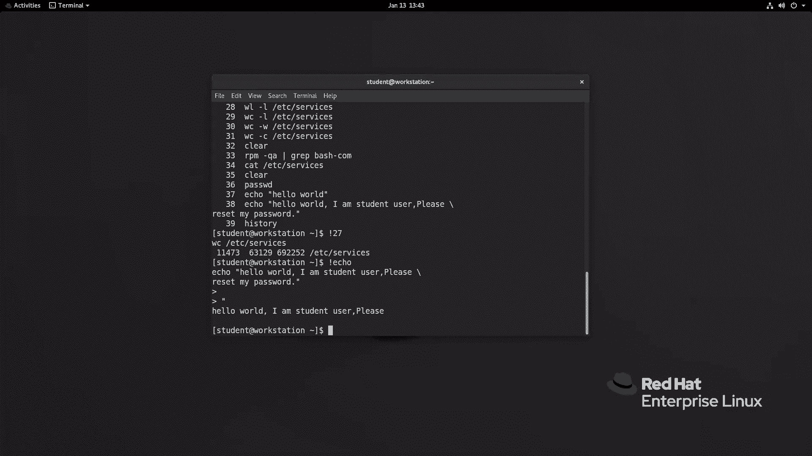

比如说啊我们可以在我们的buush上呢做一些快捷键啊，ctrol A快速跳转到命令行的开头啊，ctrorl E呢是来跳转到命令行的末尾啊，ctrorlU呢是清空光标前的内容。

control u清除光标后的内容，ctrol呢加方向键向左代表跳转到命令的第一个单词的开头啊，前一个命令的。那么同样方向键向后呢是下一个单词的，而conttrol加R可以搜索历史记录。

要比history呢更加的好用啊，那么这里呢给大家呢去演示一下。

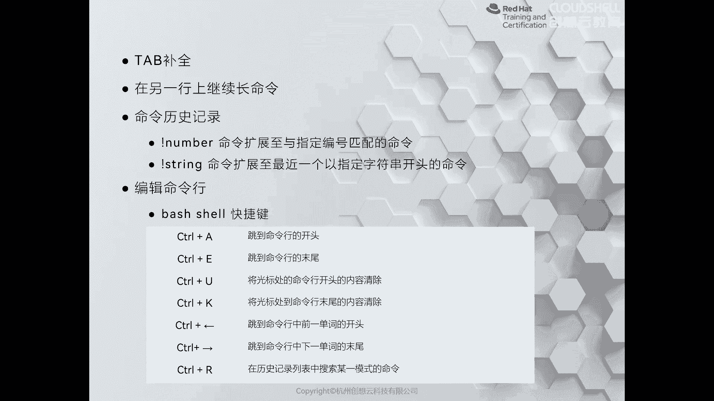

啊，好，那么我现在呢去执行一个命令呢叫contrl A。但是呢在执行之前我先去输一个长的命令。比如说IPADDRQEH0。哎，我输一个contl快速呢就跳转了到了开头啊，跳转开头。好。

接着呢我们再输入一个按键呢，cttrol加E我们来试一下。那么快速呢就跳转到了命令的结尾啊。OK同样呢我们也可以使用ctrorl键呢加方向的左键来跳转到上一个单词的开头。

conttrol键加向右的方向键向后跳转到单词的结尾。那如果我们想清空掉光标前的内容，我们可以使用contrl u啊来清空。同样，我们如果想清空到光标后的内容，比如说我的光标呢停留在C的位置。

我使用cttrol加D来清空光标和光标后内容。啊，这是一些快键，我们接着呢再重点介绍一下cttrol加R。ctrol键R的话呢会帮助我们进入到什么呀？一个搜索模式。我们只需要输入关键词。

它就可以帮助我们快速去匹配。啊，某一行，但是呢匹配之后呢，同样它和history是一样的。那么首先呢会去匹配最近的一次命令。那如果呢没有匹配到，那么你可以干嘛呀？可以继续呢输入内容或者使用方向键左右。

办。匹配到啊精准度比较高的一条指令呢，把它啊调用出来而不执行OK然后呢去修改就可以了。啊，修改就可以了。OK那如果啊如果你调用出来的这个命令啊，符合要求，就直接按下回车键来执行。啊。

这是给大家介绍的几个常用的快捷键啊。如果我们善于使用呢，则会提高我们的执行效率。

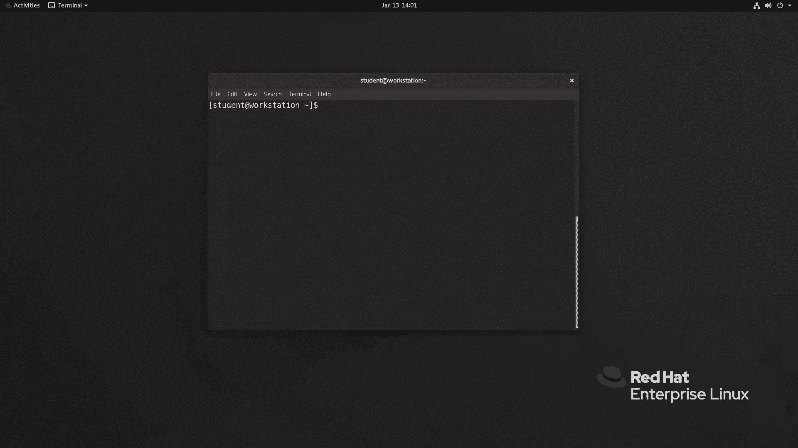