# 红帽认证系列工程师RHCE RH124-Chapter02：访问命令行 - P3：02-3-访问命令行-使用Bash shell执行命令 🖥️


在本节课中，我们将学习如何使用Bash shell来执行命令。我们将从基本的命令语法开始，逐步介绍一些常用命令的用法，并学习如何利用shell的特性来提高工作效率。

上一节我们介绍了如何通过多种方式登录到Linux系统。登录之后，我们都需要使用Bash shell与系统进行交互。在执行命令时，必须严格遵循其语法结构。

## 命令的基本语法

命令的基本格式为：`命令 [选项] [参数]`。其中，选项和参数根据命令的需要进行选择。有些命令的选项和参数是一一对应的，即不同的选项需要匹配不同的参数。

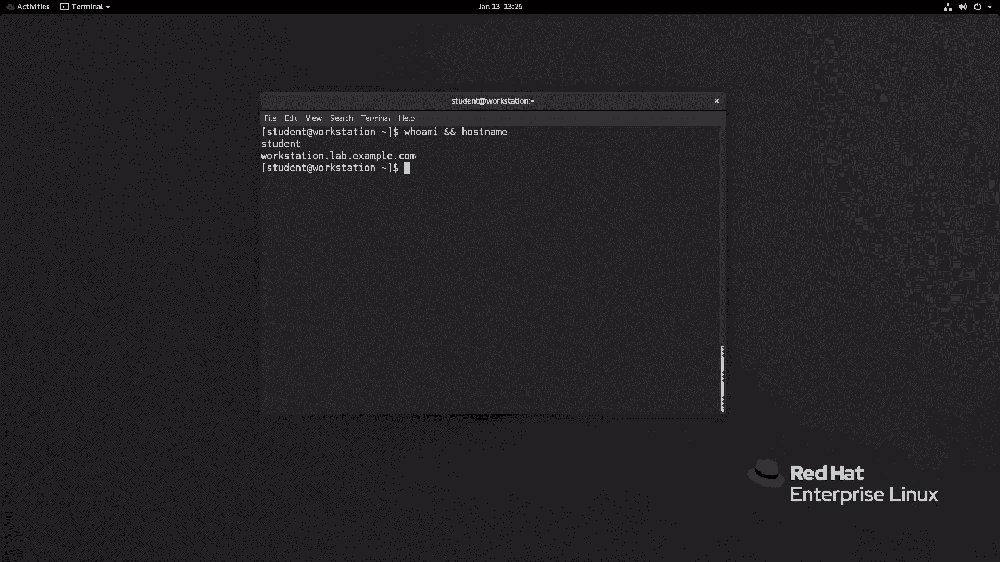

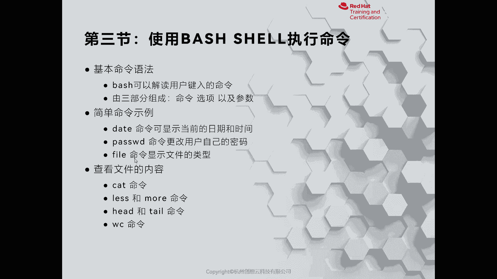

现在，我们通过远程方式登录到工作站，以`student`用户身份进行操作。

## 常用命令示例

以下是几个在Bash shell中常用的基础命令。

### 1. 查看用户身份：`whoami`
`whoami`命令用于打印当前登录用户的身份。

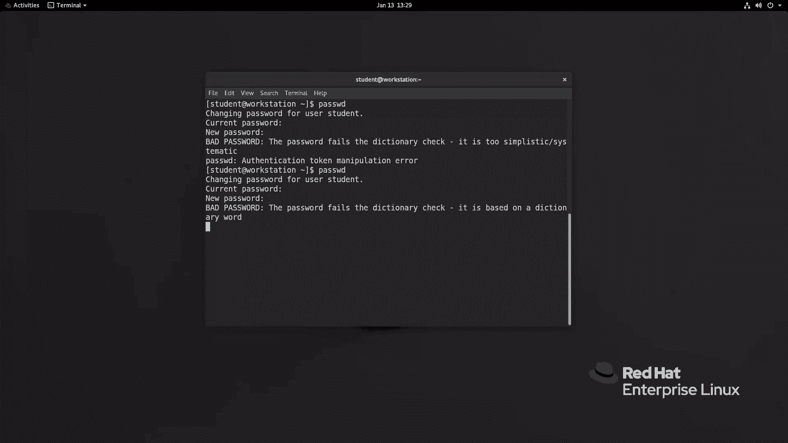

### 2. 顺序执行命令：`;`
如果想在一个终端中按顺序执行多个命令，可以使用分号`;`将它们隔开。
例如，执行`ip addr show; hostname`会先显示网络信息，然后显示主机名。

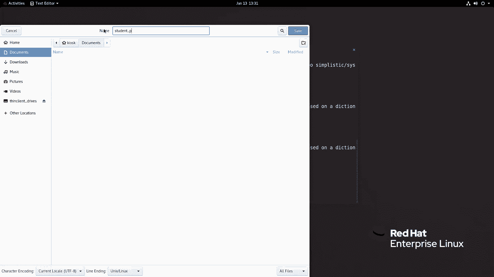

### 3. 条件执行命令：`&&`
如果两个命令之间存在依赖关系，即只有前一个命令执行成功，才执行后一个命令，可以使用`&&`连接。
例如：`whoami && hostname`。

## 更多实用命令

接下来，我们看看其他一些实用的命令及其功能。

### 1. 日期与时间：`date`
`date`命令用于打印或设置系统日期和时间。
直接输入`date`会显示当前日期和时间。
大多数命令支持`--help`选项来获取帮助。例如，`date --help`会显示该命令的语法和可用选项。
`date`命令可以使用`+%format`来格式化输出。例如：
*   `date +%F` 输出完整日期（年-月-日）。
*   `date +%Y-%m-%d` 分别输出年、月、日。

### 2. 清屏：`clear`
`clear`命令用于清空当前终端屏幕的内容。

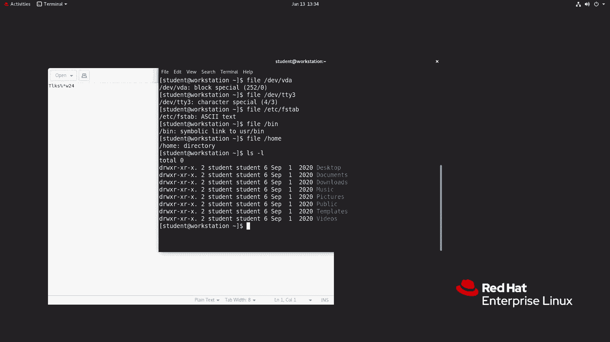

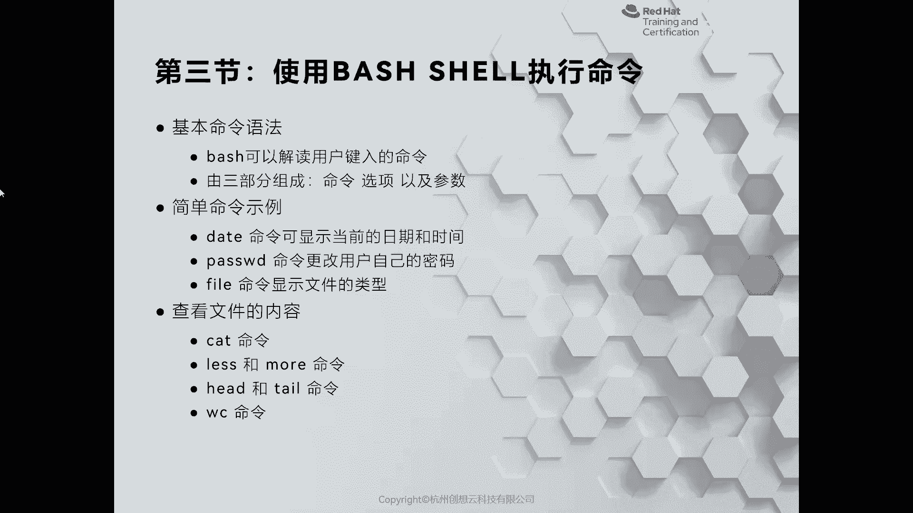

### 3. 修改密码：`passwd`
`passwd`命令用于更改当前用户的密码。直接输入`passwd`，然后按照提示输入当前密码和新密码即可。
新密码必须符合密码策略，例如长度通常需大于8个字符，且不能是过于简单的弱密码。

### 4. 判断文件类型：`file`
在Linux中，“一切皆文件”。`file`命令可以帮助我们判断一个文件的类型，这在无法通过颜色直观区分时非常有用。
例如：
*   `file /dev/vda` 会显示这是一个块设备文件。
*   `file /etc/fstab` 会显示这是一个ASCII文本文件。
*   `file /home` 会显示这是一个目录文件。

## 文件内容查看命令

处理文件时，我们经常需要查看其内容。以下是几个相关的命令。

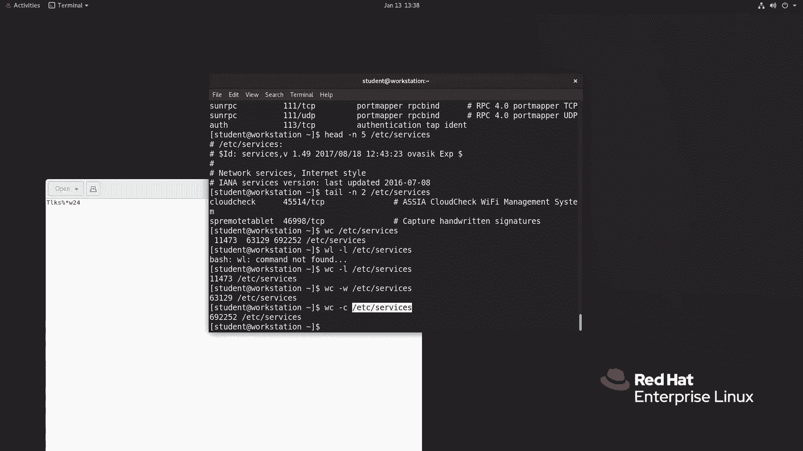

### 1. 查看整个文件：`cat`
`cat`命令用于连接文件并打印到标准输出设备上，常用来查看文件内容。
例如：`cat /etc/fstab`。

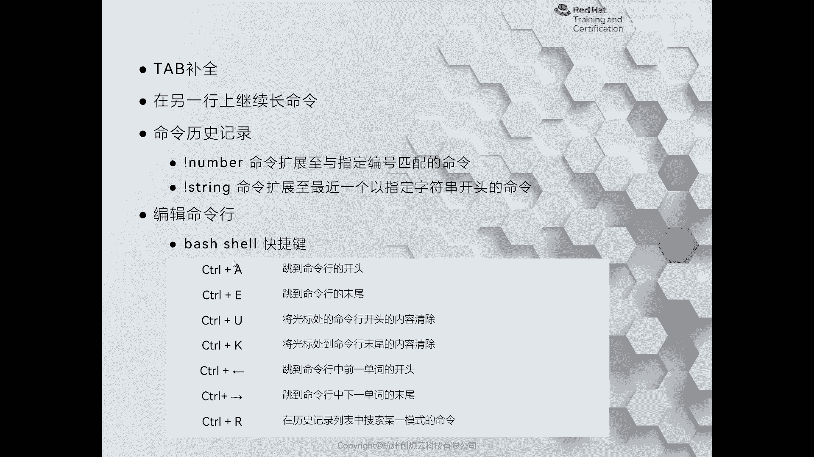

### 2. 分页查看文件：`less` 和 `more`
当文件内容很长时，可以使用`less`或`more`进行分页查看。
*   `less /etc/services`：使用空格键翻页，上下箭头键换行，按`q`键退出。
*   `more /etc/services`：功能类似，按空格键向前翻页。

### 3. 查看文件首尾：`head` 和 `tail`
如果只想查看文件的开头或结尾部分，可以使用`head`和`tail`命令。
*   `head -n 5 /etc/services`：查看文件前5行。
*   `tail -n 2 /etc/services`：查看文件最后2行。

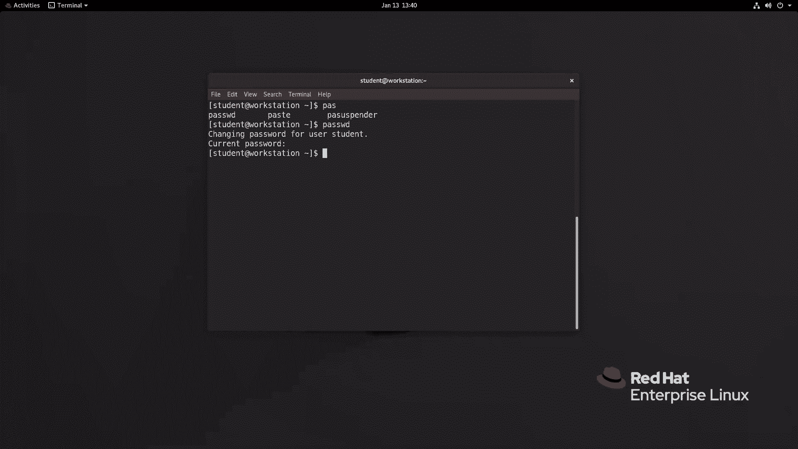

### 4. 统计文件信息：`wc`
`wc`命令用于统计文件的行数、单词数和字符数。
*   `wc /etc/services`：显示行数、单词数、字符数。
*   `wc -l /etc/services`：仅显示行数。
*   `wc -w /etc/services`：仅显示单词数。
*   `wc -c /etc/services`：仅显示字符数。

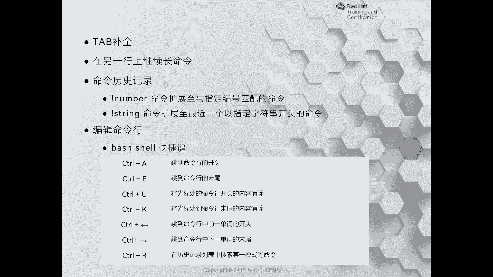

## 提高效率的技巧

为了更高效地使用命令行，Bash shell提供了一些非常实用的功能。

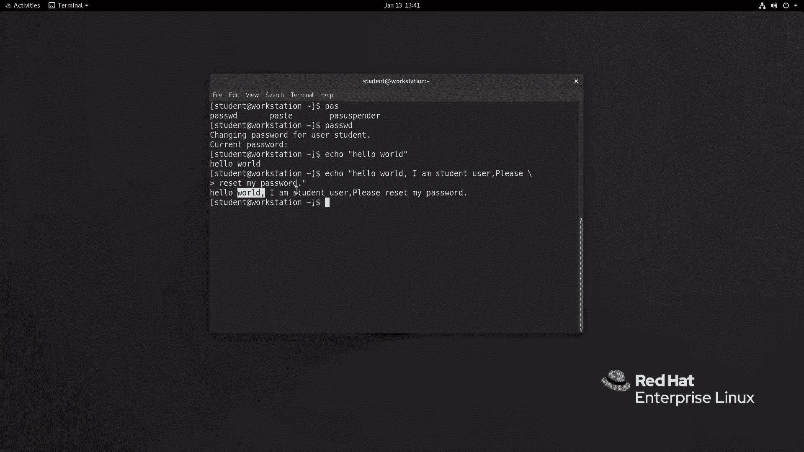

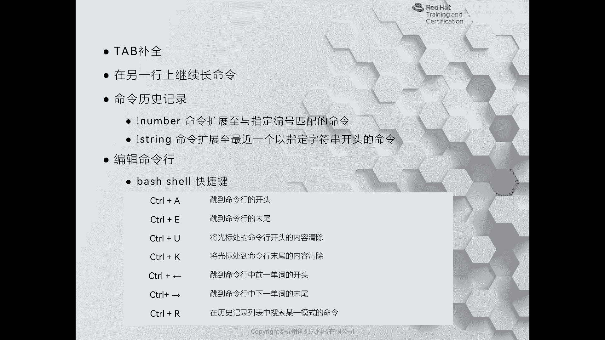

### 1. 命令补全：`Tab`键
按一次`Tab`键可以尝试自动补全命令或文件名。如果按一次没有唯一结果，按两次`Tab`键会列出所有可能的匹配项。
使用命令补全可以大大提高输入效率并减少错误。系统需要安装`bash-completion`软件包来支持此功能。

### 2. 命令行编辑快捷键
熟练使用快捷键可以快速编辑命令行。
*   `Ctrl + a`：跳转到行首。
*   `Ctrl + e`：跳转到行尾。
*   `Ctrl + u`：删除光标之前的所有内容。
*   `Ctrl + k`：删除光标之后的所有内容。
*   `Ctrl + ←` / `Ctrl + →`：以单词为单位向前或向后移动光标。

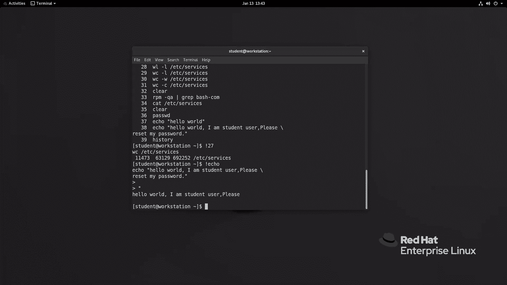

### 3. 搜索历史命令：`Ctrl + r`
按下`Ctrl + r`会进入反向搜索模式。输入关键词，Shell会动态匹配历史命令。匹配到所需命令后，按回车键即可执行，或按左右方向键进行编辑。

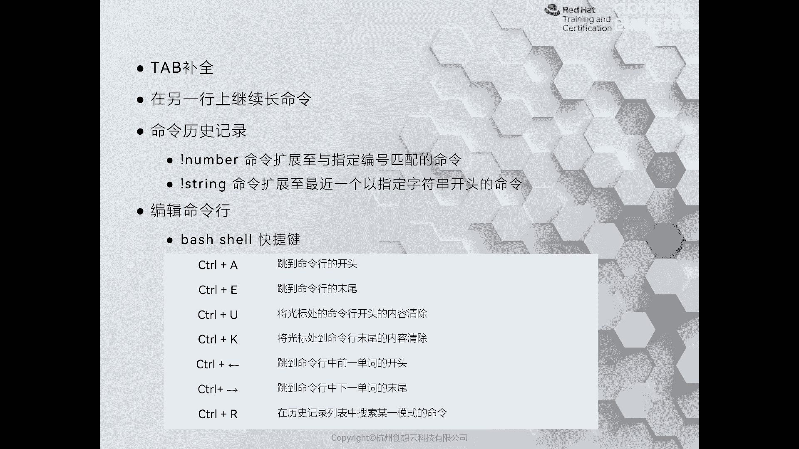

### 4. 查看命令历史：`history`
`history`命令可以列出当前用户会话的历史命令记录。
*   执行`!27`可以重新执行历史记录中编号为27的命令。
*   执行`!echo`可以执行最近一条以`echo`开头的命令。

### 5. 命令换行：`\`
如果命令很长，可以在行尾使用反斜杠`\`进行换行，使命令在下一行继续书写，这有助于提高命令的可读性。
例如：
```bash
echo “I am a student user, \
please reset my password.”
```

## 总结

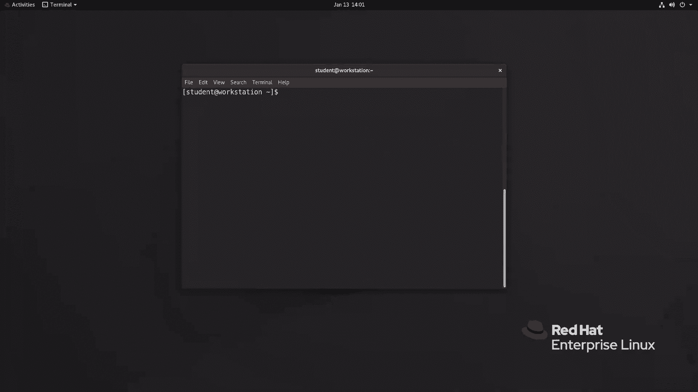

本节课中，我们一起学习了Bash shell执行命令的核心知识。我们掌握了命令的基本语法，练习了`date`、`passwd`、`file`、`cat`、`less`、`head`、`tail`、`wc`等常用命令。更重要的是，我们学习了利用`Tab`键补全、命令行快捷键、历史命令搜索等技巧来大幅提升工作效率。熟练运用这些命令和技巧，是成为一名高效Linux用户或管理员的基础。