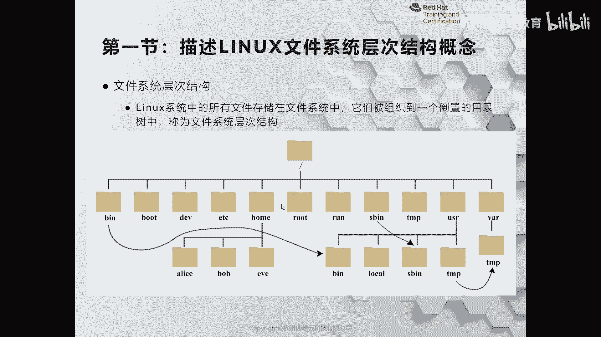
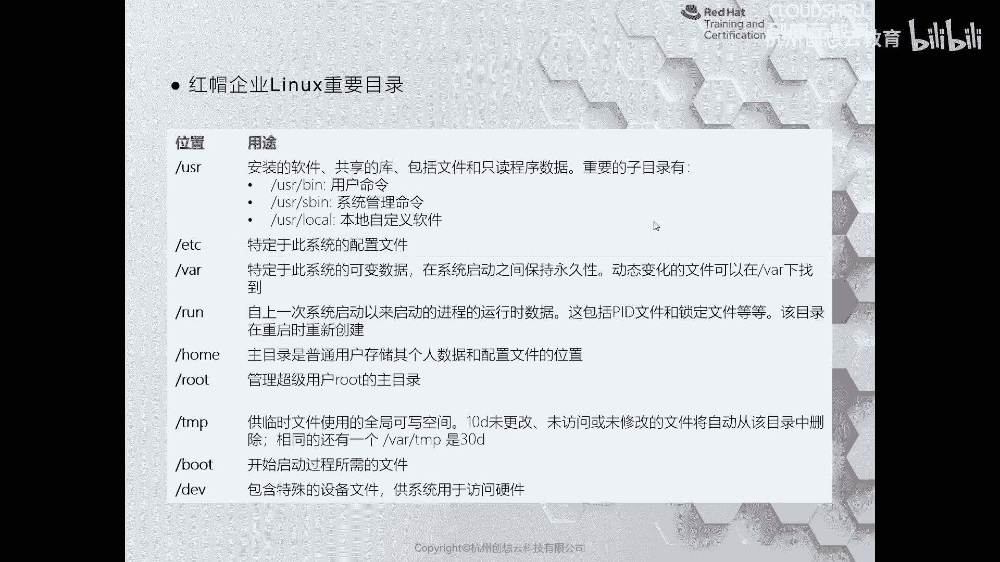

# 红帽认证系列工程师RHCE RH124-Chapter03-从命令行管理文件 - P1：03-1-从命令行管理文件-描述Linux文件系统层次结构概念 - 杭州创想云教育 - BV1SP411j7W5

好我们来看第三章啊，从命令行来管理文件，那么这一章的话呢，我们主要的目标呢就是带着大家呢认识一下linux里面的啊文件系统，目录层次结构啊，以及呢如何使用命令啊，在管理我们的文件系统。

还有呢就是如何去高效的去利用通配符来匹配文件名啊，这些内容，我们来看这个第一节啊，那么第一节的话呢讲的是啊，我们整个linux里面的文件系统结构啊，那么其实严格意义来说啊。

只要是属于是类unix系统的啊，文件系统结构呢基本上都是这样的一个状态框框啊，那么比如说我们身边的安卓手机啊，mac系统，还有这个我们linux服务器啊，那么都属于是类unix的范畴啊。

那么在整个文件系统当中啊，那么最上面的图片里面的这个斜杠，那么我们称之为是根目录，那么根目录的话呢是我们整个文件系统里面最顶级的目录啊，再往上没有了啊，下面最最顶级的，ok那么从顶积木之后呢。

往下呢这个呢我们称为是一个啊，这个其实这个应该严格一样来说呢，叫做顶级目录对吧，目录啊，这个是根目录，根目录，ok哎那么从根目录下方的话呢，这些目录呢都是一些常见的目录啊。

那么这些目录到底是有什么作用呢，ok那么我这边呢就从左到右依次呢来给大家介绍一下，那么在这个图片里面的虚线的部分呢是一个快捷方式，好吧，我们暂时把它称之为是快捷方式啊。

那么比如说根目录下面的b呢指向的是啊，user目录下面的be，ok那么b目录里面存放的是命令啊，命令并就是二进制可执行文件啊，里面存放的，ok第二个目录呢叫做boot。

那么boot目录当中存放的是什么呢，存放的是系统在启动时所需要的文件，比如说内核呀啊这些，那么这种目录的话，一般在安装操作系统的时候，我们会把这个目录作为一个独立的分区来使用，ok那么第三个啊dv啊。

dv呢就是什么设备啊，设备的话呢主要是放一些设备文件，比如说啊我们的快设备文件就是磁盘啊，诶这个字符文件啊，比如说我们的输入设备键盘啊这些，接着呢是etc啊。

tc的话呢主要是存放一些安装的一些服务的配置文件，比如说我们的阿帕奇对吧啊，数据库mary db啊，n gx等等，那么默认它的配置文件都是存放在etc下面的。

ok那么home home的话呢字面意思呢就是家目录对吧，那么在这个家目录下方呢有很多个用户的子目录，那么这些用户呢就是我们系统里面的普通用户，因此后下面和用户名同名的目录，我们称之为是用户的主目录啊。

和root同级别的话呢是我们的root root目录存放的是root超级管理员的信息，是它的主目录，接着run的话呢是什么呢，run的目录呢比较特殊啊，那么以前的时候呢这个目录存放在挖下面。

就是挖r或者是wlock run啊，嗯它主要是系统在启动之后啊，我们的进程产生的运行时数据存放在这里，里面有一些id文件呀和锁定文件呀等等啊，哎它有点像根目录下面的pk啊，进程目录啊。

他们两个都是系统启动之后啊创建的，ok然后呢sb s b的话呢是同样是一个快捷方式啊，那么它的真正的位置呢是在usr啊，那么存放的是用于系统管理的啊，一些指令，那么type的话呢则是什么呢。

则是我们这个系统里面啊产生一些临时的数据所存放的，那么接着呢就是刚才提到的user，除了刚才介绍的b和s b之外，其实还有一些其他的目录，比如说lab和lib，64就是一些库文件对吧，库文件。

ok那么接着呢他这个u字呢特别像windows里面的c盘啊，特别像另一个目录呢，叫挖挖，里面放一些经常变动的数据，比如说我们的日志呀，缓存呀啊，还有这个数据库文件呀啊，如果是个打印机服务器。

那么可能是打印机后台处理的文件呀啊等等啊，都是在挖下面的啊，都是在挖下面的，那么熟悉这些目录的功能呢，便于我们后期在查找某些特定功能的文件来去找到特定的位置，否则我们就诶这个像无头苍蝇一样是吧。

找不到文件在哪里，就不便于管理，甚至找错了位置管管理错了文件可能对系统本身呢是有害的好。

那么接着呢我这里呢也对我们的目录呢，呃的内容呢做了一个简要的说明，做了一个表格啊，唉这也是跟大家呢刚才讲到的啊。

