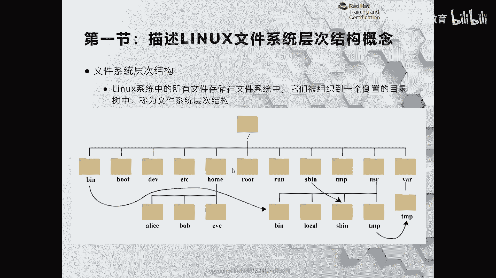
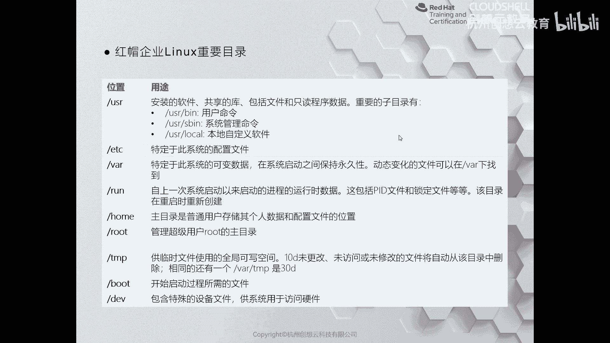

# 红帽认证系列工程师RHCE RH124-Chapter03：从命令行管理文件 - P1：03-1-从命令行管理文件-描述Linux文件系统层次结构概念

在本节课中，我们将要学习Linux文件系统层次结构的基本概念。了解这些标准目录的作用，是高效管理和定位系统文件的基础。

上一节我们介绍了本章的学习目标，本节中我们来看看Linux文件系统的核心结构。

## 根目录与顶级目录

在Linux文件系统中，最顶层的目录称为**根目录**，用单个斜杠 `/` 表示。根目录是整个文件系统的起点，其下方包含一系列标准化的子目录。

## 主要目录功能详解

以下是根目录下一些关键子目录及其作用的介绍。

*   **`/bin`**：此目录是一个指向 `/usr/bin` 的符号链接（快捷方式）。它存放系统的基本命令和二进制可执行文件，例如 `ls`、`cp` 等。
*   **`/boot`**：此目录存放系统启动时所需的文件，如Linux内核、初始内存磁盘映像等。在系统安装时，常将此目录设置为独立分区。
*   **`/dev`**：此目录包含设备文件，系统通过它们与硬件设备交互。例如，`/dev/sda` 代表第一块磁盘，`/dev/tty` 代表终端。
*   **`/etc`**：此目录主要存放系统和已安装服务的配置文件。例如，Apache、MySQL、Nginx等服务的配置均默认位于此目录下。
*   **`/home`**：此目录是普通用户的家目录。每个用户在此目录下拥有一个以其用户名命名的子目录，作为该用户的个人工作空间。
*   **`/root`**：此目录是超级管理员用户 `root` 的家目录，与普通用户的 `/home` 目录处于同级地位。
*   **`/run`**：此目录存放系统启动后，由进程产生的运行时数据，如进程ID文件和套接字文件。它类似于 `/proc` 目录，两者均在系统启动后动态生成。
*   **`/sbin`**：此目录是一个指向 `/usr/sbin` 的符号链接。它存放用于系统管理的命令，通常需要 `root` 权限才能执行。
*   **`/tmp`**：此目录存放系统和用户应用程序产生的临时文件。该目录下的文件可能会被定期清理。
*   **`/usr`**：此目录类似于Windows系统中的C盘，存放用户级的应用程序、库文件、文档等。`/usr/bin` 和 `/usr/sbin` 是其重要子目录。
*   **`/var`**：此目录存放经常变动的数据，如系统日志、应用程序缓存、数据库文件等。对于打印服务器，打印队列文件也存放于此。

熟悉这些目录的功能，有助于我们在管理服务器时快速定位特定类型的文件，避免因操作错误文件而对系统造成损害。

## 目录功能速查表

为了方便记忆，这里对核心目录的功能做一个简要总结。

| 目录 | 主要用途 |
| :--- | :--- |
| `/` | 文件系统的根目录，所有目录的起点。 |
| `/bin`, `/usr/bin` | 存放供所有用户使用的基本命令。 |
| `/boot` | 存放系统启动文件。 |
| `/dev` | 存放设备文件。 |
| `/etc` | 存放系统和服务的配置文件。 |
| `/home` | 普通用户的家目录。 |
| `/root` | 管理员root的家目录。 |
| `/run` | 存放进程的运行时数据。 |
| `/sbin`, `/usr/sbin` | 存放系统管理命令。 |
| `/tmp` | 存放临时文件。 |
| `/usr` | 存放用户应用程序和文件。 |
| `/var` | 存放可变数据，如日志和缓存。 |

本节课中我们一起学习了Linux文件系统层次结构的概念，认识了从根目录 `/` 开始的一系列标准目录及其核心功能。掌握这些知识是后续进行高效文件管理的第一步。下一节，我们将开始学习如何使用命令行工具来操作这些目录和文件。