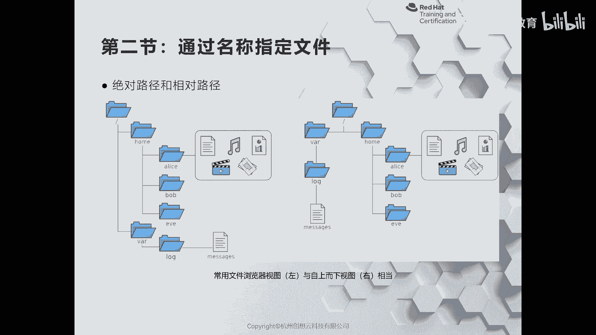
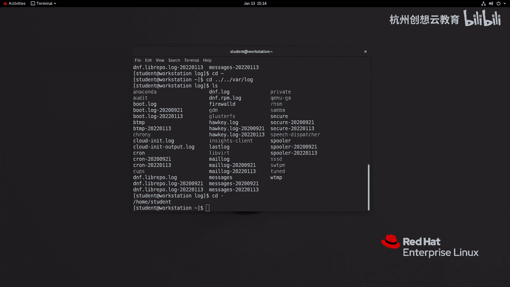
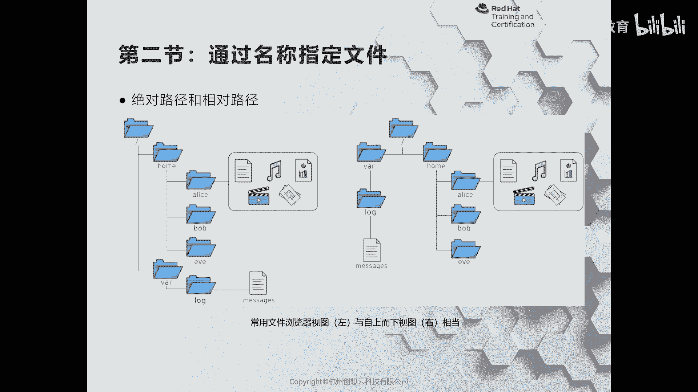
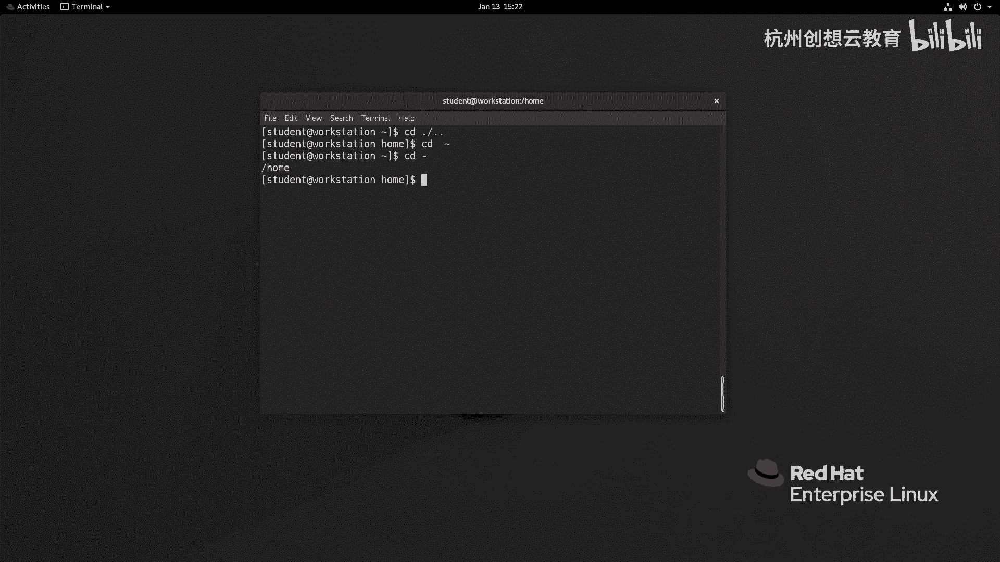

# 红帽认证系列工程师RHCE RH124-Chapter03-从命令行管理文件 - P2：03-2-从命令行管理文件-通过名称指定文件 - 杭州创想云教育 - BV1SP411j7W5

好我们来看第二节啊，通过命名称呢来指定文件，那么这一小节呢给大家介绍一下啊，这个如何呢去更改我们的工作目录啊，以及呃相对路径和绝对路径的概念啊，那么大家来看这张图啊。

那么这两张图的话呢是我们常用的文件浏览器的一个视图啊，那么一个呢是这种树状的一种呢，这种是水平的啊，水平的，那么那么无论是哪种方法呢，我们都可以把它抽象成我们平常在管理啊目录的时候的一个一个架构。

还有一个架构，那么这个架构里面我们举个例子，比如说啊我当前的用户呢是鲍勃，ok那么bob用户的话呢，如果想去查看日志啊，那么怎么去读取呢，啊那么一种方法呢就是走我们的相对路径啊。

我从bob这里回到上一级，那么就是home对吧，那么从后再往上呢就来到根目录，从根目录里面再出发，然后呢来到了挖下面，再从挖下面呢来到了logo啊，log里面找到message啊。

message ok那么我这里呢就以student的用户呢来举例啊，我们来看一下。

那么我现在呢是谁呢，是student，啊那么同样我要去看日志啊，开日志，那么cd首先呢要回到上一级，那么上一集的话呢，在我们的bh shell里面呢可以使用两个据点来代替上一集。

ok好上一集呢就是后面啊，接着呢我再返回到上一级呢，就是根目录，好根目录下面呢有很多个啊，这个顶级目录对吧，也叫一级目录啊，我们去哪里呢去挖，然后呢再来到lock。

ok这时候呢我们就能够看到这里面有很多文件了，就能看到我们刚才遇到的谁呀，messages哎就能找到了，ok好，那么我现在返回到这个刚才的家目录里面，cd波浪号代表的是回到用户的家目录。

那么刚才呢我们是一步一步的啊，利用了相对路径来到了log里面，同样我这里呢可以用一条指令也能切换过去，那么这时候呢就需要刚才大家脑子里呢，有刚才图里面那个那个那个那个样貌啊，cd啊。

上一集home home的上一级跟跟下面的挖挖下面的log，ok那么同样我们能看到message啊，messages好，那么接着呢我再整一个cd，后面跟上一个大师代表的是返回到最近一次所在的工作目录。

哎就回到了家目录里面了啊，这是一种方法叫做相对路径，那么相对路径呢一定是从当前目录出发的，那么反过来我还有一种方法呢叫做绝对路径，啊比如说我现在呢我那个要切换哪里呢。

我现在要切换到这个啊，同样是mc区里面是放这时候呢考虑的事情呢，不是说我在哪里，我只考虑到一件事情，就是说我如何来到mac就可以了，那么我直接从根里面出发就可以了，从根到挖到log。

然后来到看到messages，所以说呢我可以啊执行一个这样的命令。

然后呢走一个叫做什么呢，cd啊，根啊啊，下面的log唉，我们也能看到messages，所以说呢这两种路径的出发点是不一样的，那么第二种方法呢叫做什么呀，绝对路径它一定是从根目录开始的啊。

它一定是从根目录开始的，这是我们的一个小技巧对吧，一个小技巧ok好，那么我们知道了这个路径的方法，那么我们在切换的时候呢，就可以使用cd命令进行切换啊，cd change directory。

更改工作目录啊，那么我们在使用工作目录的时候呢，一定要记住啊，我们所在的位置啊，在我们的shell提示符上面啊，在主机名和提示符中间的这个位置呢代表的是我们当前所在的位置，那它其实就是一个相对路径啊。

在logo里面啊，log里面，那如果啊我想查看我当前具体所在的完整工作目录，可以使用p wd来查看啊，p w电来查看，ok好，那么我们随便在前为止，比如说我来到tap下面，我做一个p家底。

或者说来到自己的家目录里面，有一个p d不能看到我们当前所在的位置啊，p wd可以用来显示自己所在的位置，打死为止，ok好，那么在用在这个文件系统管理的时候呢，我们还有一些其他常用命令。

比如说touch，他知道这个命令呢不仅可以创建新的空白文件，也可以用于更新时间戳啊，举个例子，我们通过ios命令啊，跟上一个选项杠d啊，或者杠啊，那么打印出来啊，详细的信息啊。

那么这些目录呢都是在202020年的9月1号创建的啊，我现在能走一个命令叫tx后面跟上一个目录，我这里呢以desk top为例，然后呢再去看一下，你会发现desktop这个目录呢时间呢就被更新了。

因此我们可以使用touch来更新时间戳，如果你在touch命令根的这个参数是不存在的，那么就代表创建一个新的空白文件，ok好，那么刚才我们来重点说一下ios命令l4 。

其实去list列举列出我们用的频率非常高的一个命令，那么这个命令呢可以帮助我们列出指定目录下面的文件信息，如果ios命令没有跟任何的参数，就代表的是查看当前目录，但是更多的时候呀，我们会用一些选项。

比如说刚才的杠l刚来的话呢，可以帮助我们打印出来文件的属性信息，比如说啊这里看到的文件类型d的话呢是目录啊，那么我们还会看到什么呢，我们还看到比如说，代表的是链接啊，就是这里的链接呢指的是快捷方式啊。

还有呢就是我们的dv下面的v d a啊，叫b开头的，那么是快是v啊，这是最常见的几种类型啊，那么除此之外呢，在ios高l的信息里面呀，还有文件的权限信息。

这个权限信息我们在后面的章节呢为大家再次的介绍啊，深入的探讨，那么在前线后方呢，这里面一个加号，这个加号呀和我们系统里面的一种安全机制叫做se linux有关。

同时和我们的高级文件群里的管理fa 4 l也是有关系的，那么再往后呢这个数字一呀代表的是我们文件的啊链接数量，ok再往后啊，这个root代表的是该文件的所有者。

后面的这个disk呢则代表该文件属于哪一个组啊，组那么它的对应权限呢就和前面的这个都是匹配的，用户的权限rw横线组的权限rw x其他人没有权限啊，三个横线ok啊，接接着往后呢则是对于设备而言。

那这里指的是设备的具体的设备名，而对于普通文件而言，我们能看到什么呀，能看到文件的大小，再往后呢是文件的什么呀，这个时间啊，时间戳的里面的这个修改时间啊，修改时间ok是那除此之外呢我们可能还会用到谁呢。

in啊，四杠l啊，b的话呢来打印我们的隐藏的文件，那一个点代表的是当前目录两个点，上一级目录对吧，我们的上一级呢是home哎home，所以呢root用户路的组。

那么其他的当前目录里面的第二开头的文件和目录呢，相对来说呢是隐藏文件啊，那么它一般代表的意思呢，就是说我这个文件啊或者目录啊比较特殊啊，可能比较重要啊，为了避免用户呢物管理，所以说呢就给它隐藏起来了。

如果你想看目录里面的嵌套信息，你可以加一个谁呀，加一个大写字母r r，它可以帮助我们做一个递归，比如说我这里的config回车，他会把config呢做一个信息打印出来，好这是ios命令啊。

用的频率非常的高啊，频率高啊，希望大家能够使用，还有刚才介绍的谁呀，cd啊，cd命令的话呢也是用的频率非常高的一个命令，那可以帮助我们切换工作位置啊，那么再来回顾一下刚才的几个指令。

c d点代表的是当前目录啊，当前目录上一级点点啊，上一级目录和叫父目录啊，叫两个点，ok啊，那么就来到了后面下面，那么c d波浪线呢代表的是用户家目录啊，cd表的是返回到刚才访问的位置啊。

这是常见的cad命令，那么我们来再看一下我们的ppt啊，刚才呢我已经把好像这个命令呢都给大家来列出来了啊。

绝对路径啊一定是从根开始的啊，然后我们可以使用p wd呢来查看当前的位置啊，以及cd呢去切换路径。