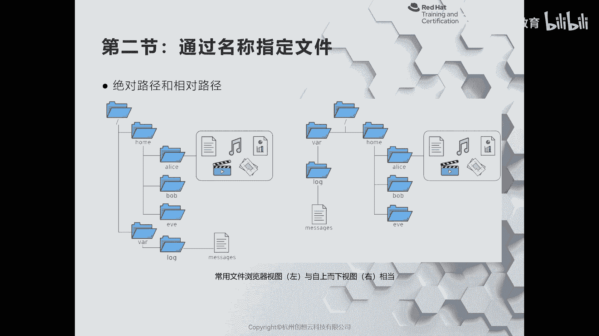
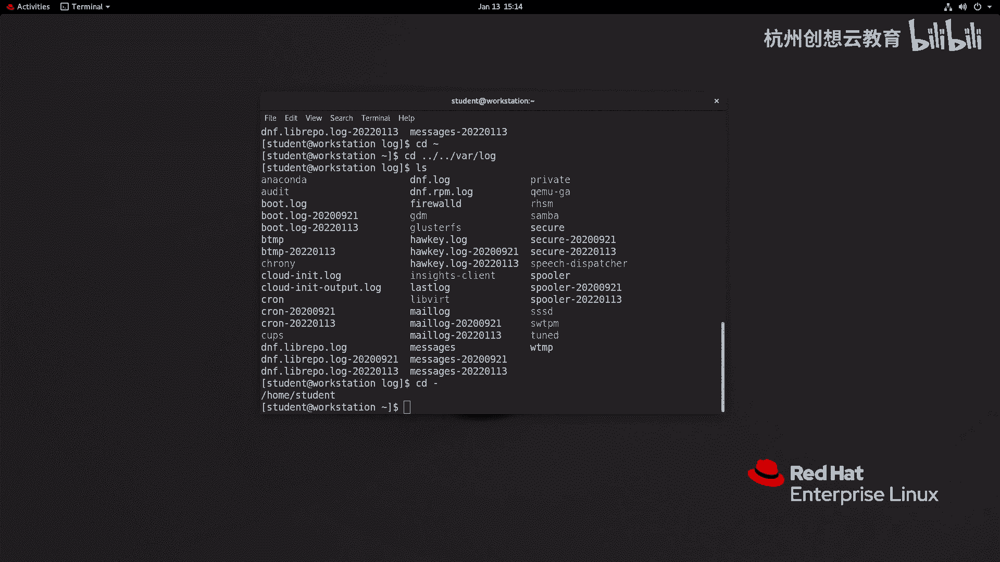
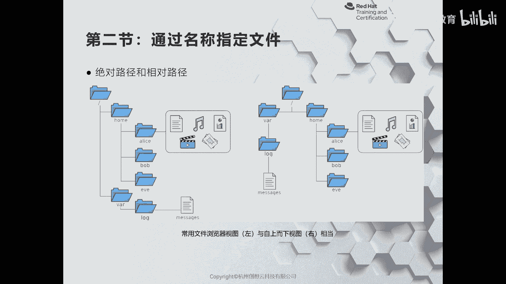
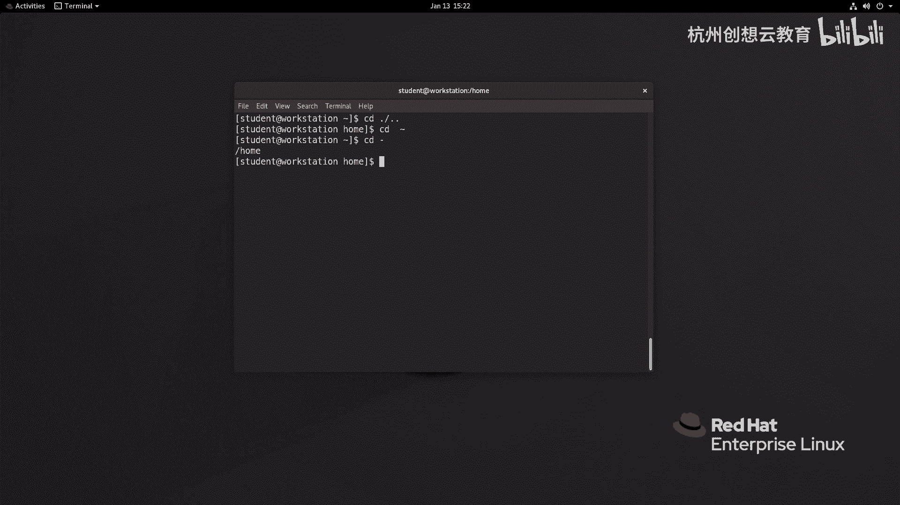

# 红帽认证系列工程师RHCE RH124-Chapter03：03-2：从命令行管理文件-通过名称指定文件 📂

在本节课中，我们将学习如何通过名称来指定和管理文件。核心内容包括理解并更改工作目录、区分相对路径与绝对路径，以及掌握相关的命令行工具。

## 概述

上一节我们介绍了文件系统的基本概念。本节中，我们来看看如何通过名称来定位和操作文件。理解路径的概念是高效管理文件的基础。



## 更改工作目录与路径概念

在图形化文件浏览器中，我们通过点击文件夹来导航。在命令行中，我们使用 `cd`（Change Directory）命令来更改当前的工作目录。

工作目录是命令执行的默认位置。例如，当您输入 `ls` 命令时，它会列出当前工作目录中的文件。

### 相对路径与绝对路径

指定文件位置有两种主要方法：相对路径和绝对路径。



*   **相对路径**：以当前工作目录为起点来描述目标文件或目录的位置。
*   **绝对路径**：以根目录（`/`）为起点，完整地描述目标文件或目录的位置。

以下是一个示例，假设当前用户是 `student`，其家目录是 `/home/student`。我们想查看系统日志文件 `/var/log/messages`。



**使用相对路径的方法：**
从家目录 `/home/student` 出发，需要先返回上级目录（`..`），再进入 `var` 和 `log` 目录。
```bash
cd ..          # 切换到上一级目录 /home
cd ../..       # 切换到根目录 /
cd var/log     # 切换到 /var/log
```
或者使用一条命令组合完成：
```bash
cd ../../var/log
```

**使用绝对路径的方法：**
无论当前位于何处，都可以直接从根目录开始指定完整路径。
```bash
cd /var/log
```

绝对路径总是以 `/` 开头。

## 常用命令详解

以下是几个在文件管理中使用频率极高的命令。

### 1. `pwd` - 打印工作目录

`pwd` 命令用于显示当前所在工作目录的**绝对路径**。当您不确定当前位置时，这个命令非常有用。
```bash
pwd
```
输出示例：`/home/student`

### 2. `cd` - 更改目录

`cd` 命令用于切换工作目录。它支持多种参数来快速导航。

以下是 `cd` 命令的常用快捷方式：
*   `cd` 或 `cd ~`：切换到当前用户的家目录。
*   `cd -`：切换到上一次所在的工作目录。
*   `cd ..`：切换到上一级目录（父目录）。
*   `cd .`：切换到当前目录（通常用于脚本中）。

### 3. `ls` - 列出目录内容

`ls` 命令用于列出指定目录下的文件和子目录信息。如果不跟任何参数，则列出当前目录的内容。

`ls` 命令常与以下选项组合使用，以获取更详细的信息：
*   `ls -l`：以长格式列出详细信息，包括文件类型、权限、所有者、大小和修改时间。
*   `ls -a`：列出所有文件，包括以点（`.`）开头的隐藏文件。
*   `ls -R`：递归列出子目录中的内容。

**`ls -l` 输出示例解析：**
```
drwxr-xr-x.  2 root root    6 Sep  1  2020 Desktop
```
*   **`d`**：文件类型（`d`=目录，`-`=普通文件，`l`=符号链接）。
*   **`rwxr-xr-x`**：文件权限（用户/组/其他人的读`r`、写`w`、执行`x`权限）。
*   **`.`**：与SELinux安全上下文或ACL（访问控制列表）相关。
*   **`2`**：链接数。
*   **`root root`**：文件所有者和所属组。
*   **`6`**：文件大小（字节）。
*   **`Sep 1 2020`**：最后修改时间。
*   **`Desktop`**：文件或目录名。

### 4. `touch` - 创建文件或更新时间戳

`touch` 命令有两个主要用途：
1.  **创建新的空文件**：如果指定的文件名不存在，`touch` 会创建一个空白文件。
    ```bash
    touch newfile.txt
    ```
2.  **更新文件时间戳**：如果指定的文件已存在，`touch` 会将该文件的访问和修改时间更新为当前时间。
    ```bash
    touch existingfile.txt
    ```

## 总结



本节课中我们一起学习了通过名称管理文件的核心技能。我们理解了**相对路径**和**绝对路径**的区别，并掌握了四个关键命令：用 `pwd` 查看当前位置，用 `cd` 切换目录，用 `ls` 查看目录内容，以及用 `touch` 创建文件或更新时间戳。熟练运用这些命令是进行高效命令行文件操作的基础。