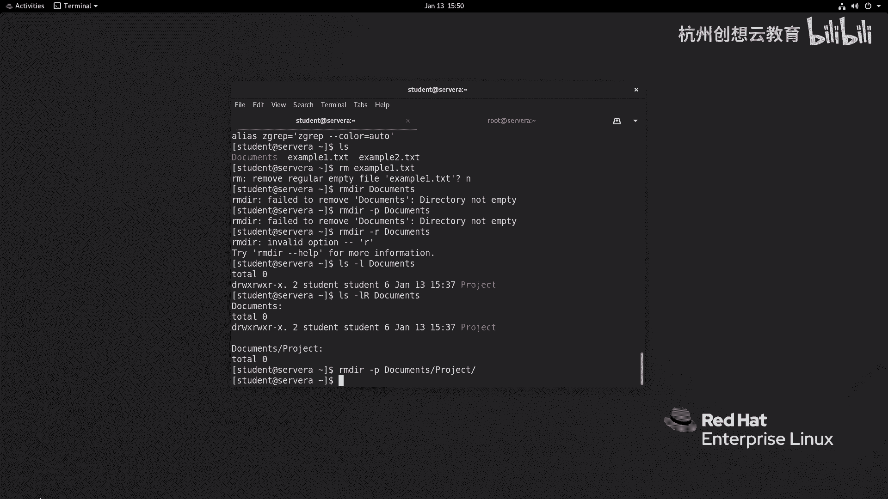

# 红帽认证系列工程师RHCE RH124-Chapter03-从命令行管理文件 - P3：03-3-从命令行管理文件-使用命令行工具管理文件 - 杭州创想云教育 - BV1SP411j7W5

好的，我们接着看第三节啊，使用命令行工具管理文件。那么在这章的话呢，我们将会带大家呢使用注如makeDRCP moveve和RMRMDR命令来管理我们文件系统当中的文件和目录。

在我PPT上的这个表格当中，大家呢可以看到常用的几个命令的用法。啊，其中如果我们要想创建一个新的空白目录，我们可以使用make第，后面跟上目录名称即可。如果是需要复制文件的话呢，CP文件名啊。

这个文件呢是原文件名啊，后面跟上一个新的文件名即可。如果需要目录的话呢，中间一定要记得加一个谁呢？加一个R代表的是递归。啊，递归ok那么如果我们想要想移动或者是重命名文件目录的时候呢。

要使用move命令啊，move命令啊，那么move命令注意了。那如果你的文件名啊和新的文件名所在的位置是在同一个目录下面。那么我们可以把这个MV理解为是重命名。

那如果呢fi和new file所在的位置是在另外的位置，那么我们可以把它理解为是移动。啊好，删除文件的话呢，可以使用RM跟上文件名。如果是目录需要递归，加上RM杠R。那么在这里呢，我需要重点的说明。

就是啊RM命令在删除文件的时候。是不会像图形化界面一样把它放在回收站里面的，它是直接将文件的原数据信息把它删除掉了。就是把文件的i note和它的文件名的节点的一个连接啊，删掉了。

所以说呢如果你误删掉了，就需要进行数据的恢复啊，一定要小心。其实除此之外呢，上面的CP呀和MV也同样有。这个。致命的危害性要小心。那么删除公目录的话呢，则是RMDR。好。

那么接着呢我分批次来给大家介绍每个命令的具体使用方法。

首先我们来看一下创建目录的命令叫做MK12。那么这个命令呢主要是用来创建一个或多个目录，以及在目录当中房建什么呀？子目录。啊，字目录。那么我现在呢呃。我现在呢回到我直接呢在哪里演示呢？这次的话呢。

我将会啊这个在我们的啊SA上面来演示OsA啊SH啊这个。啊。SH啊student at server好，远程连接上去。好，那么以后的话呢我就所有的新建文件呀什么的。

我都会在serv a里边给大家来演示啊。好，那么我听一下屏幕啊，我现呢去创建一个目录啊，我在哪里创建呢？我就在当前的位置啊，加目录里面，我去make d，我想去创建了一些信息。

比如说我想创建一个叫做啊watch啊wa。啊，我去了okK。那么我们的目录呢就出来了，可以看一看它的信息，杠LD啊，D呢是目录啊，只查看目录的OK。哎，就可以了。那么。那如果啊如果我这边呢想干嘛呢？

想在目录下呀创建新的子目录啊，那么我就可以使用make dR啊wa取的。后面比如说跟成一个video。哎，即可。那么我们可以使用L4-2啊。来查看一个目录的信息。啊，目录信息啊好。

那么接着呢我再去创建一个啊，假如说呢我现在呢想创建目录呀，叫什呀，叫做啊文档。但是文档的目录下面呢，我还想再放建一个什么呀project。啊，projectproject的话呢，现在呢问题就是。

documents和project都不存在，那么你创建它肯定会报错。那么我们可以加上一个选项啊，叫什么呢？叫做P，代表的是递归。哎，这时候呢我们就能看到我们的这个目录结构呀都创建出来了。

如果想干的更加真真切，我们可以使用te这个指令。但te这个指令呢默认是没有安装的啊，我这里呢就先去安装一下，让大家去看一看它的显示效果。我们后面呢会大家带着大家呢去安装这样的命令啊。

安装会介绍我这里呢就先去执行一次。那如果这个命令你还有疑惑的话呢，还有一种方法就是你打开一个新的终端。SHroot at server。啊，然后呢去安装，这样的话呢就更加的方便一些了。啊。

我去安装这个 tree。啊，默认是装过了的啊，太好了，那我就不用安装了啊，那我就直接执行一个tree啊。后面可以上目录名啊，会撤，那么结构呢就出来了。那么这个结构效果要比使用LS杠R更加的清晰啊清晰啊。

这是目录啊，目录OK好，那接着呢我再给大家来演示一下如何呢去复制文件。啊，复制文件。那么复制文件的话呢，我们使用的是CP这个指令，我们可以复制文件，也可以复制什么呀？目录啊，目录O呃。

同样R呢代表的是递归啊递归。啊，那么我现在呢先去创建一个文件，好吧，这里面先创建一个新的空白文件。我就举个例子，比如说呢叫做block。啊，这个。breasster one点OGG啊。啊。

我就创建一个这样的文件名好了。那么接着呢我想把它复制成谁呢？复制成为后缀是一的啊，叫做文件名啊，叫做一点OGG。啊，加个后缀，加个一啊。保存哎，我们来看一下，那么就多出来两个内容是一模一样。

但文件明确不一样的文件啊，却不一样文件O那如果你在复制的时候呀，复制的时候，比如说我想把这个block啊，这个bu这个文件呢，复制到啊watch的vi里面啊，那么我就可以使用copy。

但是呢这次呢我去加一个选项呢，叫VV的话呢可以帮助我们查看细节啊。啊，第二OGG把它复制到watch啊，V6里面啊回车，那么它会给我们带一个指向啊，一个指向啊，这样来复制。那如如果你复制的时候。

想保留文件的一些细节的信息啊，比如说文件的所有者属性，那你可以加上一个谁呢？加上一个。选项P来复制。那如果你想其他的递归呀、链接呀等等都要保留，那你可以加个谁呀A啊就可以了啊。那么无论哪种方法。

大家有没有发现？他都把旧文件给复原掉了。所以说copy命令本身是也有危险的。那怎么办呢？哎，我们在复制的时候呀。可以加加一个选项呢，叫杠I代表是交互啊，问一问。

发现唉目标的目录下面存在一个和原文件相同的文件。我是不是要覆盖掉，询问我们，如果加了这个东西就可以避免。覆盖我们的数据。那我说一个谁呀，no就不再覆盖了。啊，就不再覆盖了。O这是CP命令啊。

如果是目录的话呢，记得一定要加一个谁呢？加一个R啊，一定要加一个R。比如我把它复制到tap下面回车。啊，这是加上一个啊递归啊递归啊，那么接着呢我们来说movemove的话呢，就功能就比较单一了啊。

我们可以直接move。比如说block blast点 ORG我给它起名为block master2点OGG回车看一下，那么原来的文件名呢就不存在了。那我们现在呢就相当于走了一个什么呀，重命名啊。

重命名O那么对于move命令也是一样的。那如果我在复制的时候啊，复制的时候发现啊，watch的里面有一个同名的啊，同名的，那么就可能会覆盖掉啊，覆盖掉，我先复制第一次。啊。

复制一次放在同样放在watch的video里面。现在呢它没有重名啊，我再复一次。啊，再 for一sorry，因为是移动嘛，所以说就那个。他就什么呀，他就不存在了啊，所以呢我来到我去啊我去。啊，IS好。

我再移动一次，我移动一个谁呀？block这个文件啊，给它重命名为2。同样。不再问我们，如果啊这个blockbu2和原来的文件是不一样的那同样被会覆盖掉。那么为了避免这种情况呀，我们可以干嘛呀？

我们可以啊这个我先复制一份啊，我们可以干嘛呢？我们可以这个。在复制的时候呀，加上一个谁呀，加上一个I啊，移动的时候加个I move个I。

比如说block一点OGG到block block master2点OGG的时候，会提示有相同的文件存在。那你发现不能覆盖，就出一个N就可以了，可以防止我们的数据的丢失啊误删除啊。

同样呢在管理文件的时候，我们还可以使用谁呀？刚才提到的这个。刚才提到了这个呃MV啊MV啊，还有这个删除啊RMRM的话呢是删除文件和目录的啊RM删除和文件和目录的。那么我们可以啊走一个命令啊。

来去管理一下。比如说我现在呢要想删除这里的block一回车文件就。不存在了哎不存在了。okK那么同样我们要想保证数据的误删除，可以加个I。还会有用问我们要不要删除，那么我会以输个N啊。

就可以保留了那就保留了。ok这是RM。那如果删除目录的话呢。我们如果不加I啊，那么sorry啊，如果不加R的话，我们来试一下。那么我来删除一下watch的这个目录。啊，提示我们不是目录，那我怎么办呢？

两种方法，一种呢是加1个D啊D来删除目录，一种呢是用IMEIR这两个都是一样效果。但是呢我们仔细观察会发现这两个命令无论如何用，它都会提示目录飞空啊。那么这两种方法在删除的时候呀，一个好处在于。

如果目录里面有数据，可以避免不删除。那如果你确定这个目录里面的数据呢不再重要了，或者说已经做了备份，那么你可以使用RM杠R递归F强制啊，用在问我要不要删除了，直接删掉。啊。

删掉和这个删除呢是非常致命和危险的。啊，所以呢我们建议大家呢把啊这个用移动来替换谁呀，删除。啊，并且呢把CP。MV和RM呢都增加一个什么呀交互加杠I怎么增加呢？临时的方法呢，我们可以走一个alas啊。

alasCP等于个啊CP杠I。啊，这样的话呢，我们在执行CP的时候呀，就相当于执行了CP杠I的这样一个步骤。比如说我再创建一个文件，叫做什么呢？叫做。example一点儿什么呀？叫做一点儿的TST。

那么我想去复制一份。啊，复制一为复制为2。然后呢，我再整第二遍，它就提示我，对吧？哎，就是因为我们的执行的CP啊，相当于CP杠I。

但是呢这个使用alice直接在终端上执行的方法呢是临时性的只对本次启动的当前绘画有效。那如果想把这种功能。针对用户永久性生效，我们可以去有一个命令叫eical啊e。然后呢。把我们刚才的命令啊追加进去。

注意这个命令我们某些特点还没有学习，后面的话会接着学。所以说在操作的时候呢，一定要小心，不要破坏掉线用的文件。那么因为我们要想更改的话呢，在我们的M录里面有一个文件呢，叫做什么呢？点儿啊拜 RRC啊。

那么如果你第一次学习，你可以干嘛呀？先给它备份一下啊，你可以备份一下啊，你可以走一个点拜使RC你给它备份一下。啊，点2BAK给备份一下，然后呢再进一个ecle双引号alice。啊。

空格CP空格单引号CP杠I。啊，然后呢空格两个大于号，紧挨着把它放在点儿所以啊，我这里面为了总路径绝正确。比如说呢我加了一个。一个拨案号，用户加目录下面的这个文件。同样我们还可以使MV也产生同样效果。

RM产生相同效果。然后呢，让它生效。ssC回车。那么我们可以观察一下alice回车。那么会发现啊，那么我们的MV和什么呀？RM以及CP都加了一个I啊就加一个I。那么我们下次呢在删除文件的时候呀。

就会安全很多啊，就会安全很多okK。如果你只有一个昆目录，那么你可以使用IM点R或者是RM杠D来删除。啊，这个目录里面应该也有内容，那我就加个谁呀，加一个选项啊，叫杠P啊，sorry。RR呀难删除。A。

是皮，但是里面有东西啊，我们来看一下。然我加一个R好吧。果然里面有个目录啊，那么我们可以啊在删除的时候呀，使用一个什么呀，使用的递归啊，RMDR的话呢，它也是有递归的。那么我们可以使用什么呢？

RMDR杠P啊。但是呢加P的话注意一定要把路径写完整了才可以啊，一定要写完整啊。

