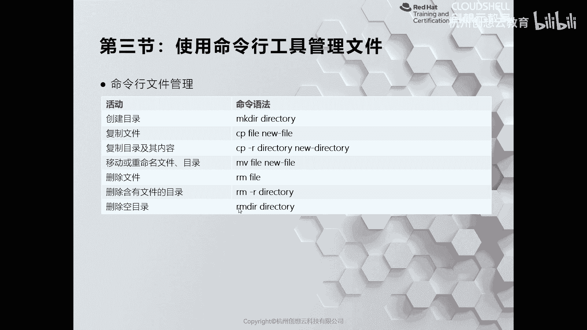
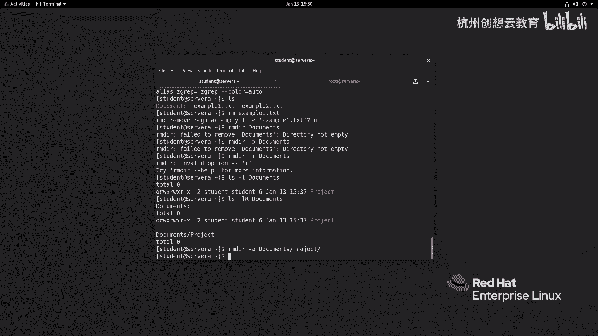

# 红帽认证系列工程师RHCE RH124-Chapter03：03-3-从命令行管理文件-使用命令行工具管理文件 📂

在本节课程中，我们将学习如何使用命令行工具来管理文件系统中的文件和目录。我们将重点介绍创建目录、复制文件、移动/重命名文件以及删除文件和目录的核心命令。

## 概述

上一节我们介绍了文件系统的基本概念。本节中，我们来看看如何使用具体的命令行工具来执行日常的文件管理任务。我们将学习 `mkdir`、`cp`、`mv` 和 `rm`/`rmdir` 命令的用法。

## 常用命令速览

以下是管理文件和目录时最常用的几个命令及其基本用法：

*   **`mkdir`**：创建一个新的空白目录。
    *   用法：`mkdir 目录名称`
*   **`cp`**：复制文件或目录。
    *   复制文件：`cp 源文件名 新文件名`
    *   复制目录：`cp -r 源目录名 新目录名` （`-r` 代表递归）
*   **`mv`**：移动或重命名文件/目录。
    *   移动/重命名：`mv 源文件/目录 目标文件/目录`
*   **`rm`**：删除文件或目录。
    *   删除文件：`rm 文件名`
    *   删除目录：`rm -r 目录名` （`-r` 代表递归）
*   **`rmdir`**：删除空目录。
    *   用法：`rmdir 目录名`



**重要提示**：`rm` 命令会直接删除文件，不会将其放入回收站。误删后需要数据恢复，操作时需格外小心。`cp` 和 `mv` 命令在覆盖已有文件时也存在风险。

接下来，我们将分步详细介绍每个命令的具体使用方法。

## 创建目录：`mkdir` 命令

`mkdir` 命令用于创建一个或多个目录，也可以在目录中创建子目录。

例如，在当前目录创建一个名为 `watch` 的目录：
```bash
mkdir watch
```

使用 `ls -ld` 命令可以查看目录信息。

如果想在 `watch` 目录下创建子目录 `video`，可以使用：
```bash
mkdir watch/video
```

如果需要创建多层不存在的目录结构，例如 `documents/project`，可以使用 `-p` 选项进行递归创建：
```bash
mkdir -p documents/project
```

可以使用 `tree` 命令更清晰地查看目录结构（如果系统未安装，可使用 `yum install tree` 安装）：
```bash
tree documents
```

## 复制文件与目录：`cp` 命令

`cp` 命令用于复制文件或目录。`-r` 选项代表递归，用于复制目录及其内容。

首先，创建一个示例文件：
```bash
touch bluesmaster.ogg
```

将其复制为一个新文件：
```bash
cp bluesmaster.ogg bluesmaster1.ogg
```

复制文件到指定目录并显示详细信息（`-v` 选项）：
```bash
cp -v bluesmaster.ogg watch/video/
```

复制时保留文件的所有者、权限等属性（`-p` 选项）：
```bash
cp -p bluesmaster.ogg backup.ogg
```

为避免覆盖已有文件，可以使用交互模式（`-i` 选项），系统会在覆盖前询问：
```bash
cp -i bluesmaster.ogg bluesmaster1.ogg
```

复制目录必须使用 `-r` 选项：
```bash
cp -r watch /tmp
```

## 移动与重命名：`mv` 命令

`mv` 命令用于移动或重命名文件/目录。如果源和目标在同一目录，则为重命名；否则为移动。

重命名文件：
```bash
mv bluesmaster.ogg bluesmaster2.ogg
```

移动文件到其他目录：
```bash
mv bluesmaster2.ogg watch/video/
```

与 `cp` 命令类似，`mv` 也可能覆盖目标位置的文件。同样可以使用 `-i` 选项进入交互模式以防止误覆盖：
```bash
mv -i bluesmaster1.ogg bluesmaster2.ogg
```

## 删除文件与目录：`rm` 和 `rmdir` 命令

`rm` 命令用于删除文件或目录。删除目录通常需要 `-r`（递归）选项。

删除文件：
```bash
rm bluesmaster1.ogg
```

使用交互模式（`-i`）删除文件，系统会询问确认：
```bash
rm -i example.txt
```

删除空目录可以使用 `rmdir` 或 `rm -d`：
```bash
rmdir empty_dir
```

如果目录非空，`rmdir` 会报错。要删除非空目录及其所有内容，必须使用 `rm -r`：
```bash
rm -r watch
```

**警告**：`rm -r` 命令是危险且不可逆的，请谨慎使用。

## 安全操作建议：使用别名（alias）

为了避免误操作，建议为 `cp`、`mv`、`rm` 命令设置默认的交互模式别名。

临时设置（仅当前终端会话有效）：
```bash
alias cp='cp -i'
alias mv='mv -i'
alias rm='rm -i'
```

永久设置（对特定用户生效），需要将别名添加到用户的 shell 配置文件中（例如 `~/.bashrc`）：
```bash
echo "alias cp='cp -i'" >> ~/.bashrc
echo "alias mv='mv -i'" >> ~/.bashrc
echo "alias rm='rm -i'" >> ~/.bashrc
source ~/.bashrc  # 使配置立即生效
```

设置后，执行 `alias` 命令可以查看已定义的别名。

## 总结



本节课中我们一起学习了从命令行管理文件的核心工具。我们掌握了使用 `mkdir` 创建目录，使用 `cp` 复制文件和目录，使用 `mv` 移动或重命名项目，以及使用 `rm` 和 `rmdir` 进行删除操作。特别重要的是，我们了解了这些命令的潜在风险，并学会了通过 `-i` 交互选项和设置别名来提升操作的安全性。熟练掌握这些命令是高效使用 Linux 命令行环境的基础。