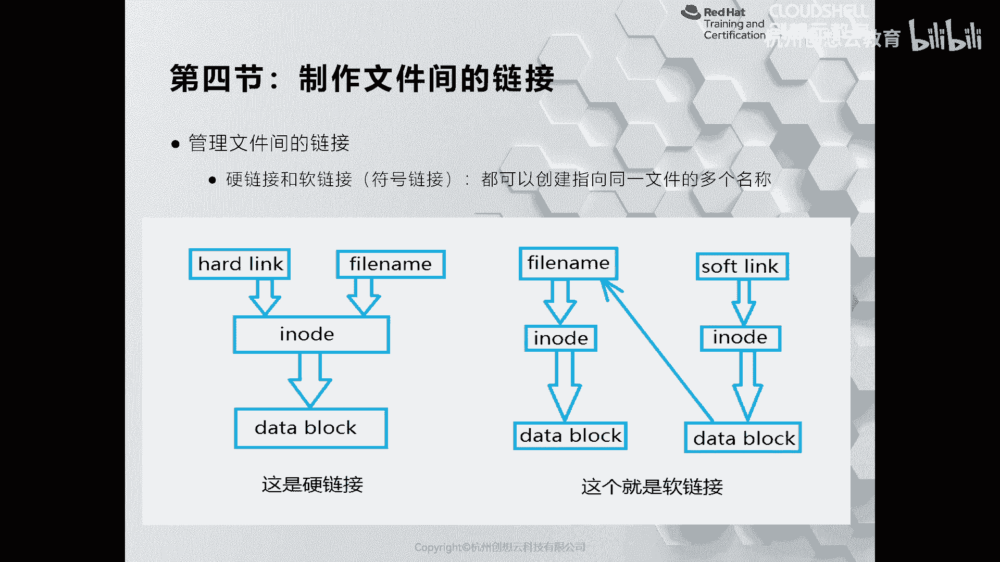

# 红帽认证系列工程师RHCE RH124-Chapter03-从命令行管理文件 - P4：03-4-从命令行管理文件-制作文件间的链接 - 杭州创想云教育 - BV1SP411j7W5

好，我们来看一下第四节制作文件间的链接。在我们的linkux当中啊啊我们有两种链接，一个呢叫硬链接，一个呢叫软链接啊。那要想明白什么是硬链接和软链接。那么我们要干嘛呀？

要首先知道我们的数据是如何存放在磁盘当中的。那么我这里呢以。啊，这个机械硬盘存放数据的方式为例来给大家介绍。首先啊我们来看PPT上的左侧的这张图。啊，跟着我的鼠标的位置。啊。

那么我们知道当我们啊新购买一个磁盘之后，要想在往里面存放数据。首先呢要给这个磁盘呢创建一个分区。然后呢格式化。在格式化的时候呢，它里面会对应的创建啊一定数量的I know的区域和block。

OK那么iode和block是干嘛用的呢？好，那么同样磁盘呢最小的单位呢是扇区，一个扇区呢是512个字节啊，当系统读取数据的时候，它不可能一个一个扇区的去读取，因为这样效率太低了。

因此呢它会预先的读取多个扇区。那么多少个扇区呢，它会把8个扇区呢当做一个区域。那么这8个扇区我们把它定义为是一个block。OK1个block。那这样的话呢就可以提高读取的速率。

但是如果我们的数据仅仅存放在block里面，对于系统再次读取查找文件的时候呢，也是一个啊很大的挑战啊，为了提高这个方面的效率呢？因此它会组建一个i node，什么是i node呢？i node。

我们一般称之为是索引，它指的是我们数据的源信息。在iode当中里面存放了文件的位置，就是在哪个block。OK还有呢就是我们的iode当中存放了文件的大小呀，文件的所有权、时间戳这样的信息。

O当我们读取一个文件的时候，那么系统呢就根据文件名和io的关系啊，去查找它对应的数据块啊，这是一个链接如果我们在对这个链接的啊基础之上创建了一个新的文件名。

但是这个文件名并没有啊并没有改变它的i note和对应的快这样一个关系啊。哎，那么这条链这条链路呢，我们就称为是一个硬链接。啊。

硬念级OK那么我们可以通过LOS杠I和state命令呢来观察一个文件的源信息和I know的信息。

好，比如说我现在呢L看一下我的文件呢有一个example一点state啊点tST。那么我就先用L杠LI去看一下我的examp一点这个文件。啊，它的iode呢是啊尾号呢是153。

那么我可以通过stateta命令来读取文件的语源信息啊，文件名、文件的大小啊，这个快这样的快啊，以及啊快的大小啊，文件的类型啊，然后呢所在的哪个设备啊，所对应的iode的索引号链接的数量。

还有它的权限信息。时间戳。安全上下文等等。啊，好，这是它的原信息啊原信息。OK好，那么接着呢我们来介绍一下什么是。软链接啊软链接。那么软链接的话呢，我们知道。

啊，硬链接的话呢是在原有的技录之上创建了一个区域啊。那么软链接的话呢，是在磁盘上新创建一个啊分配一个Io的和对应的块。在块当中呢存放了原始数据的线索或者信息啊信息。那这样的一个过程。OK那么这个信息啊。

这个信息指向原文件的文件名的这一个一个链路，我们称之为是软链接啊，我们可以把软链接呢啊当做什么呢？当做一个藏宝图的信息啊，那么软链接呢就相当于一个什么呢？就好像呢我有个匣子，在匣子当中呢放了一个藏宝图。

那么这个呢就是我们的软链接的名字啊，那么藏宝图呢就是什么呀？我们的这个啊软链接的数据，而藏宝图里面信息指向了啊具体的某一个位置存放了数存放了宝藏。那么指向的信息呢就是一个软链接啊，软链接OK啊。

这是软链接和硬链接。那么对于软链接和硬链接，我们如何去创建呢？啊，那么我们可以通过LN的命令来创建硬链接。LN其实就是我们的谁呀？link啊，link那么LN跟上原文件的名称的路径，后面再跟上一个啊你。

硬链接的位置就可以了。那么如果是软链接呢，则是通过一个杠S的选项，为什么呢？因为软链接呢我们又称为是符号链接啊，它在windows里呢其实就是快捷方式啊。那么LN杠S跟上原文件的位置。

再跟上目的文件的位置即可。啊，虽然它的命令非常简单，但是呢硬链接和软链接呢它们之间是有一定的局限性的啊，那么我们用的最多呢就是符号链接啊，那么我们可以给大家举个例子。好。

那么现在呢我的啊当前用户加目录里啊有一个example一点TST，我去创建一个硬链接，我们来观察一下什么区别。LN啊ho下面的student example一啊，我这里的举例呢用了绝对路径啊。

其实在同一个目录下面走相对路径是完全可以的。但是呢我呃这个写的完整一些啊，完整一些。Ohome下面的student，我提一个example3点TST，那么这是一个硬电题。好。

我们来观察一下之间有什么区别。我们发现啊，那么example一和example三的i know是一模一样的，也就意味着它们只是文件名不一样而已啊，其他的i know呀对应的快呢都是同一个。啊。

就好像我们看到这个呃谍战剧一样啊，某一个人啊有个特工，对吧？他有多个身份信息，但是呢都是同一个人，对吧？啊，同一个人。接着呢我再去创建一个什么呀软链接。这次呢我用相对路径。那么我们来再观察一下。

因会发现啊，那么我们的原文件和新的软链接文件呢是一个不同的iode，也就意味着我们的example4点TST呢在磁盘里面占用了新的iode和block。啊，我呢再删除一个原文件，example一点TT。

我们来再观察一次，你会发现我们的example3呢是不受影响的，还是可以访问的。因为我们只是删除了其中一个文件名而已啊，文件名和iod之间的关系并没有完全的打断。但是呢软链接而言呢。

我们删除了原文件信息。那么就意味着我们的。软链接呀，它的block里面啊信息呢在找到原文件的时候呢，找不到了啊，就会提示这样的一个过程。因此啊软链接和一链接完全是不一样的。那么我这里呢也做了一个。

啊，对比我们来看一下软链接和硬链接之间到底有什么样的区别。首先软链接呢类似于windows里面的快捷方式啊，我们因此呢又把它称之为是符号链接啊。如果我们把软链接里面的文件方更改。

同样它会同步到其他的文件里面。啊，因此我们的软链接是用的非常广泛的啊，还支持跨文件系统。比如说我在这个啊我有2块磁盘啊，我在磁盘一上面呢创一个文件，我可以把这个软链接呀放在第二块磁盘的文件系统上面。

那么软链接呢不仅仅可以指向文件，也可以指向目录啊指向目录。OK但是有一点要注意啊，因为软链接的话呢，它跨了文件系统或者某些原因，他们的权限可能会受影响。所以说呢唉在使用软链接的时候。

权限一定要注意OK那么。硬链接软我们的软链接呢只记录原始文件在哪里，它并不记录数据。因此原文件一旦被丢失，那么我们的链接呀就失效了啊失效了okK。这是我们的啊一些主要特点啊。

那么我们后面呢会学到一些命令。比如说L的时候呢，我们知道它链接的是L啊，后面会讲一个find的命令，可以通过类型里面的L类型来查找我们的二软链接。而硬链接呢它只是一个镜像。因此它是不占用磁盘空间的啊。

不占用磁盘空空间的啊，那么。同样我们的任何一个硬链接的数据发生了改变，会自动同步到其他的文件当中。但是呢它不支持跨文件系统。因为i know的值发生了变化，而硬链接的Iode呢是不变化的，因此就冲突了。

是不支持的。那么硬链接呢只支是这样文件而不支持指向目录啊。因为目录只是一个是一个抽象的概念，里面用来存放我们的文件呢，它本身是没有数据的啊，所以说不支持。啊。

那么接着呢就是如果我们对原始文件呢发生了移除啊，对我们的硬链接呢是不受影响的啊不受影响的，它没有标记。啊，这是我们的软链接和硬链接之间的区别。

