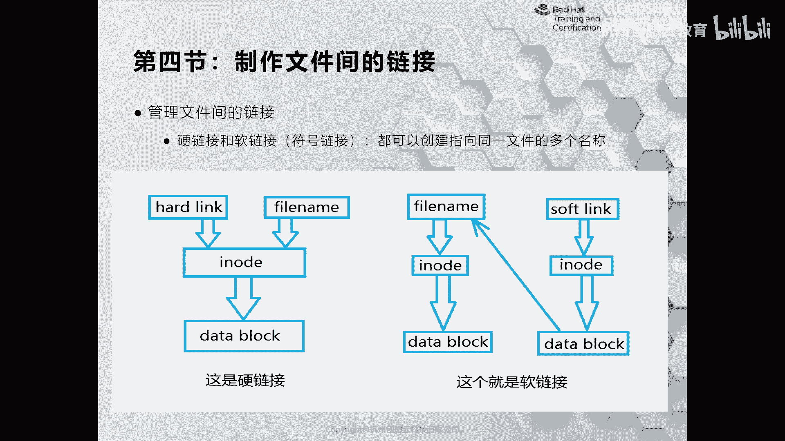
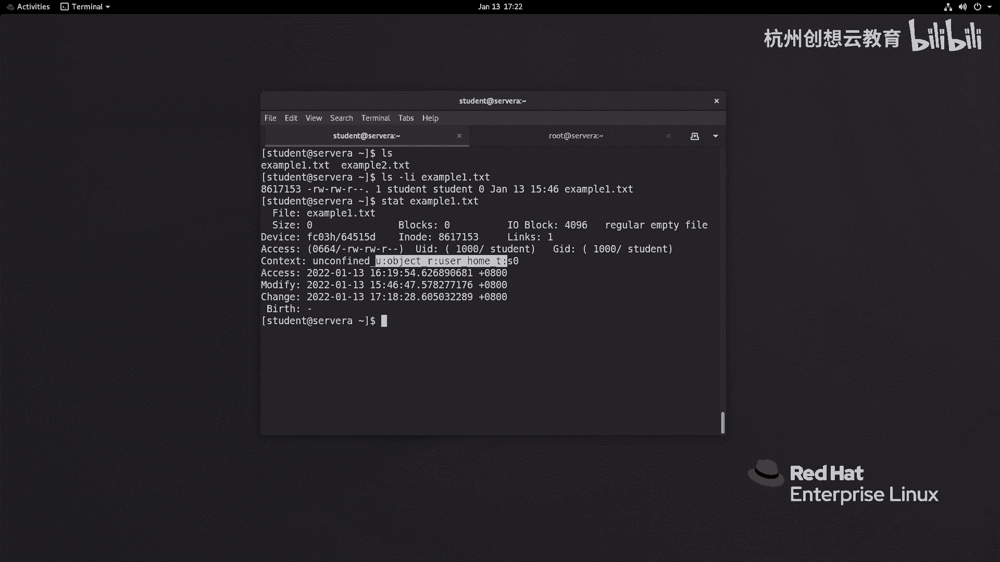
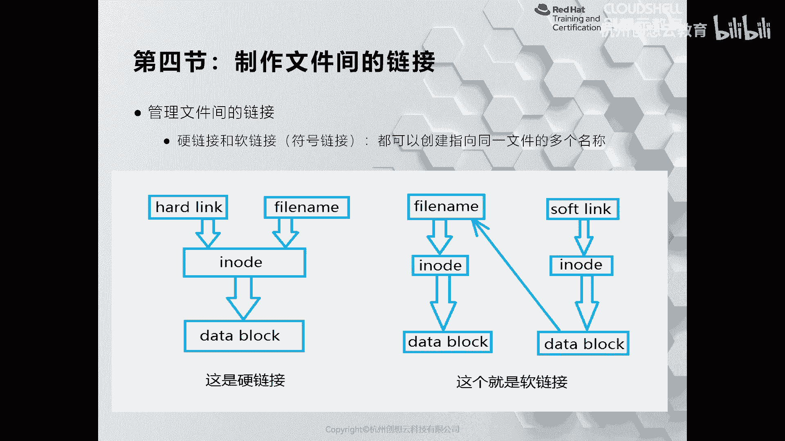
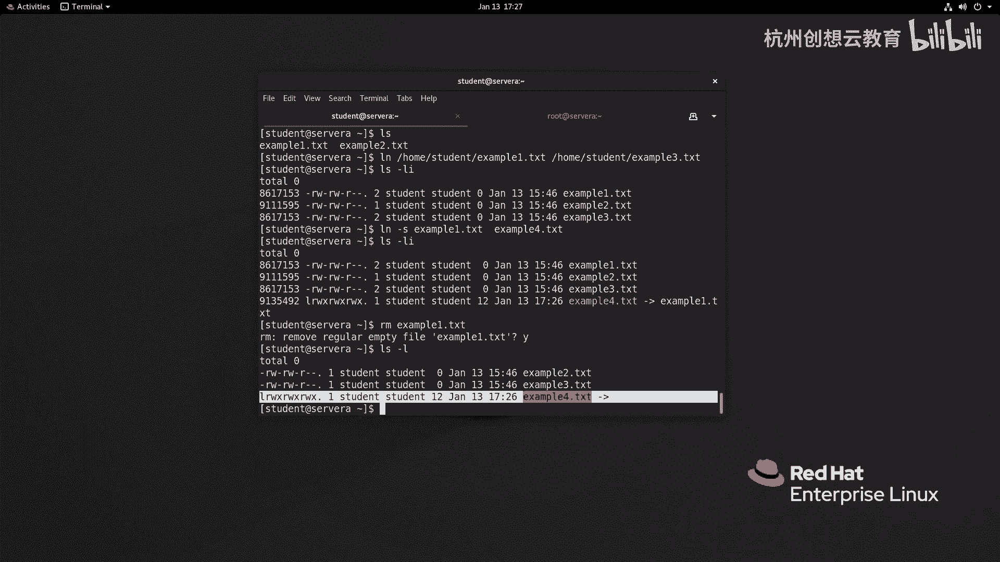
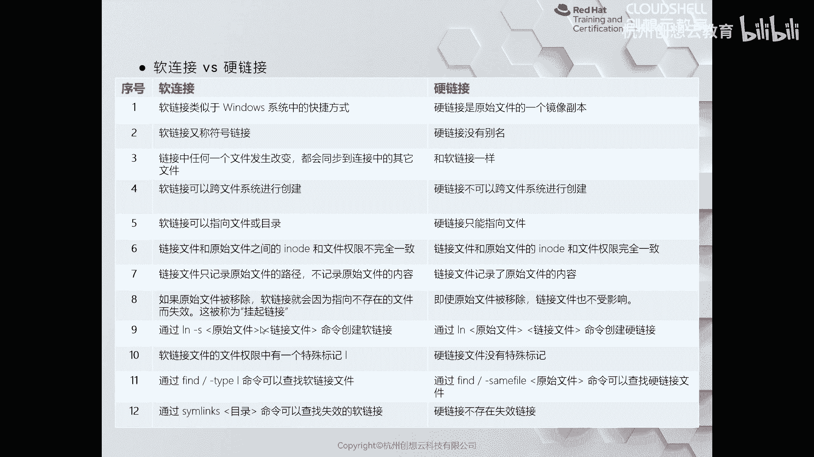

# 红帽认证系列工程师RHCE RH124-Chapter03-从命令行管理文件：03-4：制作文件间的链接 🔗

在本节课中，我们将要学习Linux系统中的两种文件链接方式：硬链接和软链接。理解这两种链接的工作原理和区别，对于高效管理文件系统至关重要。

## 概述

文件链接允许我们为同一个文件或目录创建多个访问入口。Linux系统主要提供硬链接和软链接两种方式。要理解它们，首先需要了解数据在磁盘上是如何存储的。

## 数据在磁盘中的存储方式

上一节我们介绍了文件的基本操作，本节中我们来看看数据存储的基础。以机械硬盘为例，当我们购买一个新磁盘并准备存放数据时，需要先进行分区和格式化。

格式化过程会在磁盘上创建一定数量的 **inode** 区域和 **block** 区域。
*   **扇区**：磁盘的最小物理存储单位，通常为512字节。
*   **块**：为了提高读取效率，系统会将多个扇区（例如8个）组合成一个逻辑单元，称为一个 **block**。
*   **inode**：称为索引节点，用于存储文件的**元数据**。它记录了文件的大小、所有者、权限、时间戳以及文件数据所在的**block**位置等信息。



系统读取文件时，会根据文件名找到对应的inode，再通过inode找到存储实际数据的block。

## 什么是硬链接？



在理解了inode的基础上，我们来认识硬链接。如果我们在不改变文件inode和对应数据块关系的前提下，为同一个inode数据创建了一个新的文件名，那么这条新的访问路径就称为一个**硬链接**。

我们可以使用 `ls -i` 和 `stat` 命令来查看文件的inode信息和元数据。

以下是查看文件inode和元数据的命令示例：
```bash
# 查看文件的inode编号
ls -li example1.txt

# 查看文件的详细元信息
stat example1.txt
```
`stat` 命令的输出会显示文件名、大小、块信息、inode索引号、链接数量、权限、时间戳等。



## 什么是软链接？

接下来，我们看看另一种链接方式。软链接（又称符号链接）与硬链接不同。创建软链接时，系统会在磁盘上分配一个新的inode和对应的数据块。这个新的数据块中并不存放原始文件的数据，而是存放了指向原始文件**路径名**的信息。

可以将软链接想象成一个“藏宝图”：
*   **软链接文件** 本身就像一个匣子。
*   **匣子里的藏宝图** 就是软链接数据块中存放的路径信息。
*   **藏宝图指向的宝藏位置** 就是原始文件。

## 如何创建链接？

了解了概念后，我们来看看如何实际操作。创建链接使用 `ln` 命令。

以下是创建硬链接和软链接的命令：
```bash
# 创建硬链接：ln [源文件] [目标链接名]
ln /home/student/example1.txt example3_hardlink.txt

# 创建软链接（符号链接）：ln -s [源文件] [目标链接名]
ln -s example1.txt example4_softlink.txt
```



虽然命令简单，但硬链接和软链接有显著区别。软链接（符号链接）在Windows系统中类似于“快捷方式”，因此应用更为广泛。

## 硬链接与软链接的区别与特点

以下是硬链接与软链接的核心区别对比：

**软链接（符号链接）**
*   **类比**：类似于Windows系统中的“快捷方式”。
*   **inode**：拥有自己独立的inode编号。
*   **跨文件系统**：支持跨不同的文件系统或磁盘创建。
*   **指向对象**：可以指向文件，也可以指向目录。
*   **原文件删除**：如果原始文件被删除或移动，软链接将失效（成为“断开的链接”）。
*   **权限**：其访问权限通常取决于原始文件的权限。
*   **查找**：可以使用 `find -type l` 命令查找所有软链接。

**硬链接**
*   **类比**：是原始文件的另一个“别名”或“镜像”。
*   **inode**：与原始文件共享相同的inode编号。
*   **跨文件系统**：**不支持**跨文件系统创建。
*   **指向对象**：只能指向文件，**不能指向目录**。
*   **原文件删除**：删除原始文件，只要还有硬链接存在，文件数据就不会丢失。
*   **磁盘空间**：不额外占用磁盘空间（仅增加一个目录项）。
*   **数据同步**：修改任何一个硬链接（或原始文件）的内容，所有关联的硬链接都会同步更新。

## 总结



本节课中我们一起学习了Linux中的文件链接。我们首先了解了数据通过inode和block在磁盘存储的基本原理。在此基础上，详细探讨了**硬链接**和**软链接**的定义、创建方法以及核心区别。硬链接是共享inode的镜像，而软链接是包含路径信息的独立文件。理解这些概念有助于您更灵活、更高效地在Linux系统中管理和组织文件。