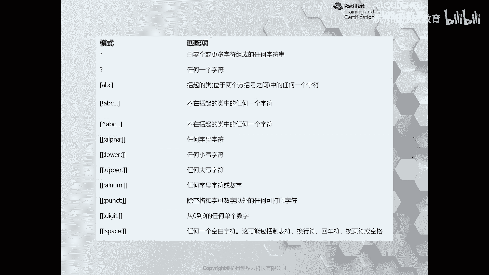
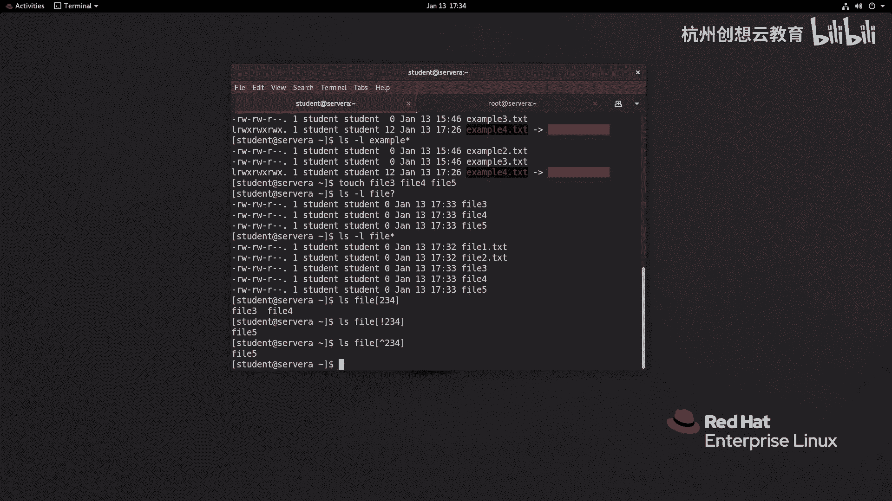
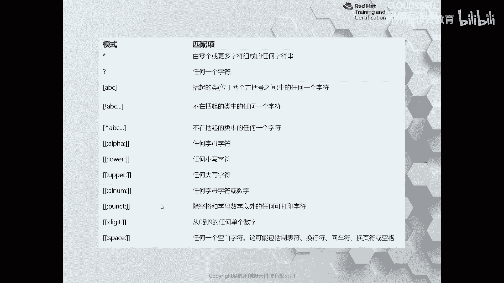
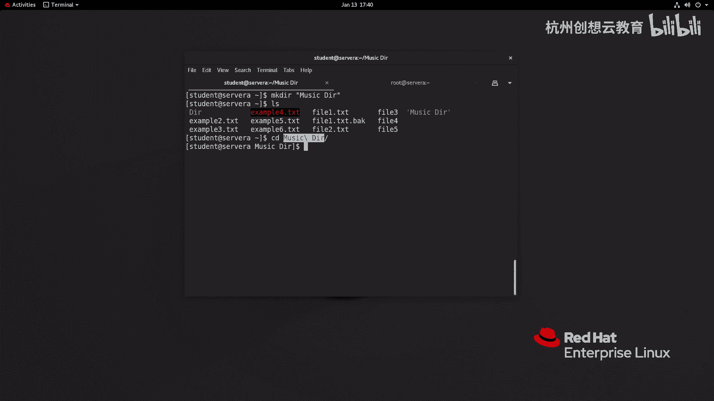

# 红帽认证系列工程师RHCE RH124-Chapter03-从命令行管理文件 - P5：03-5-从命令行管理文件-使用shell扩展匹配文件名 - 杭州创想云教育 - BV1SP411j7W5

好我们来看第五节啊，第五节的话呢是利用shell的扩展功能啊来匹配签名，其实主要的是什么呢，主要是通配符和一些表达式啊，和一些这个shell里面的表达式，ok啊首先呢我们来看一个表格。

那么这个表格里面的话呢是我们常用来匹配内容的啊，一些符号啊，首先这里的星号呢代表的是所有任何长度的字符串啊，然后呢问号呢则代表的是单个字符啊，单个字符啊。

那么中国湖里面的a b c则代表的是匹配任何一个字母，一个字母一个字符啊，那么就相当于p p a或者b或者c，那如果在中国湖前面加了个感叹号或者一个尖角符，则就意味着它可以代表排除啊，去相反的意思啊。

这是最好记的几个啊，好那么下面的这几个呢啊两个中国湖冒号阿尔法，什么lol什么阿er这些啊，就跟字面意思呢就可以了，那么阿尔法呢代表的是字符，小写字母啊，大写的买阿尔法和number对吧。

字符合数字的以及什么呀，除了空格和字母之外的可打印的字符，直至数字的和空格的啊，那么我们可以呢给大家简单举一些例子。

比如说我现在呢创建一些文件啊，创建一些文件啊，我创建个啊这个fell一点txt，非要二，第二txt啊，然后呢我们可以去筛选项，如果如果没有加任何内容呢，哎所有的啊它类似于我们走一个啊叫example。

哎我走一个问号啊，第二txt，那么他只去匹配呢，example啊开头以点tsd结尾的文件，因为中间呢只匹配了一个，那如果呢我加了星号呢，信号的呢，只要是example开头的，它都能去匹配啊，都能去匹配。

ok那如果我我想去匹配什么呢，我想去这个我想去这个匹配一个这样的内容，假如说呢我再创建一些文件好吧，我再创建一下，非要啊fail 4和fl 5，我们再来感受一下刚才的区别啊，ios杠杆l什么呀啊杠杆l。

然后呢这个fell问号，那么只有匹配345，那我加一个信号，看到没有，是不是多了两个诶，多了两个，ok那么如果呢我换成其他方式，比如说我写了一个i s去匹配什么呢，非要开头中火糊啊，这个这个234的。

那么能匹配到呢只有三和四诶，三和四啊，因为2c2 是没有的，但是有非二点t4 t当然了，如果你想排除掉，加上一个感叹号即可，或者是边角符即可啊，这样复即可，然后呢如果呢我们去想去匹配其他内容啊。

只要去啊去这个按照刚才的表格呢去编辑呢即可。

啊编辑即可。

那么除此之外呢，我们还有一些其他的用法，比如说我们可以使用波浪号代表用户的家目录，然后呢大波浪号呢则代表的是一个扩展啊，扩展字符啊，唉然后我们这里呢有例子，比如说非要花口胡123。

那么就相当于fil 1 v2 和fl 3。2t4 t，那么也可以用两个据点来代表一个序列，那么这个样例呢就代表是a。note，b。note，c。note和d。note，这是两个，我来给大家举个例子。

首先呢我去创建一个文件，这次呢我还是创建fail，但是呢我这次创建哎，我这次创建example吧，example啊，我创建一个呃567，那么就是五火炮627，第二题，ok我们就多了一个什么呀，567啊。

567好，然后呢我如果呢走一个什么呢，我走一个去备份，比如copy啊，我做个备份啊，我要备份谁呢，我要备份这里的啊，fl一点r t s t，我想把它被分成什么呀，我想被分成比，而后缀为ea k来结尾的。

你会发现这里呢就生成了一个fl一点2t s t，和fl一点2t s d b a k文件啊，非常的方便啊，非常方便好，那么接着呢我们再来啊，这个来了解一下那个什么呢，了解一下我们的这个变量扩展啊。

那么变量扩展的话呢，主要是相当于我们可以在shell上了，直接去定一个值，后面可以引用啊，可以引用，举个例子，比如说呢我这里呢定一个词呢叫什么呢，我定一个叫做啊a b c等于个啊，我写一个有一句话好了。

跟一个i am a student user啊，那么我就可以引用这样一个偏量，folder a b c啊，sorry啊a b c，那么如果标准的写法呢就是在变量的符后面呀。

和外面和关键词的外面加上花果符哎这样的内容对吧，因为如果你不加的话呢，那么可能会引起误解，比如说a b c啊，点儿什么呀，点s叫什么呀，点那个句号啊，那么走一下这个是没有问题的。

但有的特殊情况可能会出现问题，所以我们可以加上一个什么呀，上一个花圃胡给了一个整体啊，一个整体，那么命令啊命令替换啊，命令替换的话呢是干什么用的呢。

我们可以在执行命令的时候要加一个到那服我活把命令加进去，那么就相当于优先执行命令里面的内容，在执行外面的啊，早期的时候呢我们呃这个语法结构呀用的是反单引号，那么反单引号的话呢。

在编写视角脚本的时候容易和单引号呢弄混淆啊，有的时候不同的字体呀，那么反单引号和单引号看起来一样啊，是一样的，所以说呢我们就用这个dollar括弧来进行替换，那我们来举个例子。

比如说呢我想去啊cd到一个目录叫做什么呀，叫做e i r，但是呢这个目录是不存在的呀，因此我可以加上一个dollar括弧与make第一个什么呀，唉我们就可以进来了。

就相当于执行了make a d i r啊，封号啊，cd dr啊，相当于走了这个命令，啊相当于组这样一个命令，ok这是命令置换啊，命令置换，那么接着呢就是还有一个呢就是防止参数被扩展，那么是反斜杠啊。

那么我们前面的部分呢给大家介绍了，在啊这个命令行的结尾输入反斜杠呢代表是换行，同样我们在一些关键词前面加上谁呀啊反单引号哎，就可以进行什么呀，转移啊，反斜杠啊，它类似于单引号啊，单引号好。

我们呢同样呢举个例子，比如说呢你去执行一个命令叫io dollar，我使用系统里面一个变量呢叫hostname，打印主机的全名，但是呢我加一个什么信号，他就不在也是了啊，被转译成原本的意思了。

因为dollar本身是没有任何含义的，在计算机里面一般用于引用变量对吧，同样我也可以使用什么呀，反斜杠起到同样的作用啊，根据需要呢可以去使用这个功能，因为为什么呢，举个例子，比如说某些情况下呢。

我创建了一个啊目录，但是呢我加了一个啊不合理的符号空格，那这时候呢你可以发现啊，我们l4 自带了一个单引号，因为它是个整体是吧，那我们cd的时候给它自动就会加上我们的反斜杠啊，反斜杠，那你写脚本的时候。

那可能这个反斜杠就不会自动生成，你可以手动去加上去啊，加上去ok好。

