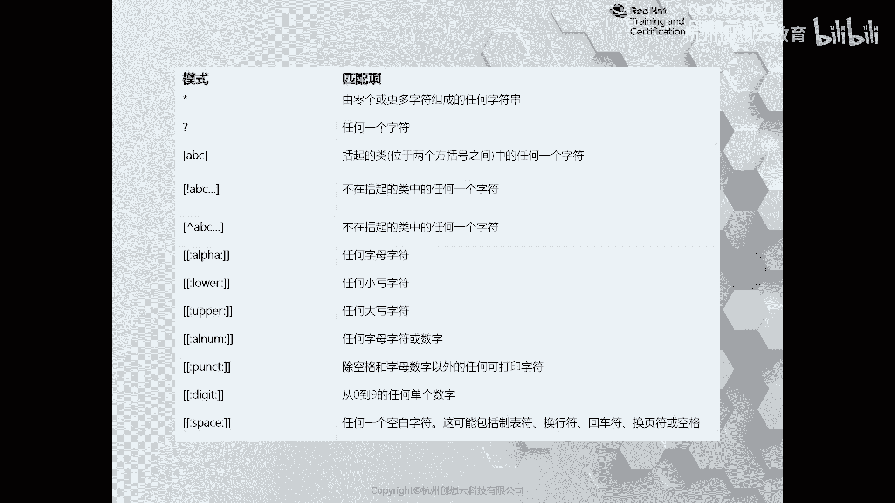
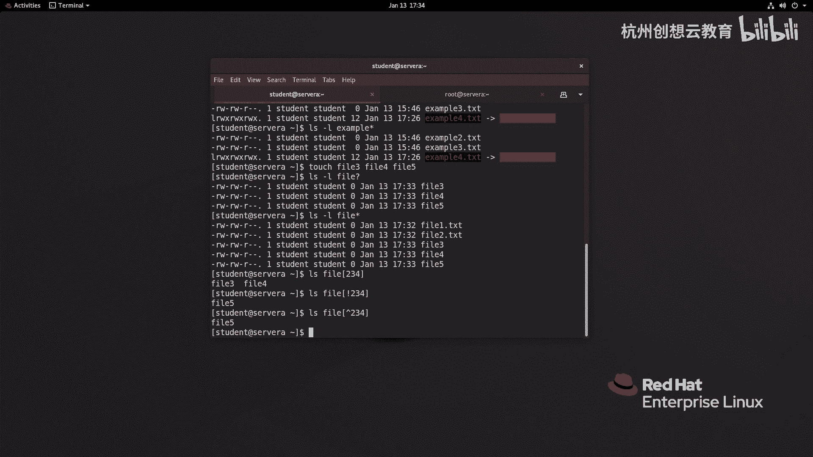
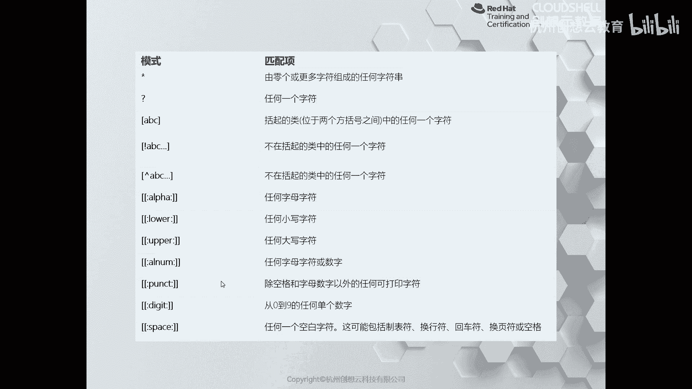
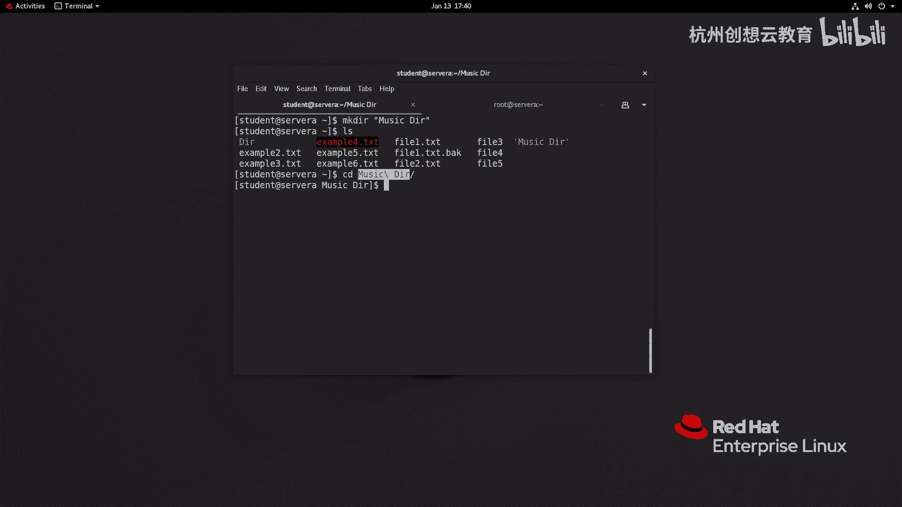

# 红帽认证系列工程师RHCE RH124-Chapter03-从命令行管理文件：P5：03-5-使用shell扩展匹配文件名 🧩

在本节课中，我们将要学习如何使用Shell的扩展功能来高效地匹配和管理文件名。Shell扩展主要包括通配符、花括号扩展、变量扩展和命令替换等技巧，它们能极大地简化文件操作。

## 核心匹配符号

首先，我们来看一个表格，其中列出了最常用的用于匹配文件名的符号。

以下是这些符号的含义和用法：

*   **`*`**：代表任意长度的任何字符串。
*   **`?`**：代表任意单个字符。
*   **`[abc]`**：匹配方括号内的任意一个字符（例如 `a`、`b` 或 `c`）。
*   **`[!abc]`** 或 **`[^abc]`**：匹配**不**在方括号内的任意一个字符（即排除 `a`、`b`、`c`）。



除了上述基础符号，还有一些预定义的字符类，它们以 `[[:类名:]]` 的格式表示：

*   **`[[:alpha:]]`**：匹配任意字母字符。
*   **`[[:alnum:]]`**：匹配任意字母或数字字符。
*   **`[[:upper:]]`**：匹配任意大写字母。
*   **`[[:digit:]]`**：匹配任意数字。

## 通配符使用示例

上一节我们介绍了核心的匹配符号，本节中我们来看看它们的具体应用。

首先，我们创建一些示例文件：

```bash
touch file1.txt file2.txt file3.txt file4 file5
```

现在，我们可以使用不同的通配符来匹配这些文件。



以下是使用 `?` 和 `*` 的示例：



*   命令 `ls file?` 会匹配 `file1`、`file2`、`file3`、`file4`、`file5`，因为 `?` 匹配单个字符。
*   命令 `ls file?.txt` 则只会匹配 `file1.txt`、`file2.txt`、`file3.txt`，因为模式要求文件名以 `file` 开头，后接一个字符，再以 `.txt` 结尾。
*   命令 `ls file*` 会匹配所有以 `file` 开头的文件，包括 `file1.txt`、`file2.txt`、`file3.txt`、`file4`、`file5`，因为 `*` 匹配任意长度的字符串。

以下是使用字符集 `[]` 的示例：

*   命令 `ls file[234]` 会匹配 `file2`、`file3`、`file4`。
*   命令 `ls file[!123]` 会匹配除了 `file1`、`file2`、`file3` 之外的文件，即 `file4` 和 `file5`。

## 花括号扩展

除了通配符，Shell还提供了花括号扩展功能，用于生成序列或组合。

以下是花括号扩展的常见用法：

*   **生成序列**：`{1..3}` 会扩展为 `1 2 3`。`{a..d}` 会扩展为 `a b c d`。
*   **生成组合**：`file{1,2,3}.txt` 会扩展为 `file1.txt file2.txt file3.txt`。

例如，我们可以快速创建一组文件：
```bash
touch example{5,6,7}.txt
```
这条命令会创建 `example5.txt`、`example6.txt`、`example7.txt` 三个文件。

花括号扩展也常用于批量操作，例如备份文件：
```bash
cp file1.txt{,.bak}
```
这条命令相当于 `cp file1.txt file1.txt.bak`，为 `file1.txt` 创建了一个备份副本。

## 变量扩展与命令替换

Shell扩展还包括变量扩展和命令替换，它们允许我们在命令中动态地使用值。

**变量扩展**允许我们引用已定义的变量。变量名通常以美元符号 `$` 开头。
```bash
MYVAR="Hello World"
echo $MYVAR
```
更安全的做法是使用 `${}` 将变量名括起来，以避免歧义：
```bash
echo ${MYVAR}file.txt
```

**命令替换**允许我们将一个命令的输出作为另一个命令的参数。现代语法使用 `$(command)`。
```bash
echo "Today is $(date)"
```
这条命令会先执行 `date` 命令获取当前日期，然后将其输出作为 `echo` 命令的参数。

命令替换非常有用，例如，可以创建一个目录并立即进入：
```bash
cd $(mkdir -p newdir && echo newdir)
```
这相当于执行了 `mkdir -p newdir` 和 `cd newdir` 两条命令。

## 防止扩展（转义）

有时我们需要使用字符的字面含义，而不是它的特殊扩展功能。这时就需要进行转义。

防止扩展的主要方法有以下几种：

*   **反斜杠 `\`**：在单个特殊字符前使用，使其失去特殊含义。例如，`echo \$MYVAR` 会输出 `$MYVAR` 字符串，而不是变量 `MYVAR` 的值。
*   **单引号 `'`**：单引号内的所有字符都保持字面含义，不发生任何扩展。
*   **双引号 `"`**：双引号内会进行变量扩展和命令替换，但不会进行通配符和花括号扩展。

例如，如果文件名包含空格，我们需要引用它：
```bash
touch 'my file.txt'
ls 'my file.txt'
```
或者使用反斜杠转义空格：
```bash
ls my\ file.txt
```

---



本节课中我们一起学习了Shell扩展的核心功能。我们掌握了使用通配符（`*`， `?`， `[]`）匹配文件名，利用花括号扩展 `{}` 生成序列和组合，通过 `$` 和 `$()` 进行变量扩展与命令替换，以及使用反斜杠 `\` 和引号来防止特殊字符被扩展。熟练运用这些技巧，可以让你在命令行中更高效、更精准地管理文件。