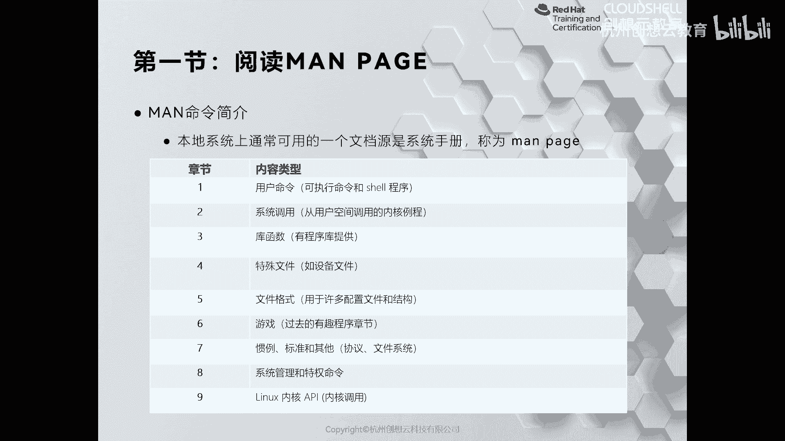
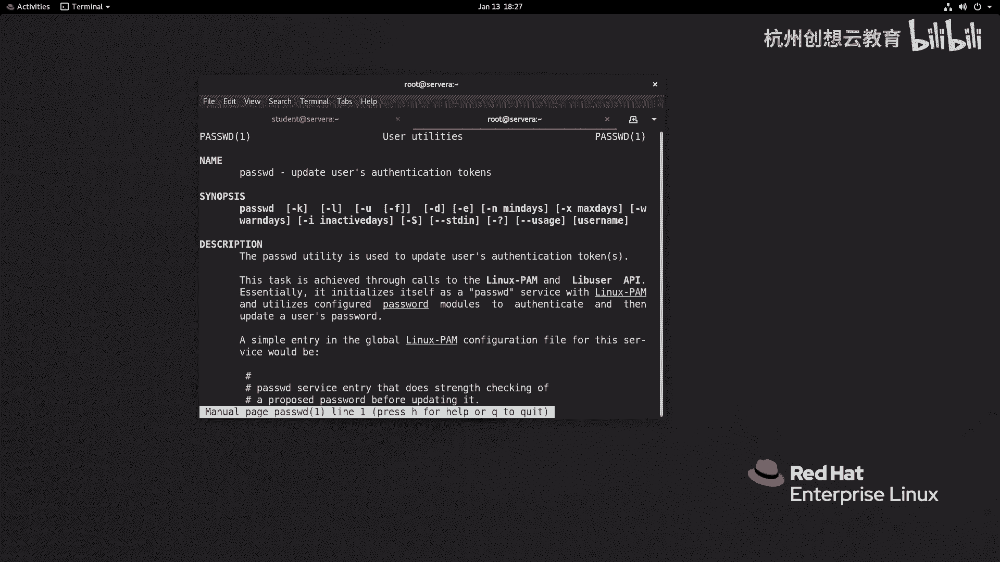
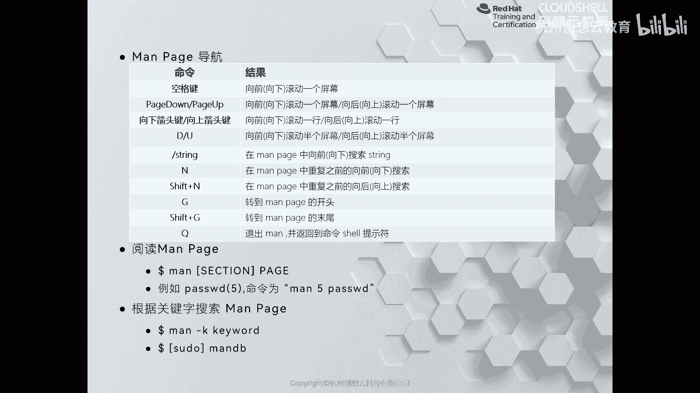
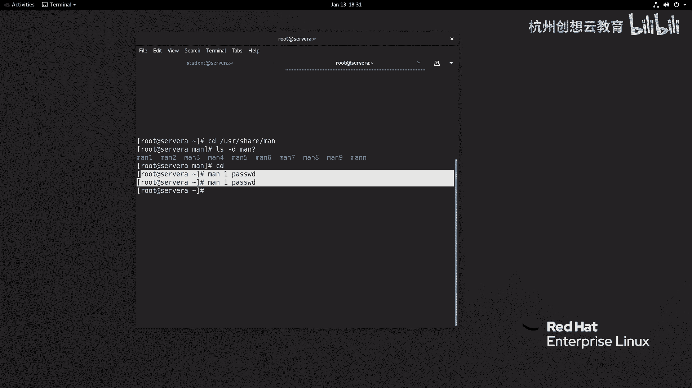
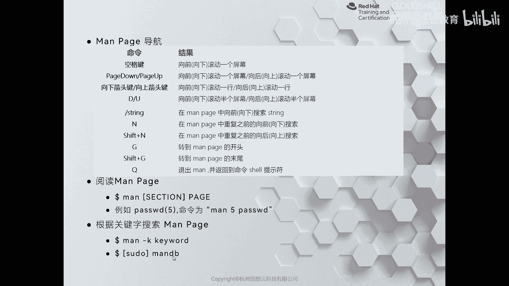
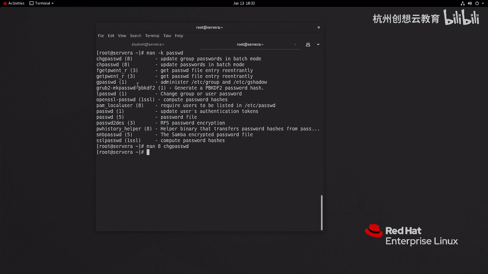

# 红帽认证系列工程师RHCE RH124-Chapter04-在红帽企业Linux中获取帮助 - P1：04-1-在红帽企业Linux中获取帮助-阅读man page - 杭州创想云教育 - BV1MG411471L

第四章节的话呢是介绍如何在鸿贸企业版linux当中获取帮助。在我们的linux当中啊，有内置两个工具，一个呢叫manure，一个呢叫GU info。

那么这两个工具呢都是用户无需在联网情况下来获得帮助的一个利器。因此我们把它称为本地的帮助系统。那么我们来仔细看一下如何呢获得帮助。首先我们来看第一节，如何使用man usual来获得帮助。

Oman usual的话呢是我们用的频率非常高的一个帮助手册。啊，那么只要是接触linux的人呀，他肯定知道my urural啊，那么为什么呢？因为my usualual呢，它把命令啊分成的很详细。

分成了不同的章节啊，根据章节，我们可以快速的去检索内容。我们来看一下man油肉有哪些章节。第一章节的话呢介绍了常用的命令，这些命令都是一些普通用户可以执行的啊。那么通过慢的第一章节来获得的信息。

第二章节呢则是一些系统的调用啊，系统调用的帮助信息。第三章节呢是库函数。第二章节和第三章节啊，对于初学者而言呢，可能用的比较少啊，我们将来呢涉及到了一些性能的调优啊，会用到第二章节。

了解一下系统调用的信息。第四章节的话呢是一些特殊文件的介绍啊，都是。放在DV目录下面的那些啊设备文件，比如说快设备文件啊，字符文件等等。第五章节的话呢是一些文件的格式。比如说我们安装了某个服务。

想对服务呢进行自定义的配置。那么我们就需要通过慢第五章节来获得帮助。第六章节呢是在过去的linkux当中啊，用于介绍一些游戏的啊。现在呢linux上面。

特别是企业级的linkux上面呀是没有带这些游戏的啊，感兴趣的同学呢可以啊自己安装一些啊经典的游戏呢进行尝试测试。第七章节的话呢主要是一些标准和这个协议等等。比如说我们想对整个的系统啊。

它缓存呀等等做一些调优。那么我们可以啊了解一下对TCP怎么去调整的。那么通过TC章节呢是可以看得到的。第八章节的话呢是一些。用于系统管理的命令。这些系统管理的命令呢一般来说啊。

对系统本身是一些有大的影响的。比如说我们后面要学习到的用户的管理，you ID啊。就属于是第八章节的范畴。那么第九章节呢则是一些内核的API啊APIOK那么章节知道了。

那么这些慢左册到底存放在哪些位置呢？

我们建议大家呢切换到root用户。然后呢，来到一个路径啊，这个路径呢就是用来存放文档的。在user下面啊user。啊，适眼慢。OK然后呢，我这里呢只查看这个目录里面的其他目录。

并且呢这个目录呀我只看慢开头啊，以数字结尾的。会发现这有慢一到慢九，正好对应了不同的章节啊，但是呢我们不需要来到这个物录里面去查看帮助文档。因为慢手册给我们提供了专门的工具，叫做慢啊。

通过慢慢后面跟上匹配章节。再跟上你要查找的内容。比如说我这里啊去查看第一章节的passWD的帮助文档，回车就能够打开它的第一章节内容。那么在这个页面情况下，如何去阅读呢？好，我们接着呢来看一个表格。

那么这个表格呢可以帮助我们快速的去啊掌握啊一些常用命令，其中空格键代表的是向下滚动屏幕。

如果你觉得空格键难以记忆，我们也可以使用键盘上的p down和p up进行翻动屏幕。啊，还有呢就是使用什么呀？使用方向键的上下键来选一按行的方式来滚动B和U按照半个平子的方式进行滚动。如果在阅读的时候。

我们没有找到想要内容，想快速的去检索，那么我们可以使用斜杠啊，后面跟上关键词进行搜索。在搜索的时候呢，使用N代表的是向前进行检索。大写字母N呢代表是向后进行检索。G可以快速跳转到开头啊。

大写字母G呢来跳转到我们的页面的结尾。Q呢是退出啊，那我这里呢给大家呢进行一个演示。

现在呢我摁下空格键。啊，它正在呢向下进行滚动。同样呢我可以摁一下PGup。和p down进行滚动。啊，那么D和U呢进行半个屏幕的滚动。啊，这些都是小写的字母。那如果想检索呢，比如说我想去找一找关键词呢。

叫user，输入斜杠，输入关键词user为车。那么被选中的部分是高亮来显示的，向下检索小写字母N。向上检索大子字母N。啊，如果我想跳转到整个文档的开头，注入字母G。来到末尾大写字母G。啊，结束Q退出。

那这是整个的一个流程啊流程。OK所以说呢一定要学会使用如何去查看我们的帮助手册啊，工具一定要掌握啊掌握。啊，但是呢有的时候呀啊那么我们在阅读呢不知道从哪里阅读。

其实我们的慢手册呢把我们的每个地方呀分的很清楚啊，比如说在我们的慢手册里面啊，你看第一行啊，第一行，第一行的话呢，会告诉我们是一个title啊，一个一个一个title啊，一个标题啊，告诉是用户的工具。

对吧？pass wD是用户的一个工具。然后呢。在工具左右两侧呢会告诉我们啊这个命令的一个常见的一个写法。那就是代表的是第一章节里面的pass达地啊，那么name里面的话呢是我们帮助手册的一个简要说明啊。

下面呢还有一些其他的内容啊，比如说我们的一个语法的概要啊，详细的描信息啊，除此之外呢，我们可能还会遇到一些比如选项啊啊，例子呀。啊，一些退出码呀啊还有一些这个什么呀，还有一些其他的相关联的文件呀啊。

有什么bug啊，相关联的其他的指令啊，作者信息等等。啊，等等。OK一般我们如果在查看的时候呢，你可以先去看选项。选项如果还不是特别的清晰，我们可以去找例子啊。但是例子的话呢不是说每个工具都有的啊。

这个要看运气啊，看运气OK。啊，那么刚才的这两种方法呀，我们都走的是精准的去匹配啊。那如果我忘记掉了关键词，那该如何去获得帮助呢？

啊，那么我们可以使用man杠K啊，然后呢来获得关键词的搜索。啊，但是呢我们搜索的时候啊，有时候可能慢手册的搜索库呀没有被更新，我们需要使用特权慢DB来更新啊。好。

那么我们来呃试一下我们的系统里面能否去通过慢来检索。

那么man按K来跟上关键词。哎，就可以了。那如果看不到会提示一些信息，找不到的话呢，我们可以使用慢B。来更新我们的数据库，一定要记得这个命令要用特权身份来执行。因为它更新的信息呢都是在根目录下面啊。

跟目录下面OK那么刚才呢我通过慢杠K呢检索信息的左侧是我们的精准匹配的内容。啊，那么括弧呢是在章节，右侧呢是它的简要说明。比如说第一个啊，那么我想获得帮助，那就是man第八跟上的工人匹配的字符串。

回车都可以打开。O好，那么这个地方呢就是我们的慢手册的使用。

