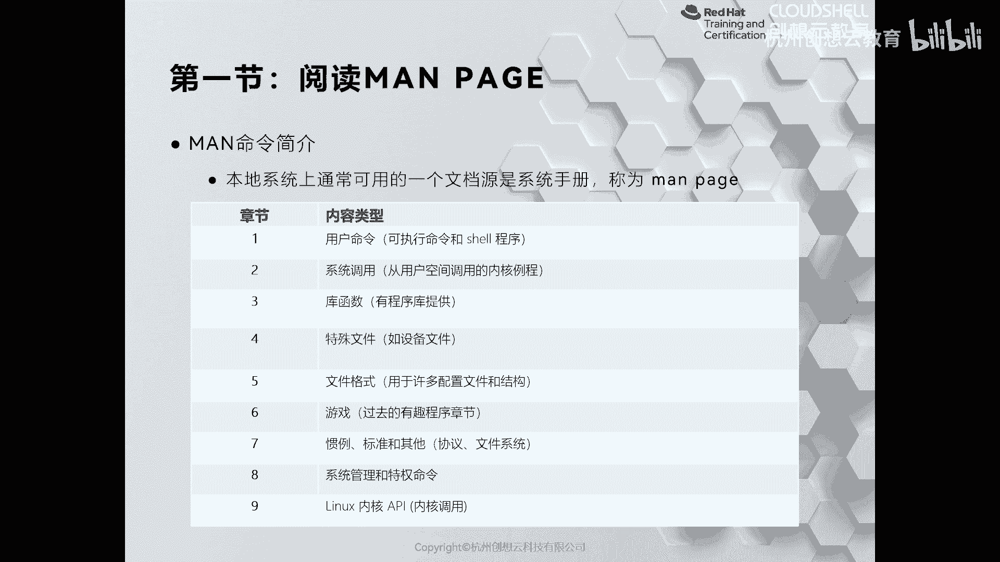
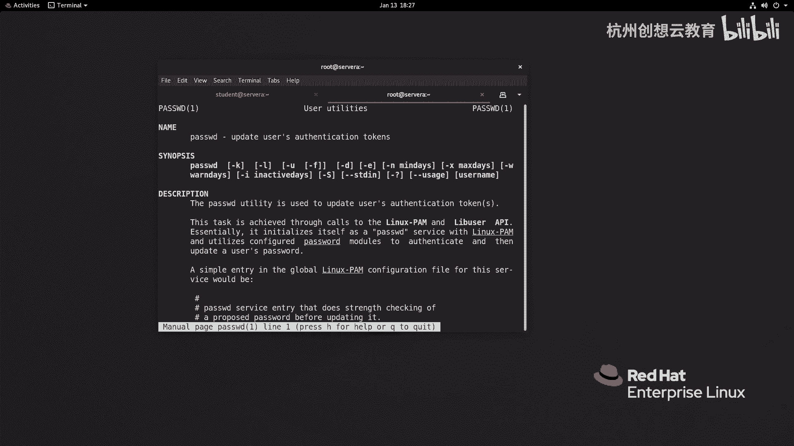
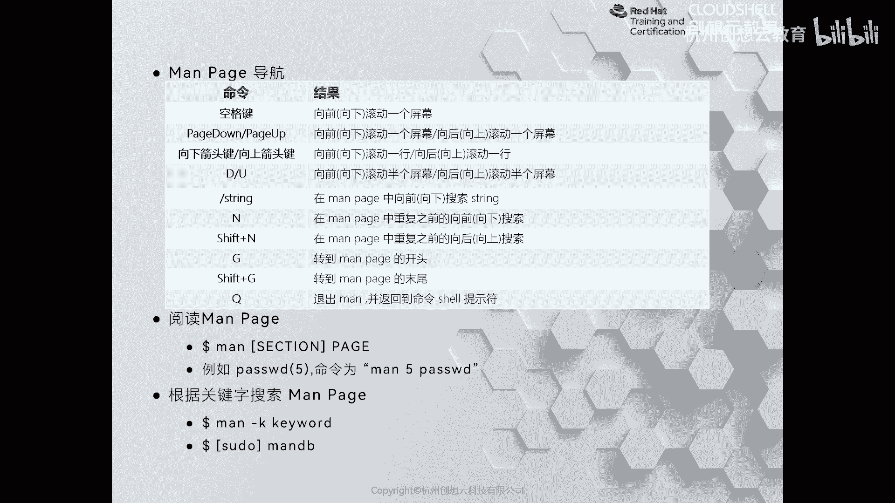
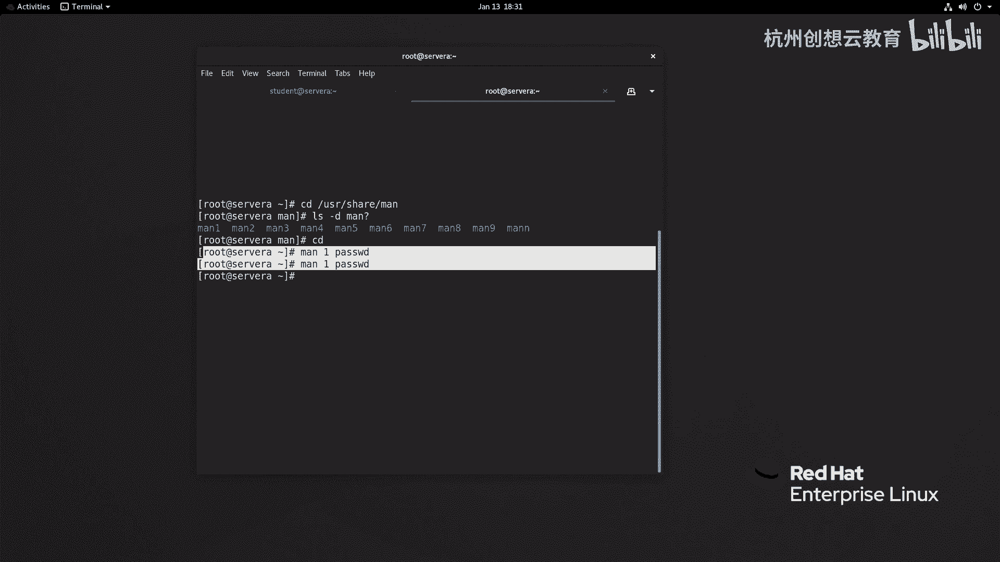
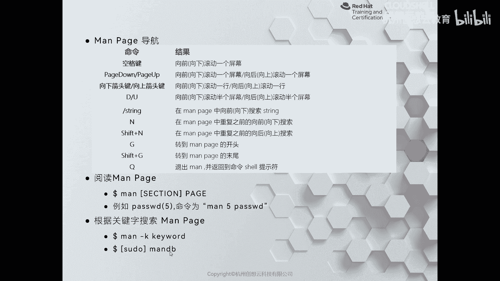
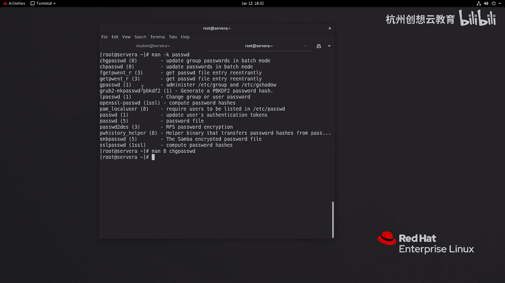

# 红帽认证系列工程师RHCE RH124：Chapter04：在红帽企业Linux中获取帮助

## 概述
在本节课中，我们将学习如何在红帽企业Linux系统中获取帮助。系统内置了两个强大的本地帮助工具：`man` 和 `info`。无需联网，用户即可通过它们查询命令和功能的详细信息。本节我们将重点介绍如何使用 `man` 手册页来获取帮助。

---

## 04-1：在红帽企业Linux中获取帮助-阅读man page

`man` 手册页是Linux系统中使用频率极高的帮助手册。它将命令和功能按照不同章节进行了详细分类，便于用户快速检索所需信息。

### man手册的章节
`man` 手册主要分为九个章节，每个章节涵盖特定类型的内容。以下是各章节的简要说明：



1.  **第一章节**：介绍普通用户可执行的常用命令。
2.  **第二章节**：介绍系统调用相关的帮助信息。
3.  **第三章节**：介绍库函数。
4.  **第四章节**：介绍 `/dev` 目录下的特殊文件，如块设备、字符设备文件。
5.  **第五章节**：介绍各类文件的格式，例如服务的配置文件格式。
6.  **第六章节**：在过去用于介绍游戏，现代企业级Linux发行版通常不包含此章节。
7.  **第七章节**：介绍各种标准、协议等，例如TCP协议的调整参数。
8.  **第八章节**：介绍系统管理命令，这些命令通常对系统有较大影响，如用户管理命令 `useradd`。
9.  **第九章节**：介绍内核的API。

这些手册页文件存储在系统的特定目录中。我们可以切换到 `root` 用户，查看 `/usr/share/man` 目录下的内容，会发现 `man1` 到 `man9` 的子目录，分别对应上述九个章节。



### 如何阅读man手册
我们无需直接进入上述目录查看文件，因为系统提供了专门的 `man` 命令来查阅手册页。其基本语法是：
```bash
man [章节号] <命令或关键词>
```
例如，要查看 `passwd` 命令在第一章节的帮助信息，可以执行：
```bash
man 1 passwd
```
执行命令后，会进入一个全屏的阅读界面。为了高效浏览，需要掌握一些常用的导航快捷键。

以下是阅读 `man` 手册页时常用的快捷键列表：



*   **空格键** 或 **Page Down**：向下滚动一屏。
*   **Page Up**：向上滚动一屏。
*   **方向键上/下**：逐行滚动。
*   **b** 或 **u**：向上/下滚动半屏。
*   **/**：进入搜索模式，后跟关键词可向前搜索。
*   **n**：在搜索模式下，跳转到下一个匹配项。
*   **N**：在搜索模式下，跳转到上一个匹配项。
*   **g**：跳转到文档开头。
*   **G**：跳转到文档末尾。
*   **q**：退出 `man` 手册页。

### man手册页的结构
`man` 手册页有清晰的结构，通常包含以下部分：

*   **NAME**：命令名称及简要说明。
*   **SYNOPSIS**：命令的语法概要。
*   **DESCRIPTION**：命令功能的详细描述。
*   **OPTIONS**：命令各选项的详细说明。
*   **EXAMPLES**：使用示例（并非所有命令都有）。
*   **FILES**：与该命令相关的文件。
*   **SEE ALSO**：相关的其他命令或文档。
*   **AUTHOR**：作者信息。

在查阅时，通常可以先查看 **OPTIONS** 部分了解各选项含义。如果不够清晰，可以查找 **EXAMPLES** 部分参考具体用法。

### 模糊搜索man手册
上一节我们介绍了如何精确查阅已知命令的手册页。但有时我们可能忘记了完整的关键词，这时可以使用 `man -k` 命令进行模糊搜索。



例如，想查找与“password”相关的所有手册页条目，可以执行：
```bash
man -k password
```
命令输出结果中，左侧是匹配的条目名称及所在章节，右侧是其简要说明。如果想查看其中某个条目的详细手册，例如 `passwd` 在第八章节的内容，可以执行：
```bash
man 8 passwd
```
如果执行 `man -k` 搜索时没有结果或结果不完整，可能是因为手册页数据库未更新。此时需要使用特权身份执行 `mandb` 命令来更新数据库：
```bash
sudo mandb
```



---



## 总结
本节课我们一起学习了如何在红帽企业Linux中使用 `man` 手册页获取帮助。我们了解了 `man` 手册的九个章节分类，掌握了使用 `man` 命令查阅手册页的基本方法及阅读时的导航快捷键。此外，我们还学习了如何通过 `man -k` 进行关键词模糊搜索，以及使用 `mandb` 更新手册页数据库。熟练使用 `man` 手册是高效学习和使用Linux系统的关键技能。