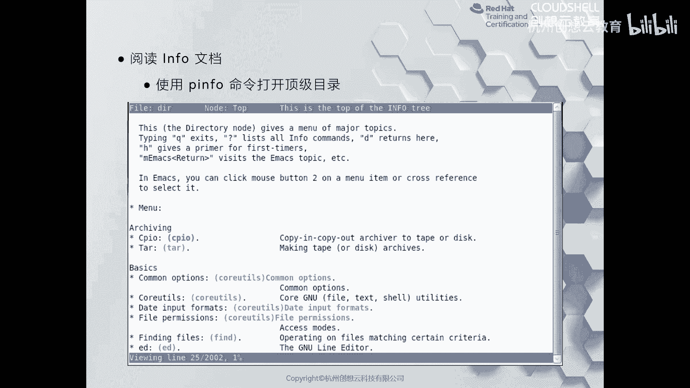
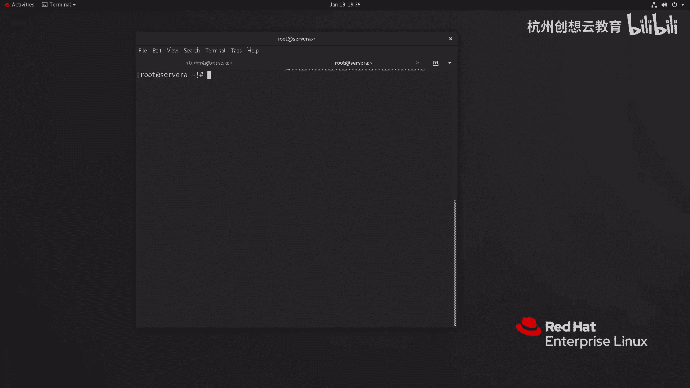
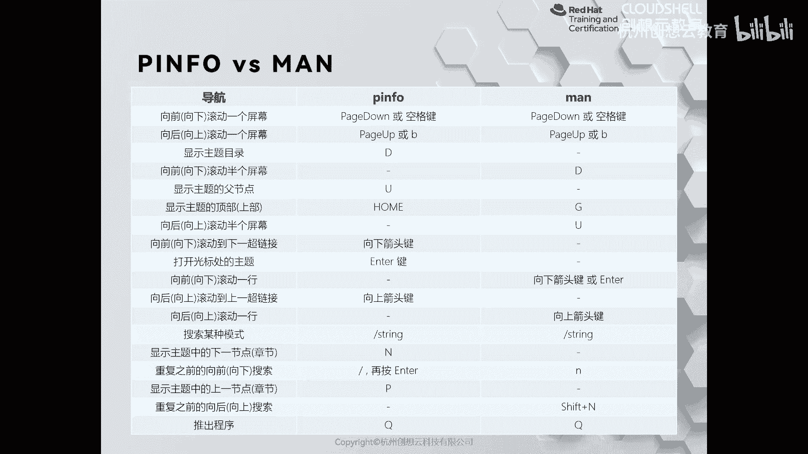

# 红帽认证系列工程师RHCE RH124-Chapter04-在红帽企业Linux中获取帮助 - P2：04-2-在红帽企业Linux中获取帮助-阅读Info文档 - 杭州创想云教育 - BV1MG411471L

接着我们来看一下如何去使用GNU in来获得帮助啊，那么为什么要使用GNU in呢？那么对于man page置而言，它是非常一种正式的格式。它记录了我们软件包当中特定命令的用法和功能啊。

并且呢针对每一个功能都是独立的软件都是一个独立的文件包啊来构建的。但是呢。啊，但是呢对于普通用户而言啊，或者说这个呃对于一些。我们常用一些某些软件啊，那么有些组件呀，或者说库啊等等。

都是由精因项目去开发的。那么卖手册可能就不太适用了。那么这种情况呢，我们就可以使用精优infer来获得一个啊内容更加综合的一个文档。那么对于啊精优infer而言。

那么我们来看一下它到底打开之后长什么样子。那么P for文呃拼 in for这个文档的话呢，它的整个界面呀有点像一个文本浏览器。啊，里面的这个被红色的部分是被选中的啊，就是这个链接呢被选中了。

而其他的这种蓝色的部分呢则是什么呀？则是一个。啊，超链接啊超链接。那么我们可以通过回车呢就可以去啊看到我们这样的一个内容啊一个内容。好，那这里呢我给大家呢做一个啊做一个这个简单的演示啊演示。

比如说啊比如说我这里呢去直接呢不加任何的内容啊，我去执行一个命令呢叫P音 for。

那么我们就会看到一个这样的一个界面啊，那么我们可以用上下箭头呢来去选中啊选中内容。如果高亮显示就是说明被选中了啊，就被选中了O比如说呢我们去选中一个呢，叫做随便找一个好吧，比如说我们找到一个bu啊。

我们就回车啊，那么我们就快速的就跳转到了哪里啊？这个bush的帮助信息页啊，我们可以通过最上方的信息文件bu点 info啊啊，node top对吧？下面呢是一个介绍啊，啊，就是下下一页呢是个介绍啊。

往前的是目录。啊等等，你可以通过方向键的左右键进行控制，往左返回到上一级啊，返回上一级O。返回来了。那么接着呢我再看哪一个呢？

比如说我看这个command options里面有关于crow u工具回车啊，那么这里呢就一些什么呀，其他的帮助信息。我们可以使用啊这个上下键的进行选择。那么大家看到啊，那么这里呢。

你的选项啊都是两个啊两个横线的，为什么呢？因为在我们的linkux里面呀，有两常见的有两种选项，一种呢是短格式的，就是一个大符，后面跟上字母的缩写。啊，但是呢还有一种呢就是符合GNU的。

就是两个大符跟上字母全拼啊，字母全拼啊，我们在后面的章节当中呢，都会慢慢去遇到这些内容啊这些内容。啊，那么这时候呢我摁下一个U，就可以快速的跳转到我们的页面的最顶格啊。

那么G的话呢那D啊那么可以跳转到我们的主题内容啊，题内容。同样呢我们也可以使用啊。斜线啊，对输进去它会有一个什么正则表达式啊，我们去匹配。比如说我输一个cl啊，you tells啊，它会去匹配啊。

去匹配啊，回车又来到了啊新的帮助页面Q可以选择退出。啊，那么如果你平常用的慢手册用的比较多，可能用Pin呀，哎不太这个适用啊，不太方便啊，感觉哪里怪怪的啊，但是呢这两种工具啊都有自己的一个缺点。

我们可以根据自己的需要呢进行相互的去补充。那么我这里呢给大家做了一个总结。我们可以通过这个表格来获得它们之间的语法性的一个区别啊，区别。那么比如说在P in里面的话呢。

和man里面啊，那么p down空格和p up和B呢功能是一样的啊是一样的。然后呢显示主题的话呢，命令是不一样的。你看它的U和man里面优功能不一样。O但是搜索倒是一样的啊，搜索啊。

搜索退出呢也是一样的啊，这一些都是习惯啊，那么我们一般用的还是慢手册会更多一些啊，如果这些呢依旧帮助不了你，那怎么办呢？我们也可以利用互联网的便便利性进行获得帮助，也是可以的啊，也是可以的。

