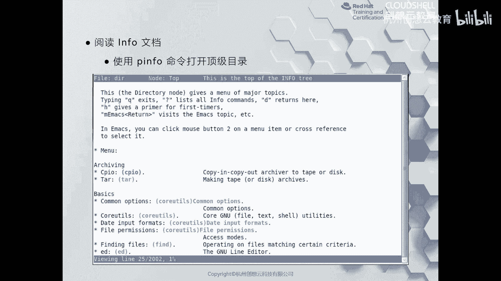
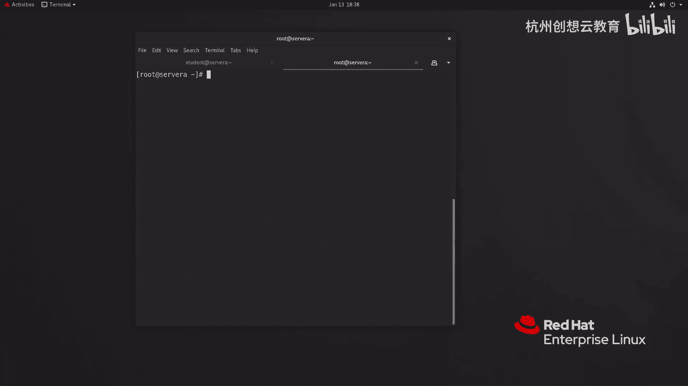
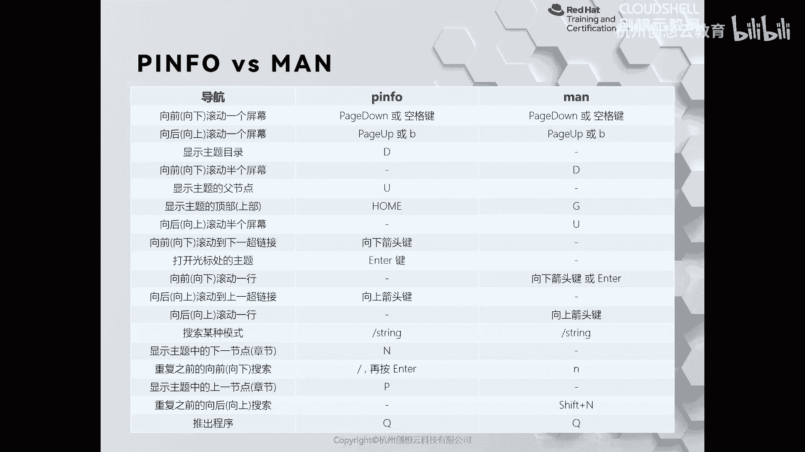

# 红帽认证系列工程师RHCE RH124-Chapter04：在红帽企业Linux中获取帮助 - P2：04-2-在红帽企业Linux中获取帮助-阅读Info文档

在本节课中，我们将要学习如何使用GNU Info工具来获取帮助。Info文档是另一种重要的帮助信息来源，尤其适用于GNU项目开发的软件，它提供了比man手册更综合、更具结构化的文档内容。

上一节我们介绍了man手册，它是一种非常正式的格式，记录了特定命令的用法和功能。然而，对于许多由GNU项目开发的软件、组件或库，man手册可能不够详尽或适用。本节中我们来看看如何使用Info文档作为补充。

## 什么是Info文档？ 📖

Info文档的界面类似于一个文本浏览器，提供了结构化的导航。在Info界面中，被选中的链接通常以红色高亮显示，而其他可点击的超链接则以蓝色显示。用户可以通过键盘导航来浏览不同章节的内容。

## 启动与浏览Info文档



要启动Info文档阅读器，只需在终端中输入 `info` 命令。

```bash
info
```

执行此命令后，会进入Info文档的主界面。您可以使用上下箭头键在菜单项之间移动，高亮显示即表示被选中。按回车键可以进入选中的主题。

例如，在Info主界面中，使用方向键选中“Bash”主题并回车，即可跳转到关于Bash shell的详细帮助页面。

在Info页面内，您可以使用以下按键进行导航：
*   按左右方向键可以在页面间前进或后退。
*   按 `U` 键可以快速跳转到当前页面的顶部。
*   按 `D` 键可以跳转到当前文档的目录。
*   按 `/` 键可以启动搜索，输入关键词（如 `coreutils`）并按回车，Info会定位到匹配的内容。
*   按 `Q` 键可以退出Info阅读器。

## Info与Man手册的对比

如果您习惯了使用man手册，可能会觉得Info的导航方式有些不同。这两种工具各有特点，可以根据需要互补使用。

以下是Info与man手册中一些常用操作的对比：

| 操作 | Info 命令 | Man 命令 | 功能说明 |
| :--- | :--- | :--- | :--- |
| 向下翻页 | `空格键` 或 `Page Down` | `空格键` 或 `Page Down` | 查看下一页内容 |
| 向上翻页 | `B` 或 `Page Up` | `B` 或 `Page Up` | 查看上一页内容 |
| 跳至文档顶部 | `U` | `g` 或 `Home` | 快速返回文档开头 |
| 搜索 | `/` | `/` | 在文档内搜索关键词 |
| 退出 | `Q` | `Q` | 退出帮助阅读器 |



## 其他帮助途径

如果man手册和Info文档仍无法解决您的问题，还可以利用互联网的便利性获取帮助。许多开源项目和社区论坛提供了丰富的教程、问答和文档。



本节课中我们一起学习了如何使用GNU Info工具来获取帮助。我们了解了Info文档的界面和基本导航方法，并将其与man手册进行了对比。掌握多种帮助工具的用法，将有助于您更高效地学习和使用Linux系统。