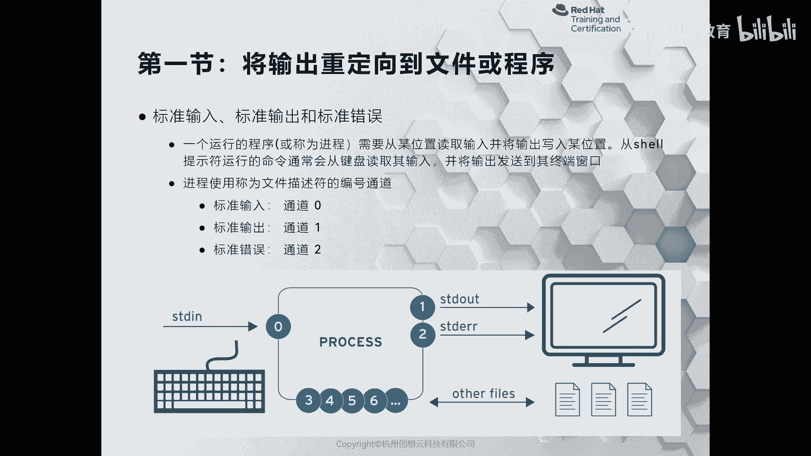

# 红帽认证系列工程师RHCE RH124-Chapter05-创建、查看和编辑文本文件 - P1：05-1-创建查看和编辑文本文件-将输出重定向到文件或程序 - 杭州创想云教育 - BV1XG4y1r78Y

第五章啊，创建查看和编辑文本文件。那么这张呢会给大家介绍如何利用shall里面的重定向符号，将命令输出的结果保存在文件当中啊。那么第二部分呢是给大家来介绍如何使用文本编辑VM来编辑文本文件。

第三个部分呢则是啊利用我们上面学习的知识。啊，比如说VM来更改一些时要变量啊，从而呢来帮助我们运行命令。啊，这张呢一共是三个小节啊。首先呢我们来看第一小节。将输出重立项到文件或者程序。好。

那么我们知道正常情况下呢，我们在键盘上啊输入指令okK然后呢，这个指令呢通过我们的CPU进行运算，将运算的结果呢会打印在我们的控台上面。那么这时候呢，它的输出结果呢就会有两种情况。

一种呢是命令执行成功之后打印的消息，一种呢是报错之后打印的消息。因此，我们把正常的输出呢称之为是标准输出。啊，那么使用英文呢SCDOUT来代替。那么它利用文字文件描述符R一来代表。

OK那么同时如果我们的指令在执行错误的情况下，那么它会输出一个标准错误，我们称之为是STD error啊，用数值2来代替啊，同样那么我们的输入呢用的是零来代替啊，那么这些012呢。

我们都称为是文件描述符啊，就是FD啊，那么这些描述符呢是可以通过系统里面呢去读取到的啊，我们来在思维上呢看一下。

因为它是文件表述符啊，无论输入还输出啊，那么输入的话呢是从输入设备，那么输出呢是从输出设备都属于设备文件啊，因此呢我们可以来到哪里呢？可以来到啊DV下面的。啊，来查看我们可以走一个命令啊。

叫L杠LSTD信号啊，那么来去匹配所有的啊标准输入输出或者是错误。那么我们会发现，那么我们的标准错误，它的是一个软链接啊，指向了我们的进程目录下面的一个self啊，FD文件描述符啊，那么指向的是2啊。

通胀标准输入呢。是零啊，标准输出呢是一啊，所以呢我们在描述标准输入标准输出和标准错误的时候呢，我们就用谁呀？标准用用这里的数字来表达就可以了啊，就可以了。OK好。

那么接着啊接着我们来演示一下一个标准输入和标准输出的流程。我现在呢回到加目录里面。啊，回到加目里面，然后呢我去执行一个命令啊，执行一个命令啊，那么比如说我执行个I啊，空格跟L。

那现在的话呢就是一个标准输入。当我按下回车的一瞬间，它会被我们的内核啊调用CPU的资源进行运算，并把输入的结果打印在当前的控台上面。那么这就是一套标准的输入到输出的流程。好。

但是呢有的时候呀有的时候我们可能有一个这样的需要。

啊，就说我希望呢我的指输出的结果呀，不仅不是打印在我们的啊这个控制台上面啊，而是放在文件当中，或者是不仅仅打印在控台上面。一部分内容呢同样保留在文件当中。那么这样一个过程呢，就变成了什么呢？

就变成了我们的这个标准输出重定向啊，或者标准错误重定项，统称之为是输出重定项。OK好，那么我们现在呢给大家来演示一下如何将命令输出的结果来打印到我们的文文本里面。要想打印到文本里面呢。

就需要使用一个纯立项符。OK那么我们来看这个表格啊，在表格的左侧用法里面的大于号啊，大于号就代表的是什么呀？标准输入啊，标准输入哎，左边啊。那个没有内容啊，标准输入到哪里了呢？

通过大于号就变成了标准输出到我们的一个文件里面。所以说大于号一个fi，我们称之为是标准输出重定项啊。那么如果按照图片的解释，也是可以看得到的。我们通过键盘或者其他的输入设备输入我们的指令。

然后呢通过处理，把原本应该打印在控制台上面的所有内容啊，进行了过滤和筛选，只保留了啊标准输出啊，并且呢把它放在了文件里面，而没有过滤的标准错误呢，则按照原来的IO路径输出到我们的控制台上面。

好，我们来看一下演示啊，那么当前我的加目录里呢有两个文件啊，那么我去输1个L啊，后面跟上一个文件名，同时我跟上一个不存在的文件。那么在这个打印的结果当中啊，就包含了一个标准输出和一个标准错误。好。

那么现在呢我去加上一个纯项符号。啊，那么大于号啊，后面跟上一个文件啊文件。注意啊，这个大于号呢其实前面是有个谁呀？是有个一的啊，标准输出我们一般省略掉啊。好，现在执行啊。

那么标准输出呢就不在我们的屏幕上显示了，而只有标准错误。那么同时在我们的文件当中也只有什么呀？只有标准输出。啊，标输出。那如果我现在呢想把这个啊这个标准那个。标准错误啊标准错误也想保留进去。哎。

我呢就可以把这个什么呀？这里的原来的啊大于号前面呢哎加上一个数字几呢，加上一个二啊，回车，同样啊只过滤了标准错误到我们的文件里面，而标准输出呢没有被过滤，因此呢还是直接输出在我们的控台上面。

因此它看起来呢就是我们图片当中的第三个。

啊，第三个okK好，接着我们这个来看一看这个文件里面的内容。

哎，我们会发现这个文件里面内容啊只保留了最近一次输入的内容，而之前的标准什么呀？输出是没有被保留的，被覆盖掉了。为什么呢？因为我们的标准输出重定项也好啊，标准错误重定项也好，那么它都是覆盖文本内容的啊。

那是不支持追加的那如果我想保留旧的内容，那么我可以呢哎在这个大于号后面呀再紧跟一个大于号两个大于号，那么这样一个符号呢，我们称之为是追加。OK这时候呢我们再打开啊，那么刚才的命令呢。

就相当于把标准输出追加在了文件里面啊。好，打开看一看我们的标准输出呢就在之前的那一行的下方啊，所以说啊标准输出里面涉及到了两个啊两个符号，一个呢是大于号，一个呢是两个大于号啊，同样这个两个大于号呀。

也可以啊，前面跟上谁呀，跟上标准错误啊，那么。错误。因此我们在总结的时候呢，只需要啊来记呢，就是谁呀啊，大于号代表的是重定向，两个大于号代表的是追加重定向啊，追加重定向。

而根据重定向前面符号数字的不一样，则代表于不同的重定向。那么默认没有写啊，一个大于号或两个大于号呢都代表是标准输出，对吧？哎，这个点二呢就代表是标准错误啊，标准错误O。好，那么接着呢我们来看啊这个。

另外一张图。

那么这张图的话呢，里面涉及到了一个设备叫什么呢？叫做DV下的NULL闹空是吧？那么这个设备呢是我们linux里面一个特殊的设备啊，那么这个设备呢就好像一个黑洞一样啊，我们永远呢往里面丢弃啊。

任何的输出啊，那么都是无法将它填充完的啊，因此我们可以利用这个设备把标准输出或者标准错误啊丢弃掉。一般来说呢是丢弃的是标准错误啊，我们来演示一下效果。

现在呢我同样执一个命令叫L杠LABC点tT。那么它只有标准输出。那么在执行的时候呀，我不希望看到这个错误，那么我就用二啊。那这时候其实我们用大于号和两个代于号呢都没有任何的区别啊。那因为没有区别的话呢。

你追加有没有意义。所以说呢一般来说呢只用于谁呀？一个大于号就可以了。好，DV下的NULL啊，就没有消息输出了啊，标准错误并丢弃掉啊，并丢弃掉。那有没有一种这样的需求呢？就是说我呢想。

既保留啊文件的标准输出，同时呢也想保留文件的标准错误输出。那么我就可以啊这样来做。那么首先将标准输出放在一个文件里面。B，然后呢，剩下的只有谁呀？标准错误了。然后呢，标准错误呢干嘛呢？就是二呢？

二大于啊就是二把标准错误重定向到哪里呢？重定向到标准输出里面啊，标准输出里面。那么就相当于我们的标准错误呀，转了一圈回来又变成了一个标准输出。同样我们的屏幕上没有打印任何消息啊，我们来看一下ABC啊。

看一下我们的file啊，那么fall里面保留了标准错误和标准输出。啊，但是呢上面的这个写法呀啊比较落后了。我们现在呢一般会这样来写啊，不用这么麻烦的语法了，直接呢在大于号前面输入一个and符号啊。

and大于号则代表的是将标准输出啊和标准错误重定向到我们的文件当中啊，打开看一看。啊，大家看一看OK这是给大家介绍的标准输入，标准输出标准错误啊，以及相关的重定下啊这个。追加重项啊，这些内容啊。

我们可以来回过头再来看这张图啊，这张图这是我们给大家讲解的内容啊，但是呀但是呀那有没有另外一种方法哎，另外一种方法叫什么呢？就是说我在这个处理的时候呀，你既然标准输出可以放在文件里面。

我是否可以把这个标准输出呀，哎，让另外一个命令来进行处理呢？当然是可以的。那么就涉及到了我们的管道知识。所以管道呢，就是说我在两个命令的中间使用一个竖线字符啊，来放置。然后呢。

它会把上一个命令的标准输出传递给第二个命令进行去加工处理。啊，比如说。

啊，比如说我现在呢去执行一个命令啊，这个命令叫做帮助啊，我想帮助一下我的IS这个信息。那么在执行的一瞬间呀，他会把所有的帮助信息打印在我们的终端上面。但是呢终端上面依旧会保留其他的内容啊。

如果是在图形化界面操作呢，还好，我们可以利用鼠标的滑轮来向上啊查看啊。但是呢如果在文本界面，或者说我们的鼠标不适用的场景情况下，那么就没有办法解决了，那怎么办呢？我们可以在命令的后面加上一个管道符。

利用我们之前学习的啊分页命令，比如说lessice进行二次加工，哎，它就可以把我们的输出结果呀进行什么呀？来进行处理，就好像lessice去查看IOS helpp的帮助一样。OK这是管道符啊管道符。啊。

环到福OK好，那么接着我们再来看一个工具。

啊，那么我们刚才呢利用了管道啊，将标准输出呢进行了二次的加工啊，或者说呢直接使用标准错误和标准输出。将指定的内容啊保存在文件里面啊，那有没有种方法既可以啊将标准输出或标准错误以及两者。保存在文件里面。

又可以把这些内容呢打印在我们的控台上面，便于观察一个非常直观的样例。比如说我们开发了一个应用程序，那么应用程序呢在执行过程当中可能会报错。我呢就希望将这个报错信息呢以日志的方式存放在本地磁盘里面。

便于啊后期的分析问题，但与此同时呢，我也希望把这个标准错误呢打印在终端上面，这样可以提醒用户哎我这个应用程序呀报错了。那么我们可以使用这里的T进行加工啊，可以使用这个T电加工啊。好，我们举个例子。啊。

比如说我们敲一个命令啊敲个命令。在敲级命令之前呀，我现在呢去打开一个虚拟机的控制台。

我去看谁呢ser哎。

好，那么在思路A上呢，我去登录一下。这里呢是为了让效果更加的方便呃，分分的很明确啊。好，我说个TTY啊，那么我们在文本控台上面的终端呀是TTY1啊，那么我在这个我的远程上执行个命令。

同样我还要执行刚才的命令，但执行中间呀，我加一个T。把这个T的信息呢放在哪里呢？放在DV下的TTY1上面，然后呢再加一个反道符回车。哎，在我们的终端上面呢，依旧有内容输出。

同时在我们的啊远程的这个终端上啊，也有内容输出。但是呢在我终端上的输出呢，是通过谁呀？IRS进行处理的。而左边啊文本控台上面内容呢是直接呢通过T啊来输出的。好，那么这一小节啊就是我们相关的重定向啊。

以及管道符和T命令的内容。

