# 红帽认证系列工程师RHCE RH124-Chapter05：创建、查看和编辑文本文件

## 概述
在本节课中，我们将学习Linux Shell中的核心概念——输入/输出重定向。你将了解如何将命令的输出结果保存到文件中，以及如何利用管道和`tee`命令处理数据流。这些技能对于管理日志、自动化任务和高效处理命令输出至关重要。

---

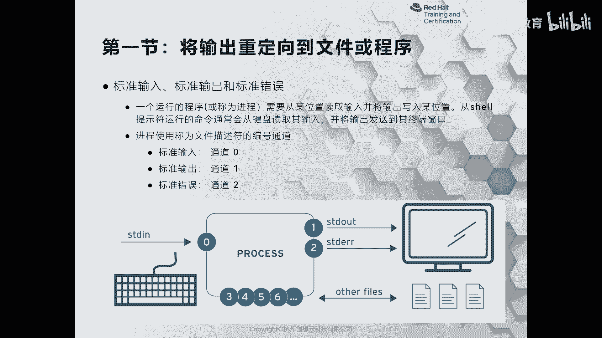

## 第五章：05-1：将输出重定向到文件或程序

在Linux系统中，命令执行后会产生输出。通常，这些输出会直接显示在终端屏幕上。然而，有时我们需要将这些输出保存到文件中，或者传递给另一个命令进行进一步处理。这个过程就称为“输出重定向”。

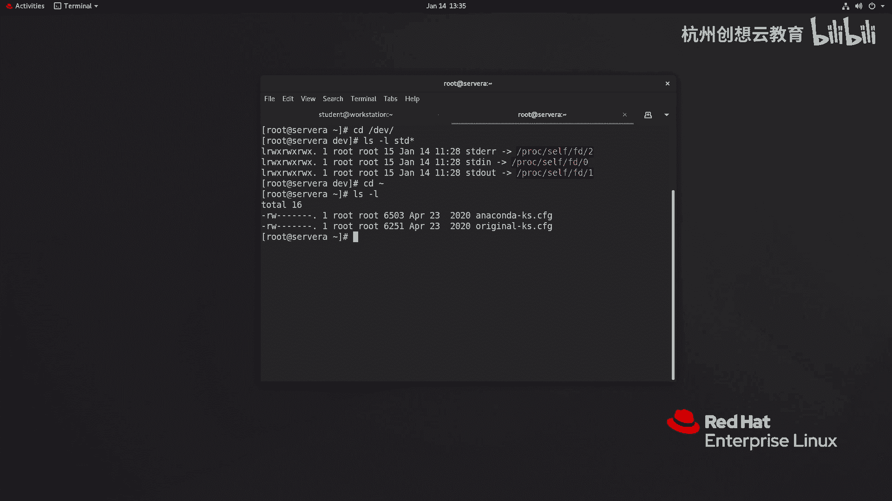

上一节我们概述了本章内容，本节中我们来看看输出重定向的具体机制和应用。

### 标准输入、输出与错误
在深入了解重定向之前，需要理解三个核心概念：标准输入、标准输出和标准错误。

*   **标准输入**：命令接收数据的来源，通常来自键盘。其文件描述符是 `0`。
*   **标准输出**：命令执行成功后打印的消息。其文件描述符是 `1`。
*   **标准错误**：命令执行出错后打印的消息。其文件描述符是 `2`。

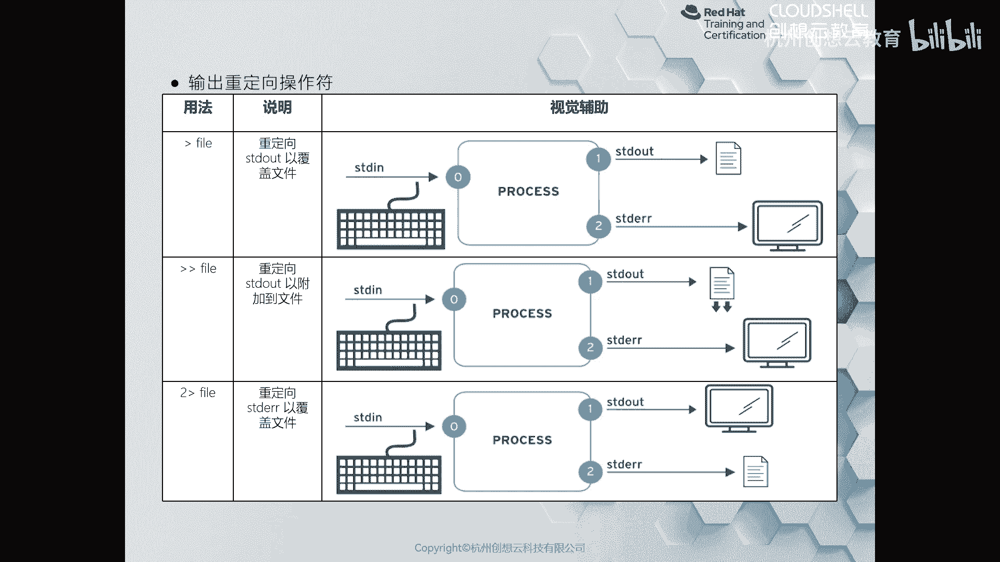

文件描述符是系统用来追踪打开文件的数字标识。我们可以通过 `/dev` 目录下的特殊文件来查看它们。

```bash
ls -l /dev/std*
```

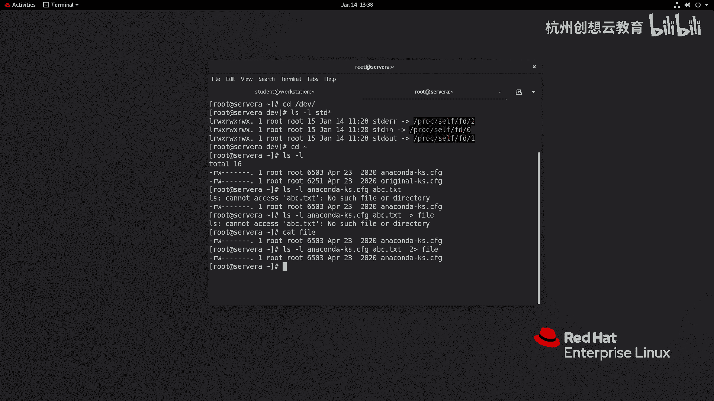

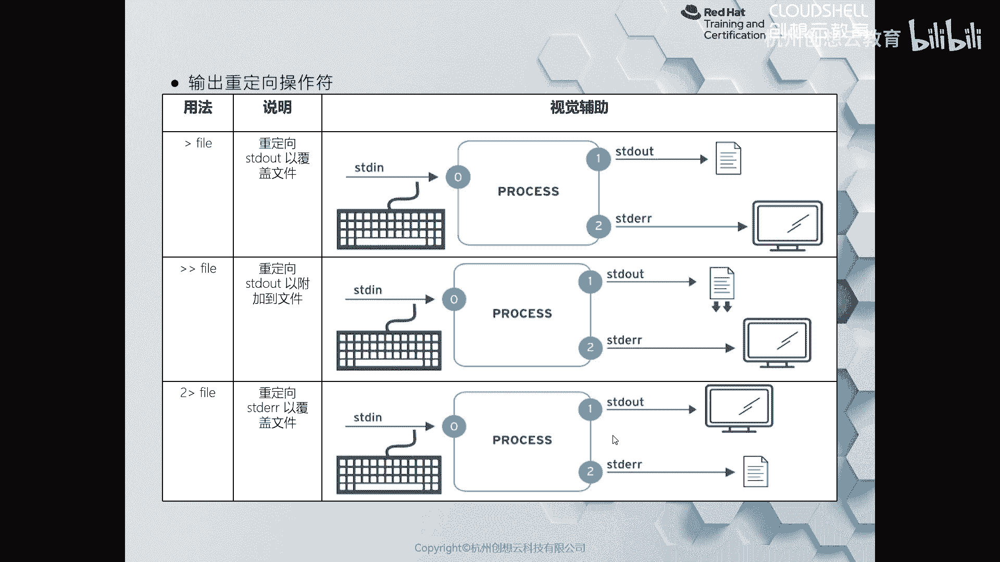

### 输出重定向操作符
输出重定向允许我们将原本应显示在屏幕上的内容，转而发送到文件或其他地方。

以下是核心的重定向操作符：

*   **`>`**：将标准输出重定向到文件。如果文件已存在，则会**覆盖**原有内容。
    *   公式：`命令 > 文件`
*   **`>>`**：将标准输出**追加**到文件末尾，不会覆盖原有内容。
    *   公式：`命令 >> 文件`
*   **`2>`**：将标准错误重定向到文件。
    *   公式：`命令 2> 错误文件`
*   **`2>>`**：将标准错误追加到文件。
    *   公式：`命令 2>> 错误文件`
*   **`&>`** 或 **`2>&1`**：将标准输出和标准错误都重定向到同一个地方。
    *   公式：`命令 &> 文件` 或 `命令 > 文件 2>&1`

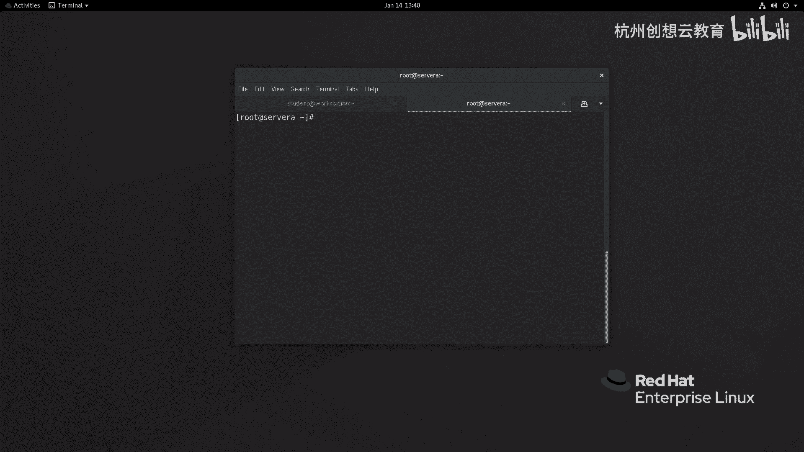

**示例演示：**
假设当前目录下有一个文件 `a.txt` 和一个不存在的文件 `b.txt`。

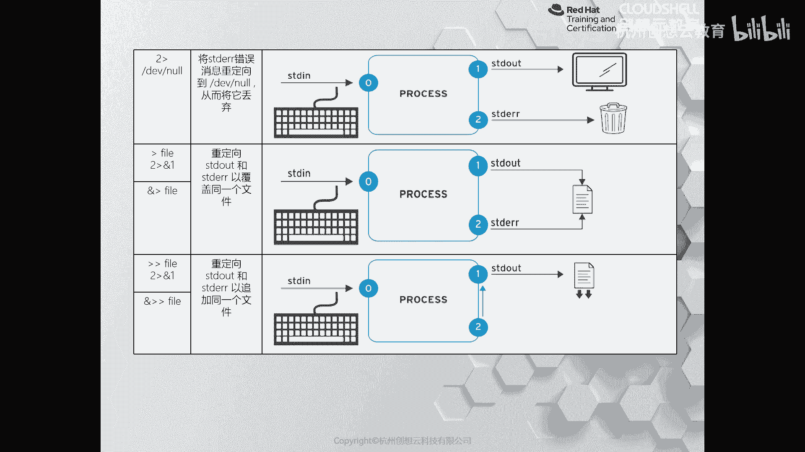

1.  执行 `ls a.txt b.txt`，会同时看到成功列出 `a.txt` 的标准输出和找不到 `b.txt` 的标准错误。
2.  执行 `ls a.txt b.txt > output.txt`，则只有标准错误会显示在屏幕上，标准输出被保存到 `output.txt` 文件中。
3.  执行 `ls a.txt b.txt 2> error.txt`，则只有标准输出显示在屏幕上，标准错误被保存到 `error.txt` 文件中。
4.  执行 `ls a.txt b.txt &> all_output.txt`，标准输出和标准错误都会被保存到 `all_output.txt` 文件中，屏幕无输出。

### 特殊设备 `/dev/null`
`/dev/null` 是一个特殊的设备文件，它像一个“黑洞”，任何写入它的数据都会被丢弃。这常用于屏蔽不需要的输出，尤其是错误信息。

**示例：**
`命令 2> /dev/null`
这条命令执行后，标准错误信息将被丢弃，不会显示在屏幕上，也不会保存到任何文件。

### 管道符 `|`
管道符用于将一个命令的标准输出作为另一个命令的标准输入。这是组合简单命令以完成复杂任务的强大工具。

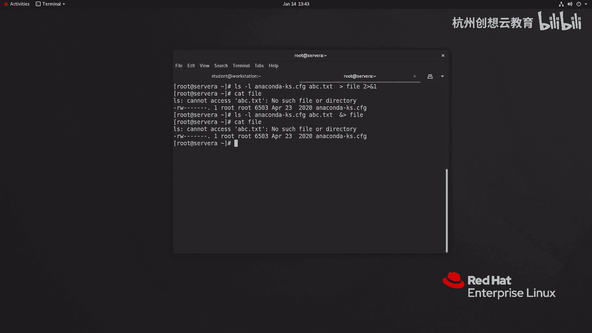

公式：`命令1 | 命令2`

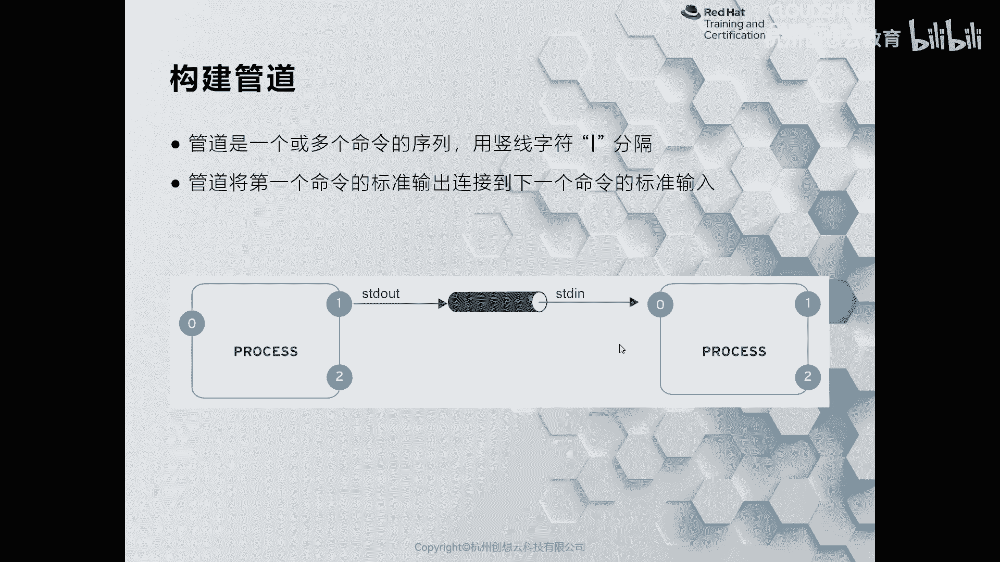

**示例：**
`ls --help | less`
`ls --help` 命令会产生很长的帮助信息，通过管道 `|` 传递给 `less` 命令后，就可以方便地上下翻页浏览。

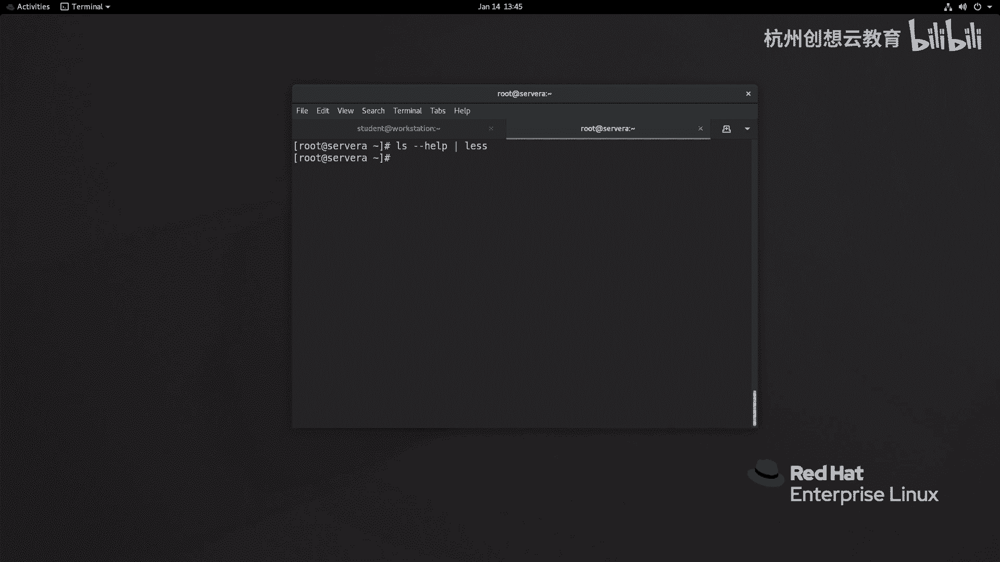

### `tee` 命令
`tee` 命令的作用是“分流”。它从标准输入读取数据，同时将数据写入标准输出和一个或多个文件。这样既能将输出保存到文件，又能在屏幕上看到实时结果。

公式：`命令 | tee 文件`

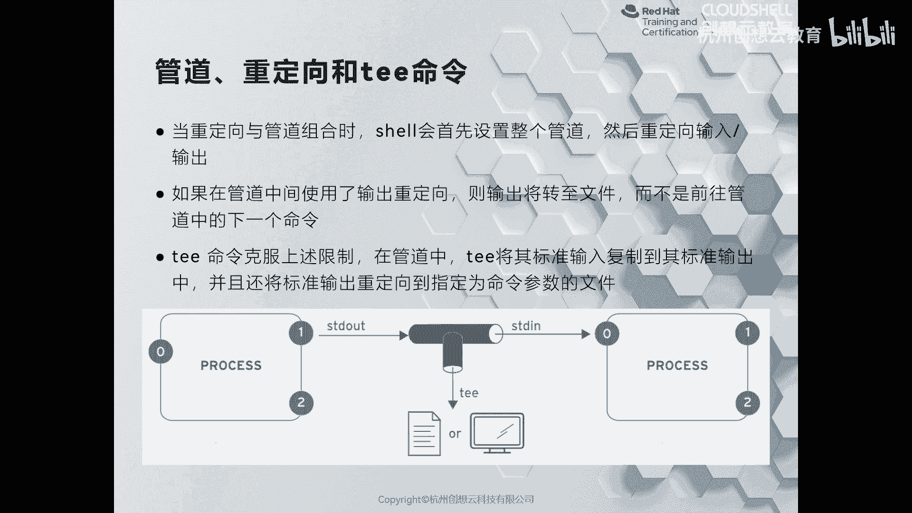

**示例：**
`ls a.txt b.txt | tee output.log`
这条命令执行后，`ls` 的输出会同时显示在屏幕上并保存到 `output.log` 文件中。这对于需要同时监控和记录日志的场景非常有用。

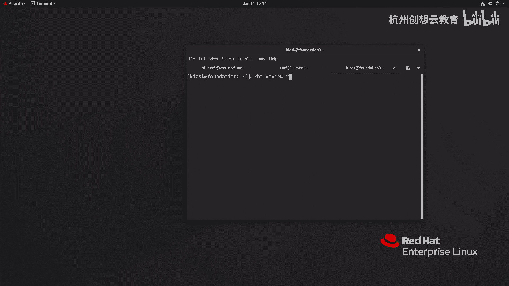

---

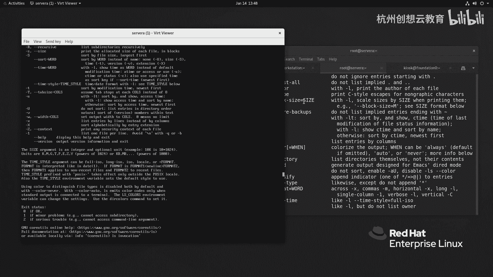

## 总结
本节课中我们一起学习了Linux Shell的输入/输出重定向。我们明确了标准输入、输出和错误的概念及其文件描述符，掌握了使用 `>`、`>>`、`2>`、`&>` 等操作符将输出导向文件的方法。我们还学习了使用管道 `|` 来连接多个命令，以及使用 `tee` 命令实现输出“分流”。这些是Linux命令行高效操作和数据处理的基石。