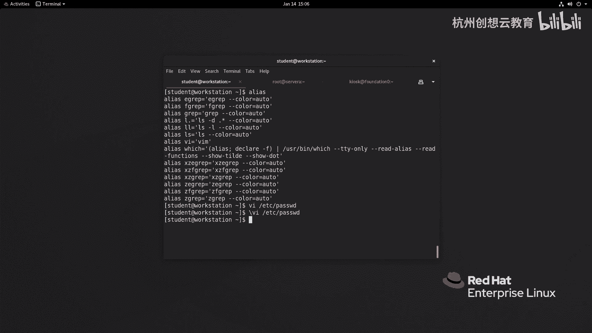
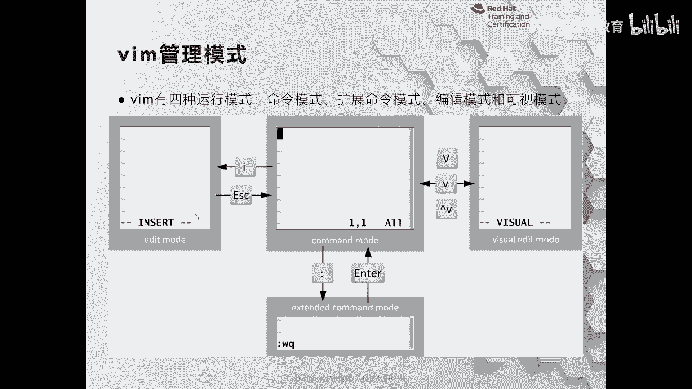
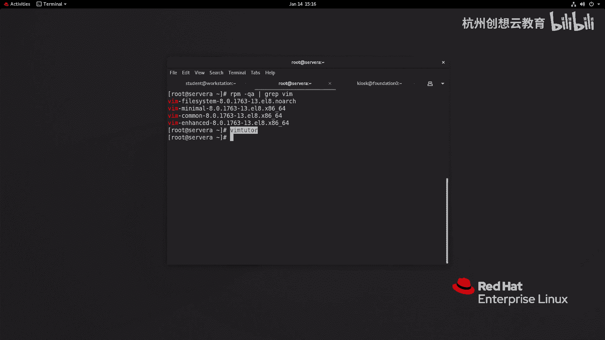

# 红帽认证系列工程师RHCE RH124-Chapter05-创建、查看和编辑文本文件 - P2：05-2-创建查看和编辑文本文件-从SHELL提示符编辑文本文件 - 杭州创想云教育 - BV1XG4y1r78Y

第二节从shell提示符来编辑文本文件，那么我们为什么在linux上呢去学习啊提示服务的方式来编辑文本文件呢，在我们身边呀有非常多的啊这种优秀的文本编辑器，比如说sublime啊。

atom这个vs code等等等等，那么这些呢编辑器呀又方便啊，门槛又低啊，基本上属于是上手就能去使用的这种，而vm呢，那么我们只要有一点点的linux基础知识就知道啊。

vm兵器它的语法呀是另外一套语法结构啊，就相当于又学了一套系统一样啊，它和linux的shell一样啊，是有各种各样的命令来操作的啊，为什么会这个样子呢，那是因为啊我们的linux在设计的时候啊。

在设计的时候把图形化界面和系统本身是做隔离的啊，因为并且呢我们在部署服务器的时候，很少去安装退化界面，那么就导致了我们没有办法啊，在编辑文本的时候呢，去选择像sublime啊。

vs code等等这种图形化的编辑工具，并且呢我们的linux呢在设计的时候呀，就遵循一个原则，就是说将我们的系统应用程序与之相关的信息和配置呢，都放在这种类似于什么i ini呀。

啊xml啊啊啊emo呀等等这样的文件当中啊，这样的话呢我们在管理起来更加的方便，并且只要是一个啊基于文本的这种职业，基于这个提示符的啊，这种文编器呢都可以进行编辑，那么比如说u盘图啊，这种啊发行版。

那么这种类型的方向板的话呢，他们在这个系统的最小化安装模式情况下呀，给我们提供了一个vi的编辑器，那么用过u班图的啊，这个同学呢应该知道在u班图里面他会给你安装一个什么呀，桌面版的啊。

会装一个nano啊，nano一个编译器，nano编辑器的话呢是更加适合这种初学者而学习的，而fda系列的linux发行商啊，它在我们使用的时候，你会发现啊，v i虽然也是安装了，但是呢他推荐我们走谁呀。

vm但是你像除了这个我们的cs和红帽企业版linux发行版而言，那么因为这种系统啊，它是面向企业级的，所以说管理的人员一定是专业的，专业就要用vm啊，而这个fda的话呢也在听取社区当中啊，一些人的建议。

因为它毕竟是桌面的嘛，所以说在新的版本当中，它也用了nano啊，nano所以说大家其实呢也不用完全纠结啊，我到底是用哪个编辑器呢去管理啊，nano和vm呢都选择其中一个即可啊即可。

那你说那我只用vi可不可以，这个地方的话呢是这样的啊，那么vm的话呢是vi的一个升级版本啊，它在vi的一些基础之上呢，增加了一些比如说分屏的操作呀，语法高亮这个等等啊，一个功能的补充。

并且呢还可以实现一些个性化定制啊，所以说呢在全球的啊编辑器的排行榜里面，z m呢一直是榜上有名，并且是在靠前的啊，非常这个受全球的这个开发人员和系统管理员的喜爱，所以说vm呢其实用的非常广泛啊。

非常广泛，我们不能因为它门槛相比较而言有点高而放弃去学习它好，那么如何去使用变频器呢啊首先我们要确保我们系当中啊，有没有装vm啊，而vm呢是有vm enhanced的这个包来安装的啊。

安装的在我们教学环境当中啊，vm呢是已经安装过了的，那么我们可以啊使用什么呀，直接去使用vm啊就可以了啊，vm呢后面跟上我们需要的文件名即可啊，文件名即可就代表编辑或者新建一个文件，这是vm的用法啊。

vm后面直接跟上文件名，文件名，ok那么接着呢给大家介绍一下呢，就是说我们这个vm呀在使用的时候呢有一个小注意事项，就是说在默认情况下呢，我们系统啊其实是把我们的vi和vm呢是做了一个别名的。

你像我们root用户是没有的，就意味着你通过vi去编辑一个文件，那么就是用的是谁啊，vi而如果选择了vm，那么就是谁呀，vm啊啊这个而普通用户呢是不一样的，普通用户的话呢是做了这个什么呀，做了一个别名。

就说我们无论说的是vi还是vm，只要后面跟上文件名，那么都是用了谁呀，vm好，那么我们举个例子，你看v i e t c下的hw d看到没有，是彩色的，就说明是vi啊，是vi，那如果你说我想只使用谁呀。

就使用vi，不想使用vm，那么我们可以使用反斜杠vi的方式呢来覆盖掉我们的内容，我们看普通用户能不能覆盖，覆盖掉了，i覆盖掉了，ok我们可以通过这种方式来覆盖。

那么我们知道了vm的一个编辑文文件的开头模式，接着就开始进入我们的真正核心的部分了，那么我们在使用vm变器的时候呀，我们都会讨论vm变器。

它有三种基本的模式，第一种模式呢就是我们z m跟器跟上文件名啊，回车之后看到的那个模式，在该模式情况下呢，我们称之为是命令模式，命令模式情况下，键盘上的所有按键都是有特殊的含义的，都是有特殊的含义的。

那么如果我们要想编辑文本文件，最简单的方法就是输入键盘上的i键，然后呢就会进入到一个叫做编辑模式，在我们的啊这个窗口的左下方啊，会有一个insert的标识啊，这时候键盘上的按键呢就恢复了它本来的意思啊。

a b c d啊都是可以输入的，当我们编辑之后就需要干嘛呀，需要保存，也可能啊做一些批量的操作，那么最常见的话呢就是保存，因此我们需要按一下esc按键回退到命令模式。

然后输入冒号冒号进入到我们的扩展命令模式，在扩展命令模式情况下，我们可以看到啊，窗口的左下方有一个冒号的提示符，然后呢输入比如wq保存并推出即可回车，那么这三个流程啊。

就是一个最简单的vi编辑里面的基本需要，那么如果我们想做一些高级的操作，比如说批量的添加配置文件的注释等等，可以进入什么呀，使用control电啊，这个加v或者是小写字母v或者大写字母v进入到什么呀。

微缩模式，我们重点呢给大家介绍左边的这三种模式的使用方法。

在我的ppt上面呢给大家列举了啊最常用的几种工具，那么除此之外呢，也希望大家能够扩展vm win 7的用法，不要仅限于这里的几个命令，那么我呢现在呢去来到我们的虚拟机里面啊，我使用入的身份。

我呢去拷贝一个文件，拷贝啊，这个谁呢，etc下的fs啊，sorry啊，a fs type啊，fs啊，pass wd把它放在我们etc那个tab下面，好吧，哎然后呢回车好，我们就使用这里的one tap。

下面的pass wd呢来给大家进行演示回车啊，那么这时候我们进入的呢就是一个编辑这个命令行模式，我们可以使用hg kel这四个按键呢进行方向键的选择，大家可以尝试一下啊，那么j呢是向下，而k呢是向上。

l是向右，rh是往左，它类似于方向键的什么呀，这个左下上右左下上右这几个按键好，那么接着呢我现在啊想干嘛呀，我想对这个文本啊进行编辑，我想在这个第一行的root啊，root这个位置呀来增加一句话。

我想在这个root后方啊加了一句话啊，那么我可以呢把光标呢移动在这个冒号的地方，然后呢输入i i其实就是insert插入，因此呢指的是在光标前啊，那么我们可以说内容空格那几个谁呀。

user ok user啊，这是编辑模式啊，编辑模式当我写完之后，我可以按下esc啊，就回退到了普通的命令模式，在该模式情况下，我再输入一个user啊，它就不起作用了，但是当我们输u的时候。

你会发现刚才说的内容啊就不不见了，为什么呢，因为u代表的是撤销最近的编辑，ok那你说那我一不小心是按错了，我没有想撤销，我可以按下ctrl加r的组合来取消撤回，ok好，接着呢我们继续干嘛呀，往下啊往下。

那么比如说呀我现在想删除掉啊，demo这一行的内容我可以执行一个dd啊，dd dd呢代表的是删除当前行，也代表了剪切当前行啊，就意味着如果你你执行dd命令之后呀。

那么我们文本里面这一行呢是暂存在内存的缓存当中的，你可以用来粘贴到其他文本或当前文本当中，如果你没有这个粘贴，那么就相当于是删除了，ok比如说我把光标呀移动到这个ftp这一行，ftp的话呢。

最下面那一行啊是nobody，然后呢我只用一个按键叫做p就可以粘贴对吧，唉如果我删掉没有粘贴就删除掉了，ok那我不想删除这么多，我只想删除某一个字符，我可以执行谁呀，x啊x就把刚才的n删除掉了啊。

删掉了，ok那我现在呢干嘛呢，我想把第一行呀复制一份，然后呢把它粘贴到第十行，第十行哎怎么做，首先在第一行呢执行一个yy代表复制，然后输入冒号进入扩展模式，输入一个十就立即跳转到第十行。

然后呢p真题即可即可啊，当我们写完之后，如果想保存，ok那我输一个谁呀，冒号进入命令的扩展模式，然后呢输入w进行保存啊，进行保存保存啊，那有的时候我们可能是保存完之后呀，就要退出。

所以可以出一个w q啊，一气呵成，如果呀我们编辑一个文件没有权限退出啊，比如说我编辑了一个内容啊，然后呢我要退出啊，没有保存，它是不让退出的，那么我们可以使用啊kill感叹号强制退出，但是注意啊。

它会忽略掉之前的配置，就没有保存啊，所以说是没有保存并强制退出啊，强退出好，我们再举一个简单的例子啊，假如说呢我现在呀想给这个文件的前五行呀增加一个什么注释诶，我可以使用ctrl v进行什么呀。

垂直方向的批量操作，那么我们的建我们的窗口左下方呀会看到一个叫什么呀，叫做whistle block的提示啊，然后呢我去选中啊，选中上下键，然后呢主输入大写字母i进入编辑模式。

那么注释我们一般在linux上啊，是看到的是谁呀，是井号键，我说井号键，那么到目前为止我们的文本没有任何的变化，我可以按下esc就见证奇迹的时候出现了，立马就被分配了。

那如果我想我想比如说在mail这一行，我想看字行号唉是第几行，便于我的理解，好主用冒号，然后输入一个指令叫set，设置空格什么呀，行号number number简称neu就可以打印出来。

我们的行号在行号的情况下呢，我想把这里的啊y开头到mail这句话删除掉，那如果用x呢可以，但是呢要按很多次，我可以只用v啊v啊，然后呢去选中啊，然后呢按一下谁呀x删除。

这是呢给大家举的这样一个简单的例子啊，不知道你学会没有啊，刚才呢给大家举几个例子啊，都是最基本的几个例子啊，基本的几个例子，那如果啊如果啊你觉得这些还不够。

你的使用我们可以使用咱们这个系统当中一个包要做好vm什么呀，enhanced来提供的一个帮助啊，一个帮助怎么用呢，可以使用vi啊，m tutor啊，回车，那么就是一个在线的文本说明软件啊。

它会帮助我们介绍如何使用zm啊，vm ok好，这是一个帮助啊，叫做vm shot。

