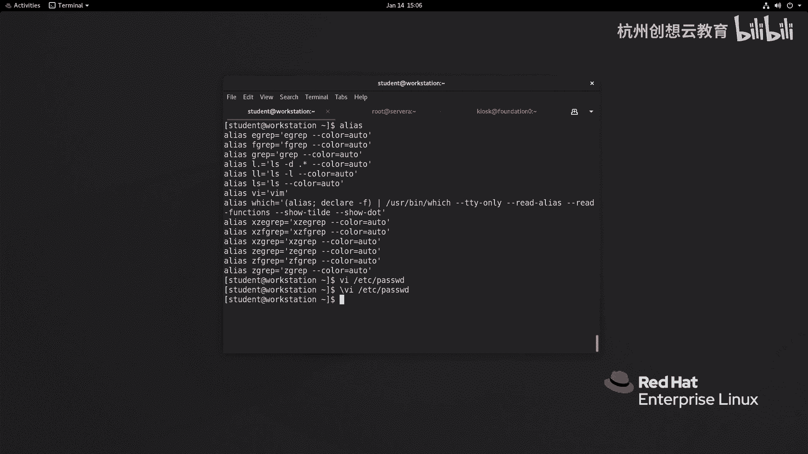
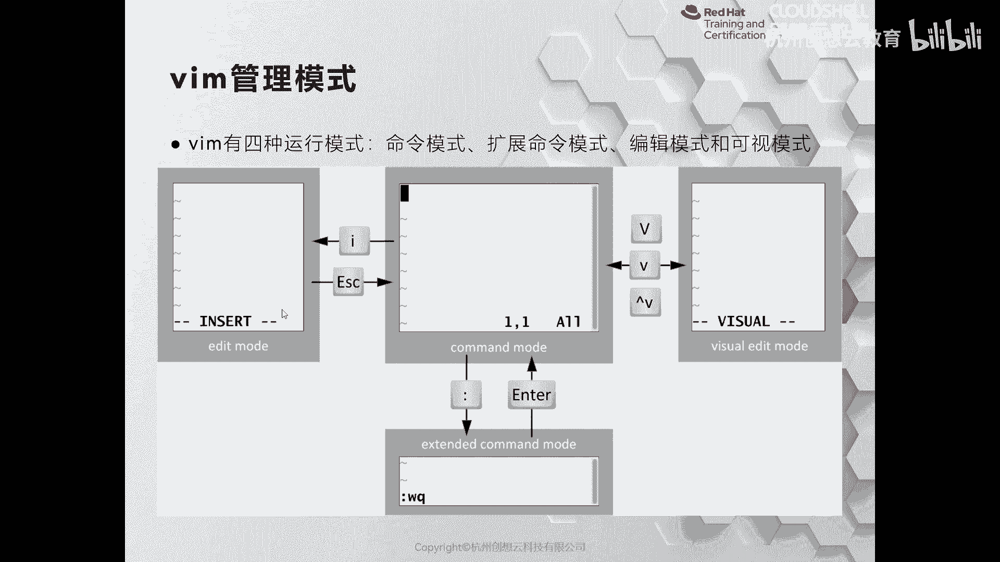
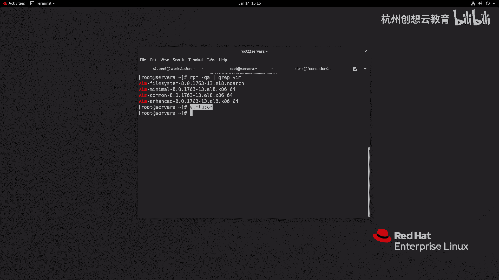

# Linux文本编辑：05-2：从Shell提示符编辑文本文件

## 📖 概述

在本节中，我们将学习如何在Linux系统的Shell提示符下，使用命令行文本编辑器来创建、查看和编辑文本文件。我们将重点介绍功能强大的`vim`编辑器，了解其基本操作模式与核心命令。

---

## 🤔 为何学习命令行编辑器？

在Linux环境中，图形化界面与系统核心是分离的。尤其在服务器部署时，通常不安装图形界面。因此，无法使用如Sublime、Atom或VS Code等图形化编辑工具。

Linux系统遵循一个原则：将系统应用程序及其相关配置信息存储在文本文件中，例如`.ini`、`.xml`或`.yaml`文件。这使得基于文本的命令行编辑器成为系统管理的必备工具。

不同的Linux发行版预装了不同的命令行编辑器。例如，Ubuntu在最小化安装时提供了`vi`，桌面版则安装了更易上手的`nano`。而面向企业级的Red Hat Enterprise Linux及其衍生版（如CentOS、Fedora）则默认使用`vim`。

`vim`是`vi`编辑器的增强版本，增加了分屏操作、语法高亮和个性化定制等功能。尽管学习曲线较陡峭，但因其强大功能，在全球开发者和系统管理员中备受青睐。

---

## 🚀 启动Vim编辑器

首先，需要确保系统中已安装`vim`。它通常由`vim-enhanced`软件包提供。在教学环境中，`vim`通常已预装。

使用`vim`编辑或新建文件的基本命令格式如下：

```bash
vim 文件名
```

**注意**：系统可能为`vi`和`vim`设置了别名。对于普通用户，输入`vi`或`vim`可能都指向`vim`。若要强制使用原始的`vi`，可以在命令前加反斜杠：

```bash
\vi 文件名
```



---

## 🧩 Vim的三种基本模式

`vim`编辑器有三种核心操作模式，理解它们是熟练使用`vim`的关键。

上一节我们介绍了如何启动`vim`，本节中我们来看看它的核心操作模式。

### 1. 命令模式 (Command Mode)
启动`vim`后，首先进入的就是命令模式。在此模式下，键盘上的按键都具有特殊功能，例如移动光标或执行编辑命令，不能直接输入文本。



### 2. 编辑模式 (Insert Mode)
在命令模式下，按下 `i` 键即可进入编辑模式。此时，窗口左下方会显示 `-- INSERT --` 标识。键盘恢复常规输入功能，可以自由编辑文本内容。

### 3. 扩展命令模式 (Extended Command Mode)
在命令模式下，按下 `:` 键即可进入扩展命令模式。光标会移动到窗口左下方的 `:` 提示符后。在此可以输入保存、退出等高级命令，例如 `:wq` 表示保存并退出。

完成编辑后，通常按 `Esc` 键返回命令模式，再输入 `:wq` 保存退出。此外，`vim`还支持可视模式（按 `v`、`V` 或 `Ctrl+v`），用于批量选择文本。

---

## 🛠️ 常用Vim操作命令

以下是`vim`编辑器中最常用的一些命令，掌握它们能应对大多数编辑需求。

### 光标移动
在命令模式下，可以使用 `h`、`j`、`k`、`l` 键分别向左、下、上、右移动光标。

```vim
h (左)    j (下)    k (上)    l (右)
```

### 文本编辑
*   **`i`**：在光标前进入编辑模式（插入）。
*   **`a`**：在光标后进入编辑模式（追加）。
*   **`x`**：删除光标所在的字符。
*   **`dd`**：删除（剪切）当前整行。
*   **`yy`**：复制当前整行。
*   **`p`**：将复制或剪切的内容粘贴到光标后。
*   **`u`**：撤销上一次操作。
*   **`Ctrl + r`**：重做，即取消上一次撤销。

### 保存与退出（在扩展命令模式下）
*   **`:w`**：保存文件。
*   **`:q`**：退出`vim`。
*   **`:wq`** 或 **`:x`**：保存并退出。
*   **`:q!`**：不保存，强制退出。
*   **`:set nu`**：显示行号。
*   **`:行号`**：跳转到指定行，例如 `:10` 跳转到第10行。

### 批量操作示例：添加注释
1.  将光标移动到目标起始行。
2.  按 `Ctrl + v` 进入可视块模式。
3.  使用方向键选择多行。
4.  按 `Shift + i`（大写 I）进入编辑模式。
5.  输入注释符，例如 `#`。
6.  按 `Esc` 键，所选行将同时被注释。

---

## 💡 获取更多帮助

如果希望系统性地学习更多`vim`命令，可以使用内置的交互式教程：

```bash
vimtutor
```

该命令会启动一个详细的指导教程，非常适合初学者循序渐进地学习。

---

## 📝 总结



本节课我们一起学习了在Linux Shell环境下使用`vim`编辑器的基础知识。我们了解了启动`vim`的方法、其三种核心模式（命令模式、编辑模式、扩展命令模式）以及常用的光标移动、文本编辑、保存退出等命令。通过掌握这些技能，你已能够在无图形界面的服务器环境中高效地处理文本文件。记住，熟练使用`vim`需要练习，`vimtutor`是一个很好的练习工具。