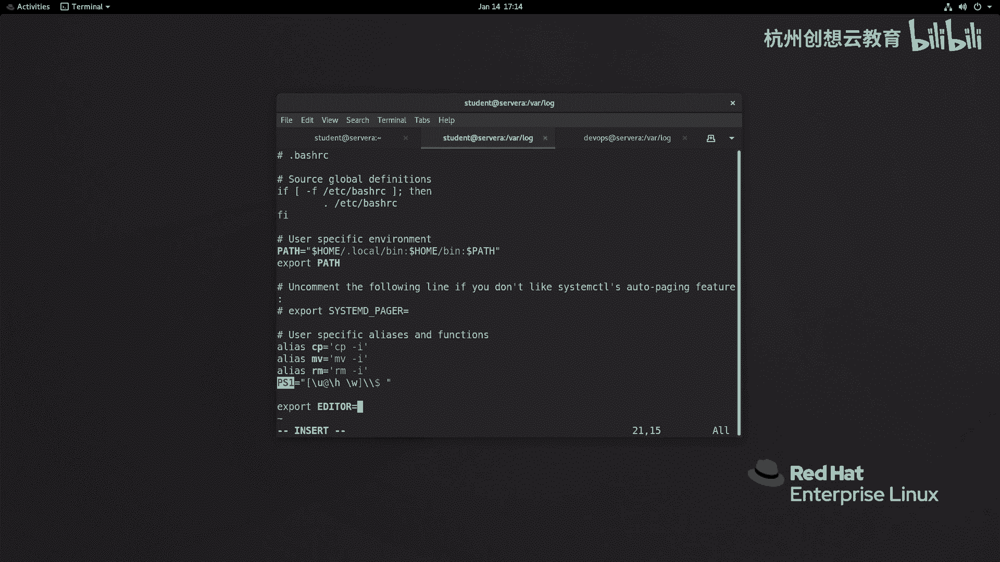

# 红帽认证系列工程师RHCE RH124-Chapter05-创建、查看和编辑文本文件 - P3：05-3-创建查看和编辑文本文件-更改SHELL环境 - 杭州创想云教育 - BV1XG4y1r78Y

好第三节呢是来讲如何更改我们的shell环境变量，那么在有的时候呢，如果我们通过对一些变量啊定制一些值，那么在后期执行命令的时候可以快速地引用，也或者呢我们可以把这个啊环境变量啊写在配置文件当中啊。

便于后面我们用户登录系统的时候，自动去啊这个追加这样的一个是要环境变量的一个配置，呃这些呢都是我们为何要去做试药环境的一个变量，但是要注意，如果我们只在当前的shell绘画设置啊，shell的一些变量。

那么它只针对当前的shell是有效的，也就是我们ppt上所说的shell变量对于特定的shell绘画呢是唯一的，ok好我们一会儿呢我给大家来举例来查看这个内容，那么我们来先看一下如何呢去定义视角的变量。

那么我们只需在我们的终端上呀输入你要定义的变量的名称，那么这个变量的名称呢是不区分大小写的啊，但是呢我们一般会使用字母数字，还有下划线来进行组合，那么并且呢我们再去定义这个变量的时候，要注意啊。

不要和现有的环境变量的冲突了啊，不要和心理互相冲突的好，那么我们现在呢去引用一下啊，去设置一下我们的视角变量，并引用一下，首先呢我现在打开我们的一个终端，ok那么我在终端上呀去定一个变量。

比如说我去定一个first name啊，first name还写上我的名字，然后呢再去使用另外一个，啊那么我去定义好的两个变量啊，那么定义好变量之后呀。

我可以使用set命令呢去列出当前设置的所有视角变量，那么结合上一章节学习的管道符，那么我去从中筛选谁呀，去筛选我的变量，比如说这个定义的first name，ok就能看到这里的值。

那么如何去引用我们的变量呢，你要想引用呢，直接在我们的变量前面加上一个dollar符即可，我们来看一下效果，那现在呢我去引用一下啊，echo dollar，dollar，first空格。

dollar last，下划线name啊，那么执行的结果呢就出来了，那如果更加标准一点的话呢，其实我们还可以使用什么呀，花火狐把这个变量的名称啊给它引引起来，但是在我们这里呢，其实在呃这shell上呢。

这个没有特别严格的去区分啊，有要不要加这个花括弧啊，那如果我们后面使用这种呃变量啊，在写脚本的时候啊，那么这个变量后面可能会紧跟着其他内容，那这时候呢我们可以用花盆弧来区分啊，这个地方呢是一个变量。

剩余的部分呢是其他的值啊，去其他的值啊，ok那么接着呢我们来说一下，那如何呢去把这个变量啊放在啊系统的配置里面，因为我们当前的变量呢只是临时的啊，临时的对于另外一个用户或者当前用户的另外一个绘画。

都是没有生效的，我们来可以试一下啊，啊那么现在呢我们刚才已经定义了两个变量，一个呢叫first name。

一个叫last name，好，我打开一个新的终端啊，那么为了演示效果，那我重新登录一次好，那么我们可以只用一个命令叫echo引用变量啊，dollar first什么呀，name啊，是没有的，唉是没有的。

这就是它的唯一性啊，唯一性，那如果要避免这种问题的出现，我们就可以把变量啊保存在文件当中，而文件呢又分为两个部分。

一个呢是和用户有关系的，那么我们放在啊加目录点bh 2 c和加目录下面的bh 2 bh什么呀，profile里面，第二种的话呢就是全局的信当中的所有用户呢都会有效。

位置呢是etc下面的12c etc下的profile，还有呢就是etc下的profile。d目录，下面我们举个例子，比如说呢我现在呢想把我的shell的终端呀做一个调整，但是呢我又不希望影响其他的用户。

我只想让我的student啊有一个这样的效果，ok那么我们来看一下效果，那么我现在呀嗯来到worth station啊。

去远程登录到student at a server a，然后呢去找一个东西啊，去搜索一个内容，我去编辑etc，下面有一个叫做啊bash r c啊。

bh 2 c。

我去搜一个关键词呢叫p s一好，这里呢有一句话啊，一句话叫ps一等于啊冒号什么，那么这句话呢就是来定义我们的一些啊shell用户的一个呃一个配置啊。

好那现在呢我去编辑自己用户家目录里面的好打开。

我把刚才的这句话呀给它干嘛呀，给它写进来啊，我做一个调整啊，那这里的小h呢代表的是用户的什么呀，这个啊我们系统的主机名的短名称，那么大写的w呢代表的是我们的相对路径，我现在把它改一改。

改成小写的w则代表的是一个什么呀。

绝对路径好保存，退出冒号wq。

然后呢我这边我这边呢是通过啊这个server a重新去登录一下我们的用户，ok啊，我直接切换吧，su杠谁呢，student，这时候我们并没有感觉到有什么样的变化对吧。

那么我现在要去一个位置位置挖下面的log，哎你会发现我们的位置呢是走了一个绝对路径。

而其他的用户，比如说dps用户来到y限log，那么路径呢是一个什么呀，相对的路径。

ok那么除此之外呢，我们还可以干嘛呢，改一些其他的配置，比如说我希望啊我的系统里面的默认配置文件呀都是vm，那么我们可以啊，可以呢这样去做，同样呢我这里呢以设置当前普通用户啊为例啊，我去编辑啊。

编辑加目录下面的点儿啊，这个bh r c我在这里面呢写一句话呢。

叫做export export，那么editor啊等于一个谁呀。

vm啊，保存并退出，那么我这次呢就直接让它生效，我可以使用source命令呢，让我们刚才的啊bs rc文件呢立即生效，那么这时候呢就意味着什么呢。

就意味着我们的用户当前的环境变量的默认编编辑器呢就是vm了，我们可以使用ev啊dv来查看信用当中所有的空间变量，我去谁写谁呢，谁写我的editor，我们会发现他是谁呀，是vm啊，是vm。

那么我们后面呢如果啊想更改我们的这个什么呀，更改我们的这个比如说哎刚才定义的这两个变量啊。

我想要取消掉，那如何去取消呢，ok那么我们可以使用这里的unset命令跟上变量名称即可好，那我这里执行一次啊，on sight啊。

first name啊，first name，不好意思，因为我们刚才干嘛呀，切换了用户的shell，所以我推出一次，然后呢再去执行啊，on sight，什么呀，at first name好。

i yesight，last name啊。

