# 红帽认证系列工程师RHCE RH124-Chapter05：05-3：创建、查看和编辑文本文件-更改SHELL环境 🛠️

在本节课中，我们将学习如何更改Shell环境变量。通过定制变量值，可以在执行命令时快速引用，或者将配置写入文件，以便用户登录系统时自动加载。需要注意的是，仅在当前Shell会话中设置的变量是临时的，只对该会话有效。

上一节我们介绍了文本文件的基本操作，本节中我们来看看如何管理Shell环境，使其更符合我们的工作习惯。

## 定义与查看Shell变量

要定义Shell变量，只需在终端中输入变量名并赋值。变量名通常由字母、数字和下划线组成，且需注意避免与现有环境变量冲突。

以下是定义和查看变量的步骤：

1.  **定义变量**：在终端中直接赋值。
    ```bash
    first_name=Zhang
    last_name=San
    ```

2.  **查看变量**：使用 `set` 命令可以列出所有已设置的Shell变量。结合管道符 `|` 和 `grep` 命令可以筛选特定变量。
    ```bash
    set | grep first_name
    ```

## 引用Shell变量

要引用已定义的变量，需要在变量名前加上美元符号 `$`。

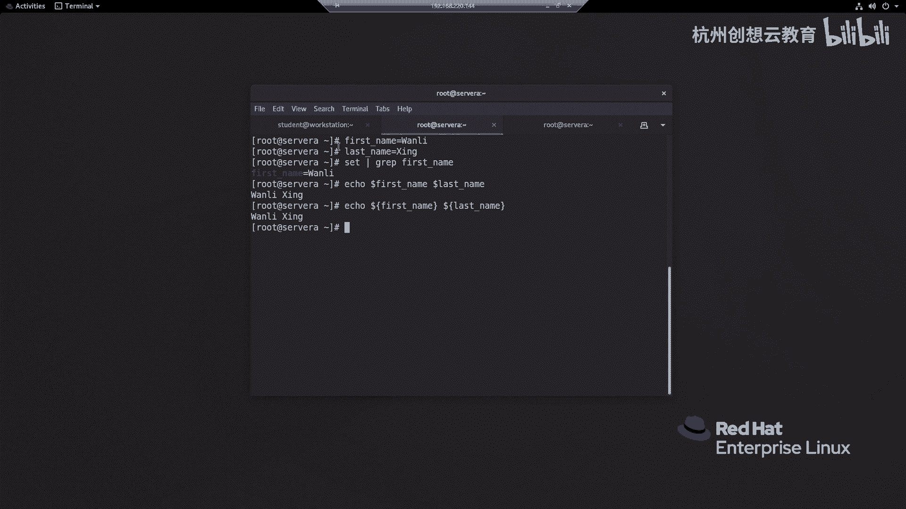

以下是引用变量的方法：

*   **基本引用**：直接使用 `$变量名`。
    ```bash
    echo $first_name $last_name
    ```
*   **标准引用**：使用花括号 `{}` 将变量名括起来。这在变量名后紧跟其他字符时，可以明确区分变量部分。
    ```bash
    echo ${first_name}${last_name}
    ```

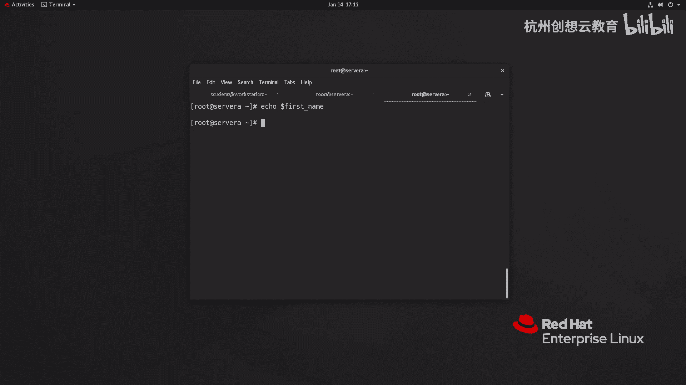

## 变量的作用域与持久化

之前定义的变量是临时的，只对当前Shell会话有效。打开新的终端或切换用户后，这些变量将不存在。

```bash
# 在新终端中尝试引用，将无法找到变量
echo $first_name
```

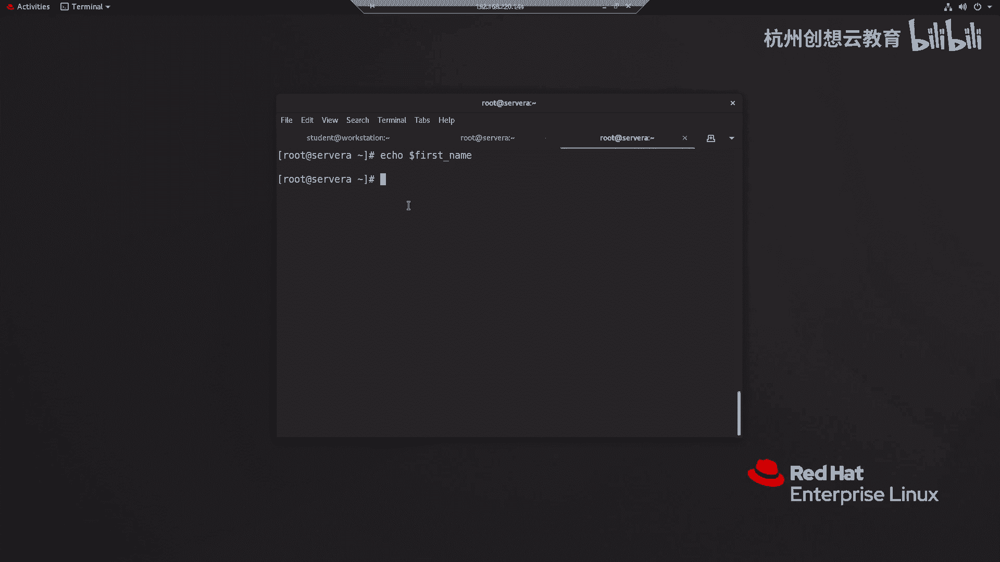

为了使变量设置持久生效，需要将其写入配置文件。配置文件主要分为两类：

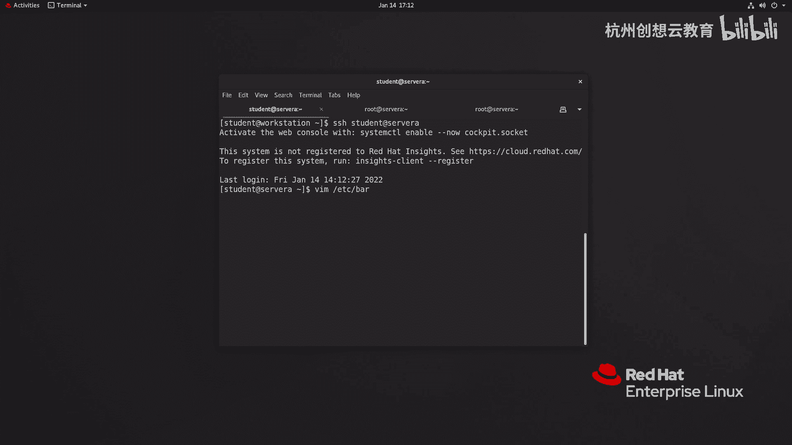

1.  **用户级配置文件**：仅对特定用户生效。
    *   `~/.bashrc`
    *   `~/.bash_profile`
2.  **全局级配置文件**：对所有用户生效。
    *   `/etc/bashrc`
    *   `/etc/profile`
    *   `/etc/profile.d/` 目录下的文件

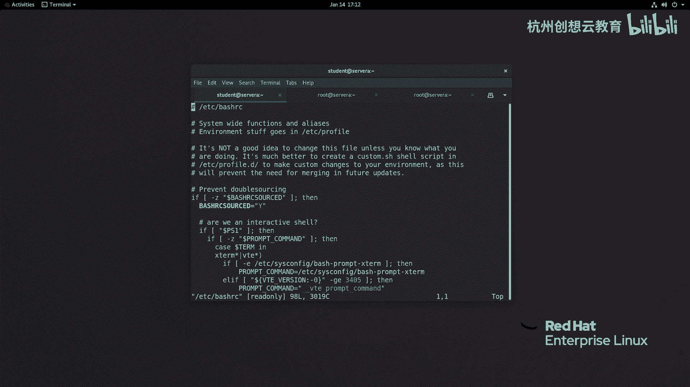

## 配置实例：自定义Shell提示符与默认编辑器

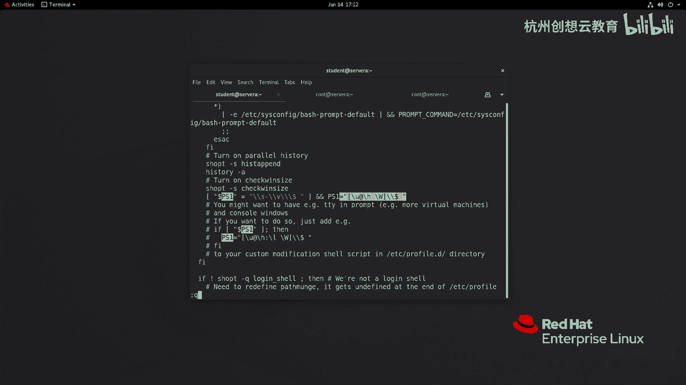

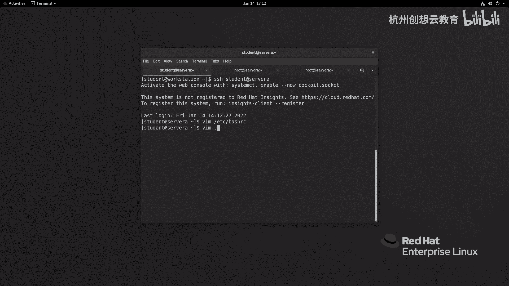

下面通过两个例子，演示如何修改用户级配置文件来定制环境。

### 实例一：修改Shell提示符

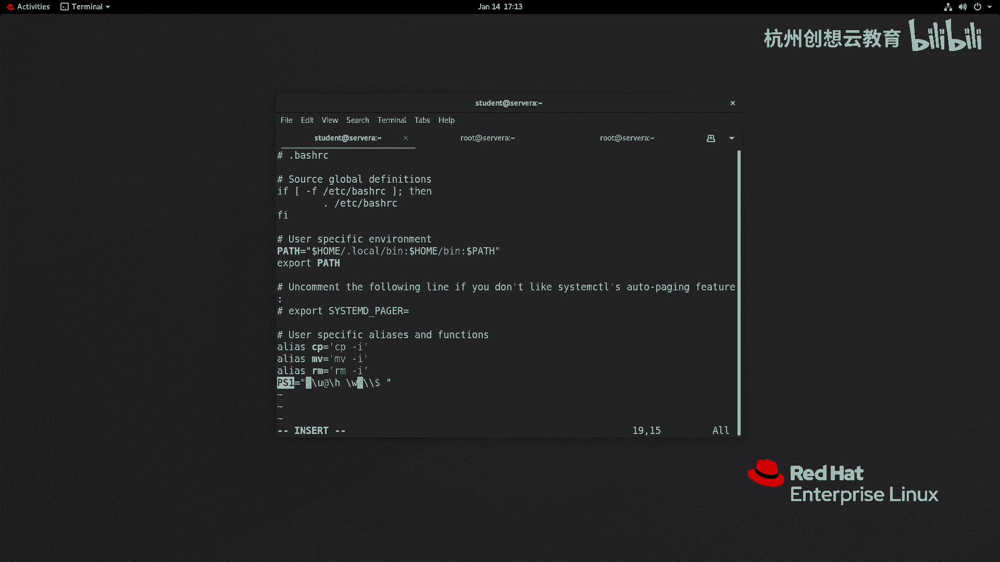

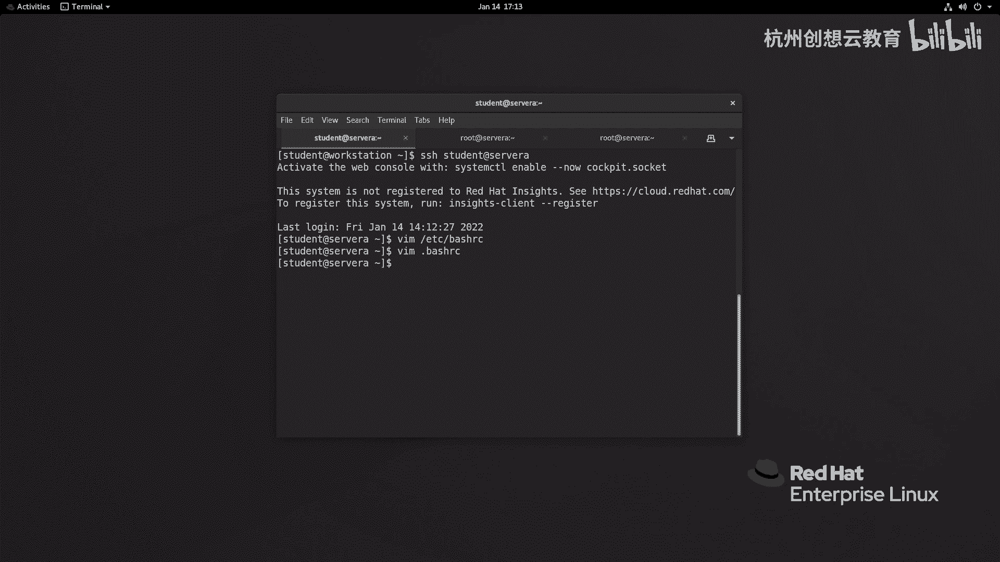

Shell提示符由 `PS1` 环境变量控制。例如，我们可以将其从显示相对路径改为显示绝对路径。

1.  编辑用户家目录下的 `~/.bashrc` 文件。
2.  找到或添加设置 `PS1` 的行，将其中的 `\w`（相对路径）改为 `\W`（绝对路径）。例如：
    ```bash
    PS1="[\u@\h \W]\\$ "
    ```
3.  保存退出后，重新登录或使用 `source` 命令使配置立即生效。
    ```bash
    source ~/.bashrc
    ```

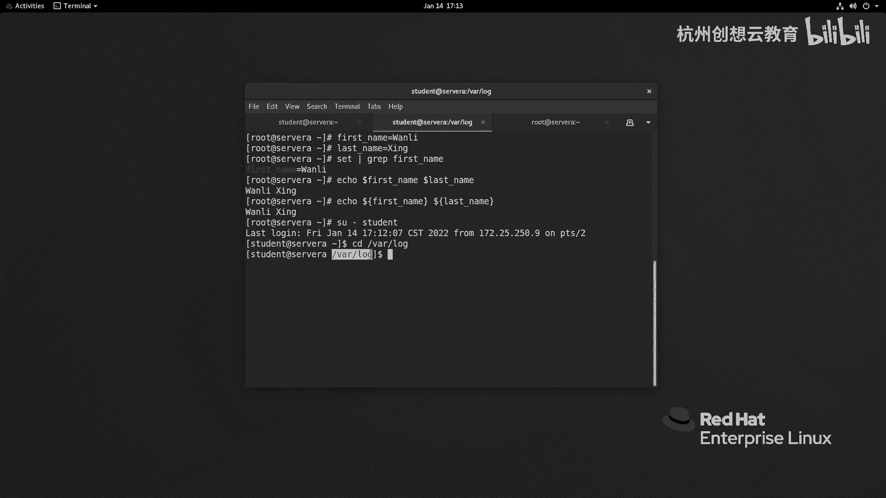

### 实例二：设置默认文本编辑器

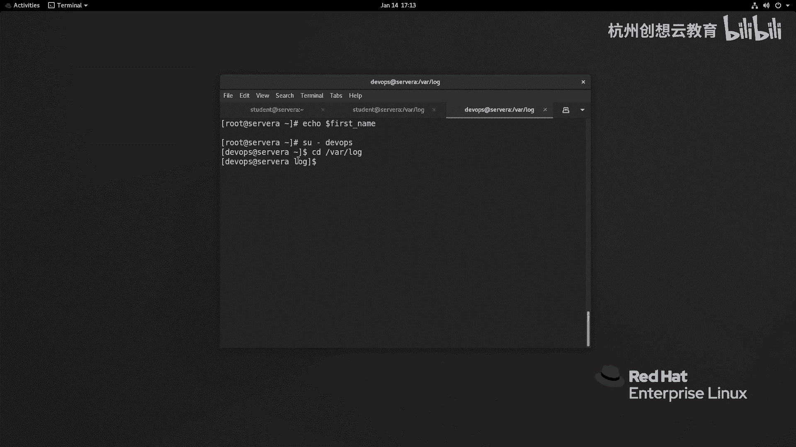

我们可以通过 `EDITOR` 环境变量来指定系统默认的文本编辑器（如 `vim`）。

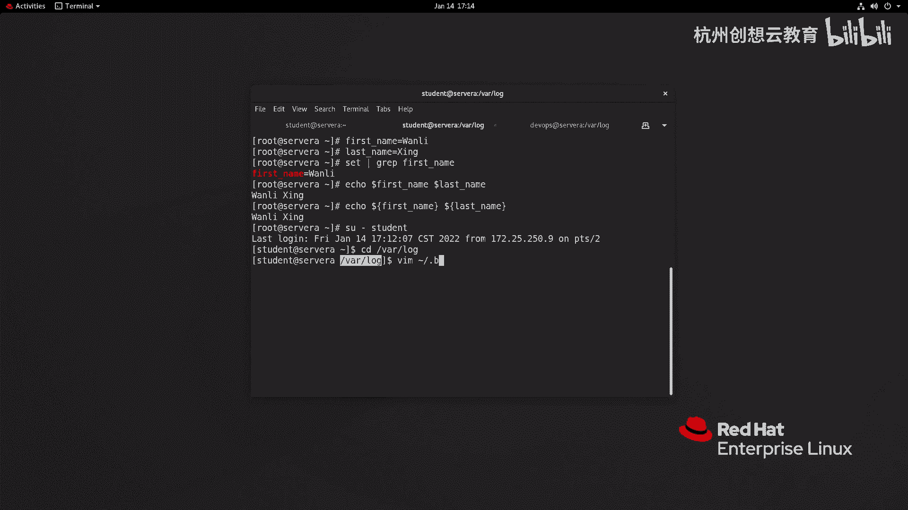

1.  编辑 `~/.bashrc` 文件。
2.  在文件末尾添加以下行：
    ```bash
    export EDITOR=vim
    ```
3.  保存退出，并使用 `source` 命令生效。之后，可以使用 `env` 或 `echo` 命令验证。
    ```bash
    source ~/.bashrc
    echo $EDITOR
    ```

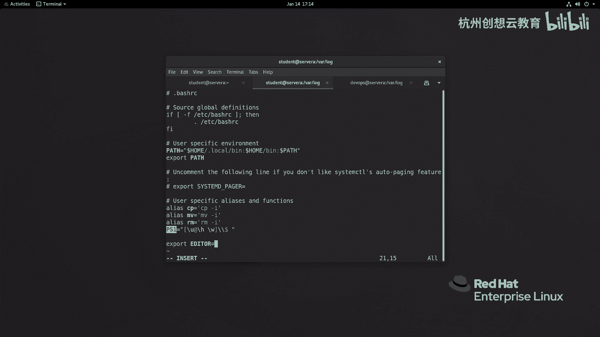

## 删除Shell变量

如果不再需要某个已定义的变量，可以使用 `unset` 命令将其删除。

以下是删除变量的命令：

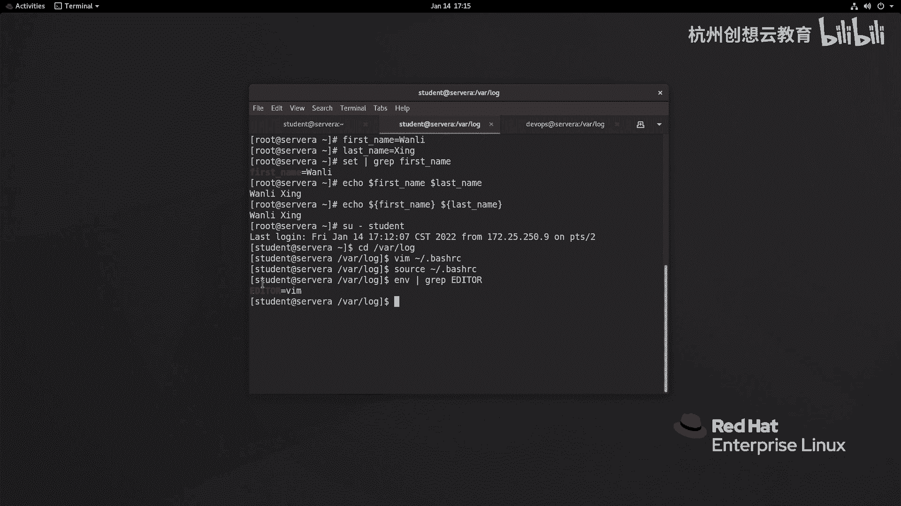

```bash
unset first_name
unset last_name
```

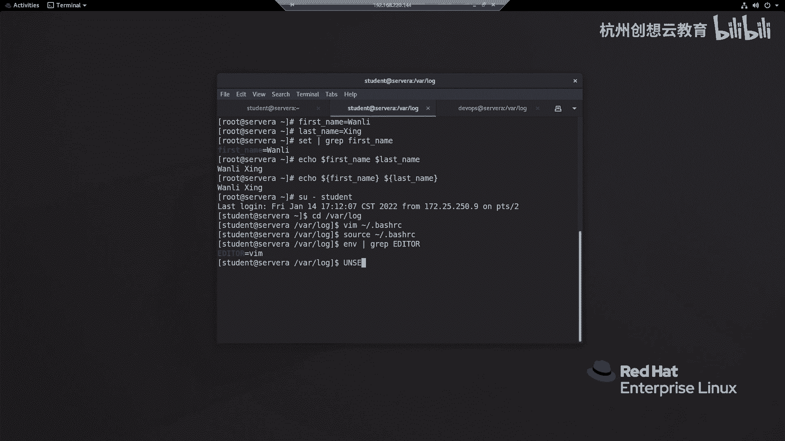

执行后，这些变量将从当前Shell环境中移除。

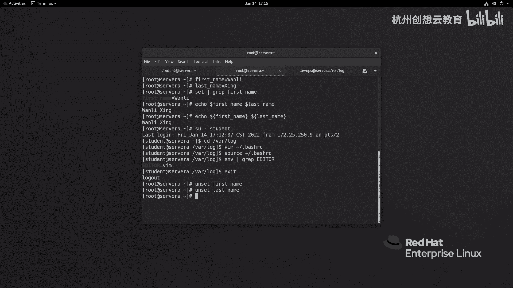

本节课中我们一起学习了Shell环境变量的核心管理方法。我们掌握了如何**定义**、**查看**、**引用**和**删除**临时变量，并理解了通过编辑**用户级**或**全局级**配置文件来实现环境变量的持久化设置。这些技能对于定制个性化的工作环境和编写自动化脚本都非常重要。