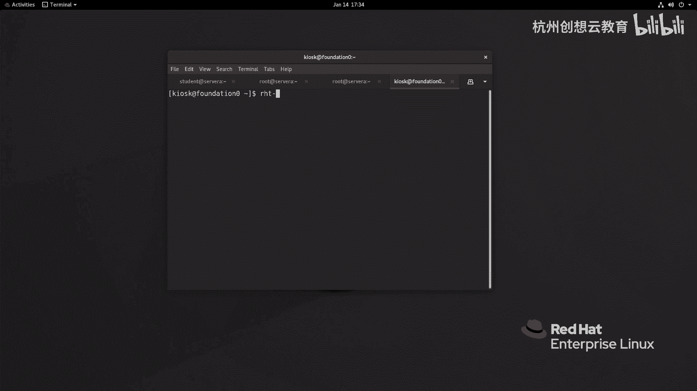
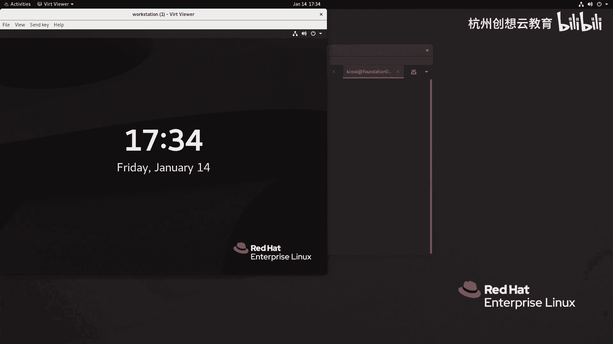
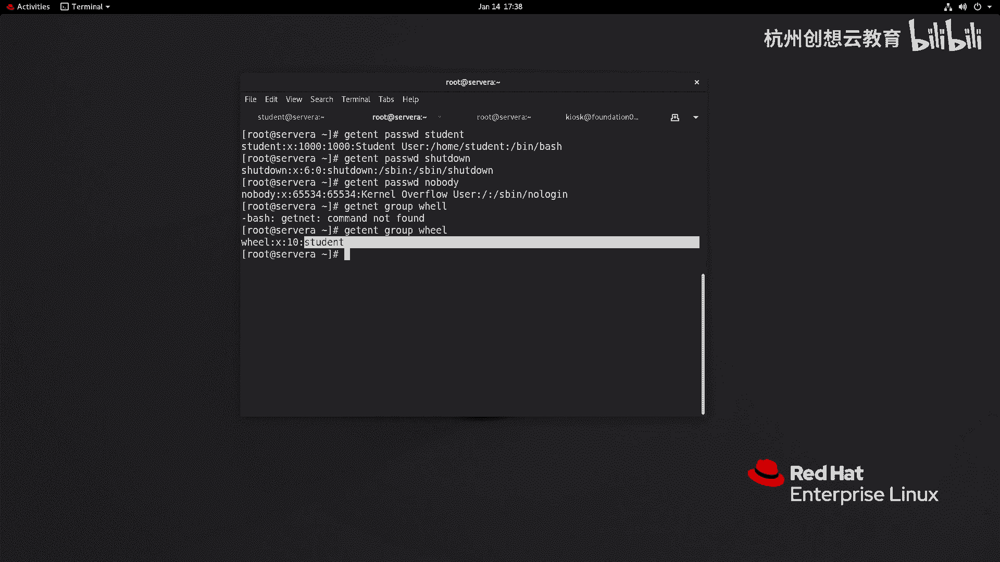

# 红帽认证系列工程师RHCE RH124-Chapter06-管理本地用户和组 - P1：06-1-管理本地用户和组-描述用户和组概念 - 杭州创想云教育 - BV1cd4y1A7Xu

啊，第六章啊管理本地用户和组。那这张的话呢是要求大家呢呃这个了解啊我们的用户和组到底是什么，他们之间有什么样的关系，对吧？还有就是我们如何呢在系统上面去切换不同的用户信息。

并使用秀度来临时获得管理系统的权限，啊。那么作为管理员呢，我们还要掌握如何在本地的linux操系统上面通过相关的指令来增加修改或者是删除用户以及组。啊，为了安全呢，我们还要给用户呀设置不同的密码策略。

比如说一些默认密码策略，或者说针对不同的用户给他设定一些密码策略。好，那么我们现在呢首先去看第一小节啊，第一小节的话呢是来介绍啊一些用户和组的概念性的内容的。啊，首先呢我们要了解一下什么是用户啊。

当呢一个啊角色啊角色，然后登录到系统之后呀啊我们要给他分配一些资源。那么为了确保资源的什么呀合理性，我不能说啊你这个用户A啊，登录到系统了，我我所有资源呢，我都允许你去访问。同样用户B呢也是样子。

那这样的话呢会出乱子的啊，那怎么办呢？哎我们根据用户的不同来给他划分不同的权限达不到权限。所以说呀归根结底，用户出现的目的呢，其实。啊，其实呢是为了方便我们人类啊来区分啊不同的角色啊，那么对于系统而言。

它去识别用户的时候呢，反而呢是干嘛呀？是使用用户的一个编号，我们把它称之为是user IDD简称呢叫UID它就相当于我们的身份证号码一样来做一个唯一的一个区分。那么我们的linux系统呢。

也是通过这套ID来区分你的权限是多少。你可以访问系统里面哪些的资源啊，资源。所以呢我们在学习过程当中，你会发现我们系统里面的每个文件，每个进程都是有一个啊所有者的啊所有者的OK那么。因此。

管理用户的这个策略的啊严密性其实也在从侧面的来体现了我们对系统安全性的一个考量啊啊，那么在我们lin上面啊，系统呢和windows里面其实是一样的啊，那么分成了三类。那么一类呢是超级用户。

在我们的linux上面的超级用户呢叫谁呢？叫root啊，它的UID呢是零啊，反过来UID等于零的一定是root啊，比如说我们在这个一啊，这个10年啊11年左右，对吧？当时的安卓手机大概是安卓的2。12。

2和2。3的样子。那么当时的手机的配置呢是比较低的对吧？并且很多的手机呢是和什么呀？运营商啊，这个合作进行发售的。那么这种手机的话呢，里面有一个最大弊端就是装满了运营商的各种APP。

并且呢使用度可能并不高。所以。我们作为这个。男同胞呀可能心有体会啊，那么拿到这种手机，第一件事要干什么呢？要刷机，对吧？所以刷机呢其实就是获取超级管理员的权限，而安卓呢又属于是linux的一种。

因此我们刷完机之后呀，就能获得里面root用户的信息啊，它就是超级管理员。而对windows而言，那么超级用户呢就是adittter这个用户O好，那么这种用户的话呢，它的在系统里面呢基本上是无敌的。

所以说我们后面呀在使用的时候会给大家额外介绍，一定要小心。那么第二类的用户呢，就是负责我们系统里面的一些什么呀服务进程正常运行的。那么这种服务进程啊，我们一般把它称之为是守护进程啊。

它不需要特定的用户身份呢去运行。他只要在系统的后端默默的运行，给我们的系统啊提供一个保障即可。那么这种用户我们称之为是系统用户。这种用户呢是不可以登录的，哎，不可以登录的啊。那么第三类的用户呢。

叫什么呢？叫做普通用户啊，普通用户的话呢主要是。给这些我们平常所遇到的什么user A呀，userB啊这种啊都是一些普通用户。那么我们是推荐在管理系统的时候呢，是通过普通用户的啊身份去登录系统啊。

然后呢，如果需要啊这个特殊权限啊，后面会讲到一个叫修 do啊，来获得齐权O那么接着呢就是我们可以使用ID的命令呢来查看用户的信息。啊，要看信息啊，那么我们现在呢去看一下。而。

现在呢我已经登录到了servA上面啊，我呢这个先走一个命令叫LOS杠L。我们来看一下，你看这里的文件呀都会属于是具体的某个用户和具体的某个组啊，某个组。那么我们后面呢还会学到一些进程的管理。

那么我这里呢简单的去执行一个啊PS啊，完这个的话呢可能没有看出来什么内容，对吧？没问题，我加1个AOX的指令啊，并且呢。并且呢我去干嘛呢？我加个lessice，好吧，哎。

你会发现呢我们的进程啊在第一列也是有用户名的信息的。所以说呢我们系统里面的文件呀，进程啊啊等等，都是和用户有紧密的关系的。因为通过这种方法可以来确保啊，你拥有什么样权限啊，拥用什么权限啊。

你看我现在啊这个在root下面呢，我想去看一下一个文件呢叫ETC下的shadow。还是可以读取的那如果呢我现在呢切换到一个普通的用户啊，叫谁呢？叫做student。哎，我想去看一下ETC的shaow。

哎，你会发现是权限被拒绝掉了，因为我们不满足安全策略啊，你你的权利是受限的啊，受限的OK那么如何去查看用户的信息呢，我们可以使用谁呀？可以使用ID这个指令ID命令，如果你后面没有加任何的参数。

就代表的是查看自己的信息啊，自己的信息。那如果呢跟上用户名名称，那么就是查看该用户的信息啊，无论是哪一个方法我们看到的ID啊，主要是包含了这三个部分分别代表的是用户的UID。啊。

用户名用户的主要组啊的ID和它的组名称以及属于哪些其他的组啊。你像我们的root用户呀，当前就是属于root用户啊，组同名的组啊，并且呢只有一个组没有其他的。而看到这个谁呀。

我们的这个student的用户呀，就不一样了。那么它不仅仅属于和自己同名的组，也属于谁呀？will组成员啊，will要组成员。OK这是通过ID的命令来查看啊，查看这个。用户的信息。那么问题来了。

那么我们的用户到底存放在哪里呢？注意对于我们的linux而言呀，本地的用户信息呢是存放在ETC下的passWD当中。啊，是存放在这个里面的啊，里面的文件呢都是以冒号呢作为分隔符分成若干列。

那么这些信息呢都是用户的信息。我们如果想查看某一个用户，可以使用这个命令。啊，这个ge啊get获取谁呢？获取这个啊pasWD这个文件啊，谁的用户信息呢？我们这里以student用户为例，哎。

就可以只筛选谁呀？tudent用户的信息。那么这个信息里面都代表了什么意思呢？首先第一列啊，第一列代表了我们的用户登录名，注意啊是登录名。OK第二列呢是一个XX的话呢在早期的啊计算机的系统的时候呀。

这个地方呢是存在的是一个用户的密码。啊，同样呢也是走加密的模式。但是呢因为在在这个位位置之后呀，会有一些其他风险。比如说我现在切换到普通用户，同样可以使用ge进命令来获取啊passWD的信息。啊。

是可以看得到的那如果普通用户也能看到加密的密密码是非常危险的对吧？所以说呢在后面呀就把这个加密的密码放在了ETC下的shale里面啊，sdle里面我后面我们会着动介绍。

那么这个第三列呢则是用户的UIDO第四列啊，第四列呢是我们用户所属主要组的ID号码，简称GID。再往后呢，这里的student user则是我们用户的全名啊，全名啊呃，那么全名的话呢。

如果是走文本界面啊，你是看不到的。一般在图形化界面会看到，不知道大家还有没有印象，我们去登录到over station的时候呢，它的图鸦界面是有一个这样的内容的。

比如说这里啊我打我把这个屏幕打开，这里呢就有个student user。好，那么回过头继续看我们刚才的这个文件。

在这个文件的这个后面的这一列呀，就第六列啊，则代表的是用户的主目录，或者叫用户的加目录。就是说用户的shall啊啊环境变量开始的地方。当我们登录到系统之后，那么它的shall啊就是在这个位置开始的啊。

好，我们来试一下啊，那么我这边呢去退出，重新登录一次student atserv a。啊，做一个命令PWD来看一看，哎，我们就在自己的加目录里面OK。好，那么再往后呢。

这一列呀代表的是用户当前使用的shall，对吧？那么比如说我们student，我可以做一个命令，icicle dollar大写的shall可以来查看当前的使用的shall类型。那么除此之外呢。

在我们的信目当中呢，还有一些其他类型的事样。比如说呢我找一个叫s down。他是负责关机的。你看呢这里一个沙档，那么再找一个谁呀？nobody。啊，bro那么no body的话呢，它这个里面的话呢。

你会发现它sha叫什呢？叫做啊SB no log in啊，那么这种shall的话呢，同样也是不被用户所啊登录的。一般在提供一些文件服务器的时候呢，会用到类似的啊shall这样类个sell。OK好。

那么接着呢我们来看啊，那么什么是组啊组。那么组的话呢，首先我们要知道为什么会出现组啊，哎，我们可以想一想，我们在上学的那个时那个时代啊，那么为了啊这个方便，对吧？我们会分小组，对吧？会分小组。

那这里也是一样的，我也可以把相同权限的用户呢归类在一起，那么就可以组建成一个组啊，我可以直接向组呢来分配权限的方式来提高效率，而不是说针对每个用户呢去分配什么呀，分配用户的权限。O那么对于组而言呢。

它也有唯一的组名称和组的ID号码。那么组的信息呢则是存放在ETC的shaow里面啊。sorry ETC下的group里面啊，好，我们来看一下啊，那么比如说我这里呢去get。啊，这个group啊，谁呢？

willok。啊。啊where那么我们就能看到这个group里面的文件，你会发现啊它和刚才的什么呀？这个paswD哎长的格式是一模一样的，也是呢以冒号呢作为分割符来分隔开啊，那么第一列呢是组的名称啊。

组的密码啊，同样组的话呢，密码会将来会存放在哪里呢？会存放在ETC下面有一个叫做Gsha的文件。那么接着呢后面是用户的GID和自己的组成员啊，组成员。好，那么我们这是主要组说组呢？就是主要组。

那么除此之外呢，还有一个术语啊，叫什么呀补充组。

有的地方呢也叫什么叫附属组啊，都是一样的啊，都是一样的。因为我们的用户呀默认情况下，它只有一个主要组，但是呢我们的用户也可以属于是其他组的成员。那么其他组呢，我们就称之为什么呀？补充组。

或者是叫做什么呀？叫做这个附属组啊。你像我们刚才的student呀。他的student组就是他的主要组。而will则是他的附属组。

