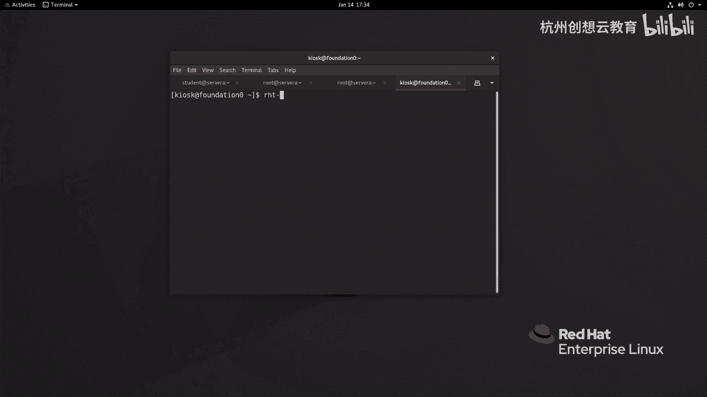
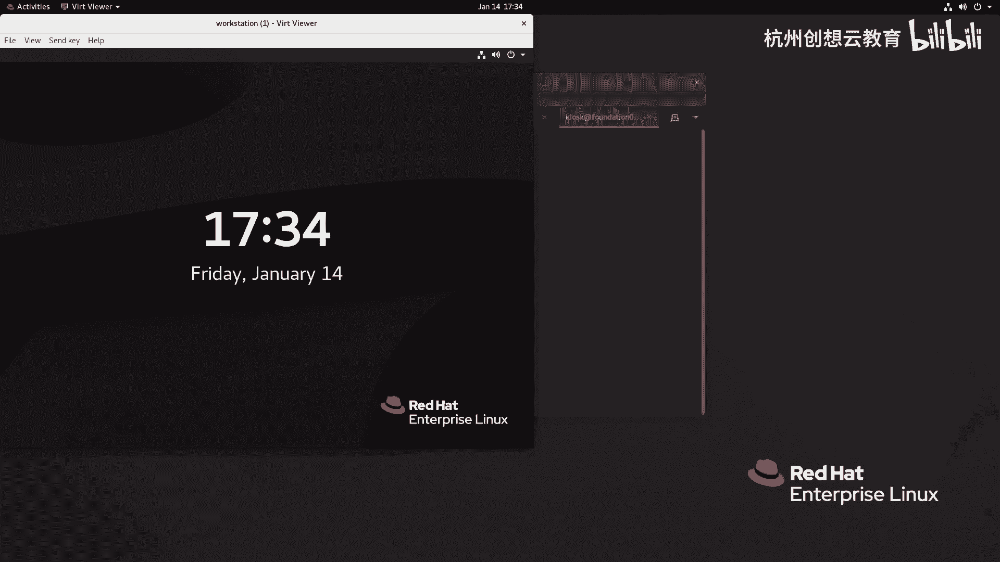
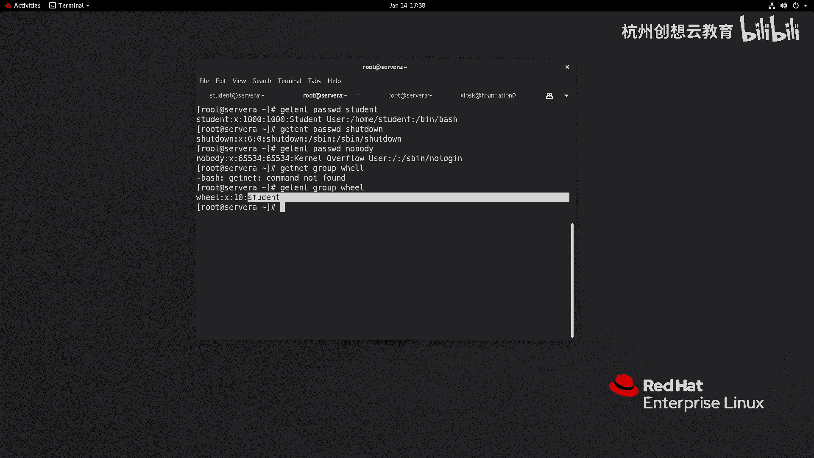

# 红帽认证系列工程师RHCE RH124-Chapter06：管理本地用户和组 - P1：06-1-管理本地用户和组-描述用户和组概念

## 概述
在本节中，我们将学习Linux系统中用户和组的基本概念。理解这些概念是进行系统管理和权限控制的基础。我们将了解用户的定义、分类、如何查看用户信息，以及组的作用和类型。

---

## 用户的概念
用户是Linux系统中用于区分不同角色和分配权限的基本单位。系统通过一个唯一的数字标识符来识别用户，这个标识符称为用户ID（UID）。每个文件和进程都归属于特定的用户，系统通过UID来决定该用户能访问哪些资源。

### 用户的分类
Linux系统中的用户主要分为三类：

1.  **超级用户**：在Linux中，超级用户是 `root`。其UID固定为0。拥有系统最高权限，可以执行任何操作。
    *   **公式**：`root` 用户的 `UID = 0`
    *   **类比**：在Windows系统中，超级用户是 `Administrator`。

2.  **系统用户**：这类用户用于运行系统服务或守护进程，通常不允许登录系统。他们的UID通常在一个特定的范围内（例如1-999）。

3.  **普通用户**：这是日常使用系统的常规用户。管理员通常以普通用户身份登录，在需要执行特权操作时，再通过特定方式（如 `sudo`）临时提升权限。

### 查看用户信息
可以使用 `id` 命令查看用户信息。如果不指定用户名，则显示当前用户的信息。

**命令示例**：
```bash
id
id student
```
执行 `id` 命令会显示三部分信息：用户的UID、用户所属主要组的GID和组名，以及用户所属的所有补充组。

### 用户信息的存储
本地用户的信息存储在 `/etc/passwd` 文件中。该文件中的每一行代表一个用户，各字段由冒号 `:` 分隔。

**文件结构示例**：
```
student:x:1000:1000:Student User:/home/student:/bin/bash
```
以下是各字段的含义：
1.  **登录名**：用户登录时使用的名称，例如 `student`。
2.  **密码占位符**：历史上这里存放加密密码，现在通常为 `x`，表示密码已移至 `/etc/shadow` 文件。
3.  **UID**：用户的数字ID。
4.  **GID**：用户主要组的数字ID。
5.  **全名**：用户的描述信息或全名。
6.  **家目录**：用户登录后的初始工作目录。
7.  **登录Shell**：用户登录后默认使用的Shell程序路径。

可以使用 `getent` 命令查看特定用户的信息：
```bash
getent passwd student
```

---

## 组的概念
组是将具有相同权限需求的用户集合在一起的管理单位。通过向组分配权限，可以高效地管理多个用户的权限，而无需为每个用户单独设置。





### 组信息的存储
组信息存储在 `/etc/group` 文件中。其格式与 `/etc/passwd` 类似，各字段由冒号 `:` 分隔。

**文件结构示例**：
```
wheel:x:10:student
```
以下是各字段的含义：
1.  **组名**：组的名称。
2.  **组密码占位符**：通常为 `x`，组密码（如果设置）存储在 `/etc/gshadow` 文件。
3.  **GID**：组的数字ID。
4.  **组成员**：属于该组的用户列表，用户名之间用逗号分隔。

### 主要组与补充组
每个用户必须属于一个**主要组**（Primary Group）。当用户创建文件时，该文件默认归属于用户的主要组。

此外，一个用户还可以属于多个**补充组**（Supplementary Groups，也称附属组）。这允许用户获得这些组所拥有的额外权限。

**示例**：
用户 `student` 的主要组是 `student` 组，同时它也是 `wheel` 组的成员。因此，`wheel` 组就是 `student` 用户的补充组。



---

## 总结
在本节中，我们一起学习了Linux用户和组的核心概念。我们了解了用户的分类（超级用户、系统用户、普通用户）、如何查看用户信息（`id` 命令）、以及用户和组信息的存储位置（`/etc/passwd` 和 `/etc/group` 文件）。我们还区分了用户的主要组和补充组。理解这些基础概念是后续进行用户创建、修改、删除以及权限管理操作的前提。