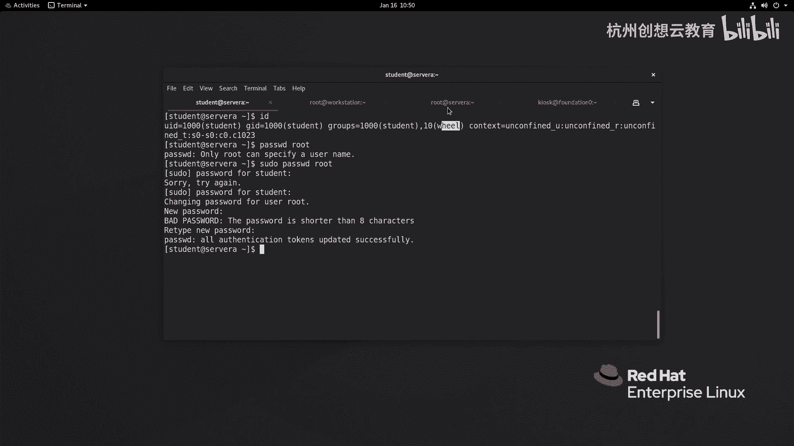

# 红帽认证系列工程师RHCE RH124-Chapter06-管理本地用户和组 - P2：06-2-管理本地用户和组-获取超级用户访问权限 - 杭州创想云教育 - BV1cd4y1A7Xu

。好，我们来看一下第二节啊，超级用户访问权限。那么这章的话呢，我们主要是来给大家介介绍如何通过啊这个用户A啊去切换到用户B，或者是对于普通用户而言啊，如何如何呢执行秀度命令来获得提全啊。

那么首先呢我们知道啊就是对于我们的操系统而言呀，大部分的操作系统当中呢都有一个超级用户啊。那么在我们的linkux里面的话呢，就是root啊。

在windows的话呢就是administrator这个用户OK。那么我们一般情况下的话呢，可以通过使用入的身份来登录到系统里面，然后执行一些普通用户无法执行的命令。比如说我们。

这个啊马上要学习的命令啊，这个user艾对吧？用来添加用户，或者说我们之前学习的命令passWD来更改其他用户的密码信息。那么这些情况呢都需要使用root来管理。那么以及后面我们其他的一些。

比如说磁盘的管理呀，对吧？文件性的管理啊等等啊，都是要有入的权限的。但是入ot权限的话呢这个。这个我们切换呀啊也好，或者说我如果有一个别的用户啊，也有这么管理员权限啊。

那么我作为一个普通用户没有权限执行，那我也可以切换到其他用户。那么如何去切换用户呢？那么我们在切换的时候呀，会走一个命令呢叫SU啊SUOK那么SU的话呢，注意它的命令的语法呀，其实是有一个区别的。

那么在我的PPT上呢，能够看到有两种用法，一个呢是FU后面跟上用户名啊，FU跟上一个大使再跟上一个用户名。那么这两个呢是有一个非常啊非常这个明显的区别的啊，那么什么区别呢？你像这个SU加上一个大使呀。

这个大使符呢，其实是一个省略啊，这个大使代表的什么呢？代表的是SU杠L啊，而杠L呢就代表的是log in也就意味着我们使用FU加横杠的时候呢，代表的是切换并登录用户是一个全新的登录。

而SU只是纯粹的切换啊，纯粹的切换O那么所以说呢我们一般是这样来给大家介绍的啊？就说SU只跟上用户名，代表的是啊利用当前已登录用户的shall。啊，当前已登录的用户的sh应。

比如说呢我用了student用户登录系统里面了，那么我要切换到啊dops，那就是F us啊，那么dops呢有一用用到了我们的tudent用户的应啊来进入到系统里面那么就意味着啊有些sha要里面的环境变量啊是没有办法让啊dop用户去用的啊。

因为它权限不足啊，有可能啊SU大跟上用户名的话呢啊就好像我们通过啊这个一个全新的终端或者是通过本文本控制台啊，这个登录到系统里面了，是个全新的登录啊，那么我们现在呢来感受一下。啊好。

那么我的系统上呢做了一个简单的别名啊，我只接一个命令Q啊，它就可以这个远程到我的哪里呢？远程我的这个普通用户上面啊。啊，那么我的word stationation上面好。

我现在去登录一下SH啊tudent at server a。

啊，好，那么我们来感受一下SU啊dedops。OK输入对方的密码，r hat。那么这是一种方法。那么还有一种方法。啊，我看可以这样搞啊，SH什么呀？SU横线啊，d。啊，然后呢输入密码，read看一下。

那么左侧的这种呢就是纯粹的切换。那么我们之前讲过，对一个用户而言，他的出发点的事要呢是自己的加目录。对吧加目录OK你看我们现在呢就是在加目录里面啊，而这个SU呢。

因为它利用了啊之前student用户的视效环境，因此呀它切换之后呢，还在哪里呢？还在student加目录里面，但是在这里呢不代表有权限，我们可以使用IOS呢看一下哎，是没有权限的啊，是没有权限的？

ok那么回去之后才有权限。所以说呢我们一般推荐大家在切换用户身份的时候呀，那么走上谁呀？SU加上一个大字符哎，大数符。哎，这样的话呢，就就就可以了啊，就可以了。那么刚才呢我使用student的身份呀。

为什么要切换过来呢。举个例子啊，比如说呢我走一个啊走一个命令啊，走一个命令啊这个。我想去看一下这个ETC下的谁头。按号发现看不到对吧？那么我就可以通过切换用户的身份呢来实现我切换到谁呀？root。

输入root用户的密码。啊，然后呢我再去看谁呀，shale呢就可以了啊，shale就可以了。因为我提全了，对吧？有普通用户呢切换到了一个超级用户。那么同样如果我想通过root用户切换到普通用户。

那么SU横杠呀跟上用户名就可以了，并且不需要输入密码验证。OK这是切万用户。但是呢随着我们这个深入的使用linux呀，我们会发现，如果我们直接呢把这个用户啊所有的普通用户呢都告知了root密码。

以便于这些用户呀，在登录系统的时候啊，管理系统啊，那么就会有一个弊端呢，就是一呢是root密码呢被暴露了，对吧？大家都知道，然后呢，root密码的权rootroot用户这个权限呀又比较高，啊。

可能会对系统呢产生一些破坏。那么所以说呢从安全角度来考虑呢，我们是不推荐大家呢使用root的身份呀，直接登录系统并管理系统的，因此我们推荐另另外一个方法。那么第二种方法叫什么呢？叫做这个。

使用秀度啊使用秀度。那么使用秀度的这种方式，其实在windows里面也是用的频率非常高的啊。比如说我们使用啊普通用户的身份来登录我们的系统啊，登录我们的系统登录系统之后呀，我们去装一个软件。

这时候呢它会弹出来1个UAC的弹窗啊，问我们要不要安装，对吧？是是和否，那么这时候呢，其实呢就是在临时的授权一个管理员的身份然后去安装软件。而我们linux上面呀，是通过谁呀？秀度啊来实现的啊。

要想让一个用户可以执行临时获得一个管理员权限的身份的命令。那么我们需要将该用户添加到秀度列表当中啊，秀度列表当中。当我们把这个用户呀添加到秀度列表当中之后。啊。

我们就不需要通过SU的方式来切换到root并执行命令，并且通过SU执行命令啊，都会被据把把这个所有的过程啊记录在我们的onelog和secre这个文件当中啊，它这个日志啊，日志OK我们来感受一下。

那么对于我们的环境而言呢，我们这个student用户和啊这个。dops用户呀都有秀度权限啊都有秀度权限。OK那么我现在呢以dellop用户为例啊，我去走一个命令啊，秀 do啊，干嘛呀？

去查看一下这个shale回车啊，回车唉，直接就打开了就打开了。然后呢我我退出啊，退出，我这边呀去切换到谁呢？用student用户来试一下啊，秀 do eTC下的shale，然后输入自己的密码。啊。

也可以查看。那么大家非常的明显会发现我这里两个用户呀在直行秀度的时候还是有一点点的区别的。那么对于st用户而言，我在执营的时候呢，需要输入自己的密码，而D用户呀却不需要输入密码。那就是因为我在这个。

修度列表里呢做了一个设置啊，我们一会儿给大家介绍一下如何呢去设置。无论是哪个用户呢，一旦执行了这个修度，那么就意味着呀我们可以干嘛呢？可以这个。查看他们的记录了。好，那我现在呢切换到root。啊。

希望呢root，然后呢我去登录一下这个系统啊，我去看一看好吧，去哪里呢？去呃挖下面的log啊，我去看一看这日志信息啊，日志信息。呃，我就通过t命令啊去监控一下，只看零行，只看新的。

啊，然后呢这边呀我再使用修度呢去干嘛呀？去这个命令。比如说我要切换到root。OK好，我们来看一看这面有没有消息啊，那么这边呢就有日志信出来了。我们来看一下，他说这个呃de用会呀在PTS一终端上面啊。

在自己加目录里面啊成为了谁呀成为了ro啊，并且呢走的命令呢是SU横横线对吧？横线。因为我这边SU后面跟的是SU横线啊，修读后面O然后呢。

下面呢是一些关于啊这个PM模块的一个信息啊信息ok那么是记录下来的啊，这就是好事啊，能记录下来啊，记录下来。而刚才提到的这个。

dent用户啊需要输密码而DV啊这个d用户呢是需要输密码的啊，就是因为我们做设置。而我们这个环境里面的这个K ask用户就是仿定是零啊，这里的K用户我想去度一下看行不行好吧。

看一ETC然后输入自己的密码啊，read啊，就发现不能够执行啊，为什么呢？因为我的K ask用户呢是没有添加到虚度列表里面。那么如何将一个用户添加到虚度列表里面呢？那么一般情况下，我们在添加的时候呀。

是一通过一个命令啊，叫做这个。

叫什么呢？叫做这个VI秀度。啊，叫VI修啊，我们来看一下O因为我们的文件是默认在ETC啊，那么这个文件呢默认只能被VI修呢来编辑。那我是入的身份，我偏偏使用VM编辑是可以的吗？当然是可以的啊。

那这里啊是推荐走VI修的啊，推荐走VI修的ok那如果你的需求比较多，那么其实呢也完全没有必要呢啊，在ETC里面去创建，只需要在ETC点地目下面去创建文件名就可以了。文件名没有任何要求。

一般我们是根据用户名或者是组名称呢进行去命名O那么语法结构呀都是参考修这个文件。好，那么我现在呢给大家来演示一下，如何去更改一个文用户的。这个速度信息啊信息。那么同样呢。

我们现在呢以数的身份来登录到我登录到谁呢？我登录到sA，好吧，我就登录到sA啊。登录3A之后呢，我去走个VI秀度。啊，VI修度。那么VI修度的话，默认走的是VM啊，走的是VM，因此这里是没有走高量的。

那么我们可以尝试一下使用谁呀，来定一个临时的编辑器。等于谁呀？VM。啊，我们再试一试看会不会变好吧，哎，就变成变用编辑了，对不对？这样语法高亮啊，那么在这个文件里呢有一些部分呢给大家简单解释解释一下啊。

你像这里的有一个叫hostals，对吧？下面还有注如什么useral，还有什么呀？命令的als，那么我们执意呀就是什么呀？命令的别名，主机的别名，用户的别名等等的别名，对不对？

那么这个别名代表什么意思呢？

因为我们后面呀在这个编写秀读列表的时候，我们可以针对用户和组啊来做限制啊，就说在哪些主机上啊啊可以去什么呀啊以某个用户的身份去齐全啊。但是呢有的时候呀主机可能比较多，或者命令比较多。

那么我们可以通过把这些这个主机名啊啊，这个命令啊什么的给它放在一起。然后呢我定一个别名就好像我们的命令的别名一样啊，那么我定个别名，比如这个啊houseels叫fi service。

就意味着我后面呢只需要指定。某某某用户啊只能够在fill service这个主机组上面，这个主机别名上面去执行修读命令就可以了。那么就意味着该用户呢只能够在FS1和FS2上面去执行修读命令啊。

就是这么一回事啊啊，就是为了简洁啊。好，那么下面非常多都是这样的一个别名啊，但是呢都被注释了，因为没有生效啊，然后呢接着往下呢，这一些关于一些默认的环境电量啊等等相关的配置。

啊啊，我们更关心的呢是哪里呢？是我们的第100行啊，那么10百行呢是什么意思呢？在100行里面呀则定义了root用户啊，可以在任何主机上面去执行什么呀？任何的命令，啊，任何的命令啊。

并且呢不需要走速度这个啊因为root本来就可以啊，然后又通过这里做限定。而这个呃107行呀写的是一个什么呢？是一个百分号will，就意味着是will组成员。

可以在任何主机上啊执行任何命令O而看到这个will组呢，我们突然想起来好像哪里不太对，为什么呢？我们来看一看我们student的用户的身份信息。那么我们的student的用户信息里面呢涉及到了一个组呀？

就是will要组OK就是一个will要组。那是不是就意味着我们的sdent用户身份可以通过秀度来做任何的事情呢？哎，我们来试一下，比如说我来一个猛一点的秀度pass wD啊，但是我执行之前呀。

想做个对比。我先通过pass wD命令去改root用户的密码，发现它提示只能够使用root的身份来执行ok那么我加个修度。再来一次，先输入自己的密码做身份验证。啊，然后呢再去干嘛呀，再去改入的密码。啊。

然后呢它提示了密码多短，但是呢我依旧能够更改成功。啊，这样是非常危险的哎，是非常危险的。所以说呀我这里呢就干嘛呢？哎通过演示一种方法呢来定义我们的这个用户信息的输入权限。

那么我假如说呢我这里加一个内容啊，加个什么内容呢？加一个。

逗号啊感叹号啊，这个user。谁呢？B下面的PAASWD跟上一个root，那么就意味着物要组成员呀可以在任何主机上去执行命令啊，执行任何命令。但是呢不包括啊使用pass WD呢来改root。啊。

感叹号代表是排除。好，那么我保存退出啊，然后呢，左边呀我再来试一次。

这时候呢就提示不被允许了啊，不被允许了。OK那么因此呢我们大家呀就可以比喻葫芦画瓢啊，然后按照这样的语法几个结构去定义哪些用户在哪些主机上去执行哪些命令啊，不允许执行哪些命令。

在本地的话呢一般只改后面的这一列就可以了。前面的部分呀，一般很少去改变啊。当我们使用集中身份验证的时候，比如说利用IPM啊，这个嗯。

啊，sorry是那个IDM啊IDM那么软件呢叫IPA啊，那么也可以实现针对于用户组啊，在某些主机上执行哪些命令的高级特性。那么我们这里啊一般都是通过只针对于用户和组来限定执行哪些命令啊。

OK那么这个看过了，然后呢，我们再再来看一看一个文件啊，叫ETC下的修点D里面。那么在这个文件当中啊，有一个叫做90开头的文件，我们打开看一看。

那么他就定义了入这个ds用户啊，在任何主机上啊，这个可以干嘛呀？不需要输入密码呀，就修度的时候啊，不需要输入密码就可以执行命令。OK那么刚才呢我们的的确确呀，在这个谁呀，在这个。

root rootot这个我们我们来试一下吧DVOPS ats a哎，我们这里呢的的确确呀可以通过修度。啊，秀度好，我们来去去干嘛呀，去改下密码，好吧，秀度啊，这个passWD啊root。

的确不需要输密码验证身份啊。OK这是给大家介绍了速读列表啊，那么。我们一般的话呢是呃根据需要啊，跟这个用户呀或者这个组去增加对应的权限，而不是像re耀8或者re耀7一样，就把这个什么呀。

就把这个用户的这个。所有的权限呀就全全部加上赋余了啊，就说你只要属于未绕做成员OK那么你就能够为所欲为啊。那么因为real个这个系统啊，它毕竟是企业级的嘛，那么他可能认为啊接触这个系统的人员呀。

都是经过专业的啊培训，或者说专业是用来啊给这个服务器做运维的等等啊。那么认为你是个专业人士，所以说呢它在这里呢做的很粗糙啊，没有做任何的细化。而我们在生产环境当中一定要在这里呢做一个仔细的设置啊。

一定要做一个仔细的设置。O这是我们针对于速度啊设置啊，以及如何切换用户。

