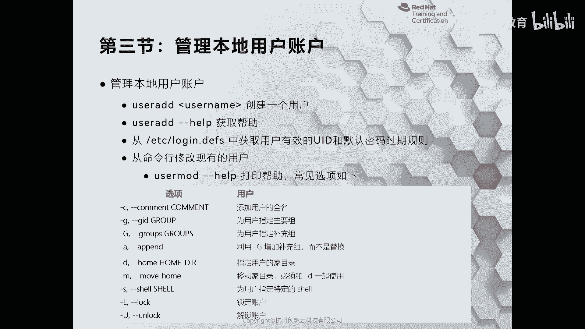
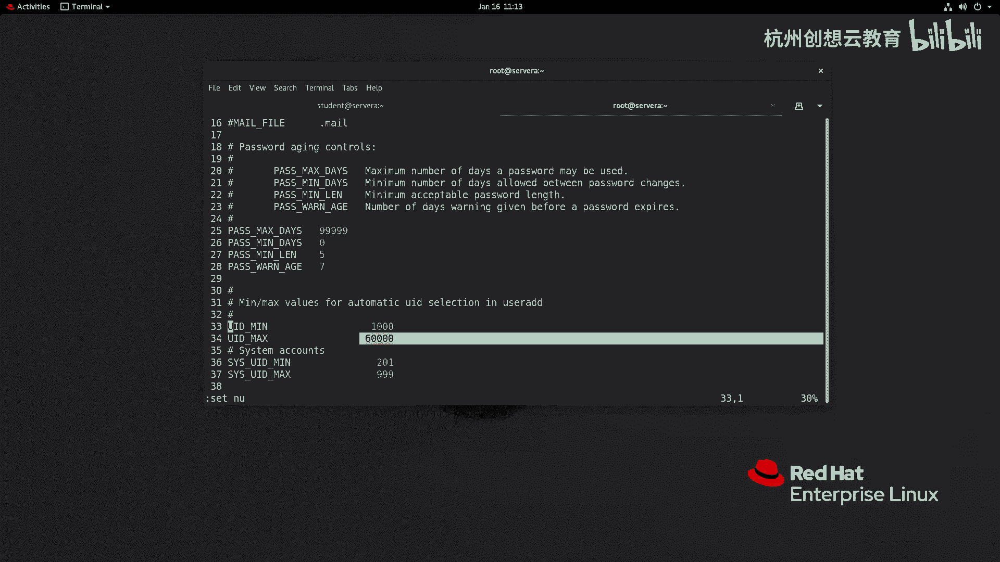
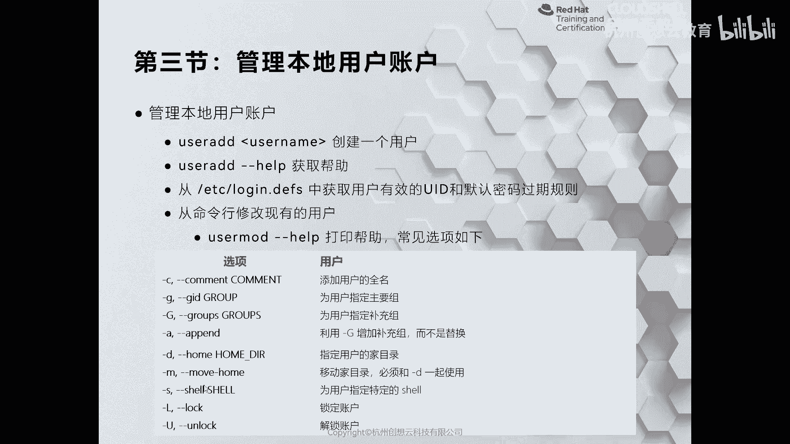
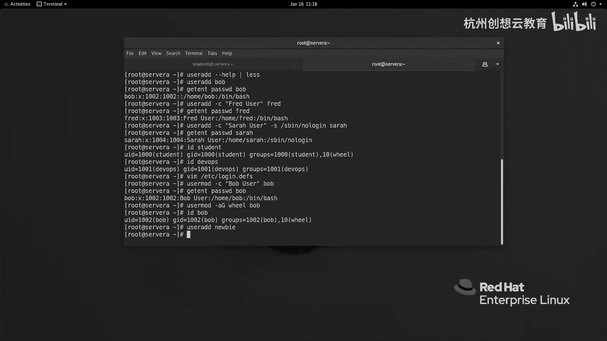
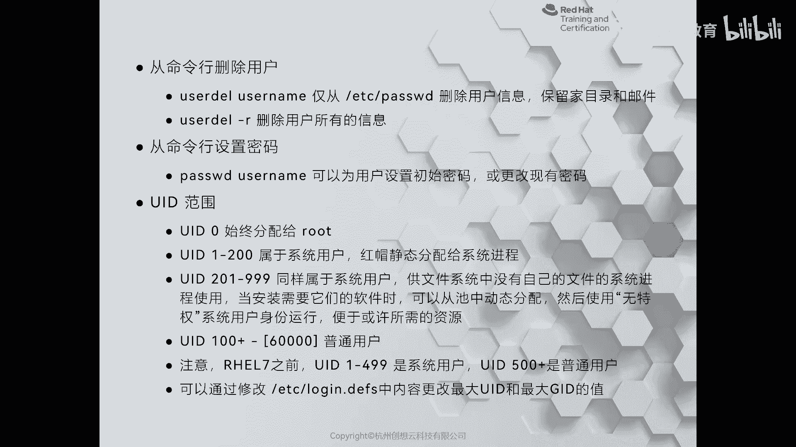
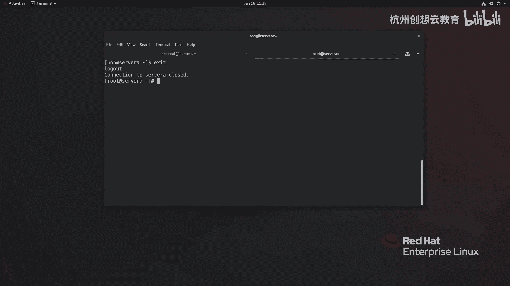
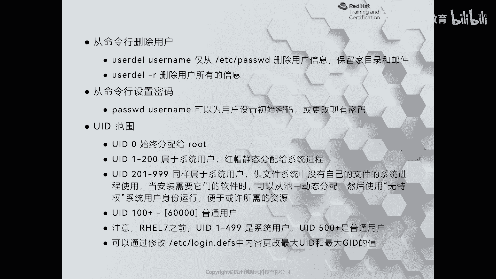

# 红帽认证系列工程师RHCE RH124-Chapter06-管理本地用户和组 - P3：06-3-管理本地用户和组-管理本地用户账户 - 杭州创想云教育 - BV1cd4y1A7Xu

好我们来看第三节啊，管理本地用户账户啊，那么这一小节呢我们来讲一讲如何来添加系统里面的一些用户啊，或者说修改性当中已存在的一些用户，那么首先我们来说一些个命令的叫uzi啊。

那么uzi的话呢是我们红帽切换linux里面推荐的一个命令，ok那么这个命令有一定linux基础的经验的啊，小伙伴们呢可能也接触过i的usok。

那么我这里呢这里呢先给大家呢聊一聊这个呃这两个命令的区别啊，那么在我们的这个fda系列的linux发行版当中呢，那么user i和i user呢是同一个命令，当你只用as user的时候呢。

它其实是一个谁呀，它是一个user add的一个软链接，ok那么如果在这个u盘图啊，这种linux的系列方向盘当中啊，那么user i呢是一个非交互式的命令，就和我们今天学的是一样的。

而i user的话呢则是一个交互式的一个命令，当你增加一个用户的时候呢，它会询问你用户的这个first name呀，啊last name呀，全名啊，邮件地址呀，办公地址呀等等，巴拉巴拉很多信息。

ok然后呢在这个这个啊susc啊，susan这个这个系统上面的话呢，a是什么样呢，是这个只有谁呢，只有这个and user，我记得啊，只有记得是as user哦，sorry啊，是只有user i的啊。

是没有i的user，ok诶这是几个命令的区别啊，啊那么我们在real上呢给大家来演示一下，如何通过uzi的来增加一些用户，ok那么首先呢我们已经通过身份啊登录到我们的sola啦。

student的身份，那么我们在做用户管理的时候呢，我们课堂上呀这个为了方便啊，或者说你在登录的时候呀，就直接选择root都是可以的好，那么我现在呢请切换到root身份，啊然后呢我去增加一个用户。

那么在增加用户之前呢，我先通过user e杠杠，还要help来获得该命令的帮助啊，该密的帮助好，那么我现在呢把它less一下，回车回车，那么回车之后呀，在这里面有大量的相关的内容。

那么我们常见的有咖啡啊，那么修改用户的全名啊，for name，ok然后呢还有谁呢，还有这个唉在增加用户的时候呢，我们会来指定它的主要组啊，默认来说呢你在用增加用户的时候呀，会给你创建一个同名的组啊。

不需要指定，ok那么下面还有什么呢，还有这个啊杠这个大写字母g啊，来增加一个负数组，ok唉，然后这个还有这个s增加用户的一个shell u来指定用户的ui d ok好，那么我现在呢去增创建一个用户呢。

叫谁呢，叫bb叫bb，ok i user e啊，我就很单纯的说一个叫用户叫bob回车，那么我们的系统里啊就增加了用户呢叫bob，我们可以通过该进，这个pass drod来bb来查看用户的信息。

哎这是用户的信息，你看他的ui d是1002g i d的1002加目录，home bob用户呢它拥有自己的一个shell，然后呢我再增加点用户啊，uzi这次呀我加一个谁呀，加个c全名好吧。

叫什么叫freed啊，user ok那么接着呢这个用户呢叫就叫freed啊，freed回车，我们再来通过该进场的来获得一下free的信息，那free的信息，ok那么它的全名啊，就是这个效果了啊。

然后呢我再增加用户呢叫谁呢，叫做啊，叫做这个呃sara sara，用户的话呢，我不希望呀它通过本地的shell来登录系统，那么我可以通过user i的，那么同样我这次加个全名好了，叫做henry啊。

suffer啊，user啊，然后呢它的shell啊，我不希望它登录系统，我就加上一个s b啊，no log in啊，回车用户呢就体验上来了，同样我们通过该镜头呀，来来获得该用户的信息，我们来检查一下。

那么这是我们第三个用户啊，它的这个啊share啊是不可登录的啊，不可登录的，ok复刻登录之后呢，这个那么那就意味着它有没有密码，都是没有办法登录系统的啊，都是没有办法登录系统的。

而这个上面这两个用户一个叫bob，一个叫fried，那么现在能否登录系统呢，不可以，因为没有设置密码，没有设置密码，ok那么这些用户呢我们发现它的ui d都很特殊啊。

都是从1000 011千零二一千零三的一次递推，而我们系统当中啊，现用的两个用户，一个呢是student，那么3d的是1000啊，那么dops啊，dels用户的ui d呢是1001啊。

从1000~1005啊，就1004啊，一次在递归，那那么这些用户的ui d是从哪计算的呢，注意啊，我们系统当中有一个这样的文件啊，叫etc下的什么呀，log in force。

那么这个文件当中呢有没有这么一行啊，有这么一行叫什么呢，叫做啊dollar这个ui d m n看到没有，还有ui d呢，max那么在这里呢则是来指定了我们linux里面默认用户的ui d的范围。

那么我们在增加用户的时候呀，它会从这里呢取值，那么在取得之前呀，它首先会去判断啊e t c past dd里面最近一次啊，用户应该是什么呀，最大的一个ui d的用户的i d是多少。

然后呢在这个范围之内加一就可以了，比如说呢你找到一个用户的uid呢是一是1005啊，然后呢还有一个用户的uid呢是2000，那么他经过判断呢就去找2000的这个。

然后呢2000呢哎接着呢2000在这里面小于6万对吧，小于6万，那么就是2000+1新的用户呢就是2001了啊，只要不超过6万，当一旦超过6万了，那么他就会再次的去干嘛呀，去找etc下的psp d。

看里面有哪些用户的ui d呢，属于是1000~6万之内的，并且没有被被使用的，然后你再去分配啊分配，ok这是用户的ui d啊，用户的i d，那么我们后面还会给大家介绍呢。

通过该文件呀去更改用户的密码，默认策略，ok这是增加用户，当我增加完用户之后，可能有一些别的需要，比如说哎我那个第一个用户要报我呢，没有增加什么呀，for name，我想增加一下，改一改。

后期哎我可以用c来改对吧，我说我想给一个用户啊增加一个附属组，ok那么只改组复数组，用大写字母记要增加一个辅助组，一定要记得要加a啊，还可以更改加目录啊，因为一般跟在加目录的时候呢，会和m一起用。

就是md啊，移动到哪儿啊，更改用户的share啊啊，锁定账户啊，结个账户等等好，那么我现在呢去把第一个用户的全名啊给它改一改。

啊那么我们就可以这样来实现了，叫user mode，杠谁呀，后面跟上我们的全名叫bb啊，user给指向我们的bob用户，那么我们再去改进啊，这个pass wd啊，去看bob，咱就有了全民啊。

有了全名k那么为了后面呀我这个用户啊在这个执行命令的说呀，便于提前啊，我想把那个bob和这个freed啊都增加一个管理员权限，让它可以修度啊，可以修路，那么我们可以干嘛呀。

可以这个把这个用户呢增加到五组成员里面，对不对，我现在呢先把报告加进来，那就是user mode啊，不是替换啊，加上a就是要叫will啊，will跟上一个bb回车，然后呢d bob。

那么我们的bob呀也和student的用户一样，哎赠与具有什么呀，通过修度来提前的方法了，ok那么随着我们的使用啊，可能后面还要干嘛呀，还可能要删除一些用户，还要删除用户，那怎么办呢。

我们这里啊先去干嘛呢，先去创建一个，先去创建一个用户，我们便于后面删除啊，我新建用户叫什么叫小叫这个新手啊，叫nb啊，叫nb，ok我一会儿把这个用户呢给它删掉，好吧啊，删掉好。

那么我们来看一下p p t啊，ppt那么怎么删除用户呢，删除用户呀，我们可以简单地通过user dell命令去删除，但是这个命令在删除的时候一定要注意了，那么删除的时候呢。

这个他只会把这个etc pass wd里面的信息的删除啊，只会保留用户的家目录和邮件啊，这个保留的那么好处就在于是用户的数据是保留的，那么缺点呢就在于如果后面呀我们再增加用户，这个用户的ui d呢。

正好和你之前删除的这个用户uid呢是一样的，那么这个用户啊就可以去访问啊，删除用户的加盟信息，存在数据泄露的风险，那么如果你想删的很干净，那么就可以使用user dale跟r来删除。

那么我们现在要把刚才增加的这个牛b用户那个删掉。

user dale啊，gr nb的车，那这个用户呢就不再存在了，ok啊就不存在了啊，这是给大家演示的删除用户啊，那么我们刚才呀分分增加了这几个用户呀，那么多是没有办法去去登录系统的啊，登录系统的。

因为没有设置密码，因此呢我现在给他设置个密码pass wd啊，谁呢，bob密码red hat啊，我们教室里面用密码都用red hat，这样便于记忆啊，freedo ra hat。

然后呢我们就可以登录了啊，登录了好，那么就可以远程的方式登录啊，我们来试一试啊，自己登自己好了，i s h bob at server a啊，回车yes，输入密码ride，唉我们就能登录到系统里面了。

唉登录到系统里面了，ok好，那么这是给大家演示了如何新建用户，修改用户和删除用户啊，那么别忘了一件事情，就说那么我们这些用户呢都是有一个u i d的啊。

而u i d呢正是我们之前给大家介绍了是用来什么区分用户的身份的，因为系统啊是不会使用啊用户名的方式来区分的。

而是用用户的ui d，那么ui d的话呢是有一个有一个范围的，我们来看一下啊，那么如果ui d是零，那么它一定是入的身份，ok刚入的u i d呢，当用户的ui d呢是这个属于是1~200的这个范围之内。

那么我们把它称为是系统用户，但是呢它是黄帽静态分配给新进城的啊，也就意味着不需要我们管理员去管理的，那么还有一个呢范围也是系统用户是多少呢，是201~999，那么这个id的话呢可以便于后期用户的管理啊。

我是管理员，我去装了一个软件，是一个服务，哎，我想把它给它分配一个ui d，那么从201~999里面找一个啊都可以，那么当我们的uid呢是从100~6万这个范围之内啊，那么一般指的是普通用户。

普通注意啊，我这里特意加那个强调在real 7之前就是real 5呀，real 6啊，那么ui d的话呢1~499啊，是系统用户，而这个500之后是普通用户，因此我们从红帽760l级到红毛770。

或者是从real 6升级到real 8的时候，用户的uid呢要事先呢做好迁移啊赚钱，否则会出现问题啊，出问题，那么如果你的6万不够用了。

那么我们可以在e t c log in default里面去找那个什么呀，max uid呢去修改即可啊，去即可。

