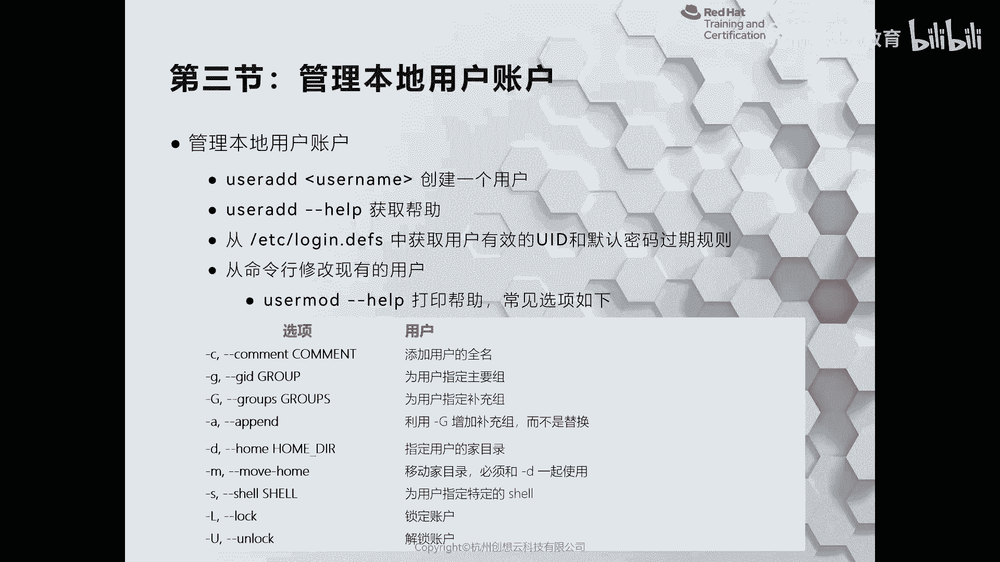
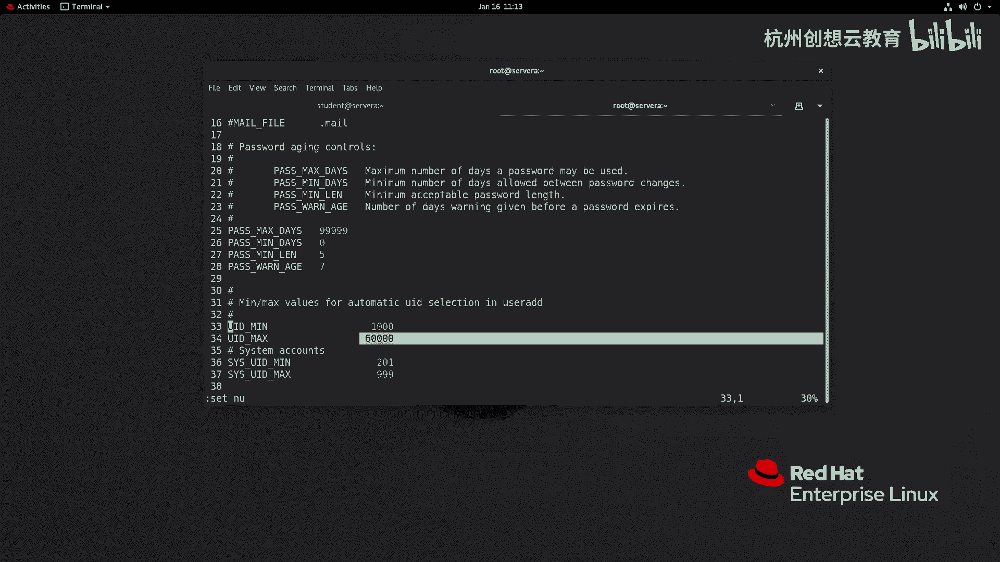
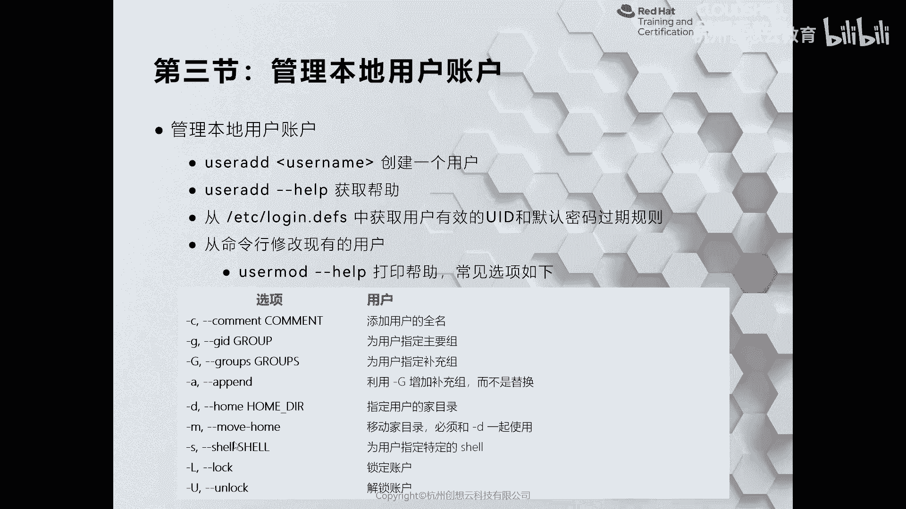
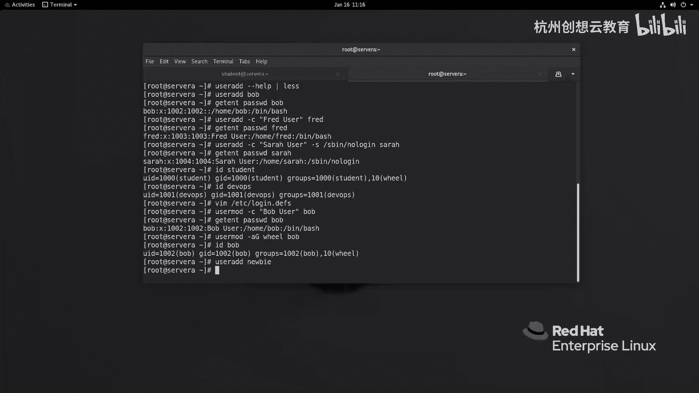
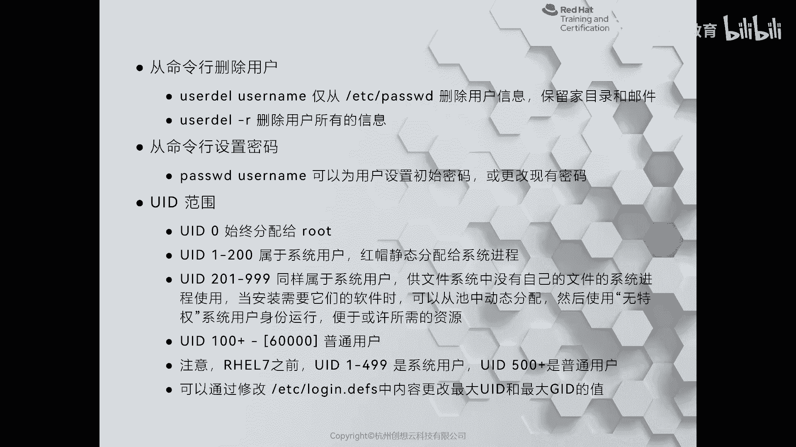
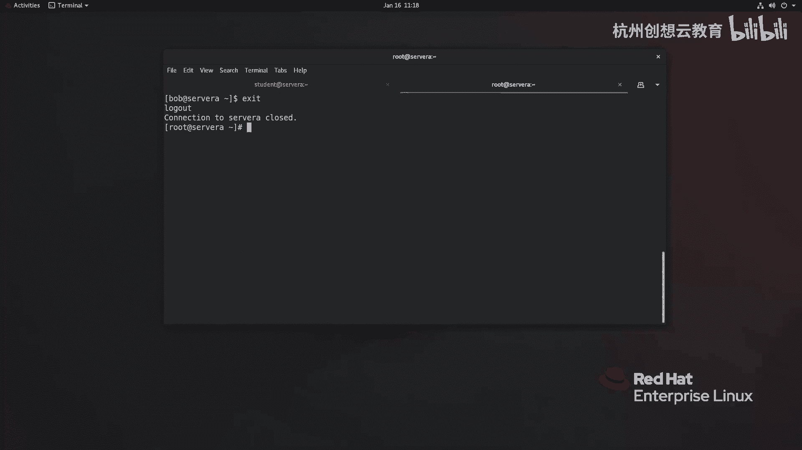
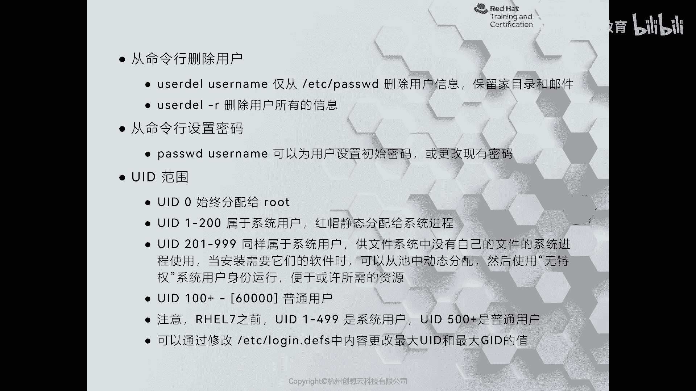

# 红帽认证系列工程师RHCE RH124-Chapter06：06-3：管理本地用户账户

## 概述
在本节课程中，我们将学习如何在红帽企业Linux系统中管理本地用户账户。具体内容包括使用`useradd`命令创建用户、使用`usermod`命令修改用户属性、使用`userdel`命令删除用户，以及理解用户ID（UID）的分配规则和范围。这些是系统管理员日常工作中的基础技能。

---

## 用户管理命令：`useradd`与`adduser`的区别
在开始创建用户之前，有必要了解不同Linux发行版中用户创建命令的差异。

*   在Fedora系列的Linux发行版中，`adduser`命令是`useradd`命令的一个软链接，两者是同一个命令。
*   在Ubuntu等Debian系列的Linux发行版中，`useradd`是一个非交互式命令，而`adduser`则是一个交互式命令，创建用户时会询问姓名、邮件地址等详细信息。
*   在openSUSE系统上，通常只有`useradd`命令，没有`adduser`命令。



在红帽企业Linux中，我们推荐使用`useradd`命令。

---

## 创建新用户
上一节我们介绍了用户管理命令的基本情况，本节中我们来看看如何使用`useradd`命令创建新用户。首先，我们需要切换到`root`用户身份来执行管理操作。

可以使用`useradd --help`命令获取详细的帮助信息。常见的选项包括：
*   `-c`：设置用户的全名。
*   `-g`：指定用户的主要组（默认会创建一个与用户名同名的组）。
*   `-G`：为用户添加附属组。
*   `-s`：指定用户的登录Shell。
*   `-u`：指定用户的UID。

以下是创建用户的几个示例：

1.  创建一个名为`bob`的简单用户：
    ```bash
    useradd bob
    ```
    创建后，可以使用`getent passwd bob`命令查看用户信息，包括其UID、GID、家目录和默认Shell。

2.  创建一个名为`fred`的用户，并指定其全名：
    ```bash
    useradd -c "Fred User" fred
    ```

3.  创建一个名为`sara`的用户，指定全名并禁止其登录Shell（例如，用于运行服务的系统账户）：
    ```bash
    useradd -c "Henry Suffer" -s /sbin/nologin sara
    ```
    使用`/sbin/nologin`作为Shell的用户将无法登录系统。

新创建的用户默认没有密码，因此无法登录系统。需要后续使用`passwd`命令为其设置密码。

---

## 用户ID（UID）的分配机制
我们注意到，新创建用户的UID（如1002， 1003）是依次递增的。这个分配规则由系统文件`/etc/login.defs`中的`UID_MIN`和`UID_MAX`参数定义。

系统在创建新用户时，会查找`/etc/passwd`文件中已存在的最大UID，然后在该文件定义的范围内（默认为1000到60000）分配一个未使用的最小UID。如果分配的UID超过了`UID_MAX`，系统会再次搜索范围内未被使用的UID进行分配。

这个文件也用于定义密码的默认策略，我们将在后续课程中介绍。



---

## 修改用户属性
创建用户后，可能需要修改其属性。这时需要使用`usermod`命令。

常见的修改操作包括：
*   修改用户全名：`usermod -c "新全名" 用户名`
*   为用户添加附属组（注意要使用`-aG`选项来追加组，而不是替换）：`usermod -aG 组名 用户名`
*   修改用户家目录：通常与`-m`（移动旧家目录内容）选项一起使用。
*   修改用户的Shell。
*   锁定或解锁用户账户。



**操作示例：**
1.  为之前创建的`bob`用户添加全名：
    ```bash
    usermod -c "Bob User" bob
    ```
2.  将`bob`用户添加到`wheel`组（该组的成员可以使用`sudo`命令提权）：
    ```bash
    usermod -aG wheel bob
    ```
    现在，`bob`用户就和`student`用户一样，可以通过`sudo`来执行管理命令了。

---

## 删除用户
随着系统维护，可能需要删除不再需要的用户。删除用户使用`userdel`命令。



删除用户时需要注意：
*   仅使用`userdel 用户名`：只会删除`/etc/passwd`等文件中的用户信息，但会保留用户的家目录和邮件目录。优点是保留了用户数据，缺点是如果后续创建了相同UID的新用户，新用户可能访问到旧用户的数据，存在安全风险。
*   使用`userdel -r 用户名`：会删除用户账户，并同时删除其家目录和邮件目录。删除更彻底。

**操作示例：**
删除之前为演示创建的`nb`用户及其所有数据：
```bash
userdel -r nb
```

---



## 为用户设置密码与登录测试
之前创建的用户（如`bob`和`fred`）因为没有密码，所以无法登录。现在我们来为他们设置密码。

使用`passwd`命令为用户设置密码（在示例中，我们使用`redhat`作为简单密码，实际环境中应使用强密码）：
```bash
passwd bob
# 输入密码：redhat
passwd fred
# 输入密码：redhat
```

设置密码后，用户就可以登录系统了。我们可以使用`su`命令切换用户，或者通过SSH进行远程登录测试：
```bash
ssh bob@localhost
# 输入密码后即可登录
```

---



## 理解UID的范围与分类
系统通过UID而非用户名来区分用户身份。UID有不同的范围，代表不同的用户类型：

*   **UID 0**：超级用户`root`。
*   **UID 1-200**：系统用户，由红帽静态分配给系统进程使用，管理员通常无需管理。
*   **UID 201-999**：系统用户，通常分配给由系统管理员安装的软件或服务使用。
*   **UID 1000-60000**：普通登录用户。这是`/etc/login.defs`中`UID_MIN`和`UID_MAX`定义的默认范围。

**重要提示**：在RHEL 7之前的版本（如RHEL 5/6）中，UID 1-499是系统用户，500之后是普通用户。因此，从旧版本（如RHEL 6）升级到新版本（如RHEL 7/8）时，需要特别注意用户的UID迁移，否则可能导致权限问题。如果默认的UID范围（60000）不够用，可以直接修改`/etc/login.defs`文件中的`UID_MAX`值。

---



## 总结
本节课中我们一起学习了红帽Linux系统下本地用户账户的核心管理操作。我们掌握了使用`useradd`创建用户、使用`usermod`修改用户属性、使用`userdel`删除用户的方法。同时，我们也深入了解了用户ID（UID）的自动分配机制、不同UID范围所代表的用户类型，以及如何为用户设置密码使其能够登录系统。这些知识是进行系统用户管理的基础，请务必熟练掌握。