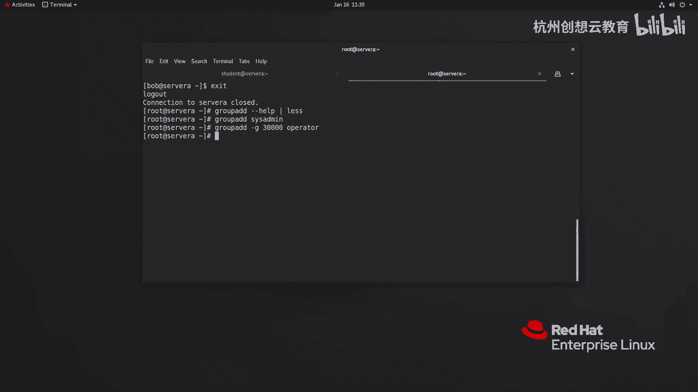
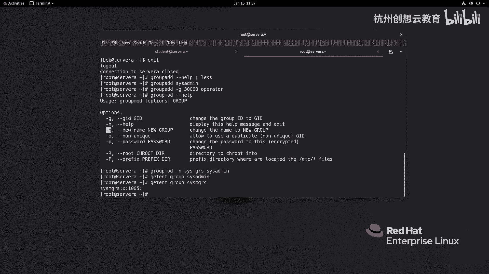
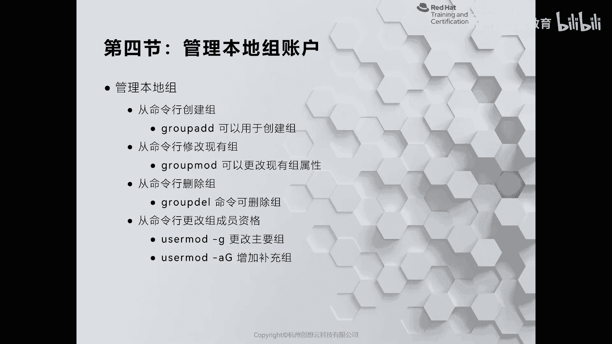
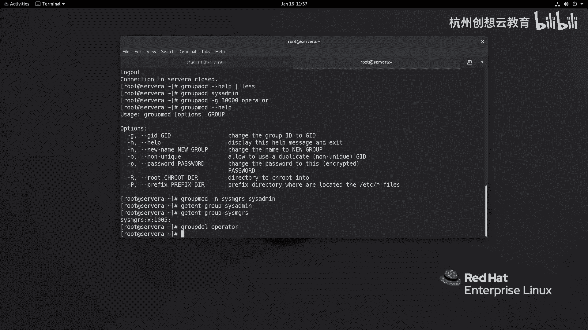
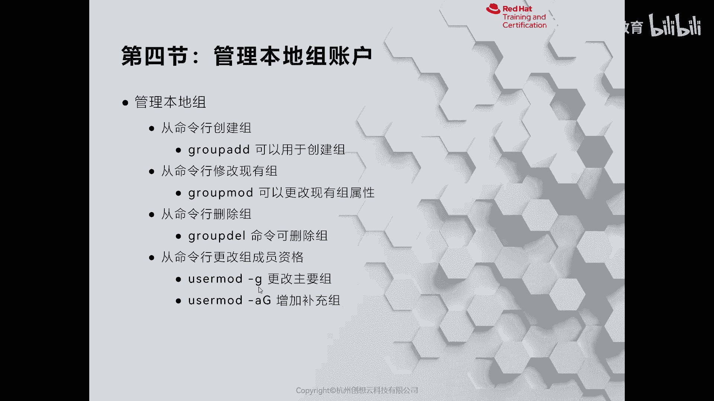
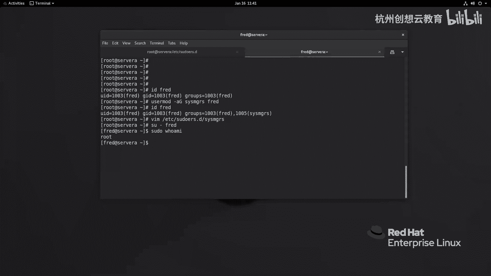
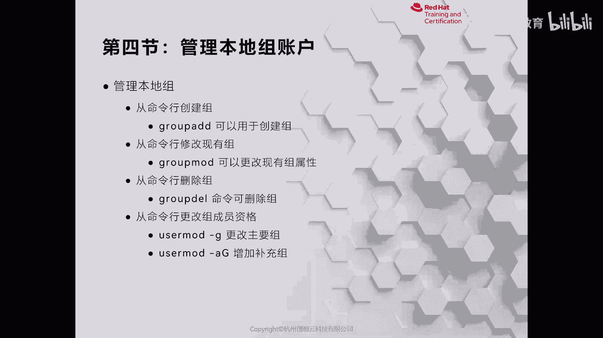

# 红帽认证系列工程师RHCE RH124-Chapter06-管理本地用户和组 - P4：06-4-管理本地用户和组-管理本地组账户 - 杭州创想云教育 - BV1cd4y1A7Xu

啊在linux当中啊，管理组是非常的简单的啊，那么第四节正式来给大家介绍如何在本地呢去创建我们的组啊，和管理我们的组，那么在创建组的时候呢，我们通过的命令啊，就是group i啊。

它的用法和user id的用法是唉大同小异。

但是呢更加简单啊，那么我们可以通过uzi啊，sorry啊是group e杠杠help来获得帮助，我们可以利用管道符啊，然后呢分页命令来显示东西非常少啊。

那么uzi的里面的小写字母g呢代表的是来指定主的g d k诶，然后呢其他的就不常用了，ok所以说呢我们直接可以通过group啊，i直接跟上一个组名称，比如说this is，即可。

那么如果你想在增加组的时候呀，想更改它的g i d，那么可以跟个g比如说跟着3万跟上一个什么呢，跟上一个叫做operator啊，operator，那这是个组名称。

ok那么如果啊如果我们这个后期呀要想修改。

则走的是group mode这个命令啊，比如说我现在刚才那个刚刚执行的这个命令当中啊。

这个3000啊啊或者叫operator吧，然后要这个this is me，我想给它改一改好吧，this as me，我想改一改，我想改成叫this is major好吧。

那么我就可以通过group mode刚刚help来获得帮助，那么里面有个谁呀，刚n啊，高n杠n的话呢，可以协助我们去更改组的名称，那么group mode感恩新的名称叫做csm g r s和mers。

那么接着跟上我们旧的名字at me对车，那么我们就可以通过什么呀，该进程啊，这个group啊，group来获取admit，该进啊，sorry，因为这个名变掉对吧。

我们要换成选c major m g r s1 ，这哎就能看到你们的gd啊，是1005的信息啊信息，那如果后期我们想删除也非常的方便啊，那么删除的话呢我们不需要像这个啊user dale一样加一个选项。

直接加一个选组名称就可以了啊，好那么我们来执行一下组名称啊。

组名称好比说呢现在呢我要把operator的删除掉，那就是group啊，杠啊，直接跟上组名称operator啊，回车即可，那么这是给大家演示了如何去更改我们这个主的信息，那么我们后面其实在施工当中啊。

经常会组和这个什么呀，和我们的这个用户呢结合在一起来使用。

就比如说我们可以干嘛呢，可以通过这个命令啊，叫做user mode杠j来更改主要组，那么比如说你在增加用户的时候呀，不希望用透明的组，你你可以把这个主要改成其他已存在的组。

或者说你把这个组呢作为我们的补充组啊，或者负数组来使用，那么现在呢我就把我刚才的报告用户呀增加一个附属组呃。

fried吧，我用freed，我增加一个，我现在呢用这个freedom，freedom现在是一个很普通的用户，我就把它增加一个辅助组啊，我用刚才的cs m g r s来更改，然后呢跟上我们的用户名啊。

这时候呢我们再来看一下free的哎，就变化了，怎么办呢啊我们结合刚才学的知识呀，我们去写一个啊修改文件好吧，vm啊，etc下面的修ders啊，修点死啊，我们放在目录下面啊，起名叫做什么呢。

起名就叫做cs m g r s打开啊，然后呢输入i进入编辑，我们输入百分号组的名称，csm g r s空格啊，等于括弧啊，哦然后呢我们顺便呀啊这个模仿一下谁呢。

模仿一下我们的那个这个dios用户的这个呃这个写法，因为它里面有一个什么呀，有一个这个叫做我记得是90开头的是吧啊，90开头的那you sorry，所有吧，sud点电哎，这个里面有吗，我们先看一下。

我记得是有的，这个啊soldiers是啊，是90，但是刚才为什么没看到呢，90啊，那么他这个的话呢就是没有输密码的，那么我们可以去参照这个语法结构啊，写个no pad好吧，no pass wd啊。

冒号啊，空格啊，空格写个什么一个or啊，写个all，这个地方我们不用加空格啊，不用加空格啊，保存并退出好，那么这时候呢我们再来切换到刚才的freed，我们就可以速度啊，这个who am i啊。

免密码取齐全，ok好，这是我们来给大家演示的组的管理方法。

