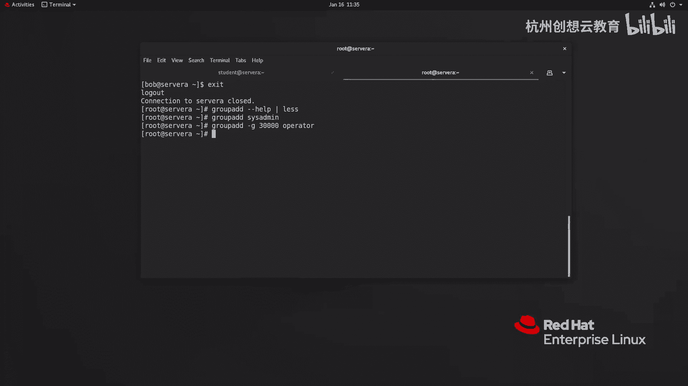
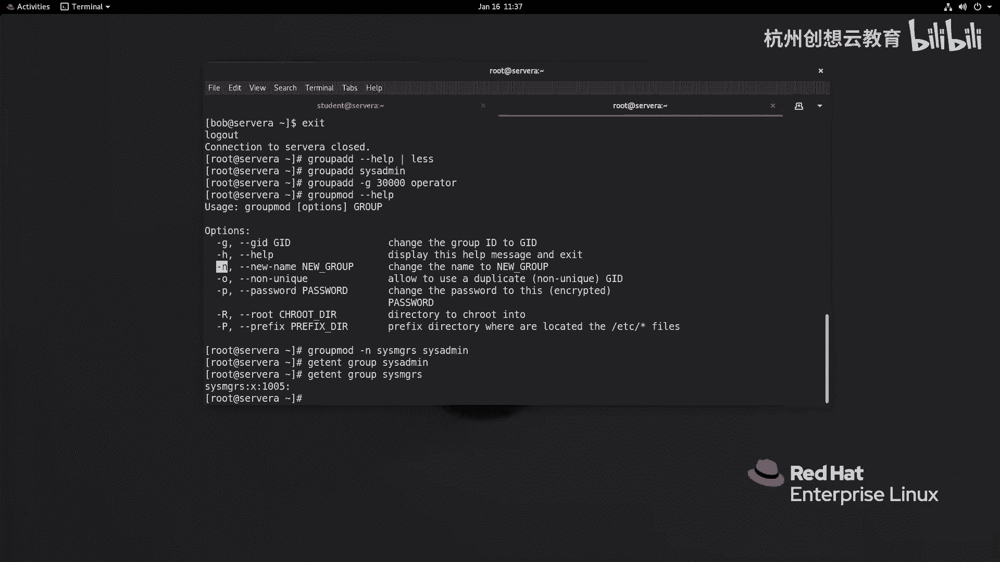
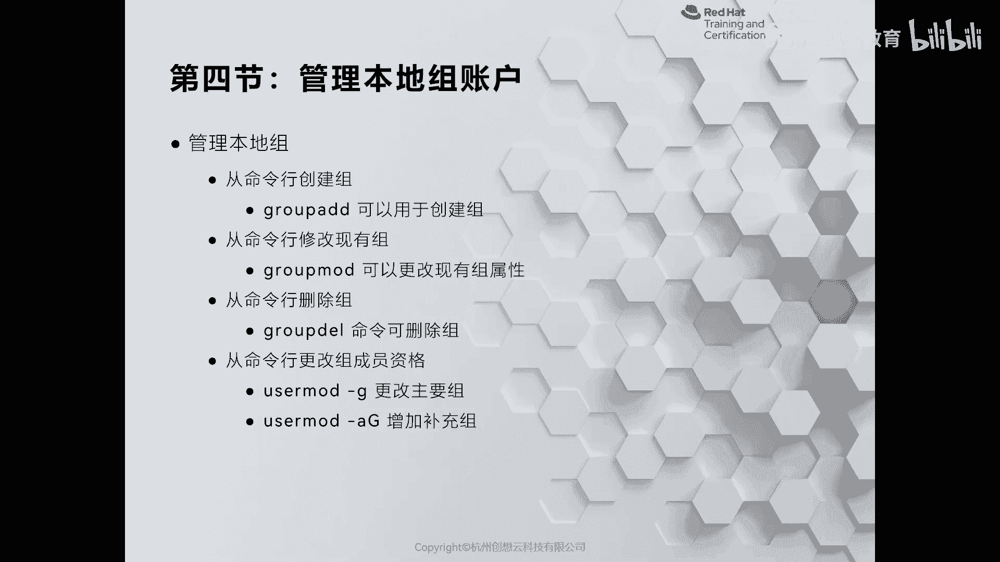
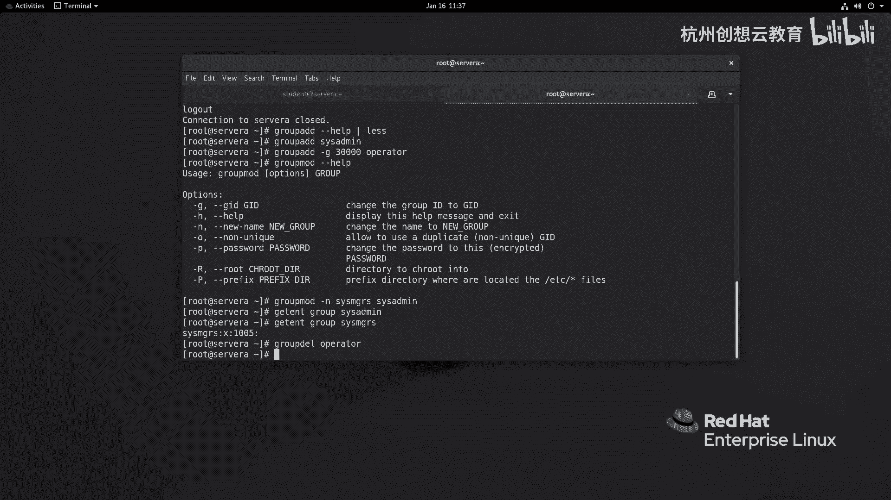
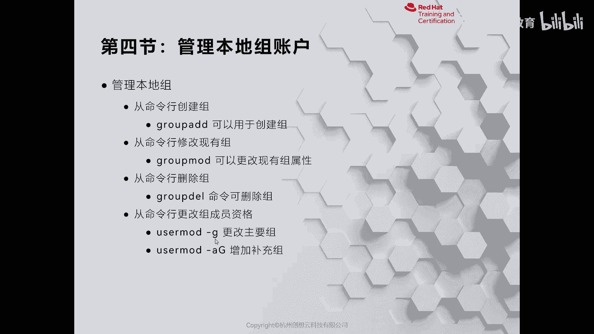
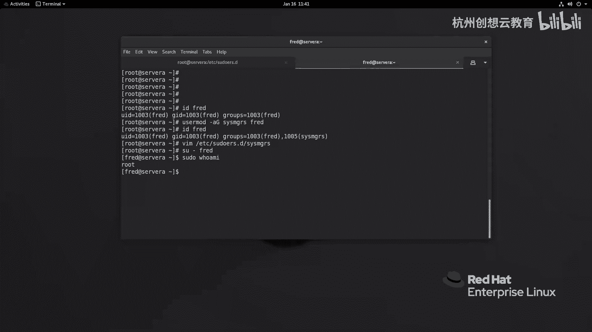
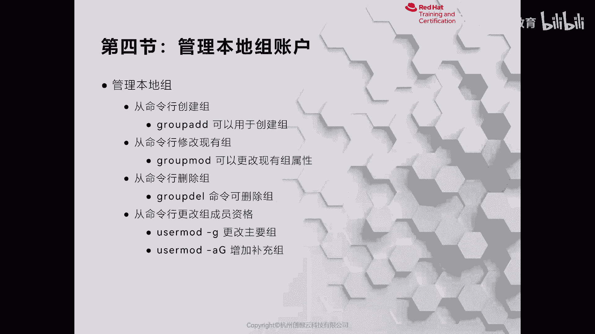

# 红帽认证系列工程师RHCE RH124-Chapter06：管理本地用户和组 - P4：06-4-管理本地组账户

在本节课程中，我们将学习如何在Linux系统中管理本地组账户。我们将介绍创建、修改和删除组的方法，并演示如何将用户与组关联起来，以实现权限管理。

## 创建本地组


在Linux中，管理组非常简单。创建组的主要命令是 `groupadd`，其用法与 `useradd` 命令类似，但更为简洁。

以下是 `groupadd` 命令的基本用法：

```bash
groupadd [选项] 组名
```

例如，要创建一个名为 `thisis` 的组，可以执行：

```bash
groupadd thisis
```



如果你想在创建组时指定其组ID（GID），可以使用 `-g` 选项。例如，创建一个名为 `operator`、GID为30000的组：

```bash
groupadd -g 30000 operator
```


## 修改本地组

上一节我们介绍了如何创建组，本节中我们来看看如何修改已存在的组信息。修改组信息使用 `groupmod` 命令。

例如，假设我们想将之前创建的 `thisisme` 组更名为 `csmgrs`。可以使用 `-n` 选项来更改组名：

```bash
groupmod -n csmgrs thisisme
```

执行后，可以通过 `getent group csmgrs` 命令来验证组信息，可以看到其GID等信息。

## 删除本地组

删除组比删除用户更简单，不需要额外的选项。删除组使用 `groupdel` 命令。



以下是删除组的命令格式：



```bash
groupdel 组名
```

例如，要删除之前创建的 `operator` 组，可以执行：

```bash
groupdel operator
```



## 将用户与组关联

在实际工作中，我们经常需要将用户和组结合起来管理权限。例如，我们可以更改用户的主要组，或者为用户添加附属组。

使用 `usermod` 命令的 `-g` 选项可以更改用户的主要组，而 `-G` 选项可以为用户添加附属组。



例如，我们有一个用户 `freedom`，现在想为其添加一个附属组 `csmgrs`：

```bash
usermod -aG csmgrs freedom
```

执行后，可以使用 `id freedom` 命令查看用户的组信息，确认 `csmgrs` 组已成功添加。

## 配置组权限示例

为了更深入地理解组的管理，我们可以结合文件权限进行配置。例如，创建一个sudoers配置文件，允许特定组的成员无需密码执行所有命令。

以下是配置步骤：

1.  使用 `vim` 编辑器创建一个新的sudoers文件：

    ```bash
    sudo vim /etc/sudoers.d/csmgrs
    ```

2.  在文件中输入以下内容，允许 `csmgrs` 组的成员无需密码执行所有命令：

    ```
    %csmgrs ALL=(ALL) NOPASSWD: ALL
    ```

3.  保存并退出编辑器。

配置完成后，属于 `csmgrs` 组的用户（如 `freedom`）就可以使用 `sudo` 命令而无需输入密码了。例如：

```bash
sudo whoami
```



## 总结



本节课中我们一起学习了Linux本地组账户的管理。我们掌握了使用 `groupadd` 创建组、使用 `groupmod` 修改组、使用 `groupdel` 删除组的方法。同时，我们还学习了如何通过 `usermod` 命令将用户与组关联，并配置了基于组的sudo权限。这些技能是进行系统用户和权限管理的基础。