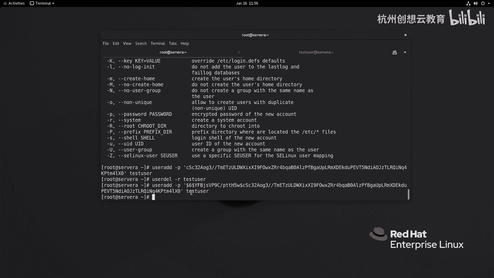
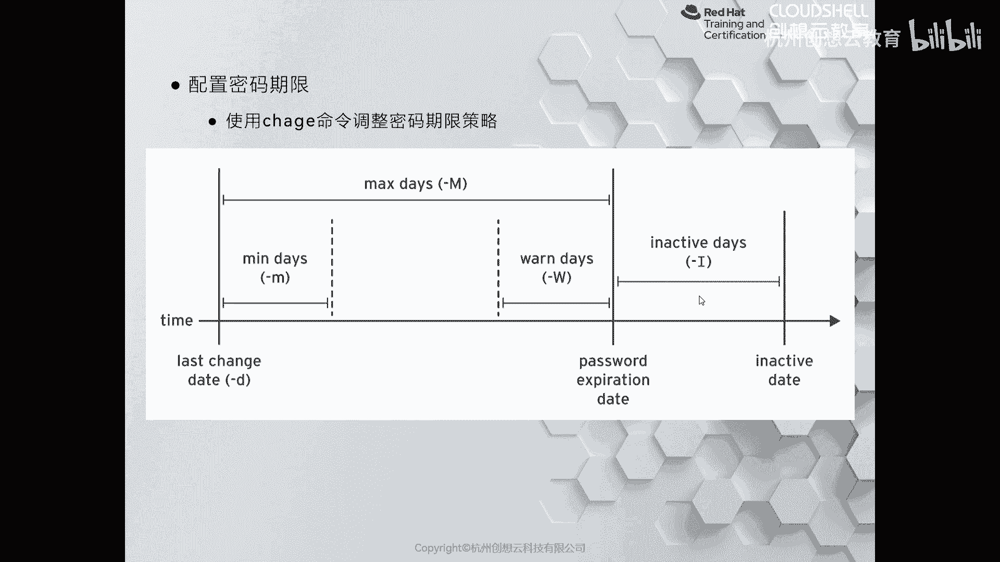
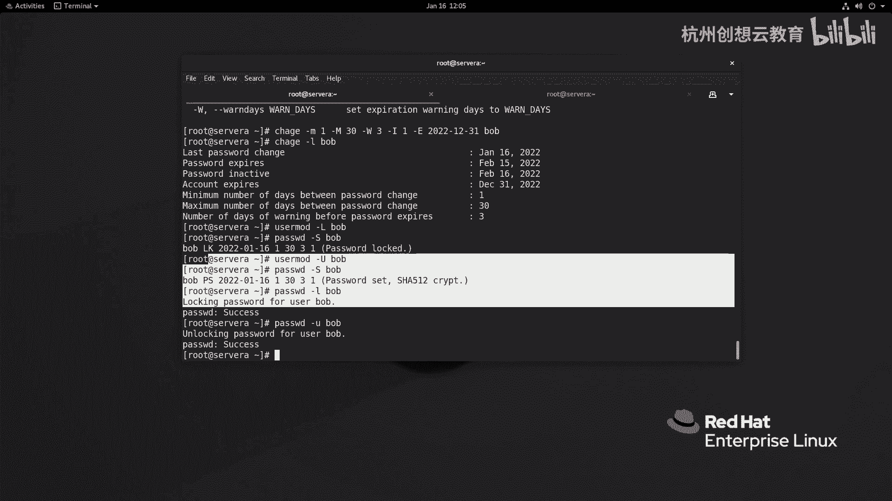

# 红帽认证系列工程师RHCE RH124-Chapter06-管理本地用户和组 - P5：06-5-管理本地用户和组-管理用户密码 - 杭州创想云教育 - BV1cd4y1A7Xu

好，我们前面的章节呀已经学习了如何去添加用户啊。那么我们在添加用户的时候呢，默认情况下是没有设置密码的。那么就意味着我们的用户没有办法去登录到系统当中啊。然后呢我们用passWD这个指令啊。

给他做一个初始密码，这样就可以登录系统了。然后接着呢我们来给大家介绍呢，如何去来管理用户的密码。首先我们最常用的命令呢还是啊passWD来更改用户密码。我们可以使用passab啊。

这个杠杠help来获得它一些简要的说明啊。那么passab的话呢，我们在设置初始密码的时候呢，哎我们这个还可以通过啊这个啊杠S选项呢来查看用户啊账户密码的一个呃这个状态信息。O。

那么比如说我们之前创建的bob，我们来看一下pass WD杠S啊bob。那么对于报抱用户而言，它的密码呢已经被设置了啊，PS啊，说明是什么呀？password site。那么密码这什么时候改的呢？

是2022年的1月16号啊，正是今天啊，正好今天。然后呢，我们的密码的这个有效期啊啊到什么时候，这个下次什么时候可以改呢？啊，距离啊这个2022年的1月16号呀？凌天啊，就是意味着可以随时的更改，对吧？

然后呢，接着呢，这个5个9呀则代表的是我们密码的过期时间，就说你需要改密码的时间是55这个99990天那那天之后啊才能改。你像这个值都是走到默认呀啊，默认值一般不符合我们的策略，所以说我们可以去修改。

那怎么改呢？啊注意默认的话呢，改的方法呢是修改的是ETC下面的log in。dforse这个文件。啊，我们把行号呢打开啊，在文文件的25行。和26行呢就是来控制默认用户密码策略的地方。

比如说最短的时间呢是0天，我不希望啊，我改成一天，对吧？那么最长的时候呢，是几天呢，是这个30天。那么改完之后呢，他会对后面的用户呢生效啊，他不会说啊你改完了是吧？啊，原来的用户呀呃这个也能生效。

不会他只会对后面的用户生效，比如说我现在增加一个用户呢，叫那他上，好吧，他上啊，然后呢给他改密码，但是改密码呀，我们刚才要输两次，对吧？啊，前期阶段初始化的时候改密码很简单就可以了。

但是我又不想输两次啊，我想做一个非交互式的啊，走一次，同样我们来看一下帮助。啊，帮助里面呢有一个这样句选项呢叫做STDIN啊，那么读取啊新的指令从哪里啊？从标准输入啊，就说反反过来的说存标准输出啊。

我当做密码，把上个命令的标准输出当做密码就可以了。对我的标准输入。那么我们可以通过这个icical啊read。啊，管道符啊，passWD杠杠STDIN。啊，哎那么ecle输出一个标准输出。

通过管道符呢变为了标准输入给谁列给pa萨布地了。然后呢读取给谁呀，给我们的娜塔莎。密码就改了。好，这时候呢我们再来看一看。我们呢他上用户的密码策略信息。有没有发现？这里就发生了变化，哎。

我们就可以登录了。那么我们现在切换到那塔上。啊，然后呢我去改密码。啊，改一下密码，改成谁呢？改成这个首先输当前密码是readd hat输新的密码，那么新的密码呢要有复杂性啊复杂性。

那么我们这里啊偷个懒怎么偷呢？那我们可以去筛选个字符串，好吧，比如说我去筛选个谁的呢？筛选个root的吧。ETC下面的shadow啊，你看这里面有很多个字符串，我随便拿出来一部分，好吧。粘贴。哦。

sorry呃，还不能着急啊，为什么你看这里提示了，你看我刚才输入密码做验证的时候呢，提示什么呀？你必须要等一段时间才能改，因为我们这里策略啊改的是一天后啊，所以说要等到明天才能改密码。OK啊。

我就cttrol什么呀，ctrol C了，终止掉了。那我把时间改成什么呀？2022年的1月17号吧，我们要试一试效果。啊，117号，那么现在是11点50分啊，我去改一下。啊。好。

那么我们再来改一次试一试，好吧。啊。哎，还是不行，我们来看下时间。1月哎1月16号啊，sorry，我在改的时候忘记改数字了。17啊，没着啊变成17号了，再来改一次。啊，密码red hat哎，可以改了啊。

可以改了，我们就可以输入新密码了。那我这里呢就不改了，因为新密码太复杂了，不便于记E啊，有contl C掉了。好，我把时间呢恢复正常啊恢复正常。511分了啊，好车ok什么时间呢就正常了啊。

这是我们来说这个改密码的时候的一个啊方法。那么这些密码放在哪里了呢？那么早期的时候呀，我们的密码呢是放在了ETCIpassWD里面。那么后面为了安全呢，我们就把它放在了shaow里面。

而shaow的权限啊，我们正好学习了权限，对吧？那么。里面前面命令啊叫L杠L啊，那么涉及到权限啊，我们可以来看一看，好吧。呃，我这边使用root啊，L杠LETC下的shaow。是没有任何权限的啊。

具体的权限信息呢，我们下一章节再讲到啊。好，那么我们现在的shale是没有权限的。但是呢入的身份是可以查看的啊。那么我们去看一看好吧，看啊这个文件啊。

你发现这里呀都是这种啊这个很长的字符串中间呢用冒号来分隔开和我们的ETC的pasD啊非常的像啊，那么但是呢这里的每一列都代表有特殊的含义啊，特殊的含义。OK好。

那么我呢把这个每一行每一列的意思呀总结了一下。我们来看一看啊，那么第一列啊，那么就这里的root了，代表的是我们的登录名啊，也是用户名。那么第二列呢是我们的加密的密码，在加密密码里面是有讲究的啊。

那么首先呢我们会发现呢这里被三个doer符啊分开了。第一个doer符则代表了我们加密的算法，do6啊，就说明我们走的是哈西512啊，如果是doer一就说明是MD5啊，如果是doer5呢，哈西256啊。

从re6吧开始都是哈西512了啊，哈西512了。OK。在更早的时候呢，用的是MD53法啊MD5。接着呢到第二个do后面啊这个地方呢是颜值啊叫st啊，就是当我们输入一个字符串，作为密码之后呢。

那么这个颜值呢会结合我们的这个密码呀，随机生成一个新的字符串。通过这个字符串来使用哈信文绕型加密生成了后面的这串话啊，后面这串就是什么呀？就是加密后的内容。OK啊。

我们我们来可以通过open SSL呢来生成一个。我们比如说拿这个student用户的密码呢，我们来试一试看能不能匹配。好吧，那么ge进。啊，这个shadle studentdent。好。

我们只要了这一行啊只要这一行。好，我们来试一试open SSL啊，这个pass WD dollar6啊，do6杠s颜值颜值我们把它拿下来啊，这颜值。然后呢。

再输入我们之前知道的密码是student点加密，那么这是执行的结果。那么这个结果啊啊这个结果啊，那么理论上来说是和我们这地方是一模一样的。有没有发现？啊，是一模一样的。

那同样那我也可以事先呀啊让他走随机的延值也是可以的。我不指定颜值，我去加一个密码，比如比red hat。那么它的颜值呢是多少呢？是这串啊，是随机的。啊，随机的一串。然后呢，后面呢，这是加密后的密码啊。

加密后的密码。那么加密后的密码我拿到之后呢，我可以把这句话呀复制出来。干嘛用呢？那么不知道大家有没有在意啊，user ID里面有一个这样的一个选项，叫做杠P啊，后面跟上加密后的密码。哎，我也来试一下。

好吧，呃，passW啊，sorry啊，user id啊，我们来增加用户呢叫那叫test user好吧，杠P我把加密后的密码啊，sorry啊，我再把重新复制一次啊。我把这个加密后得密码呀给它拿过来。啊。

这样可以了啊，user id杠P啊，我把加密，我我为了这个保证没问题，没有突殊符号啊，我加一个单引号，跟上一个test user。好，我现在呢测试看能不能切换过去好吧，SU横杠。

test user密码是reide hat。sorry，好像我们要把那个颜值什么也要加上去。啊，是的啊，我要把颜值加上去，刚才犹豫了一下啊，然后还是。第一个感觉是正确的啊。好，把它拿下来。好。

我把这个用户呢先给它干掉，好吧。啊，Uer I杠P啊。好，跟上我们的test user。好，然后呢我这边呀再来试一试。来就登了上来了。OK那么这是U ID的刚P的用法，后面跟上一个加上哈希5哈希的算法。

还有这个颜值和加密后的都要加上去，再跟上用户名啊，就可以了。好，那么接着呢我们来看第二列啊，说完了。第三列。第三列的话呢，代表的是最近一次修改密码的时间啊。

它是从197年啊1月1日开始算的时间间隔天数啊。那么你像这个15775就代表是距离1970年1月1日呀，这么多天了OK了。

啊，这这个天数啊去改的啊。那么接着第四列呢是密用户呢可以多少天之后才可以改密码。他是从15775这天开始算起的啊，距离这一天有多少天啊，零天啊，就是当天可以改啊，OK然后呢，第五列呢是多少天之后啊。

用户可以改密码啊，可以改改密码。OK。啊，接着呢再往下呢就是什么呀？就是这个七啊，七的话呢代表的是密码到期之前多少天警告啊，说哎这个用户呀你要知道啊，多少天之后呢，密码就过期了啊。

你要去改了该去改密码了啊。好，接着呢。再往后呀，冒号没有内容了，我们就这个按照顺序来说好了。那么第六列呢。啊，第六列啊就是我鼠标的位置代表的是密码过期之前的警告啊，过期之前啊默认来说呢是-一啊。

我们在增加用户的时候呢，有一个选项啊，是来指定的，默认负一，就说不会警告哎，是不警告啊，然后sorry看看花眼了啊呃，第七列是多少天天之前会警告我们的密码信息啊，啊后这个地方的话呢，代表的是什么呀？

我们的账号的事情啊，账号的事情，账号事情，如果你你这个密码还没有过没有改我我后面比如写个一好吧，那么写个一的话呢，就代表的是你的密码啊，比如说今天到期了啊，你没有改密码，那么明天呢我再给你保留一天啊。

在这一天之内啊，你把密码改了OK没问题，你还可以登。如果过了明天你还不改，那么你的账号呀就被锁定了。接着呢最后的这个冒号的这个地方啊在这个地方啊就是冒这个地方啊则代表的是我们的账户冻结的时间啊。

冻结的时间OK那么账户冻结的时间呢和密码的过期时间啊没有直接的关系。我可以在密码过期之内还没有过期，我把账号呢给你冻结掉啊，是可以的啊，也可以设置为密码到期那一天啊，账户被冻结啊，都是可以的。

那么冒号后面啊这个地方则是一个保留位啊，保留位OK啊，那么这个文件呢大家呢一定要去看懂啊看懂。啊，那么如何去后期来更改密码的策略呢？对吧？我们刚才提到的ETC下的log in点dos的话呢。

只对后期的用户有效啊。那对已已经产生的用户是来说是没有效果的。那么我们可以使用啊CHAGE啊，来更改密码的期限。那么在这个命令里面有一些长的选项啊杠D啊，来指定上一次改密码时间啊，有一个巧用啊。

把这个D的值呢改为几啊，改成0啊，改成0。那么就代表的是距离。啊，1970年1月1日是0天。那言外之意，就是说你的密码呀要必须改密码了，你的账户要必须改密码了，否则是不能登录系统的啊。

那么小M呢则代表的是最小的改密码天数啊，最短一次改密码天数啊，那么我们默认值是零嘛，哎，就是那个值，刚才我们改成一了，对吧？啊，最大的天数啊，用的是M啊，大写的M警告呢是大写的W啊。

大写的WO默认值是7，对吧？那么这个大M呢，刚才我们改成谁呀？改成30了，那么不活动天数呀是杠I啊，我们没有指定，对吧？没有指定。好，那么现在呀我们把我们的用户的密码的策略呢改一改，好吧，改一改。

那么现在我们去改谁呢？

我们先通过CHAGE杠L来看一下bob用户的。好吧，bob用户呢他走的是默认的策略啊，默认策略你该都是never neverever neverever是吧？哎，我们改一改CHAGE啊，我先来个D0。

我们来感受一下好吧。包裹。改完之后，哎我们来看看它的详细性，你看密码必须被更改。那这时候呢就意味着我如果呀我去切换到鲍勃用户输入他的密码，re hat就必须要输密码，否则就不能去登录了，好吧啊。

同样呢我这里呢啊设置一个设置，我就不设置密码了，但是呢我通过谁呀，我通过root好吧，我通过root给他改成密码。因为root改密码的话呢，可以做一个简单的密码。啊，我再改一次，好吧。

我这里没有做策略啊，所以说可以重复的改密码。给我们的抱抱啊，这时候呢他再登就没事了啊就没事啊。哎，read ahead哎，就没问题了。并且呢。我们这时候在看用户密码的信息，你会发现又和以前一样了是吧？

但是我不希望这样啊，我想让它符合和默认策略是一样的。想密码用户改完密码之后啊，一天之后才可以再改呃，30天之后呢，密码到期。但是呢我人性化一点，我允许你延期一天改密码啊，但不响你登录啊，不影你登录。

但是呢这个账户呀，我准备设定在2022年的12月30号，31号啊，账户过期，怎么改呢？CHAGE啊，要想改它的最短的改密码的，就是可以改密码的时间，就是小M一天啊，最短最长的密码到期时间呢大写的M对吧？

哎是30天警告，提前呢我三天警告。往后呢延期一天，但是呀你的这个账户啊，账户啊，我要干嘛呀？设置一个过期的日期，我准备到2022年的这个12月31号车哎，sorry这个。往下闪练往下用户了，谁先报走。

啊，那么这时候呢我们再来看一看鲍抱的信息啊。爆勃那么鲍勃的话呢，明天。啊，sorry啊，这个明天就可以改密码了。那么什么时候密码过期呢？等到我们的2月15号呀，密码就过期了啊，那么那么密码过期之后。

你那么过期之前三天我会警告你。那么你要这天我没改，我是我是那个等一天可不可以啊，可以啊，我最最多呢等你等到2月16号，16号之后你再不改，不好意思，密码就被锁定了。等到你的账户呀。

等到12月31号的时候呢，就被不能登录了。你说我要再续期，哎，我这边再给你改是吧，再给你改啊，这是改用户的密码的信息啊，这信息。那如果呢我们随着我们的使用啊啊随着使用啊，比如说某些某些原因。

我想把密码的给它锁定掉啊，那么我可以通过啊这个CHAGE啊里面去改啊，也可以通过什么user mode和paWD啊，那么这些选项，比如user mode呢用大L啊，paW呢用小L来改啊轻洁A呢。

我们就不再演示了。因为刚才使用CHAGE里面杠E就是那么我们来演示下锁定，好吧。啊，那现在呢我就因为某些原因啊，我要把bob呢给它锁定掉啊，bob锁定掉。

那我就可以使用user mode杠大L去锁定bob啊，我去看一下bob的状态。鲍抱呢已经被什么呀？LK了，被锁定了。哎，我这边登一下bo勃。这样抱抱啊，密码red hat。登不上去。哎，登不上去啊。

拒绝是吧？拒绝啊，你说解锁怎么办啊，那么就可以使用大U啊来解锁。啊，我们的密码呢。哎，你会发现就解锁了。就可以登录了啊，re hat。就登上来了好。

同样呢我们也可以使用啊passWD里面的杠L来锁定账户，或者是通过小U来解锁账户的密码都是可以的啊。上面的这个方法呀，是通过对账户本身啊来设定的啊。

还有这个CHAGE而pasWD呢则是通过密码的方式来锁定账户的啊，锁定账户的OK那如果我们不想让用户呢登录，一定要记得可以把它shall啊，改为SB no log in。

