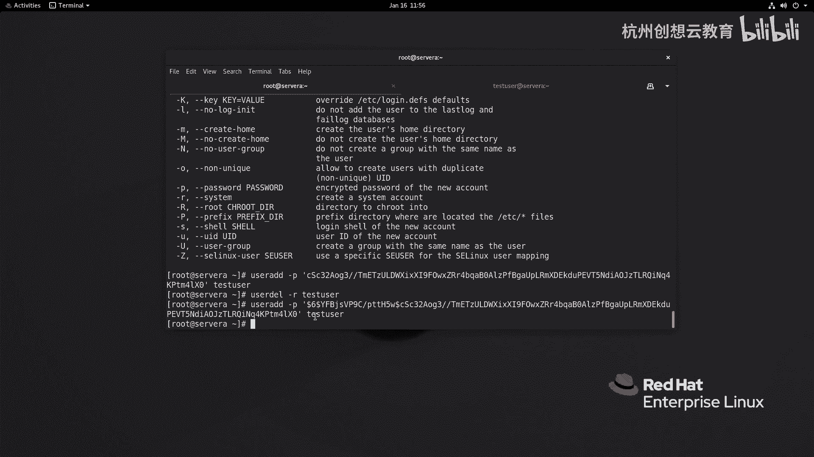
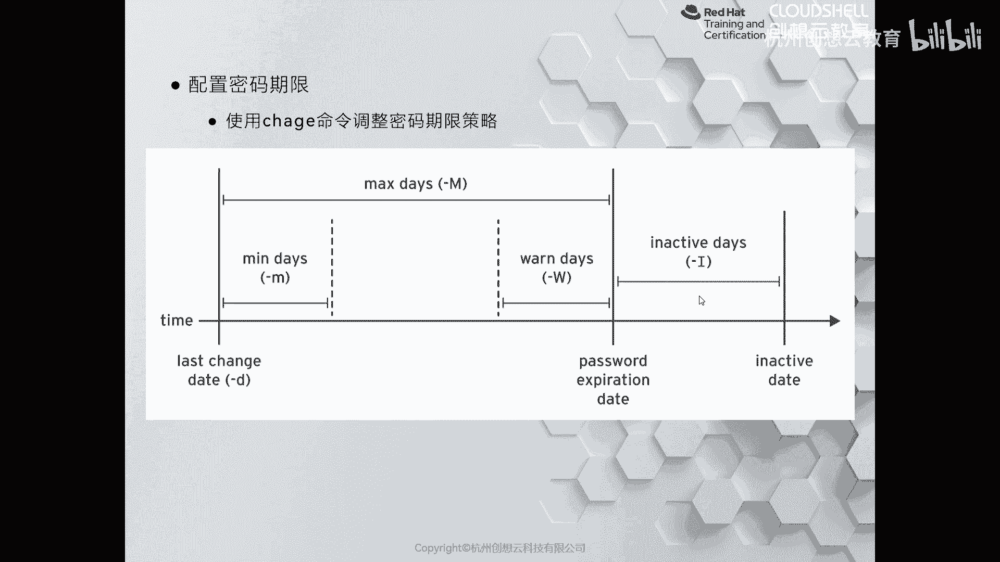
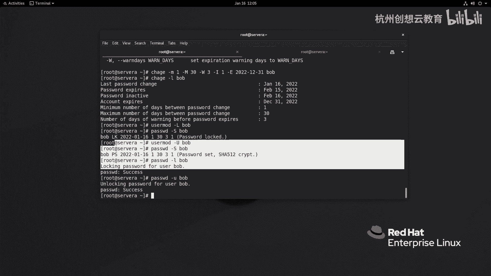

# 红帽认证系列工程师RHCE RH124-Chapter06：管理本地用户和组 - P5：06-5-管理本地用户和组-管理用户密码

## 📖 概述
在本节课程中，我们将学习如何管理Linux系统中本地用户的密码。内容包括设置初始密码、查看密码状态、修改密码策略、理解密码存储文件`/etc/shadow`的结构，以及使用相关命令锁定、解锁用户账户。

---

## 🔑 设置与查看用户密码
上一节我们学习了如何添加用户。在添加用户时，默认情况下没有设置密码，这意味着用户无法登录系统。我们可以使用`passwd`命令为用户设置初始密码。

### 使用`passwd`命令
`passwd`命令最常用于更改用户密码。可以使用`passwd --help`查看其简要说明。

**示例：为bob用户设置密码**
```bash
passwd bob
```
系统会提示输入并确认新密码。

### 查看密码状态
使用`passwd`命令的`-S`选项可以查看用户账户的密码状态信息。

**示例：查看bob用户的密码状态**
```bash
passwd -S bob
```
输出可能类似：`bob PS 2022-01-16 0 99999 7 -1`。其中：
*   `PS` 表示密码已设置。
*   `2022-01-16` 是最近一次修改密码的日期。
*   第一个`0`表示密码可随时更改（最短修改间隔）。
*   `99999`表示密码永不过期（最长有效期）。
*   `7`表示密码过期前7天发出警告。
*   `-1`表示密码过期后账户不会被禁用。

这些默认值通常不符合安全策略，我们可以进行修改。

---

## ⚙️ 修改默认密码策略
默认的密码策略由`/etc/login.defs`文件控制。修改此文件只会对之后创建的新用户生效。

**文件位置与关键参数**
```bash
vim /etc/login.defs
```
在文件第25行和26行附近，可以找到以下参数：
*   `PASS_MIN_DAYS 0`：密码最短使用天数（0表示可随时更改）。
*   `PASS_MAX_DAYS 99999`：密码最长使用天数。
*   `PASS_WARN_AGE 7`：密码过期前警告天数。

**修改示例**
将`PASS_MIN_DAYS`改为`1`，`PASS_MAX_DAYS`改为`30`，意味着新用户设置密码后，至少1天后才能再次修改，并且密码有效期为30天。

---

## 🤖 非交互式设置密码
在脚本或初始化时，可能需要非交互式地设置密码。可以使用`echo`命令结合`passwd`的`--stdin`选项。

**命令格式**
```bash
echo "你的密码" | passwd --stdin 用户名
```
**示例：为natasha用户设置密码**
```bash
echo "redhat" | passwd --stdin natasha
```
设置后，使用`passwd -S natasha`查看，会发现密码策略已应用新值（如最短修改间隔变为1天）。

此时切换到natasha用户并尝试立即修改密码，系统会提示需要等待。

---

## 📁 密码存储文件`/etc/shadow`
早期用户密码存储在`/etc/passwd`中，出于安全考虑，现在加密密码单独存储在`/etc/shadow`文件中。该文件权限为`---------`，只有root用户可以查看。

**查看shadow文件**
```bash
sudo cat /etc/shadow
```
输出格式为用冒号分隔的多个字段，例如：
`root:$6$xyz...$abc...:19080:0:99999:7:::`

### 各字段含义详解
以下是`/etc/shadow`文件中每一列的含义：

1.  **登录名**：用户名。
2.  **加密密码**：格式为`$id$salt$encrypted`。
    *   `$id`：加密算法标识（1=MD5, 5=SHA-256, **6=SHA-512**）。
    *   `$salt`：加密使用的“盐值”，增加破解难度。
    *   `$encrypted`：加盐后密码的哈希值。
3.  **最近更改日期**：从1970年1月1日到上次修改密码的天数。
4.  **最小间隔**：密码更改后，至少需要经过的天数才能再次更改。
5.  **最大间隔**：密码有效的最大天数。
6.  **警告期**：密码过期前，提前多少天开始警告用户。
7.  **不活动期**：密码过期后，账户还可以登录的宽限天数。
8.  **失效日期**：从1970年1月1日起，账户被禁用的天数。
9.  **保留字段**。



### 验证密码哈希
可以使用`openssl`验证密码哈希的生成。

**示例：验证student用户的密码**
假设已知student的密码是“student”，且从`/etc/shadow`中获取其盐值和哈希。
```bash
openssl passwd -6 -salt <盐值> student
```
生成的哈希值应与`/etc/shadow`文件中student记录的第二字段（`$6$<盐值>$<哈希值>`）后半部分一致。

### 使用加密密码创建用户
`useradd`命令的`-p`选项允许直接使用加密后的密码字符串创建用户。

**命令格式**
```bash
useradd -p ‘$6$<盐值>$<哈希值>’ 用户名
```
**示例**
```bash
useradd -p ‘$6$xyz...$abc...’ testuser
```
这样创建的用户testuser，其密码即为生成该哈希的原密码。

---

## 🛠️ 使用`chage`管理用户密码策略
对于已存在的用户，可以使用`chage`命令修改其密码策略，它会直接作用于`/etc/shadow`文件。

### 常用选项
*   `-d 0`：将“最近更改日期”设为0，强制用户下次登录时必须更改密码。
*   `-m 天数`：设置密码**最短**使用天数。
*   `-M 天数`：设置密码**最长**使用天数。
*   `-W 天数`：设置密码过期前**警告**天数。
*   `-I 天数`：设置密码过期后账户**不活动**（宽限）天数。
*   `-E 日期`：设置账户的**绝对失效日期**（格式：YYYY-MM-DD）。
*   `-l`：列出用户的详细密码策略信息。



**示例：全面修改bob用户的密码策略**
```bash
chage -m 1 -M 30 -W 3 -I 1 -E 2022-12-31 bob
```
这条命令将bob用户的策略设置为：改密后至少1天才能再改，密码30天后过期，过期前3天警告，过期后给予1天宽限期，账户在2022年12月31日失效。

使用`chage -l bob`可以查看修改后的详细信息。

---

## 🔒 锁定与解锁用户账户
有时需要临时禁止用户登录，可以通过锁定账户或密码来实现。

### 锁定账户（推荐）
使用`usermod`命令的`-L`选项锁定账户，`-U`选项解锁。这会在`/etc/shadow`的密码字段前添加`!`。

**锁定bob账户**
```bash
usermod -L bob
```
**解锁bob账户**
```bash
usermod -U bob
```
锁定后，即使用户输入正确密码也无法登录。

### 锁定密码
使用`passwd`命令的`-l`选项锁定密码，`-u`选项解锁。效果与`usermod`类似。

**锁定bob的密码**
```bash
passwd -l bob
```
**解锁bob的密码**
```bash
passwd -u bob
```

### 彻底禁止登录
若要彻底禁止用户登录（即使通过其他方式如SSH密钥），可以将其登录shell改为`/sbin/nologin`。
```bash
usermod -s /sbin/nologin bob
```

---



## 📝 总结
本节课我们一起学习了Linux本地用户密码的核心管理知识。我们掌握了使用`passwd`命令设置和查看密码，了解了密码策略文件`/etc/login.defs`的作用，并学会了非交互式设置密码的方法。我们深入剖析了密码存储文件`/etc/shadow`的结构和每个字段的含义。最后，我们学习了使用`chage`命令灵活管理现有用户的密码策略，以及使用`usermod`和`passwd`命令锁定、解锁用户账户的方法。这些技能是系统用户安全管理的基础。