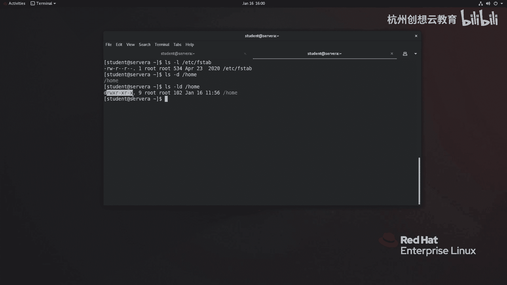

# 红帽认证系列工程师RHCE RH124-Chapter07-控制对文件的访问 - P1：07-1-控制对文件的访问-解释Linux文件系统权限 - 杭州创想云教育 - BV1h14y1t7Ds

啊，第C章啊控制对文件的访问啊，那么在我们整个红帽的系统管理这门课程的呃整个这个教材当中呢，我们在讲权限的时候呢，会涉及到三种权限啊，那么分别是基本权限啊，特殊权限，还有一个叫做ACL的啊管理方式。

那么其中在本章节当中呢，就会涉及到刚才提到的前两种啊，OK那么我们来看一下这一章啊，它的整个的培训目标啊。那么这一章呢要求大家呢就是啊了解啊我们如何呢去列出文件啊目录啊，这些呢权限啊，并且呢。啊。

去看懂这些权限代表了什么含义啊，那么这些权限呢到底对我们的用户啊和组能够产生什么的影响啊，当我们理解之后呀，就可以选择合适的工具啊，去更改文件目录的什么呀所有者啊，所属组啊或者权限等等。啊。

然后呢我们也会给大家介绍呀，在我们的lininux当中有一些命令啊，有一些目录啊，还有一些这个啊比较特殊的权限啊，那么会产生一些特殊的影响。好，那么我们首先呢来看第一小节。

第一小节的话呢是来介绍一下关于如何呢去查看权限啊，以及这些权限呀，都代表了什么的意思。O那么在linkux当中呢，那么在使用啊权限管理的命令的时候呀，那么我们会发现啊，其实这个命令非常简单啊。

非常的简单。那么管理方法也非常灵活啊，直接呢啊有些简简单的一个条这个规则去遵循就可以了啊，遵循就可以了。OK那么当我们使用命令啊，叫L啊，我们最常的呢就是L。那么L的话呢去查看一个文件的时候。

啊，去查看一个文件的时候呢，会查一个这样的效果啊。那么以我现在打印出来的这个内容为例啊，那么这个权限呀就是我们IOS里面第一列啊第一列第一列第一列的话呢，我们又把它分成若干部分啊。

那么去除第一个位置和最后一个位置。那么剩下剩下的这个空间呀，就是存放的是我们的权限信息。O权限信息。那么这些权限信息呢又一分为三啊，一分为3啊，那么。第一段啊这里的RW啊一个大使。

则代表的是该文件的所有者的权限。然后呢，接着啊接着第二个三个位置啊，就R两个大使，那则对应的是该文件的什么呀？所属组对应的权限。而最后的这个位置呢则代表的是什么呀？代表的是啊这个该系统当中。

其他的成员啊，有什么样对应的权限啊。首先所以说呢在我们linkux里面判断权限是最简单的。啊，你可以直接呢通过权限从左到右的顺序呢去判断啊去判断。从左到右啊。

那么优先级呢就是先去判断用户的啊这个文件的所有者用户信息。接着呢再去判断他的什么呀？所属组啊，最后呢去判断其他人OK那么你像我们这里呢体现的只是用户和什么呀，和他的所属组。但是事实上啊。

我们姓当中的用户的这个关系呢相对来说会复杂那么一点点。你看这个图。

比如说呢我这里那个有个用户呢叫jo啊，应该叫dojo啊。那么这个用户呢，那么它属于自己的组之外呢，它还属于是web组啊，web组OK而这个什么alison呢，艾ison呢他不仅属于自己组织外。

还属于will组，也属于什么呀web组。那么他们就有一个共同的组部分web。那如果我想让什么呀？后面我在管理的时候呀，我希望呢对该两个用户呢都去开放某个权权限的时候，那么完全呢可以给他赋予什么呀？

这个组就即可啊即可OK啊，那么我们刚才呢在。

终端里面啊看到的这个RW啊什么的，或者我们后面还会看到一些其他的权限。比如说。啊，这个我们加1个LD啊LD那么看到这个目录呢，还有一个什么X的权限啊，那么这种这个这里呢两个地方啊。

那么共同的部分就是相相重叠啊，那么我们看到内容呢就是RW和X啊，那么这三个呢就是我们的所谓的权限位了啊，权限位了。那么这个权限都代表什么含义呢？O啊，我们来接着看我们的PPT啊。

那么如果啊如果我们看到一个文件啊拥有这些权限的时候呢，我们是这样来理解的。如果看到它有R的权限，那么就意味着呢该用户啊对这个文件呀拥有读取的权利啊。那如果是R是W呢则代表呢可以修改文件的内容啊。

甚至删除该文件都是可以的。而X则很少见到，为什么呢？因为X呀代表的是执行权限。如果我们编写了一个是要脚本或者其他类型的脚本，我们会把这个文件呀增加一个X权限。如果啊不是。

那么就像说常规文件呀啊配置文件呀等等啊，我们是不不用加这个X的O那么对于目录而言呢，又稍微有一点点的变化。O那么R权限呢则代表的是列出目录里面的内容，那，就是说我看一看啊。

这个目录里面包含了哪些的别的文件，哪些别的目录啊，去这样去看一看O那么第二个W呢则代表对文件这个目录本身呀，对这个目录本身啊有什么样的一个管理权限，是是修改名字删除还是什么的对吧？

那么也可以呢在这个目录里面呀新建或删除新的文件O。但是要想让保证啊保证你的用户或组对这个目录拥有R权限，或者是RW权限，必须要结合谁呀？X。X为什么呢？因为X呢则代表的是用户或主进入目录的基本权限。

OK所以我们在看到一个目录的时候呀，它要么没权限，如果有它里面一定会带有X，所以会出现什么呀？没有权限RX或者是RWX那绝对没有啊，不包含X的这种情况出现。那么大家一定要注意OK一定要注意。

那么我们再看一个文件或目录权限的时候呢，就用L杠L就足够了啊。那么如果想看目录自己一定要别忘了加一个DOK好，那么我们再回过头呀，看看我们刚才的这个指令啊，我们就能分析出来什么意思了。

比如说这里的ETC线的FSt就代表了他的所有者root用户拥有读写的权利。而对于他的组成员，root组成员呢也拥有什么呀？只读的权利。而其他人呢是只读的OK然后呢，下面的这个呢是home目录啊。

那么对于root用户而言，那么拥有读写的权利。那，这个X呢可以省略不翻译啊，然后呢，对于它的所属组成员呢是只读的，其他人呢也是只读的。O这个呢就是如何去查看权限以及去解释权限内容。

