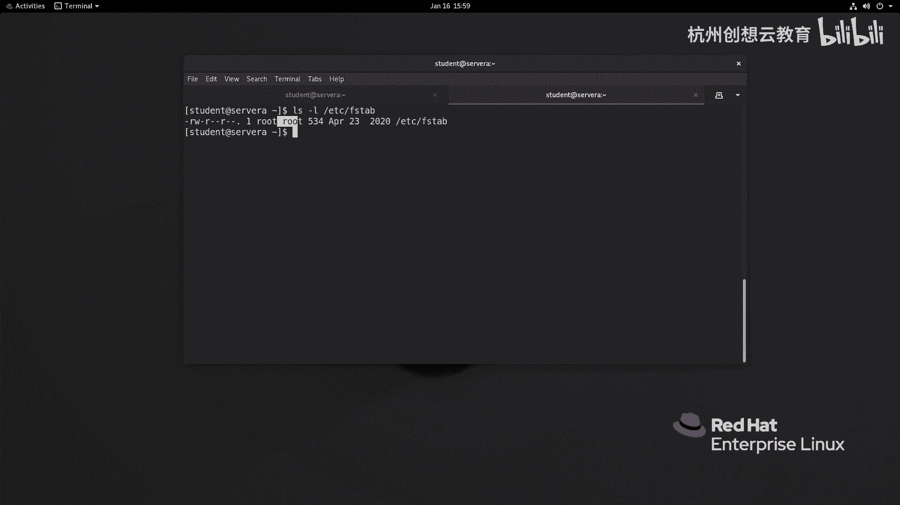
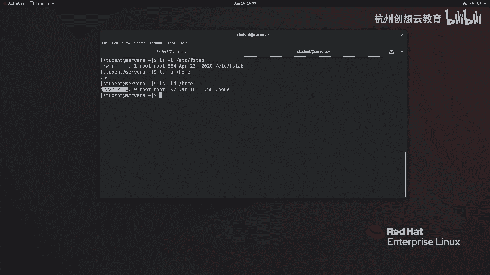
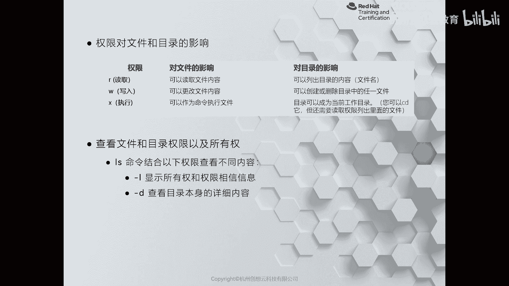
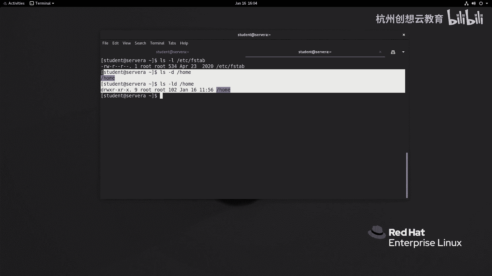

# 红帽认证系列工程师RHCE RH124-Chapter07-控制对文件的访问：07-1：解释Linux文件系统权限 🔐

在本节课程中，我们将学习如何查看和理解Linux系统中的文件与目录权限。理解权限是系统管理的基础，它决定了用户和组对系统资源的访问能力。

## 概述
Linux系统通过一套简洁而灵活的权限机制来保护文件和目录。本节将介绍如何查看这些权限，并解释权限位所代表的含义。

## 查看文件权限
要查看文件或目录的详细权限信息，最常用的命令是 `ls -l`。


执行该命令后，输出结果的第一列包含了权限信息。我们以一个典型的输出为例进行说明。

```
-rw-r--r--. 1 root root 0 Aug 21 10:00 example.txt
drwxr-xr-x. 2 root root 4096 Aug 21 10:00 example_dir
```

权限字符串（如 `-rw-r--r--`）可以分解为几个部分。第一个字符表示文件类型（`-` 代表普通文件，`d` 代表目录）。剩余的九个字符每三个为一组，分别代表**文件所有者**、**文件所属组**和**其他用户**的权限。



权限判断遵循从左到右的优先级：先判断所有者，再判断所属组，最后判断其他用户。

## 权限位的含义
权限位由三个基本字符构成：`r` (read)、`w` (write)、`x` (execute)。它们对文件和目录的意义有所不同。


以下是每个权限位的具体含义：



**对于文件：**
*   **`r` (读取)**：允许查看文件内容。
*   **`w` (写入)**：允许修改文件内容，或删除该文件。
*   **`x` (执行)**：允许将文件作为程序或脚本执行。

**对于目录：**
*   **`r` (读取)**：允许列出目录内的文件和子目录名称。
*   **`w` (写入)**：允许在目录内创建、删除或重命名文件和子目录。
*   **`x` (执行)**：允许进入该目录，这是访问目录内任何内容（包括使用 `r` 和 `w` 权限）的前提。

对于目录而言，`x`（执行）权限是基础。一个目录可能拥有 `r-x` 或 `rwx` 权限，但绝不会出现仅有 `r` 或 `rw` 而没有 `x` 的情况，因为那样将无法进入目录。

## 权限示例分析
现在，让我们分析之前 `ls -l` 命令输出的两个例子。

*   **文件 `example.txt` (`-rw-r--r--`)**
    *   所有者 `root` 拥有读写权限 (`rw-`)。
    *   所属组 `root` 组拥有只读权限 (`r--`)。
    *   其他用户拥有只读权限 (`r--`)。



*   **目录 `example_dir` (`drwxr-xr-x`)**
    *   所有者 `root` 拥有读、写、执行权限 (`rwx`)，可以完全管理此目录。
    *   所属组 `root` 组拥有读和执行权限 (`r-x`)，可以列出目录内容并进入。
    *   其他用户拥有读和执行权限 (`r-x`)，同样可以列出目录内容并进入。



## 总结
本节课我们一起学习了Linux文件系统权限的基础知识。我们掌握了如何使用 `ls -l` 命令查看权限，并理解了 `r`、`w`、`x` 这三个权限位对文件和目录的不同意义。正确解读权限是后续进行权限更改和管理的基础。在下一节中，我们将学习如何使用命令来修改这些权限。