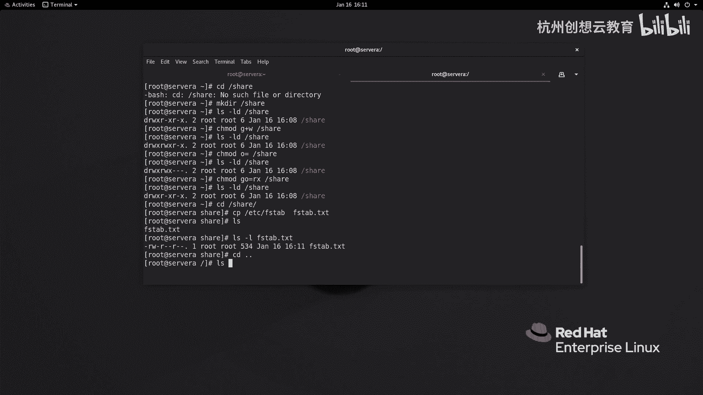
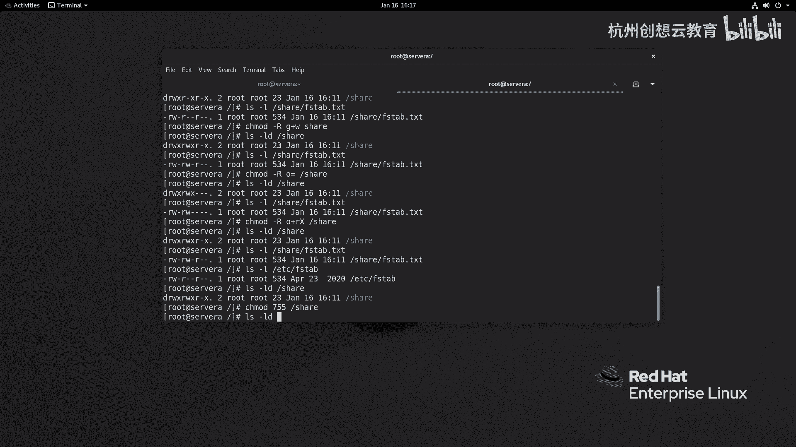
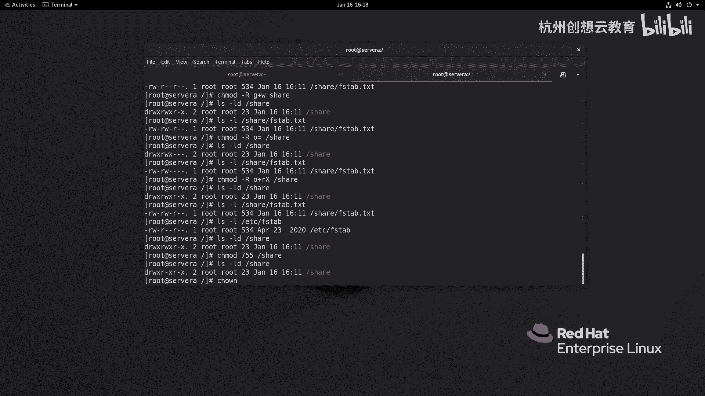
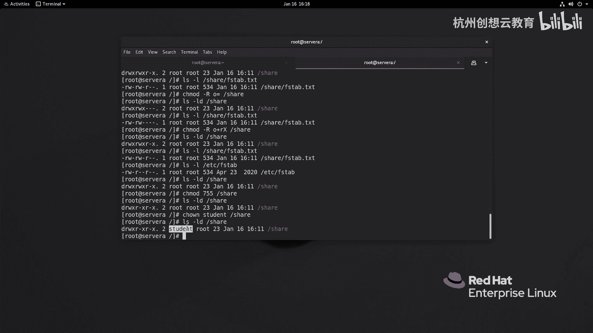
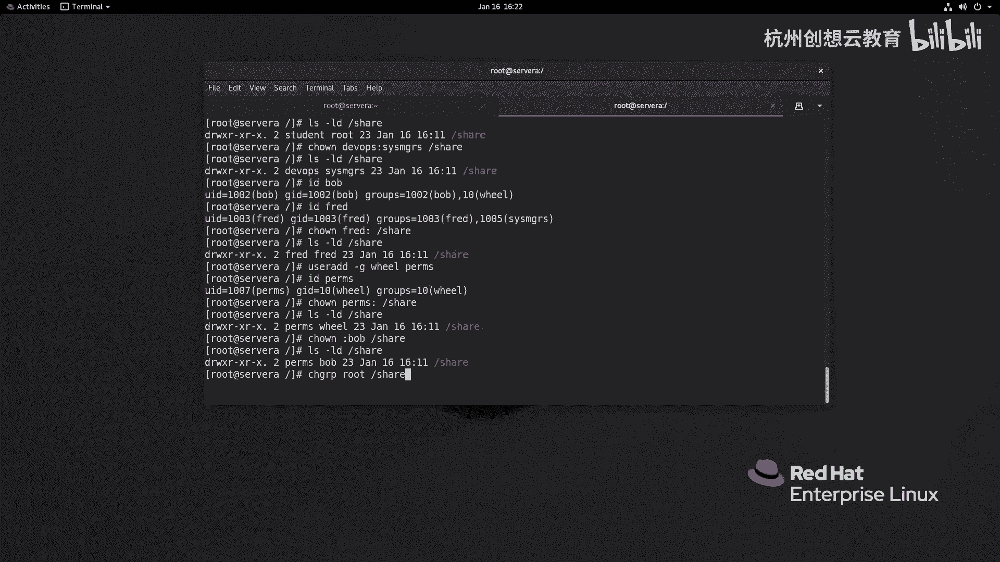
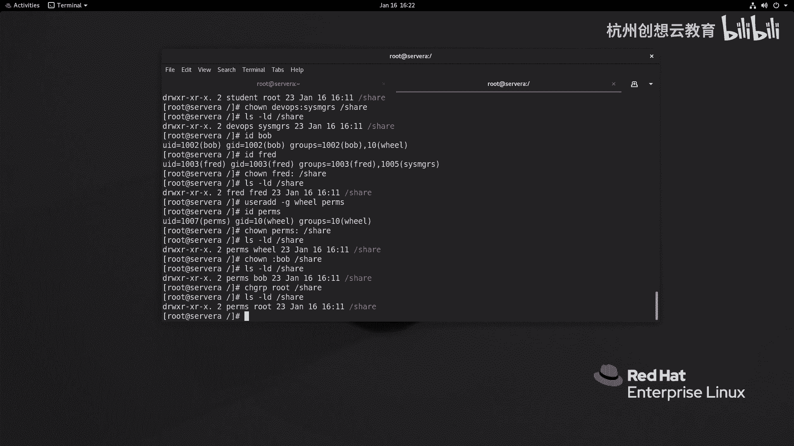

# 红帽认证系列工程师RHCE RH124-Chapter07-控制对文件的访问 - P2：07-2-控制对文件的访问-从命令行管理文件系统权限 - 杭州创想云教育 - BV1h14y1t7Ds

好，第二节的话呢是讲的如何呢通过命令行的方式来更改我们文件或者是目录的权限。那么我们在改在改这个文件的权限的时候呀，我们会用到一个叫做CHMOD的命令。那其实呢就是change mode的英文缩写。

OK。那么我们在更改文件或目录权限的同时呢，有两种语法结构。第一种呢我们称之为是符号法。第二种呢就称之为什么呀数值法。而对于符号法而言，它的整个的命令呢结构呢是这个样子啊，CHMOD啊空格啊。

whowhat和which啊，后面跟上你要更改的文件或者是目录即可。其中这里的ho呀分别代表的谁呢？user用户。groupG啊组。o other其他人。那如果你在管理权限的时候呢。

涉及到了系统当中的每一个用户呀，也可以使用A来代替啊。并且呢A呢呃一般呀我们会省略不写啊，省略不写。O然后呢，第二个呢是谁呢？是what。what命令的话呢，是一个可以理解为是一种什么呀？是一种动作啊。

是用动作，那么分别代表了加号啊，增加什么权限。啊，减号代表是删除什么权限，如果是等于号呢，则代表的是精确设置啊。我不担心你以前的权是如何，我要啊设置为什么什么样子。第三个呢。

which则代表是我们的权限位啊RW和X啊。好，那现在呢给大家举个例子啊，举个例子，比如说呢我现在呢去创建一个目录啊，目录啊，我去创建在哪里呢？创建在根目录下面好了。叫做啊叫做什么呢？

叫做share啊共享。打共享。OK然后呢，我现在呢希望这个共享目录呀啊怎么呢？哎，我希望呀这个它的组呢是读写和执行，我们先去看一看它原来的权限位。那么对于这个目录而言，它的原本的权限呢是什么呀？

是这个对于所有者呀，是读写和执行所有组呢是是直读的啊，我现在呢希望它组呀是读写，那就可以走一个叫做CHMODho谁呢？组呀，干嘛呀？要增它我要增加变为RWX，那相比较而言，现在是RX少了什么呀？

少了W是吧？那我就可以增加一个W。然后呢，再跟上我的目录。我们再来观察一下这个权限。啊，会发现哎就增加了一个打入权限。啊，当众权。那我现在呢想发现呢这个实验目录呀，对于其他人而言是只读的。

但是我不希望啊我并不希望这个其他人对这个目录呢有制度权限。哎，我可以走一个CHMD那我这一次来个猛一点的，好吧，我想来一个什么，其他人没有权限O等于。没有权限，什么都不写啊，跟上一个目录。

接着呢我们再来看一看。哎权限就去去取消掉了。啊，就取消掉了。OK好，那么我再来一个命令啊，我现在呢要把这个权限呀恢复成默认的状态啊，就最初的状态。那我就可以使用什么CHMOD啊，那么U不变。

那就不用写了。G呢是什么呀？读和执行啊，那么其他人呢也是读和执行。哎，那我为什么合并在一起呢，哎，我就可以这样来写了。G和O等于个RX啊，斜杠是。我们来看一看。哎，我们的权限呢就恢复正常了。

OK会不会正常的啊，接着呢我们再来演示一个东西啊。假如说呢我现在呀来到了这个适验目录里面。啊，来到这个实验目录里面，来到这个实验目录里面之后呀，我呢呃想在这里呢创建一个文件好吧，我就创建个什么文件呢？

我把这个ETC呀的FSt呢拷贝过来一份啊，叫做什么呢？叫做这个FSTAB啊，点TST啊加后缀好吧？好，然后呢有了，那么这个文件的权限呢是多少呢？是呃644啊，这是我们马上讲的内容啊，就是对用户而言呢。

是读写的啊，这个所属组和其他人而言呢，是只读的啊，然后呢，我现在呀我现在呢回退到上一级我现在要干嘛呢？我希望啊。

我又希望啊对于他的组成员呢有这个写的权利啊，我们怎么做啊？呃，现在的话呢我们的这个目录。啊，目录啊，这个和文件的权限呢都还正常还正常还正常。OK那么我增加一个只只读，那我就可以干嘛呀？写个G加一个W。

然后呢加上一个大写的字母R，代表递归啊，后面跟上我的文件名即可。好，我们来检查一下。啊，哎，可以了。那么接着呢我有一个要求啊，我有个什么要求呢？

我现在呀要求呢这个share目录和FSt呀都没有开放对企他人的权利。那么就是这目的啊CHMOD杠R那么O呢没有权利啊，跟上我们的share。同样这个方法呢也容易实现。好，那么问题来了。

我现在呢要求给目录增加一个只读的权限。同样文件呢也增加一个只读权限。那么就意味着我们在给目录增加的时候呀，需要这样来写，叫O等于个2X。对不对？这是目录的。啊，但我没有执行。那么对于文件而言呀。

我就需要执执行的是O等于R就可以了。啊，R就可以了，走两条命令可以啊。如果这里面有很多个文件很多个子目录的话，那么我们就意味着需要重复执行很多次这样的命令，那反而显得有点不太不太好了。那怎么办呢？

这时候呢我们就可以这样做了啊，CHMOD啊杠R。那O啊OO什么呀？O这个增加1个2X吧。啊，增加2X增加的时候呀，这个你会发现这个X呢是大写的啊，大写什么意思呢？大写就代表呀，当它发现是个目录的时候。

哎，我给你增加一个X。当你这个文件的时候呢，哎我就不给你增加X。这样的话呢就可以避免刚才出现的问题。啊，而文件是正常的。啊，文件是正常的OK这是CHMOD的用法。好。

那么接着呢我们再来看这个啊数字的用法。那么数字用法的话呢，它的语法结构呢是CHO目的，后面跟上三位的数值啊，然后呢再后面呢跟上我们的参数啊，文件或者是目录。那么这里的参数是怎么算的呢？

那么大家还记得刚才我们说那个IOS命令的时候呢，有一个这样的一个一个一个信息啊。那么我们可以通过LOS杠L哎去发现一个文件的权限。那么权限位啊一共是9位啊，9位分成3啊33这样一个过程。

那么每个地每每三个段呀都代表是啊用户所属组或者其他人的权利。那么我们就通过啊把这个所有者或所属组或其他人的权限呢合并成一起，用述值的方式求和啊，那么其中。我们的X呢则代表的是二的0次方。啊。

二的0次方OK那么。W这个权限呢则代表的是什么呀？二的1次方。啊，一次方。那么R这个权限呢则是二的2次方，就意味着如果啊针对于某个用户。换某个组。啊，拥有具体权限的时候呢。

我们就把有权限的地方进行求和即可啊即可。你像我这里呢有一个权限的叫RWX，那就是2的2次方。加二的1次方，再加二的0次方，最终呢就是谁呀？二的2次方呢？R呢是4W呢是谁呀？是2。

而X权向位呢是一求和等于7。所以说呢我们刚才呀这个看到的这个文件，你像这个文件，那么测权限呢就是多少呢？是二的2次方增加加谁呀，加这个二的1次方。6吧然后第二个权项位啊是只有一个R，那是二的1次方了。

那是2。啊，6啊sorry啊，只读啊是4啊2的2次方是4啊。那么其他人呢同样也是4。因此，针对于ETC线的FS tab这个问件，它的权限呀，我们可以描述为是644啊。

644O因此我们通过这个数值也可以用来管理。比如说啊比如说我们的share这个目录的权限呢已经被我们改成了啊，这个另外一个情况啊，能变成多少呢？变成7对吧？4加2加17啊，775了啊，775了。

那现在呢我想把这个目录呢恢复成原样权限，就变成CH目的啊，原来是多少呀？原来是只有这个只有这个所有者呀，是读写和执行而所属组还有其他人呢是只读的，因此就变成755。

啊，我们来看一下。

哎，就变成这个样子了。OK好，这是CHMD啊CHMD。那么但是呢我们现在呢发现呀我只能改这个文件或目录的权限，但是我却没有办法呀啊这个实现一些其子功能。比如说哎我希望啊希望这个ssM加R这个组呀。

对这个文目录呢也同样具备一个读写的权限。啊，基本一下，那这个我们刚才的命令是没有办法的那怎么办呢？这时候呀我们就可以使用这个命令了。啊，叫做谁呀？叫做CHOWN啊。

这个命令呢可以协助我们来更改文件或目录的所有权啊，就所有者其实应该严格意义来说啊，就是所有的啊这个用户啊或者组啊所有的权利OK好，那么它的语法呢最标准的用法呢，就是啊CHMOD啊。

后面跟上你的用户信息就可以了。比如说我要更改的是student，后面跟上一个目录或者文件。

然后呢，哎我们这个目录呀，它的所有者就变成了student。

那么这里呢有一个更高级的用法可以用来延伸，就是CHOWNA冒号B什么意思呢？这个冒号的左边呀是组的名称啊，sorry呀，这个冒号左边呢是我们的用户的名称。冒号右边呢是我们的组的名称啊。

那么CHOWN呢这代表的是同时更改文件的所有者和所属组。好，我们来演示一下这个命令。好，那么MS杠LDshare。那么现在呢走个命令叫CHOWN啊，写个DVOPS冒号CM什么呀？GRS。好。

我们来看一看。那么我们的目录呢就被改的啊，同时满足刚才的要求啊，就是所有者呢是deops啊，所有组呢是s measuresok那么接着呢还有一个隐申啊，一个隐身，那就是CHOWA冒号啊。

这个是什么意思呢？这个代表的是呀，我更改文件或目录的所有者的同时。将该文件或目录的所属组啊改为A用户的主要组。啊，好，我不知道大家有没有听明白啊，我再我再大家举个例子，那么我可以这样做。

比如说举个例子啊，我呢去看一下我的报勃。bo勃用户的主要组呢是bo勃。然后呢，freed呢。fed主要组的也是frreed。那么我们现在改可能看不出来有什么大的变化，我们来试一下啊嗯fred。

冒号后面跟上视影。哎，组啊都是free的。那么接着呢我再增加个新用户，叫user id叫什么呢？叫做唉叫做什么呀？叫做。PRMS好了。但是呢我在增加的时候呢，我去指定它的主要组啊，我给他改改个主要组。

我把它的主要组呀指的是谁呢？是will这个成员。啊，V要。啊，然后呢我们再来看一下P点pro这个用户pro这个用户的话呢，它的主要组啊和自己的名字不一样啊，我们用它来演示CHOWN啊。

PRMS冒号斜杠石影。回车啊，我们来观察一下。你发现啊所有者是pers，然后呢，所有组呢就是我们该用户的主要组。啊，主要组。啊，那么这是两个延伸啊，第三个延伸呢就是CHOW冒号跟上一个B啊。

那这个B代表的是我们的组啊，就相当于可以使用啊CHOWA啊，更改我们的什么呀组啊，更改我们的组OK好，那现在我去走一下命令啊，走个命令来更改我们的组啊。怎么更改呢？CHOWN啊，后面跟上组名称。

我改一个叫做bo抱啊，包括报抱前面加一个冒号啊，斜杠视影。好，我们来看一下。哎，我们的组呢就发生了变化。OK好，那么这是CHOWN啊，那如果你觉得这个命令啊。功能啊非常丰富啊，但是呢不够简洁。

我只想改一个文件或组的所有所属组啊，我不想这么花里胡哨，对吧？哎，你可以使用CHGRP命令啊，这个单纯的呢去改所属组啊，单纯的去改所属组好，我们来走一个命令啊，那么现在呢这个目录呀被bo勃所拥有了。

我就写一个CHGRP。跟上组的名称啊，我这里改成root组好了啊，share回车啊，检查一下。

哎，我们的组呢就改过来了。

