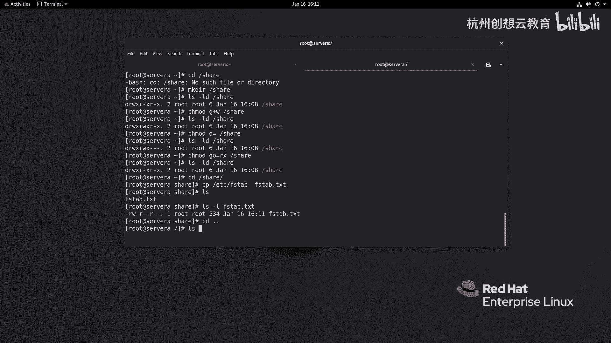
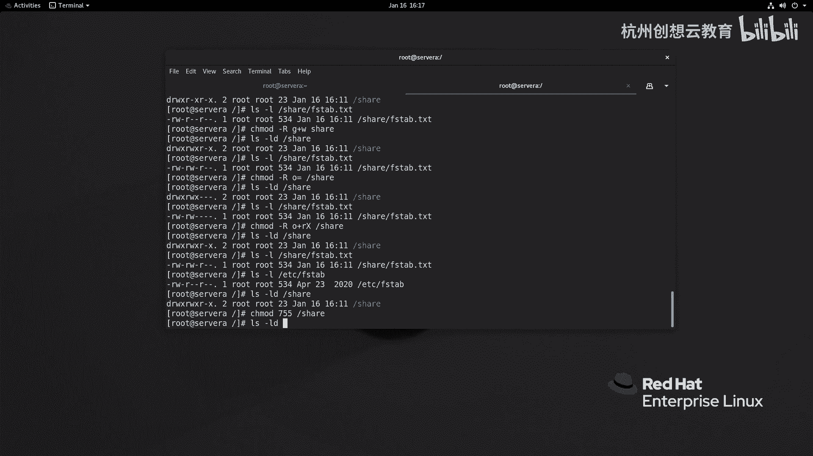
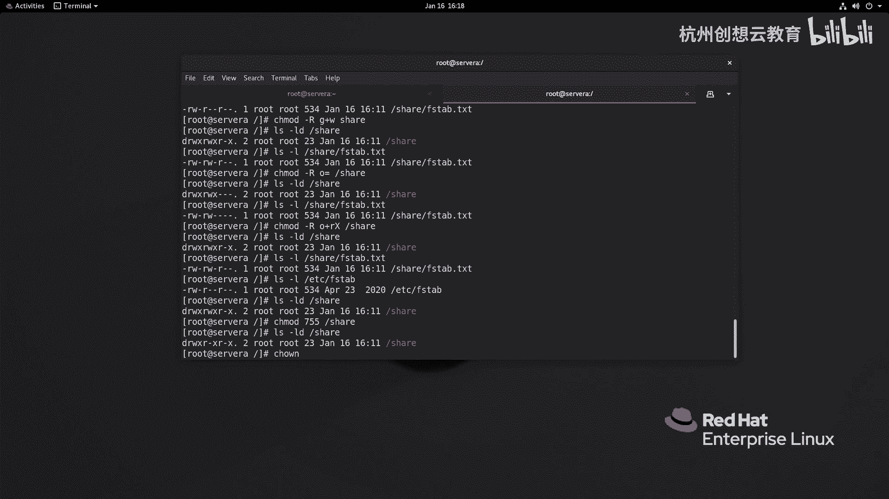
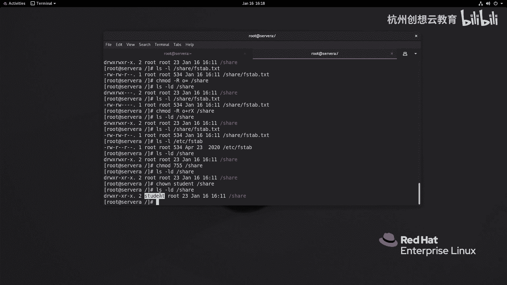
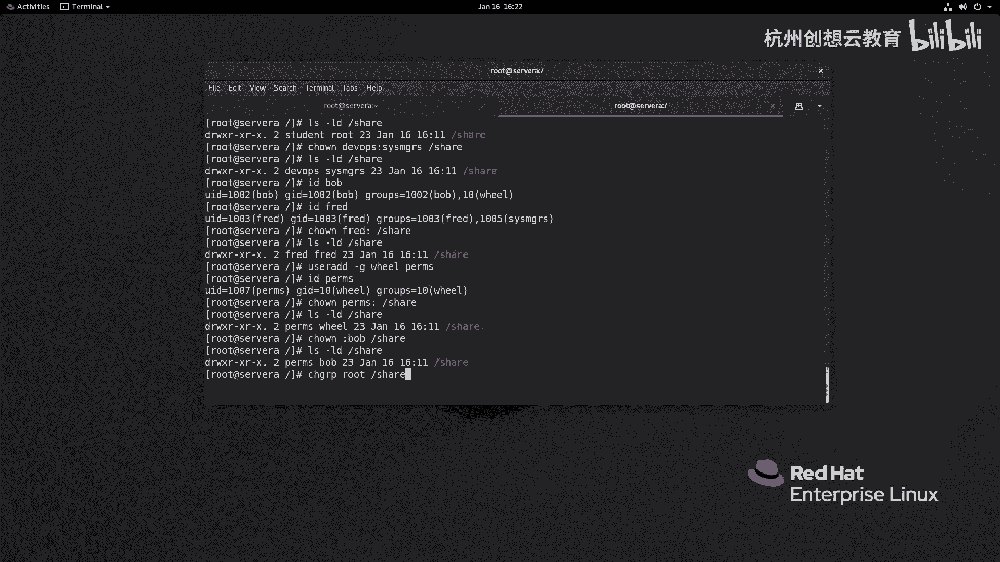
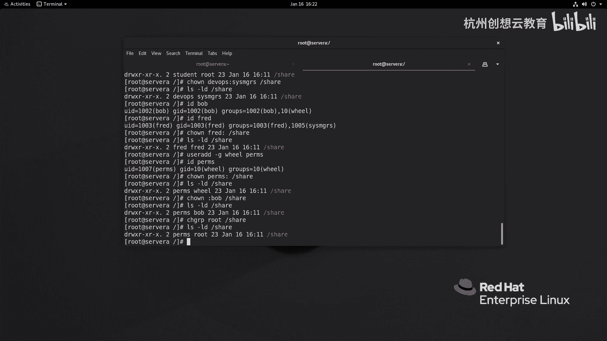

# 红帽认证系列工程师RHCE RH124-Chapter07-控制对文件的访问：07-2：从命令行管理文件系统权限 🔧

在本节中，我们将学习如何通过命令行来更改文件或目录的权限。我们将重点介绍两个核心命令：`chmod` 用于修改权限，`chown` 和 `chgrp` 用于修改所有权。课程将涵盖符号法和数值法两种权限管理方式，并通过实例演示其应用。

## 使用 `chmod` 命令更改权限

`chmod` 是 “change mode” 的缩写，用于修改文件或目录的访问权限。它有两种主要的语法结构：符号法和数值法。

### 符号法

符号法使用字母和符号来指定权限的更改。其基本命令结构如下：

```
chmod [who][what][which] file_or_directory
```

以下是各部分的含义：

*   **who**：指定权限作用的对象。
    *   `u`：用户（所有者）
    *   `g`：组
    *   `o`：其他人
    *   `a`：所有人（通常可以省略）
*   **what**：指定要执行的操作。
    *   `+`：增加权限
    *   `-`：删除权限
    *   `=`：精确设置权限（覆盖原有权限）
*   **which**：指定具体的权限。
    *   `r`：读
    * `w`：写
    * `x`：执行

现在，我们通过一个例子来演示符号法的使用。首先，在根目录下创建一个名为 `share` 的目录。

```bash
mkdir /share
```

使用 `ls -ld` 命令查看其默认权限。

```bash
ls -ld /share
```

假设默认权限是 `drwxr-xr-x`（所有者有读、写、执行权限，组和其他人只有读和执行权限）。如果我们希望为组增加写（`w`）权限，可以执行：

```bash
chmod g+w /share
```

再次查看权限，会发现组权限已变为 `rwx`。

如果我们希望完全移除其他人（`o`）的所有权限，可以执行：

```bash
chmod o= /share
```



要将权限恢复为最初的 `drwxr-xr-x` 状态，可以一次性为组（`g`）和其他人（`o`）设置读和执行权限：

```bash
chmod go=rx /share
```

### 递归更改权限

当需要同时更改目录及其内部所有文件和子目录的权限时，需要使用 `-R` 选项（递归）。

进入 `/share` 目录并创建一个测试文件：

```bash
cd /share
cp /etc/fstab fstab.test
```

现在，我们希望为 `fstab.test` 文件的所有组增加写权限。可以执行：

```bash
chmod g+w fstab.test
```

如果希望为整个 `/share` 目录及其所有内容移除其他人的所有权限，可以执行：

```bash
chmod -R o= /share
```

### 处理目录与文件的差异

目录需要执行（`x`）权限才能进入，而普通文件通常不需要。如果使用 `chmod -R o+x /share` 为所有内容添加执行权限，文件也会被错误地赋予执行权限。

为了解决这个问题，可以使用大写的 `X`。它表示：仅当目标是一个目录，或者目标文件已经对任意用户拥有执行权限时，才赋予执行权限。这样可以安全地为目录树添加进入权限：

```bash
chmod -R o+X /share
```

## 数值法

数值法使用三位八进制数字来代表权限，每位数字是 `r`、`w`、`x` 权限值的和。

*   `r` (读) = 4 (2²)
*   `w` (写) = 2 (2¹)
*   `x` (执行) = 1 (2⁰)

计算方式为：将拥有的权限对应的数值相加。
例如：
*   `rwx` = 4 + 2 + 1 = **7**
*   `rw-` = 4 + 2 + 0 = **6**
*   `r-x` = 4 + 0 + 1 = **5**
*   `r--` = 4 + 0 + 0 = **4**




因此，一个权限为 `rw-r--r--` 的文件，其数值表示为 **644**（用户=6，组=4，其他人=4）。

使用数值法更改权限的命令格式为：

```
chmod [numeric_mode] file_or_directory
```

例如，将 `/share` 目录的权限设置为 `drwxr-xr-x`（755）：

```bash
chmod 755 /share
```



## 使用 `chown` 命令更改所有权




`chown` 命令用于更改文件或目录的所有者（用户）和/或所属组。

### 基本用法

更改文件的所有者为 `student`：

```bash
chown student /share
```

### 同时更改所有者和所属组

使用 `用户:组` 的格式可以同时更改两者。例如，将 `/share` 的所有者改为 `devops`，所属组改为 `sysadmins`：

```bash
chown devops:sysadmins /share
```

### 特殊用法

*   `chown :组名 文件`：仅更改文件的所属组。
    ```bash
    chown :root /share
    ```
*   `chown 用户: 文件`：更改文件所有者为指定用户，并将其所属组改为该用户的主要组。
    ```bash
    chown fred: /share
    ```

## 使用 `chgrp` 命令更改所属组

如果只想更改所属组，可以使用更简洁的 `chgrp` 命令。

```bash
chgrp root /share
```

## 总结

本节课我们一起学习了从命令行管理文件系统权限的核心操作。



1.  我们介绍了 `chmod` 命令的两种用法：**符号法**（直观，适合精细调整）和**数值法**（快捷，适合批量设置）。
2.  我们学习了如何使用 `-R` 选项进行递归权限更改，并了解了使用大写的 `X` 来智能处理目录与文件执行权限的差异。
3.  我们掌握了 `chown` 命令，用于更改文件或目录的所有者和所属组，包括其多种语法格式。
4.  最后，我们了解了专门的 `chgrp` 命令，用于快速更改所属组。



通过灵活组合这些命令，你可以有效地控制Linux系统中文件和目录的访问权限。