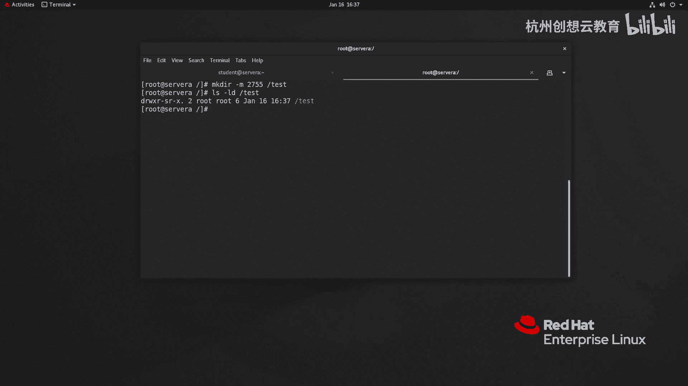

# 红帽认证系列工程师RHCE RH124-Chapter07-控制对文件的访问 - P3：07-3-控制对文件的访问-管理默认权限和文件访问 - 杭州创想云教育 - BV1h14y1t7Ds

好我们来看第三节啊，管理默认权限和文件的访问啊，那么我们刚才呀通过cs和目的啊，c h o w n和c h g r p呢来实现了更改文件的权限，所有者和所有组啊，那么改完之后呢。

我们是可以通过一系列的方法呢去测试的。

比如说我们现在呢就是有一个呢组，你看我们这个啊它的组成员呀是这个是root，ok我们再给它先改一改好吧，我把它改成will啊，will。

那么will的话呢这个组啊c h g r p c h g r p我去改一改，因为will组成员的比较多啊，我改一下，那么改完之后呢，我这里呢去再给他增加一个权限啊，我允许组呀是读写和执行的。

然后呢我去测试一下好吧，那么其中student的用户属于will组啊，我就切换到student好，然后呢来到shares里面去创建文件好，说目录好了，make a dr这个private。

然后呢private申请好了，然后呢我们去看一下这个prevent目录，按目录目录的话呢，这个特组呀还是变成了谁呀，变成了student这个组啊，并且我们能够在这个目录里面创建。

但是我创建完这个目录之后，那么对于啊其他的v要组成员而言，就变成了其他人了，就说其他的组成联呀，要想来到这个pvt组里面啊，去戳那个东西，哎不行哎不行，ok那么这时候就需要我们的特殊权限了啊。

就需要我们特殊权限了，ok好我们来看一下特殊权限到底是什么东西。

那么特殊权限呢在我们这个linux里面呀，有三种，分别叫做s u i d，s g i d和static，其中s u i d呢这种权限呢我们是在前面我们用的是好几次了已经，但是呢我们没有感觉到啊。

感觉到为什么没有感觉到呢，因为我们一切是那么顺利对吧好，我们来举个例子。

大家就明白了，那我现在呢切换为root，大家还记得有一个文件叫做shadow吗，筛到这个文件呀，它对于系统当中的所有用户呢都是没有权限的，注意在linux里面啊。

你像这个文件虽然呢对root设置的是没有权限，但是root用户要想去改这个文件内容是可以的啊，我给大家举个例子啊，这个例子呢只做演示，啊我现在呢我去去编辑这个etc下的shadow。

然后呢在这个shadow里面啊，我干嘛呢，我把这个pm那个删掉啊，我不删，老家出事吧啊注释，你看它会提示警告正在更改一个只读的文件，但我是谁呀，我root呀，我不听我不听是吧，冒号q啊，保存并退出。

加感叹号强制啊强制ok然后呢我们再打开看一看是不是保存成功了，哎绑定成功了好，对于如何用户来说是不生效的，那么为什么说这个不生效呢，大家还记得这个命令吗。

pass等于d pass dd呢是可以用来更改用户的密码的，并且呢允许普通用户修改自己的密码，而密码呢正式存放到了我们的shadow里面，也就意味着啊。

我们的普通用户可以通过pass wd这个命令去修改一个，原本自己连看都没有权利去看的一个文件，ok那么问题出现在哪里呢，其实这个地方呀就出现在了我们的pass dd上面。

我们来看一下pass wd的权限到底多少，那么我用了一个命令置换啊，呃，sorry啊，我应该少了个东西啊，你这种情况怎么办啊，我们输入一个reset回车即可啊，那么刚才的命令啊少了东西啊。

那么少的时间少了位置，位置的话呢可以帮助我们查找我们的命令所在的位置，那么这个命令的权限呀，我们来看一看啊，那么你会发现在他的权相位里面的第一列啊，第三大列的位置啊，那么写了一个r r w s对吧。

这里是rw s啊，那么权限的话呢，按照我们之前的写法都占满了，那就是七这个地方没占满，少了个w那就是五，其他人呢同样没有w，那也说过就是青木五，但是这里呢有有s啊，这就是我们刚才提到的sd。

那么x y g的功能呢就是我们p p t上的解释啊，那么以拥有文件的用户身份，而不是运行文件用户的身份去执行，什么意思呢，就是说在我们的linux里面呀。

当你使用一个命令执行的时候呢，它是以当前用户的身份去执行的，ok那么比如说啊，比如说我现在切换到谁呀，student，那么student的用户啊去创建一个文件，那么这个文件的所有者呀就一定是谁呀。

就一定是我们的student用户，啊就一定是私人用户，这是正常的，但是呢我给这个这个命令啊，增加那个s y d之后，我不管是用户还是bob，他在使用这个命令的时候呀，都是以root的身份去执行的。

ok那么因此就能解释的通，为什么普通用户可以改自己的密码了，那么是不是这样子呢，我们来验证一下怎么验证啊，因为现在的这个touch命令啊，你看执行之后显示的结果呀，属于是student。

那么我去看一看这个touch命令权限是多少，那他是75年，然后我现在把这个命令也增加一个s u i d，那么如何给一个命令增加一个s u i d呢，命令的语法c h m o d u加s。

啊其实这样也可以对吧，好，我们来检查一下是不是和pass wd就一样了，然后呀我们用普通用户呢再去创建文件叫什么呀，234第二天4t我们来做个对比，那我们来看一看啊，那么123所有者student。

234所有者root，这就是s y d的神奇的地方，s y d呢我们可以使用啊数字四来代替你，像我们的这样一个权限啊，那么原本的应该是多少呢，是755的，对不对，现在就变成谁了呀，变成了475多的一位。

第一位啊，权限的正常来说呢一共是四位啊，第一位是特殊选项位，专门留给特殊选项位的啊，后面三位是给基本权限的，两部分不能混合在一起啊，一定要独立出来啊，4755，那如何去取消呢。

那么我就可以通过这样一个方式取消，既然是你是4755，那么我增加的时候呢是u加s，那取消呢就是u减s，同时啊我也可以啊，我也可以使用四连篇，目地多少呢，四星五五，大家看效果是不是一样的效果。

那么我把它取消掉呢，把这个四呀写成零，或者说空缺不写都可以恢复为原样，这是s u i d。

那么s y d的话呢，我们一个注意事项就是它只针对于二进制可执行的文件，但是呢对于目录来说没有任何的意义，ok没有任何意义，好接着呢我们来说谁呀，s g i d。

那么sgi d的话也可以作用在我们的命令上面，那么它的效果呀和s u i d呢是差不多的，只不过呢是以该命令的所属组身份去执行啊，我们这个呢就不再举例了，那么你要想给一个命令增加一个s g i d啊。

那么就是什么g加s这样的一个命令，ok g加s，那么我们一般用的更多的呀，反而是对目录本身啊，那么对目录的话呢是什么意思呢，就是我们如果呀对一个目录增加了一个s jd的话，那么在该目录下面啊。

无论是谁新建的子目录都会自动继承父目录的所属权，好我们来感受一下什么意思。

那么我们现在呀现在呀看一看我们的sheer这个目录，shell目录呢属于v r组，那么刚才呀我在这个实验目录下呢，又创建了一个谁呀，创建一个private，那么而这个private的话呢，测权限呀。

亚特组呀变成了student，这并非我本意啊，因为我最希望的是看到的就是这个private这个组呀，所有组会和物流组一样，这样的话就方便了呀，我就没有必要为了这个新建的目录再去改它的所属组啊，所有组啊。

因此呢我给这个我给这个目录呀增加一个s g d，那么就是g加s，这时候呢我们来看一下这个目录，那么在它的所有组合全位增加了一个啊，s ok那么接着呢我去创建一个新的目录啊，叫在share下面。

我去创建目录叫做music，然后呢我们去观察一下这个music，你会发现它的组和share的所属组是一模一样的，那这就是s i d s u i d呢。

我们也同样可以使用啊g减s的方式来取消我们的s加i d，或者使用二进制数值二来代替，那就是c hmd啊，这个2755啊，跟上我们的目录，那就增加了谁呀，s，gd那取消呢。

同样我们把这个2a换成零或者省略不写即可，啊即可，啊就即可啊，那么同时呢我们也可以啊，也可以什么呢，也可以通过这个啊在创建目录的时候来指定啊，mc第二杠m2755 啊。

增加这个二后面跟上一个目录叫什么呀，叫做test，来我们来看一下这个目录是不是具备了s gd好，接着呢我们来看第三种啊。

叫做什么呀，叫做真之位啊，翻译过来叫真志伟，叫做o加t，就说我们的c h m o d呢可以通过o加t的方式来增加，那么增加呢只针对的是目录唉目录，那么这个当中我们系统里面是有的就是tap目录。

那么增加之后呢，只允许该目录下的所有者来删除啊，就说我在time下面创建文件，谁想删都能删吗，不是的啊，只有该文件的所有者生存去删，那么为什么会这个样子呢。

为什么呢，因为我们的tap这个目录呢，它比较特殊啊，它是一个临时的目录啊，那么就意味着系统当中的所有用户啊，都有可能在目录下面什么生成缓存数据，临时数据，那么为了保证大家都能够去写去读。

因此呢我只能把temp呢增加为七七，加完气之后呢，也就意味着任何人呀可能会彼此误身出去，那么为了避免这种情况，我给这个目录呢增加一个正值危增加站，之为通过cg目的o加t方式来实现的，当然了。

不需要我们管理，因为这个目录在装系统的时候呀，就我们配好了啊，配好了，那么我们来举个例子，比如说呢我现在呢切换到student，我来到tap里面，去创建一个文件叫做remove me。

并且呀我把这个文件权限改为777啊，很暴力好吧，很暴力，那么就意味着呢大家都可以去删除这个文件，理论上来说啊，我们在不忽略附目录有专职位的情况下，然后呢我这边啊换成谁呀，换成这个我们的dev ops。

然后呢来到type里面，我把这个remove me啊，看能不能删除掉权限拒绝，为什么呢，因为这个文件呀不是我们这个divs身份的去创建的啊，常常见的ok这就是占着位啊，作用在目录上面叫做tap。

这个目录上面我们一般不用管理啊，那你如果有自己定义的目录呢，可以通过cs目的o加t的方式来管理，那么占着位用数字是一，所以说呀对于我们tep这个目录本身而言，那么测权限呢我们可以描述为是1777。

177o好，这是三个特殊权位啊，那么因此呀我们的我们的特殊权限的要么是s y d自己，要么是s y d呢，可以s e g i d结合，其他就没有组合情况了，不可能出现有s u i d和s j d。

还有什么s b i t同时具备的，不可能啊，不存不存在啊，不存在，ok好，那么这是我们的特殊权限位，接着呢我们再来说一说什么呀，默认文件权限，那么什么是默认权限呢。

我们在无论是任何用户在新建文件或目的时候呀，我们会发现我们并没有做任何的权限管理，它都有一个初始权限，那么这个初始权限呢我们就称为是一个默认权限，我们可以通过you mask这个命令来查看。

好那么我们来看一看我们的普通用户啊，普通用户叫谁呢，叫做dio ops，它的默认权限多少，you mask是0002对吧，那是四位，四位002就什么意思呢，就是我们要反着来算啊，最高权限是777。

那么现在呢是多少呀，是002，我们不考虑特选位啊，那么002，那么002的话题减了这边没多少的775，那么就意味着我们的普通用户的创建目录的权限呢是775，再减去啊。

目录比文件多的一个执行权限就变成了664，所以说呢普通用户在创建文件的时候，它的权限呢是664，而root用户，啊root用户它的mask指的是022，那么777减去个022，90多少呀，是755。

所以说呀root用户新建的目录权限呢是755，减去目录比文件多的执行权限就变成了多少呀，64，因此root用户新建的文件权限是64，好我们来试一下，那么我们来到op，我们来到camp里面吧。

啊我用root身份创建一个文件叫做什么呢，叫做read me gbt，我们来看一看，64普通用户，我们来一次是看它是不是664，啊664哎，就是这样效果。

而这个you mask默认呢已经在我们系统当中配好了啊，配好了呃，我记得是在我们的profile里面，我们来搜一搜好吧，grape啊，your mask etc下面的啊，这个profile哎。

you mask好，我们打开看一看到底是怎么写的好吧，啊他这里呢写了一个if判断语句啊，它判断如果我们的用户的uid大于199，并且用户的gid和uid相同的情况下。

那么就把它you mask值分配的是002，如果不是满足的条件，那么它的you mask值呢就是022，那么而我们普通用户呀正式大于了199，所以它的mask质量是002，而root用户呢小于199。

所以说是022，那么如果呀我们想想让用户的初始权限啊起作用，那么就可以通过这种方法去改，那么一种方法呢就是修改啊这个配置文件，一种呢是在用户家目录里面去构建。

那么还有一种呢就是临时的把临时的我先演示个临时的，比如说我的mask值呢是002呀，我现在想把它变成合数的一样，022022，ok那么我在创建文件试一试啊，创建在哪里呢，加目录里面七个叫做啊叫做123。

第2t s t我们来看一看是不是和路子一样，变成644了，你看644是不是可以，但这种只对针对当前绘画是有效的，一旦重启或者换了终端就没有了，那么我们可以呢写在哪里呢，写在这里加个目录。

下面一个点儿r c写在这里就可以了，或者写呢写在下面的profile里面都可以啊，一般我们都写在by 12 c里面了，好那么我可以这样写，写个谁呀，写个u mask空格零二唉，这样的话呀。

哪怕它重新登录了也不受影响，再去dv o p s at server a you mask，0r不会变吧，那么如果呀你想让性当中所有的用户都产生这样的效果，那么我们还可以啊。

这个模仿刚才的这个if判断语句，判断语句你去改呀，对不对，你你可以直接改这个啊，你可以直接改这个也可以干嘛呀，也可以呢，把你的配置呀放在profile给了目录下面，你自己起一个，比如写个local啊。

local谁呀，your mask。s h，注意啊，这个一定要加上一个均天线啊，好去写一句话，我把刚才那句话呢给它粘贴下来啊，我们去给它改一改好吧，大于等于多少呀，9998，我们改一改范围。

然后这个mask只能改成007啊，普通用户007啊，好保存并退出，我们来感受一下，看看能不能生效，因为profile里面有两个嘛，我们看哪个能生效啊，好s u got student，那一定要用登录。

you must 007是不是就变了，创建文件应该多少呀，是770，那就是660，660，ok这就是修改mask值啊。

