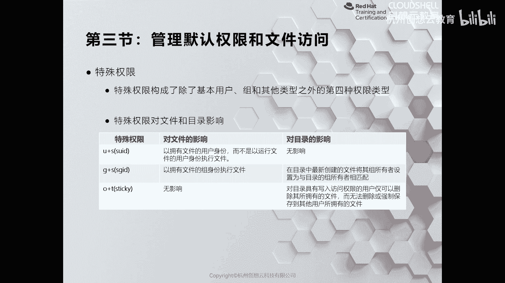
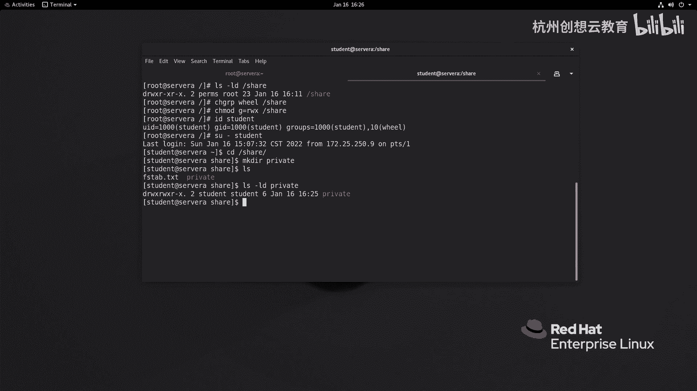
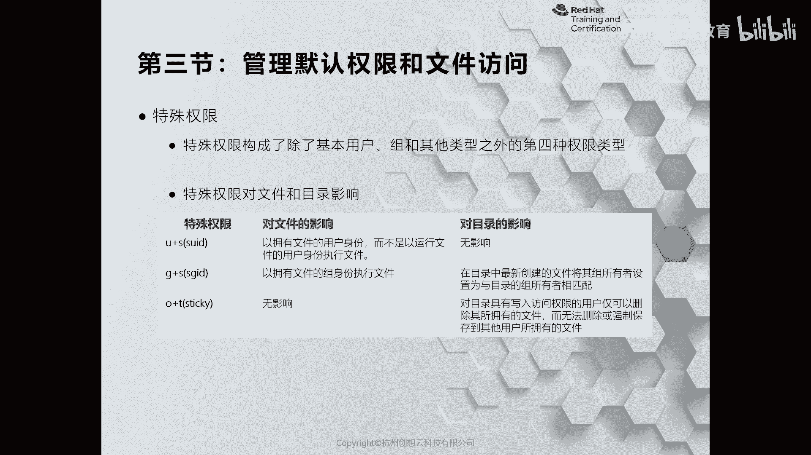
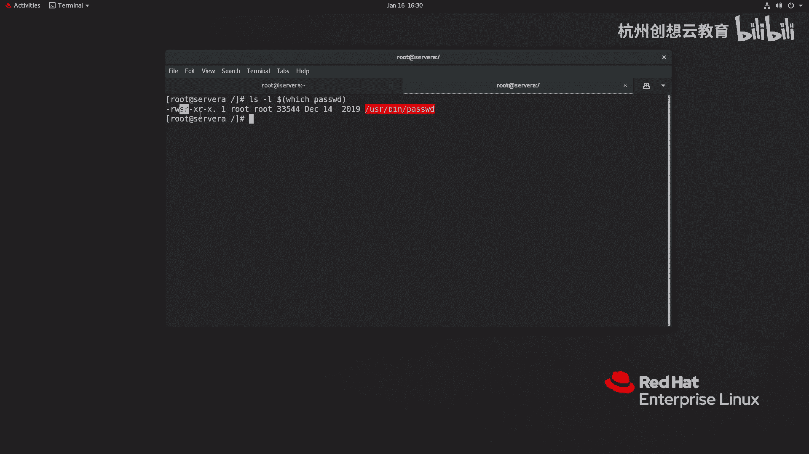
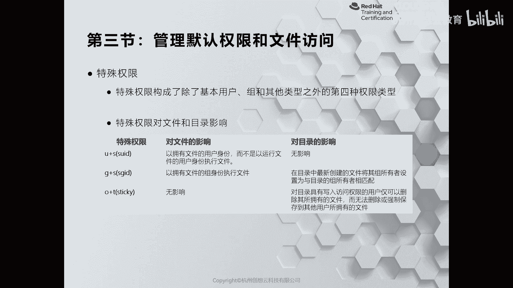
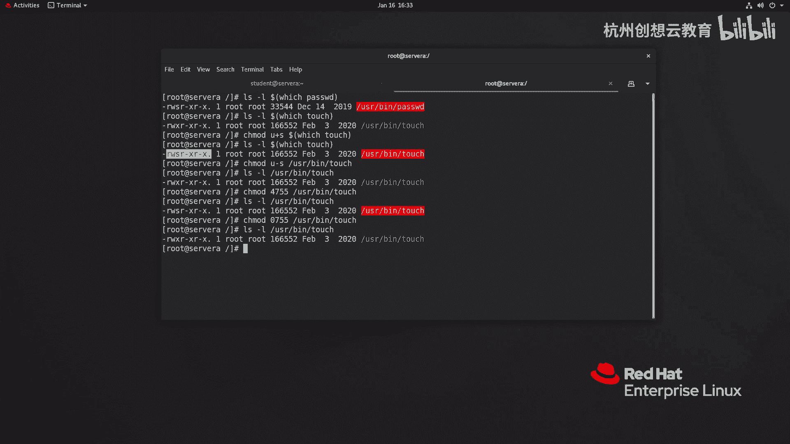
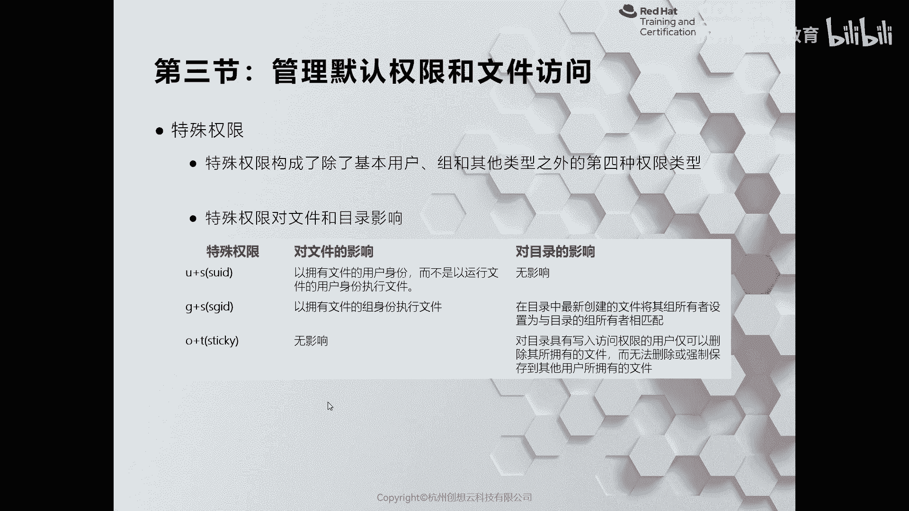
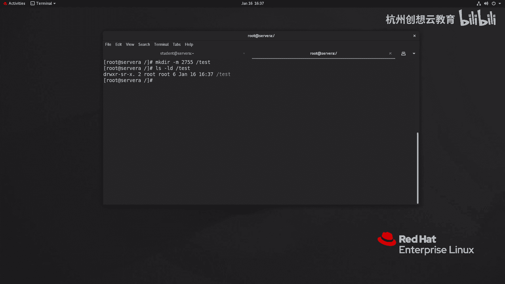
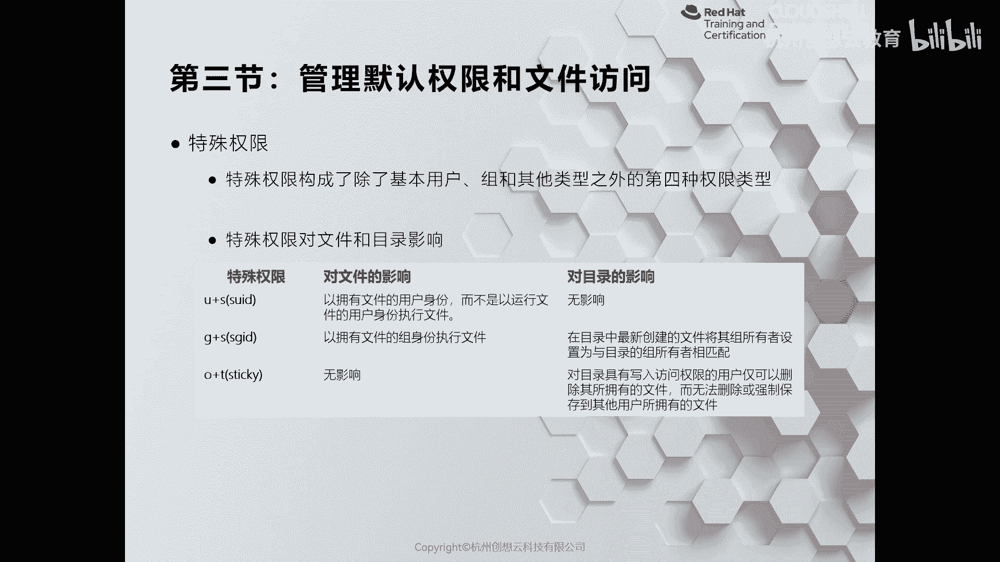
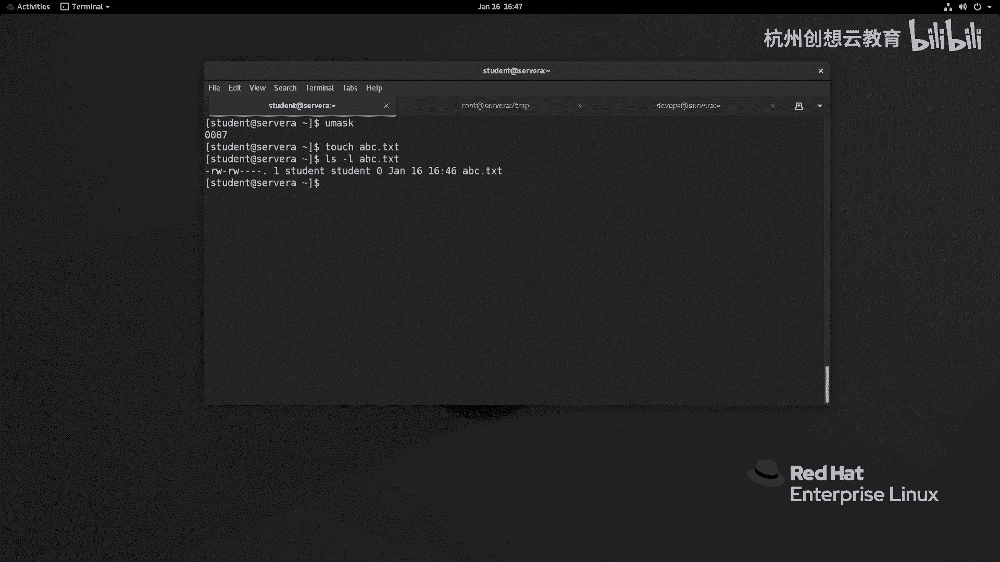

# 红帽认证系列工程师RHCE RH124-Chapter07-控制对文件的访问：07-3：管理默认权限和特殊访问权限



在本节课中，我们将要学习如何管理Linux系统中的默认权限，以及三种特殊的文件访问权限：SUID、SGID和粘滞位。这些知识对于精确控制文件和目录的访问行为至关重要。

上一节我们介绍了如何使用`chown`和`chgrp`命令更改文件的所有者和所属组。本节中，我们来看看如何设置默认权限以及使用特殊权限来解决更复杂的访问控制问题。





## 特殊权限概述

Linux系统中有三种特殊权限，它们可以赋予文件或目录超出常规读、写、执行权限的能力。这三种权限是：
*   **SUID**：设置用户ID。
*   **SGID**：设置组ID。
*   **粘滞位**：Sticky Bit。

## SUID权限

SUID权限通常设置在可执行文件上。当一个具有SUID权限的命令被执行时，该进程将以**文件所有者**的身份运行，而不是以执行命令的用户的身份运行。





一个典型的例子是`/usr/bin/passwd`命令。普通用户可以使用它修改自己的密码，而密码实际存储在`/etc/shadow`文件中，该文件对普通用户没有任何权限。这是因为`passwd`命令被设置了SUID，并以root身份执行，从而获得了修改`/etc/shadow`的权限。

**查看SUID权限：**
```bash
ls -l /usr/bin/passwd
```
输出中，所有者权限位的执行位（x）被替换为`s`，例如 `-rwsr-xr-x`。

**设置与取消SUID：**
*   使用符号模式：`chmod u+s 文件名`
*   使用数字模式：SUID对应的数字是**4**，放在常规权限数字之前。例如，`chmod 4755 文件名`。
*   取消SUID：`chmod u-s 文件名` 或 `chmod 0755 文件名`。

**注意事项：** SUID只对二进制可执行文件有意义，对目录无效。



## SGID权限



SGID权限可以设置在可执行文件或目录上。
*   **对文件**：效果与SUID类似，进程将以**文件所属组**的身份运行。
*   **对目录**：这是更常见的用法。在一个设置了SGID的目录中创建的任何新文件或子目录，其所属组将**自动继承该目录的所属组**，而不是创建者的默认组。

这在需要协作的共享目录中非常有用，可以确保所有新建文件都属于同一个工作组。

**设置与取消SGID：**
*   使用符号模式：`chmod g+s 目录名`
*   使用数字模式：SGID对应的数字是**2**。例如，`chmod 2755 目录名`。
*   取消SGID：`chmod g-s 目录名` 或 `chmod 0755 目录名`。



## 粘滞位



粘滞位只对目录有效。最常见的例子是系统的`/tmp`临时目录。当一个目录设置了粘滞位后，即使该目录权限是777（所有人可读、写、执行），也只有**文件的所有者**或**目录的所有者**才能删除或重命名该目录下的文件。

这防止了用户误删或恶意删除其他用户在公共目录中创建的文件。

**设置与取消粘滞位：**
*   使用符号模式：`chmod o+t 目录名`
*   使用数字模式：粘滞位对应的数字是**1**。例如，`chmod 1777 目录名`。
*   取消粘滞位：`chmod o-t 目录名` 或 `chmod 0777 目录名`。

## 管理默认权限：umask

当用户创建新文件或目录时，系统会赋予一个初始权限，这个初始权限由`umask`（用户掩码）值决定。`umask`定义了需要从默认权限中“屏蔽”掉的权限位。

**查看当前umask值：**
```bash
umask
```
对于普通用户，通常为`0002`；对于root用户，通常为`0022`。

**权限计算方式：**
*   **目录的默认权限**：`777 - umask`
*   **文件的默认权限**：`(777 - umask)`，再减去执行位（x）。因为新建文件通常不需要执行权限。

例如，umask为0022时：
*   新建目录权限：`777 - 022 = 755` (rwxr-xr-x)
*   新建文件权限：`755`减去所有执行位 = `644` (rw-r--r--)

**修改umask值：**
*   **临时修改**（仅当前会话有效）：`umask 新值`，如 `umask 027`。
*   **永久修改**：将`umask`命令添加到用户的shell配置文件中（如`~/.bashrc`）。
*   **系统级修改**：可以编辑`/etc/profile`或`/etc/bashrc`文件来为所有用户设置默认umask。

---



本节课中我们一起学习了Linux中的三种特殊权限（SUID、SGID、粘滞位）以及如何通过`umask`管理新建文件的默认权限。SUID和SGID通过改变执行进程的身份来突破常规权限限制，而粘滞位用于保护公共目录下的文件。理解并合理运用这些机制，可以构建更灵活、更安全的文件访问控制体系。