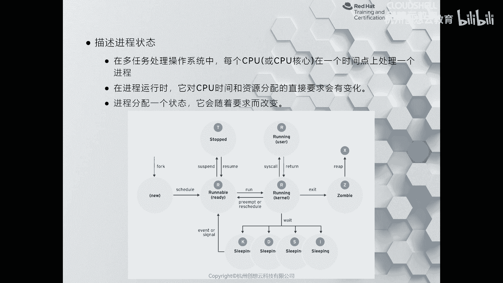
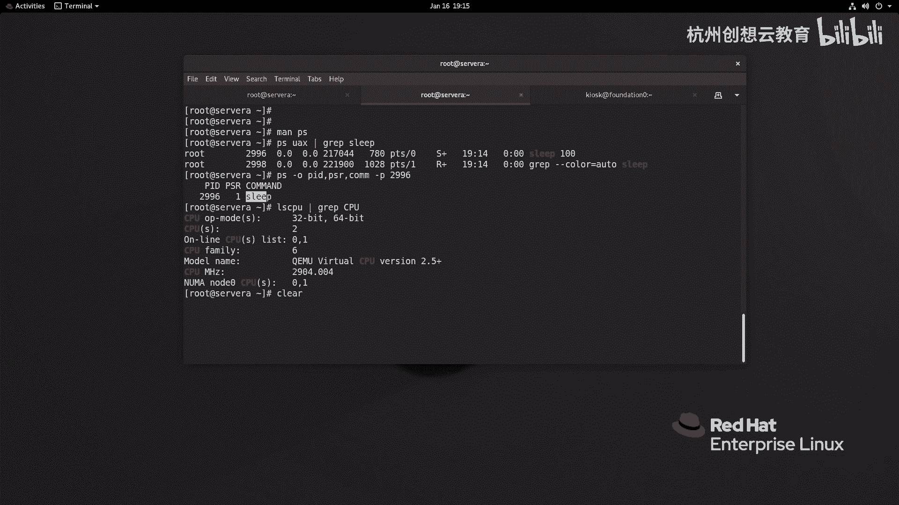

# 红帽认证系列工程师RHCE RH124-Chapter08-监控和管理Linux进程 - P1：08-1-监控和管理Linux进程-列出进程 - 杭州创想云教育 - BV1c14y1x7YQ

哎，第八章啊，监控和管理linux进程。那么这章的话呢，我们主要是啊学习如何呢去啊这个查看啊运行在系统上面进程的一些信息啊，比如说它的状态呀，它的这个资源的使用情况啊等等啊。

那么也可以呢啊了解如何呢在一个终端上啊，同时去执行多个啊任务啊，还有如何去控制这些任务啊，比如说啊某些任务是没有用的，我可以把它给干掉啊，以及还有如何通过一些命令啊，来查看我们的啊系统的负载情况啊。好。

我们来看第一小节。第一小节的话呢是讲的是什么呢？讲的是如何呢啊去查看我们的进程啊进程。那么要想去查看进程呢，首先我们要知道一下什么是进程，对吧？那么我们知道那么在我们的系统上面呀。

那么都可以安装一些应用程序啊，那么应用程序呢严格意义上来说呢，它是什么呀？它是我们存储在磁盘上面的一些可执行文件啊，当我们需要运行该程序的时候呢，我们的系统呢会把这个应用程序呢。啊，加载起来啊。

然后呢把它放在内存里面啊，然后呢通过啊对内核啊来调配CPU的资源啊，然后呢进行运算啊。那么这时候呢我们的程序的这个形态呀，就是一种我们把它称之为什么呀进程啊，进程，你可以理解为是进行当中的一个程序。

对吧？O那么进程都包含包含哪些信息呢？对于一个进程而言呀，那么我们又分为是单单线程和多线程的啊，那么。无论是哪一种啊，那么对于进程而言，它都会分配一个啊这个自己的地质空间啊，以及安全属性啊等等啊。

以及它的一个进程的状态啊。那么除此之外呢，还包括一些进程的环境变量啊，包括一些什么上下文的调度啊等等啊，都这些内容OK。呃，然后呢我们接着看张图啊，那么这张图的话呢来描绘了一个进程的啊生命周期啊。

那么左边呢这个process呢是我们的副进程啊，副进程。那什么是负进程呢？负进程的话呢就是我们系统当中啊。啊，在启动的时候呢，总有一个进先启的第一个进程呢是我们系统里面的所有进程的副进程。啊。

所有的附进程OK那么当我们远程到1个SH绘画的时候呢，那么这个SH绘画呀，就是你后面执行一些命令的副进程。OK那么他们之间都是有关系的。

或者说我们执行的所有命令啊都是beash的子禁程O那么副禁程呢通过fok函数啊，通过folk函数，然后呢去创建一个新的子禁程的一个结构。OK那么这时候的子禁程啊，这时候子禁程啊，它的无论存这个。

这个这个什么呀这个呃安全性啊，呃还是文件这个描如服呀、特权呀等等资源的使用情况啊，环境变量都是和我们的负近城是一模一样的啊，没有没有没有什么区别啊，没有什么区别。那么与此同时，我们的负金程啊就会干嘛呢？

就会这个。进入一个这个啊休眠的状态啊，休眠的状态。OK那么它这个信号呢叫wait啊叫wait一个信号请求啊，叫wait等待对吧？哎，那么是休眠状态啊，灰色的休眠状态。那么接着呢我们来往下看我们的紫禁程。

那么紫禁城拿到这个可以运行的地图空间呀，安全属用之后，通过exec函数啊，然后呢把自己的啊这个程序的代码呀加载进来啊，加载进来。那么然后呢开始执行。当它执行结束了啊，执行结束了。

那么紫禁程啊会关闭并且丢弃掉自己的资源和环境。啊，然后呢这个并给这个负进层呢发送个信号。那么负进程呢这时候。啊，这时候呢就会从休眠状态呢恢复正常。而我们的紫禁城啊，紫禁城在退出之后啊。

因为excel也是个函数嘛，在退出之后呀，如果啊如果我们的禁程没有释放干净，保留了一些资源没有释放掉。那么这时候呢，附禁城呢和这个紫禁城之间的关系呢已经被剥离了啊，已经没有了。

因为紫禁城在退出的在清理完自己之后呢，发送了一个excel函数，对吧？信号啊，但是那么附禁城就认为啊紫禁城啊你的任务完成了，对吧？那么这时候紫禁城啊。资进程啊，如果有多余的资源没有释放干净。

那么这个进程就会变成一个叫做江停进程啊，叫zble啊，这是一个进争的状态啊，进行状态。OK那么在我们的real期之后呀，我们的进程是谁呢？第一个进程是st D。那么在早期的时候呢。

我们的副进程第一个是in啊叫in it ok。啊，这是我们的这张图。那么接着呢我们再来看一张图啊，那么这张图的话描述了我们进程在各个时期的一个状态啊一个状态。啊，无论是我们要知道一件事情呢。

就是说无论是我们的CPU啊多厉害啊。那么在当前的操系统当中啊，当它在执行任务的时候，都是每个核心啊，在最短的时间内，如果我们把这个时间的片段把它缩放到最小的单位啊。

那么我们能看到啊这个CPU啊是一个任务，一个任务的去执行的啊，每个任务呢在它执行的这个时间段呢，我们称之为是时间片啊，时间片CPU的时间片O去执行。那么但是呢因为它执行的速度太快了，对吧？时间又太短了。

所以说对于这个应用层而言呢，我们看到呢它在同一时间呢在处理很多个任务啊，所以说是多任务啊，多任务O那么无论是哪种情况，那么CPU啊在分配资源的时候呢，我们的啊进程呢都是一种状态。

如果我们的CPU分配的资源正好能够给我们的进程的分配计算资源去使。用那我们的进程啊就会进入到运行状态。那如果我们的进程，我们CPU分配的资源还没有轮到它。

那么我们的进程啊就会进入到一个什么呀啊休眠状态啊，休眠状态，或者是进入到这个呃一个准备运行的一个阶段啊好我们来看这张图啊，这张图的话呢是一个子禁程的一个状态图，当我们的子禁程生成之后啊。

CPU通过调度啊，然后呢这个给它分配计算资源啊，那么如果这时候呢我们的进程啊正好拿到了计算资源，那么就会开始有reable，然后呢进入什么呀running状态啊，内核状态运行状态啊哎，这是这个过程。

当它执行完了啊，执行完了，那么内核状态，然后呢干嘛呀？通过系统调用啊，然后呢进入用户空间的运行状态。用空间结束之后呢，返回给内核一个运行状态那么最终呢结束啊结束啊，那如果出问题了就。停对吧？暂停是吧？

如果我们把进程呢给它关闭掉啊，这个服务呢没有运行，或者把这个系统关机了，断电了，那么进程呢都会进入到一个X的状态，就是待的状态啊。那么在运行期间呀，如果我们的资源不够用，或者说某些原因这个。

用户发送一些特殊的指令哎，那么我们的进程啊会进入到一个停止状态，或者是进入到休眠状态啊，休眠状态一般都是这个等等等信号等能太久了，对吧？资源还没有轮到，哎，我们就是个休眠状态O。呃。

那么对于休眠状态的进程而言呢，我们一定要学会呀如何呢去啊识别我们的进程信息啊，识别执行信息。O那这是非常重要的啊。那么那么我们在在查看进程状态的时候呢，我们最多呢是一般会用谁呀？用这个PS命令啊。

PS命令来查看OK啊，那么我们先通过PS呢简单指行一个指令啊，我们来看一看我们的这个目前我们系统里面进行的信息。

好，那么我现在呢走一个命令叫PS。那么PS的话呢，打印出来的是当前用户当前终端的啊这个运行在前台的规划。那么现在呢只有一个就是besh啊拜lash嗯，不是还有个PS吗？注意啊。我们的PS命令啊。

它其实在执行的时候呢，是截取了。啊，特定要求的这个进程的一个状态的一个快照。那么然后再输出的。所以说我们在执能一瞬间是有PS的啊，那么只接束之后，这个PS其实就已经释放掉了，所以只有一个be。当然了。

你说PS也在，那也对，因在那个时间点是存在的。那么在这个信息里面呢，我们能看到的有进程的ID号码啊，它和用户一样，对吧？运行的时候呢给它分配一个啊编号啊，那么这个编号呢，我们就称之为是什么呀？

进程的ID简称PID那么附进程呢就是PPIDPPY啊在哪个终端上面对吧？那么消耗的时间啊以及指令。那么但是呢这个信息量呢太少了，我们一般呢可以使用这个名字叫PSAUX啊。

来打印啊当前系统当中所有用户所有终端里面的啊进程啊，那么我们这个量特别多啊，所以呢我加一个管道符less来显示一下。啊，非常非常多。来看一下。那么第一列啊是我们的什么呀？用户的这个名称啊。

那么第二列呢是我们进程的ID。那么其中这有一个进程号是几呀是一的来看一看，正好是我们的sstem地它是我们所有进程的子进程啊，呃然后呢百分号CPU啊，代表的是我们CPU资源的使用率啊，内存的使用率啊。

那么我们的进程啊在运行运行的时候申请的内存地的空间啊，那么实际消耗的内存空间大小啊，终端啊，那么这里的问号呀代表的是啊和终端没有关系啊，然后呢啊这个state呢是我们进程的一个状态啊。

那么状态里面包含的有什么大S小SI小于号啊，那么这些进程到底是这些状态代表什么含义呢？对吧那么我切换一个终端啊，然后呢通过man命令来帮助我们解析一下。那么在man里面我们可以搜一个状态码，叫做什么呀？

叫做code啊 statusters。啊，我们解束个code好了啊，code。那么code的话呢，这里面有一些常用的啊进程状态，我们一定要看明白啊。当我们在看进程的时候呢，状态呀那么如果是D状态啊。

那么它解释是一个什么呀？不可休眠的啊不可中断的休眠状态啊，那么一般是IO啊，那么这里的D呢就得是指的是磁盘的休眠，那么为什么不可中断呢？因为在这种情况下呀，就意味着我们的系统的一些进程啊。

正在将一些关键的数据。啊，写入到我们的磁盘里面啊，所以说呢如果我们人为的把它给中断掉，那么可能会导致数据的丢失啊，所以说是非常危险的。那么I呢则代表的是我们这个唉内核的一个什么呀。

一个这个空闲状态的一些进程啊，空闲状态进程啊，跟它闲着无事啊呃，然后R啊R代表的是我们这个进程啊已经在运行当中了，或者是啊在队列里面马上就要开始准备运行的进程。好，那么大S呢则代表的是一些可以中断的啊。

因为这种进程啊，它虽然没有结束休眠了，可能在等待某些事件啊，还没有结束，说它是休眠状态。并且可以人为的中断掉。啊，那么大节字母T呢则代表的是什么呀？通过管理员呀发送一些信号而导致进程停止的一个。

小写字母T啊是代表的是我们在进行使用调试器啊，debug调试器的时候，那么跟踪的一个状态啊，那么大写的W呢，这个我们目前呢是没有见到的OK那么X状态呢是带状态，houl never be seen。

对吧？那么当我们这个。这个服务器关机的时候呀，那我们的进程呢就是一个de的状态。OK那么Z呢是我们的将停状态。那么你看它其实啊可能就是这个在终止的时候呢，还没有被什么呀？负进程啊给它给它处理掉，对吧？

没有处理掉啊，所以呢就导致了一个将停状态，没有处理干净。那么这些状态呢都是我们进程的主要状态。那么除此之外啊，我们的进程还有一些次要的状态。那么这里啊是它的次要状态。

比如说小于号则代表的是我们高优先级的进程。而N呢则代表的是低优先级的进程，那么高优先级和低先级是相对而言的。当我们的进程啊属于是高先级，就意味着它可以。分配更多的啊这个计算资源。因此。

那么对于其他进程而言，就会少了一些计算资源。因此对其他用户来说呀是不友好的。而N的话呢是低优先级。那么相对而而言呢，对其他用户呢是友好的啊，L则代表的是我们这个内存里面的锁定页啊。

那么小S呢代表的是绘画的领导者，那其实就是副进程，对吧？那么小L则代表我们的进程啊是一个多线程的进程。那么加号呢则代表的是我们的进程啊，处于是我们的终端的前端啊，就是我们在终端上超机的命令。

它会带一个加号。好，那么回过头我们来看这里你会发现啊，那么这个呢是一个sep，对吧？哎，可以中断休眠状态。但是呢C目的呢是负它是所有进程的负进程，所以说这个进程是没有办法终止掉的。

O那么它又是S小SO那么我们后面代给呀就代表的是我们的进程是一个什么呀？是一个啊空闲状态，对吧？并且属于是小于号代表的是什么呀？高优先级是吧？高优先级的进程，那么除此之外呢，下面还在其他的进程。

比如说我们能看到的。啊，最下面啊，你看我们刚才执行命令的时候，这个less对吧？当前都在用，那么是在什么呀？哎，这里啊加号前端对吧？那么alas之后呢，它就sleep了啊，等待这个事件完成，对吧？

我们退出就可以了。而我们在打印的时候呢，这个PS命令啊正在执行，因此是runing状态。啊，软你状态OK好，这是给大家解释了这个PS命令啊这个。它的状态，然后呢。

这个start呢则代表是我们进程的启用的时间啊，那我们这里呢是当天起来的，因此是早上10点半ok。然后呢，消耗的时间啊，CPU的时间，后面具体执行的指令啊。

具体的指令OK所以啊我们的这个进程啊里面打印出来信息非常丰富的啊，非常丰富的OK。我们下去之后呢，一定要多多了解一下这个PS命令，因为它功能太多了。比如说我现在呢想看一看我的系统里面的哪些进程啊。

消耗的CPU比较多。那么我就排个序啊，用谁呀，用CPU的百分率来看一下情况。啊，那么喂我们来看一看啊，这是我们的CPU的使用情况。因为我们现在的虚拟机里面的资源虽然很多，但跑起来的金融很多。

但是呢我们并没有跑什么业务，因此呢这里面基本上都是空闲的啊，空闲的OK好，接着呢我们再看看内存的使用量。那么内存的话呢是RSSS。所以呢我们的排序的时候呢，可以等于谁呀？RSSS啊，我们来看一下结果。

这是按照内存的使用量来使的，但是好像没有看到什么效果是吧？因为内存同样基本上都为0啊，我们的服务器是空闲的啊，是空闲的那如果我们想看一下我们的这个进程啊或者线程到底是在我们哪个啊CPU上去运行的啊。

我们可以换别的命令。那么比如说啊，比如说呢我这边挑一个啊简单的命令叫怎么呀DDsleep吧啊，sleep啊，sleep多少呢，写个100啊，100秒ok那么我们去看一看这个进程的ID好吧啊。

PSAX去筛选一下我们的sleep。好，那么sle之后呢，那么这个指令啊就是我们刚才跑的。那么它的进入ID号呢是2996，对吧？那么我们看看它到底分配在哪个CPU上面了。那么PS杠O啊PID。啊。

然后呢PSR啊com慢。啊，我们的。这干这东西杠P是29。96啊，我们来看一下C部的话呢，运行在我们的CPU0上面啊，CPU0上面。而我们的CPU我们来看一看。啊，而我们的CPU啊是两个核心的。

分别是CPU0和CPU1啊，就意味着我们的sep刚才的这个指令的啊进程啊是运行在我们第二颗CPU的核心上面。OK好，这是给大家简单介绍一下这个PS的指令啊，PS的指令。

