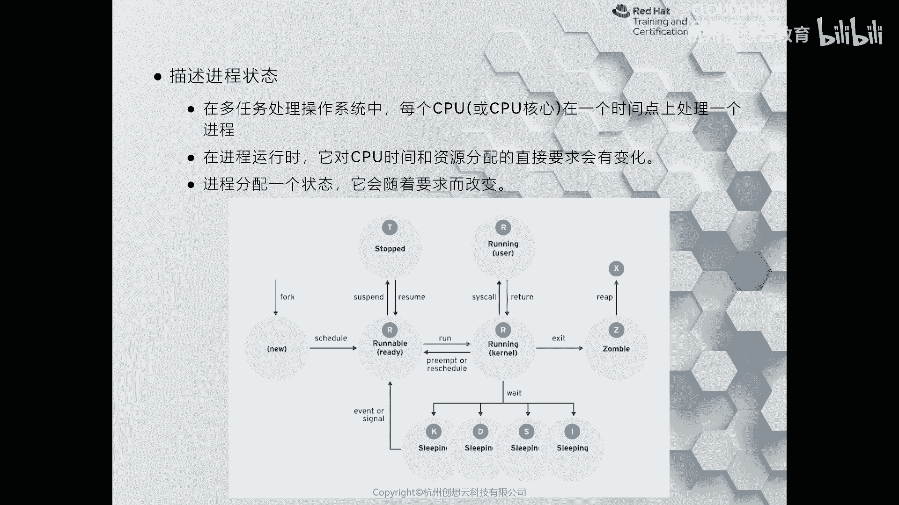
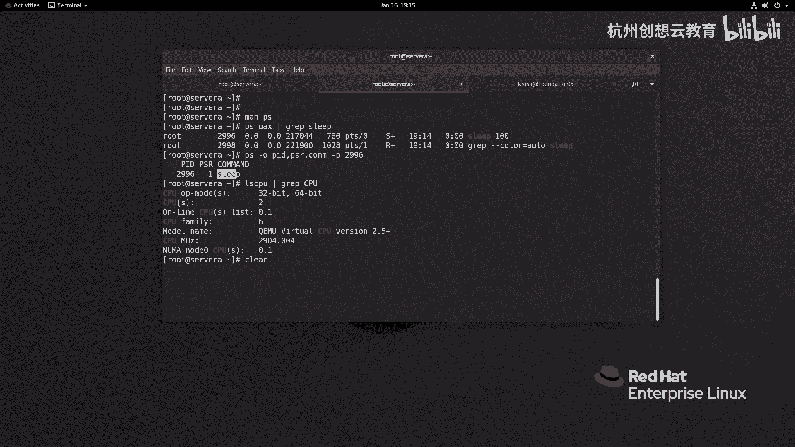

# 红帽认证系列工程师RHCE RH124-Chapter08：监控和管理Linux进程 - P1：08-1-列出进程 📋

在本节课中，我们将要学习如何查看运行在Linux系统上的进程信息，包括其状态和资源使用情况。理解进程是管理系统任务和性能的基础。

## 什么是进程？🤔

上一节我们介绍了本章的学习目标，本节中我们来看看进程的基本概念。

应用程序是存储在磁盘上的可执行文件。当需要运行程序时，系统会将其加载到内存中，并由内核调配CPU资源进行运算。此时程序的形态就称为**进程**，可以理解为“正在运行中的程序”。

一个进程包含以下信息：
*   独立的地址空间和安全属性。
*   进程的状态。
*   环境变量和上下文调度信息。

进程可分为单线程和多线程。

## 进程的生命周期与状态 🔄

理解了进程是什么之后，我们来看看它是如何产生和变化的。

在Linux系统中，所有进程都源自一个“父进程”。系统启动时的第一个进程（如 `systemd`）是所有进程的始祖。当我们打开一个终端会话时，该会话的shell（如 `bash`）就是后续执行命令的父进程。

父进程通过 `fork()` 函数创建一个子进程。子进程初始时拥有与父进程相同的资源、环境变量和安全性设置。随后，子进程通过 `exec()` 函数加载自己的程序代码并开始执行。父进程则进入等待（`wait`）状态。

子进程执行结束后，会清理自身资源并向父进程发送信号。父进程随后被唤醒。如果子进程在退出后仍有资源未完全释放，且与父进程的关系已剥离，它就会变成“僵尸进程”（状态为 `Z`）。

CPU通过分配极短的时间片来轮流执行多个任务，从而实现多任务处理。进程因此有不同的状态：

*   **运行 (R)**：进程正在CPU上运行或已就绪，等待CPU调度。
*   **休眠 (S)**：进程在等待某个事件（如I/O操作完成）而暂停执行。其中`D`状态为不可中断休眠（通常涉及关键磁盘I/O），`S`状态为可中断休眠。
*   **停止 (T)**：进程被暂停（例如，由管理员发送信号）。
*   **僵尸 (Z)**：进程已终止，但其部分信息仍保留，等待父进程读取。
*   **死亡 (X)**：进程已完全终止，此状态通常不可见。

进程还可能有一些次要状态标识，例如：
*   **<**：高优先级进程。
*   **N**：低优先级进程。
*   **s**：会话领导者（通常是父进程）。
*   **+**：位于终端前台进程组。



## 使用PS命令查看进程 👁️

了解了进程的状态后，本节我们将学习使用 `ps` 命令来实际查看这些信息。

`ps` 命令用于显示当前系统的进程快照。最基本的 `ps` 命令仅显示当前用户在当前终端的前台进程。

```bash
ps
```
输出示例：
```
  PID TTY          TIME CMD
 1234 pts/0    00:00:00 bash
```

这个信息量较少。更常用的方式是使用 `ps aux` 来查看系统所有用户的所有进程。

```bash
ps aux | less
```

以下是 `ps aux` 输出中各列的含义：

*   **USER**：进程所有者的用户名。
*   **PID**：进程ID。
*   **%CPU**：进程的CPU使用率。
*   **%MEM**：进程的物理内存使用率。
*   **VSZ**：进程占用的虚拟内存大小。
*   **RSS**：进程占用的、未被换出的物理内存大小。
*   **TTY**：启动进程的终端编号。`?` 表示与终端无关。
*   **STAT**：进程状态（即上文提到的R、S、D、Z等状态码）。
*   **START**：进程启动时间。
*   **TIME**：进程占用CPU的总时间。
*   **COMMAND**：启动进程的命令行。

## 进程信息筛选与排序 🔍

`ps` 命令功能强大，我们可以对输出进行筛选和排序，以快速定位特定信息。

例如，如果我们想查看消耗CPU最多的进程，可以结合 `sort` 命令进行排序：

```bash
ps aux --sort=-%cpu | head -10
```

如果想查看消耗内存最多的进程，则可以按 `RSS` 排序：

```bash
ps aux --sort=-rss | head -10
```

若要查看某个特定进程（如 `sleep`）运行在哪个CPU核心上，可以使用 `-o` 选项自定义输出字段，并指定进程PID：

```bash
# 首先启动一个sleep进程并获取其PID
sleep 100 &
ps aux | grep sleep

# 假设查到的PID是 2996，查看其运行的CPU编号
ps -o pid,psr,comm -p 2996
```
输出可能为：
```
  PID PSR COMMAND
 2996   0 sleep
```
其中 `PSR` 字段为 `0`，表示该进程运行在第0号CPU核心上。

## 总结 📝



本节课中我们一起学习了Linux进程的基础知识。我们首先了解了进程是程序的运行实例，然后探讨了进程从创建到结束的生命周期及其可能处于的各种状态（如运行、休眠、僵尸等）。最后，我们重点掌握了使用 `ps` 命令查看、筛选和排序进程信息的核心技能，这是监控和管理系统任务的第一步。熟练掌握这些内容，将为后续学习进程控制和管理打下坚实基础。