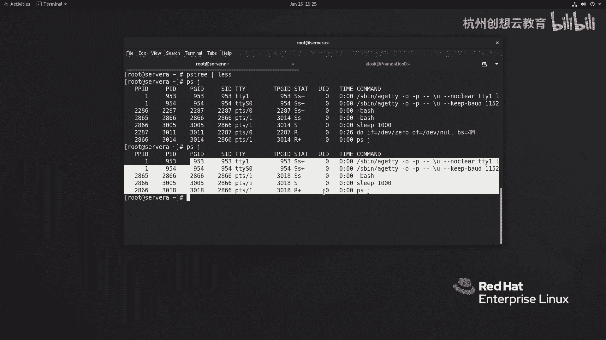
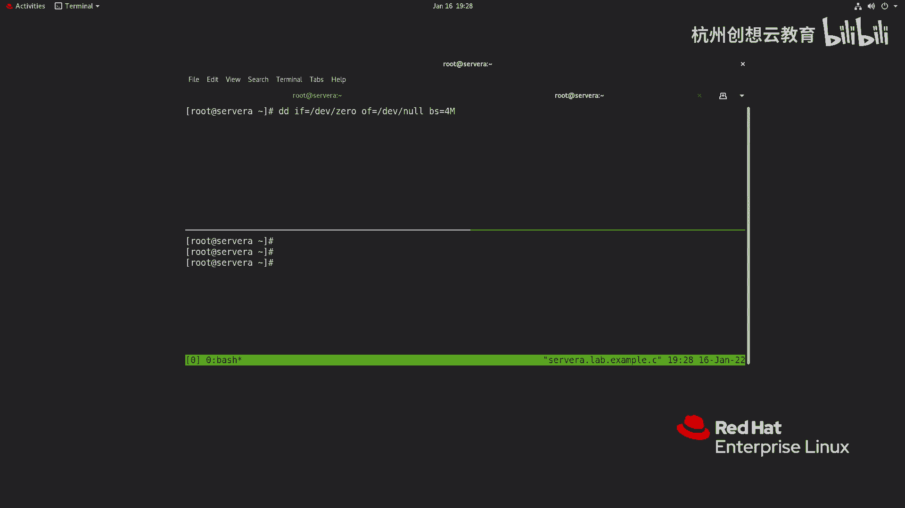
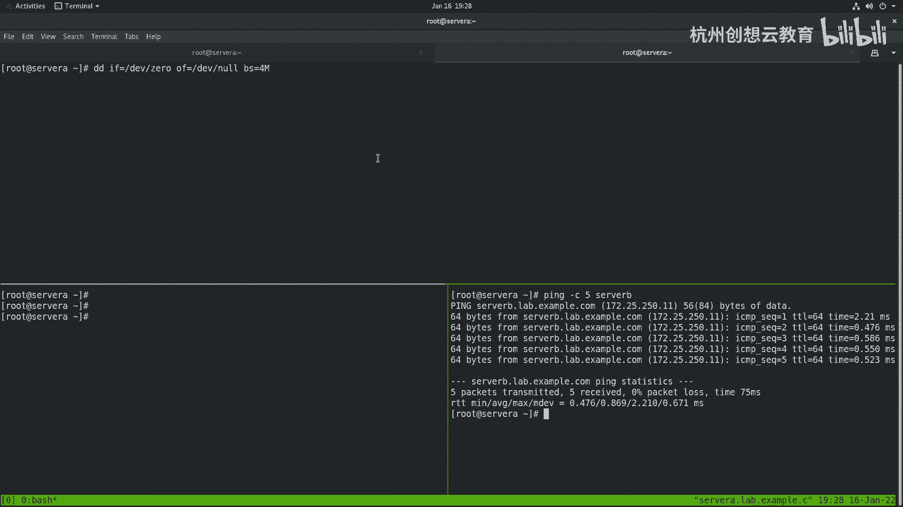
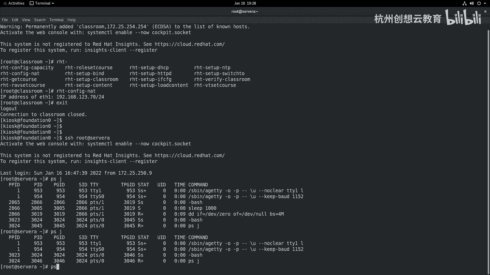
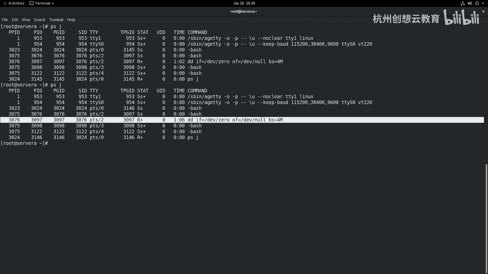

# 红帽认证系列工程师RHCE RH124-Chapter08-监控和管理Linux进程 - P2：08-2-监控和管理Linux进程-控制作业 - 杭州创想云教育 - BV1c14y1x7YQ

啊控制作业啊，那么这一小节呢是来给大家介绍呀，那如何呢在我们的shell上面呢去控制我们的作业和绘画，ok那么首先我们在终端上呢敲一个命令，好那么这个命令叫什么呢，还是谁呀，sleep好了，sleep。

我这次要把这个时间呢加的久一点啊，sleep 1000好，然后回车，那么回来之后呢，因为它还没有执行结束，我希望呢在当前的终端上啊，再次进行一个任务。

比如说l s杠l那么回车之后也发现这个命令啊并没有执行，为什么呢，因为我们第一个任务还没有结束啊结束，所以说呢第二个任务呢是没有办法执行的，那么也就意味着呀我们的终端上面默认情况下啊。

终端上面一次只能执行一个任务啊，只有这个任务执行结束了才能执行第二个任务啊，我现在要ctrl c啊，把这个命令给它终止掉啊，那么那么那么也就意味着意味着什么呢。

意味着呀我们这个要想啊这个在一个终端上执行完一个任务之后啊，经完一个任务之后啊，然后呢去执行第二命令，那怎么办啊，那么就意味着我们需要啊把这个命令后面加一个and符啊，下一个and符哎。

就是我们qt上啊显示的一个and这样一个符号，ok是安了一个这样的符号好，那么我们来试一下啊，那么还是sleep啊，1000啊，1000加上一个and回车，那么回来之后呢。

我再去执行一个杠l a就可以了，ok所以一个作业呢只能属于一个绘画啊，一个绘画啊，啊这是这个地方啊，是一个小小注意事项，ok我们要指导一下一个作业呢只能支持一个绘画啊。

那么并且呀并且还有一件事情呢就是什么呢，就是我们的系统当中的啊，所有作业啊，他们之间都是有关联的啊，因为我们上一小节呢刚给大家介绍过所有的进程啊，它都是从负进程那里分支的，对不对。

所以啊我们当前的进程呢也是有负继承而出来的，那么我们可以通过一个p s tra啊，技能数来查看我们进程和进程之间的关系，那么我们会发现所有进程都是来源于c tm d啊，ccm d你看非常多什么网络对吧。

计划任务啊，审计啊，n t p d对吧啊这个防火墙啊，这个啊还有下面的各种各样的，你看我们的这个呃系统的安全守护进程啊，哎日志啊等等，那么其中呢在这个分支里面啊，在这个分支里面。

你看正好是我们当前的这个绘画，因为这里面有sleep呀对吧，还有p s ree啊，这些都是我们刚刚执行的，并且有没有发现在我们的这个进程数里面，你看ph tra和sleep是共同存在的。

因为我们加了后台作业，对不对，哎后台作业ok这是一个注意事项啊，记住一定要这样子，那因此并且呢并且啊并且的话呢，如果啊我把前面的这个绘画某一个地方我都终止掉，那么我们和这个进程上面附带的啊。

这些任务呢也会被被这个被结束掉啊，被解构掉，哎我们可以把这个树这个这个树状图呢当做一个苹果树对吧，那么现在这些指令啊就是长在枝干上的苹果，然后我把这个苹果的枝干给它锯掉了，那么苹果呢也就不在树上了啊。

不在树上了，ok这个地方一定要注意啊，一定要注意，我们一会儿呢给大家来解释啊，如何解决这个问题，ok啊那么这是给大家说的这个进程之间的关系啊，那么刚才的这种方法呢，其实啊也不是说这个任务这个结束了啊。

而是呢我们把刚才这个任务啊加上符之后呢，放在了后台啊，放在了后台，ok因此呢我们可以通过job 4命令来查看我们当前绘画的后台作业，那么后台呢有几个呀，有一个他的作业编号呢是一当前的是running啊。

和终端有关系啊，并且呢这个指令的具体内容啊，我们看到了，那现在呢如果我想把这个技能啊把它放在我们的前台继续运行，那么我可以使用f g百分号一啊，为什么是百分号一呢，哎他的作为序号呀是一ok好回车。

那么就恢复到了前台运行，恢复到了前端运行，ok这是fg啊，好f g k好，然后呢接着那如果啊如果我们要想把它恢复在后台作业，那这个是什么情况呢，这个呀比较特殊啊，那么比如说啊我现在呢在走这个命令。

在前台啊，正在走sleeping 1000啊，正在走这个命令，然后呢我发送了一个信号叫做什么呢，叫ctrl加z，那么加z之后呢，他就同样呢也放在后台了，但是这次的后台呀和之前的后台不太一样。

之前呢是在后台运行的呀，现在呢被我干嘛呀，发送了z啊，ctrl z，那么我的信号呢是被stop掉的啊，金融是stop掉的，因此它就不再运行了啊，那么这时候呢它不仅消耗着我们的资源，但是他又没干活啊。

因此呀那么我想把它在后台回复诶，我就可以使用bg百分号解一恢复，在后台运行，ok这是如何去控制我们后台的作业，但是呢后台如果有个用户放了很多的后台，放了很多个后台。

然后呢并且呢只能在该用户的shell上面才能看到这个后台，对不对，那我如果呢是另外一个用户，比如说啊这个root呢又打开一个新的终端呀，它走一个面叫jobs，可以发现他找不到，那么这种情况下怎么办呢。

哎我们可以使用ps加加一个选项叫j啊，那么通过这个选项呢来查看所有用户的后台作业好，我们来看一下效果p s j k，那么就能看到刚刚的后台作业啊，后来作业ok这是这个好，那么我们继续说。

刚才呢我们提到了，如果呀我把这个某一个绘画的中间呢给它切断掉啊，那么运行在该啊这个终端上面的这个任务位啊，也会被终止掉，我们举个例子好吧，比如说呢我做个dd命令，dd什么呢，dd一辅等一个dv下的啊。

zero啊，dd啊是用来这个从快设备文件读取的数据呢，把它在刻录到另外一个里面，那我现在从哪读呢，从zero一个空设备里面去读取，然后呢读取之后呀，再把它丢弃到我们的nn，每次躲读取多大的快设备呢。

我就来个四兆吧好吧，然后呢放在后台让它一直运行啊，一直运行，那么我们的这个呃作业呢就已经形成了，那么同样我们的进行数呀也能看到啊，也能看到，好我们来看一看好吧，去搜我们的谁呀。

搜查我们刚才的那个指令d dd呢是在第一个终端绘画上面，对不对，好，现在呢我干嘛呢，通过p啊，这也能看到这个会画作业，然后呀我把左边那个终端呀给它意外的关闭掉，然后呢我们再去执行命令。

会发现我们的中我们的这个刚才的任务呀就被被被消失了啊，那如果我们刚才的那个作业系统，假如正在编译内核对吧，快马上就编译成功了，唉某些原因啊，比如说网络的原因导致中断了，或者某些原因导致中断了啊。

那个任务呢就就结束了，所以说呢这种方法呢就就不太友好是吧，那怎么办呢。

那么在早期的时候呀，我们在进行任务呀，可以通过加一个谁呀，no help啊，后面再跟上你的药啊，指定的任务，那么这样的话呢可以使我们的任务啊与终端无关，啊与终端无关，也就是说你中端断没断。

跟我没关系对吧，我的任务呢照常运行，啊唉放在后台了啊，放在后台了，ok然后呢，如果我们某些原因呀，把这个后台作业给他干掉也是不影响的，啊在这个好，我给它盖掉，我们在八上看看这个海还是起不起作用，好吧啊。

这个好像不太好使对吧，不太好使，ok不太好使的话，那么我就换一种方式好吧啊，八上啊不太好使，我就换一种方式，翻译成什么方式呢，哎从七开始就有了，但是八里面呢它给我们装好了，我们可以通过这个命令看到啊。

叫i c s h杠l，那么会看到啊，我们的绘画，我们的shell里面有一个叫做t mu x的一个shell，那么这个shell的话呢，它可以在一个终端上啊，虚拟出来多个终端啊，怎么用啊。

我这里演示一下t mu x回车，那么这时候呢我们会进入到t mu x这个新的终端里面，那么最明显的特点呀，就是我们的这里是一个绿色的，那么在这里敲击命令和之前的no hub是一样的效果啊。

是可以一样效果，啊实际效果，那么在执行的时候呢，如果啊如果你说我想看看其他的一些信息，假如说我们当前终端呢是一个文本控制台啊，那么文本平台我们只能通过control加alt加fn的功能键来切换。

但是我现在不想切换，因为我想在一个窗口里面看到所有我想观察到信息，那怎么办，哎我可以把这个终端呀切割窗口，我按下ctrl b加上一个双引号啊，ctrl b是个左键，按完之后呢释放掉。

再同在单独的按下双引号，就可以把我们的窗口分割成上下两个啊，那么这时候呢我在这里呀就可以去看一看，哎，我们的进程的情况了，就能看到我们的情况了，ok好，接着啊，接着啊，我们这个还可以再切啊。

只要你的屏幕足够大对吧。

我们都可以切换，比如说我下面这个呀还想再分割一个，那我可以这样分割，ctrl b释放掉，然后呢选择一个什么呀，百分号，那么它就可以实现一个啊这个啊水平方向的一个分割对吧，哎我这边可以干嘛要去测试一下啊。

某些主机之间呀有没有通对吧啊，去测试，那这样用起来比较方便，并且在这个终端上面执行的这个任务，如果被终止。

意外的结束掉了，那么也是不影响的，好我们来个p。

给大家看一下有没有发现我们的一个任务啊，应该还不是这个啊，这一个一分钟多了啊，是他啊，一分钟多就有这个任务，你看还在运行对吧，还得运行，ok那么这次又是我们的后台作业的一个呃控制和管理啊。

