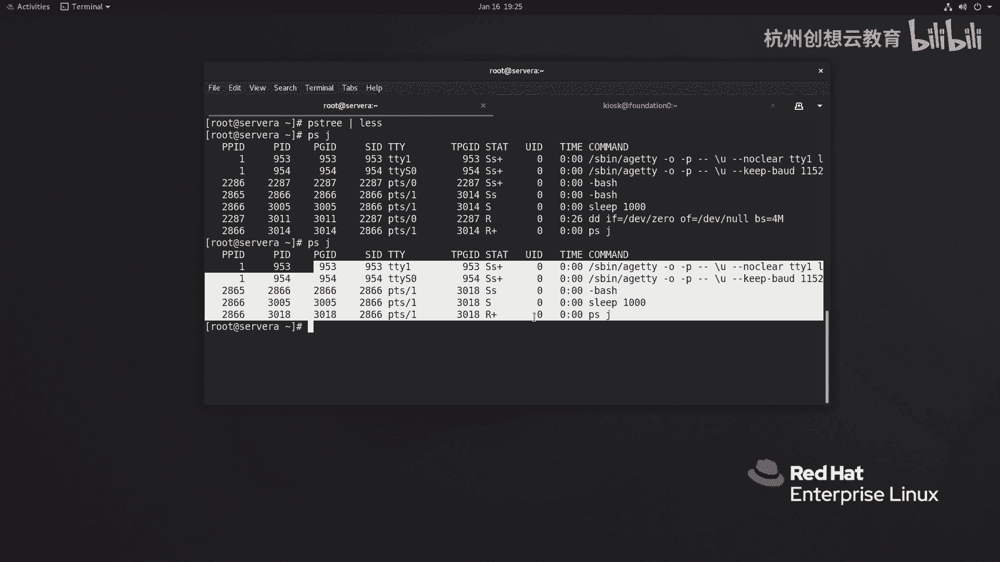
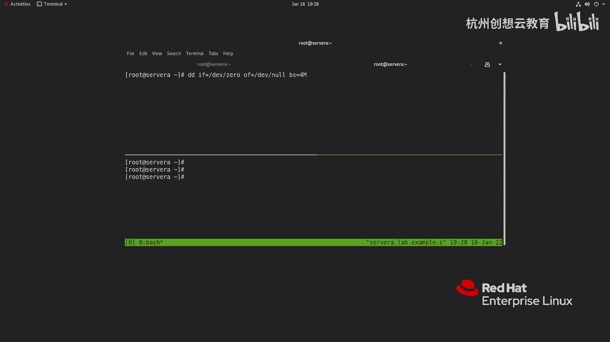
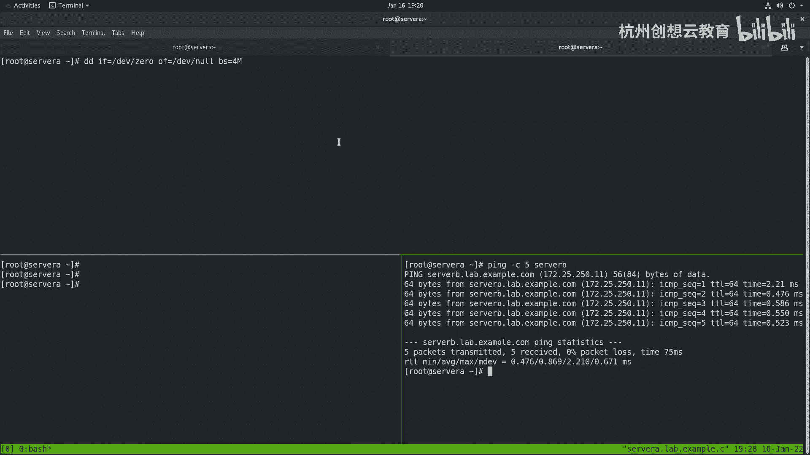
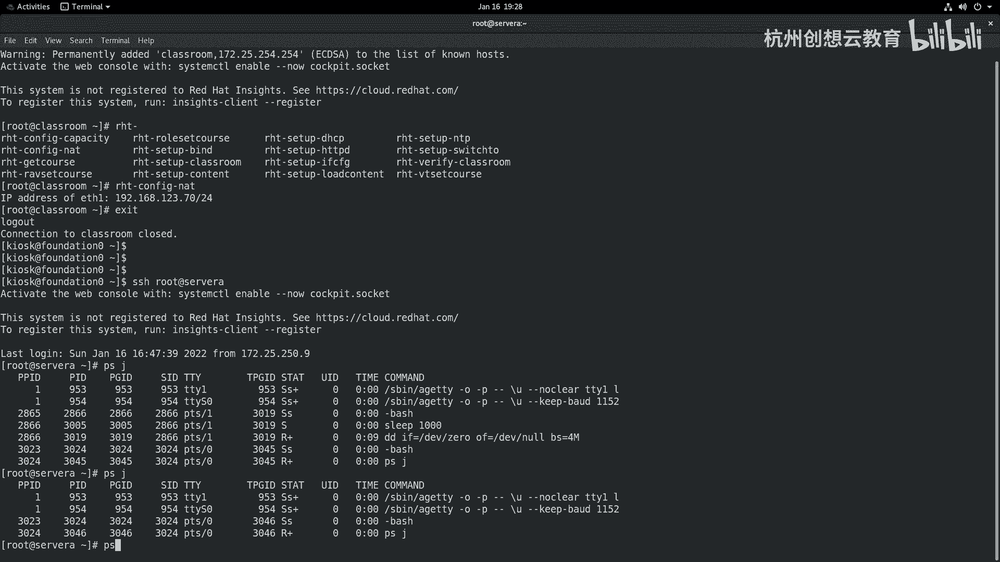
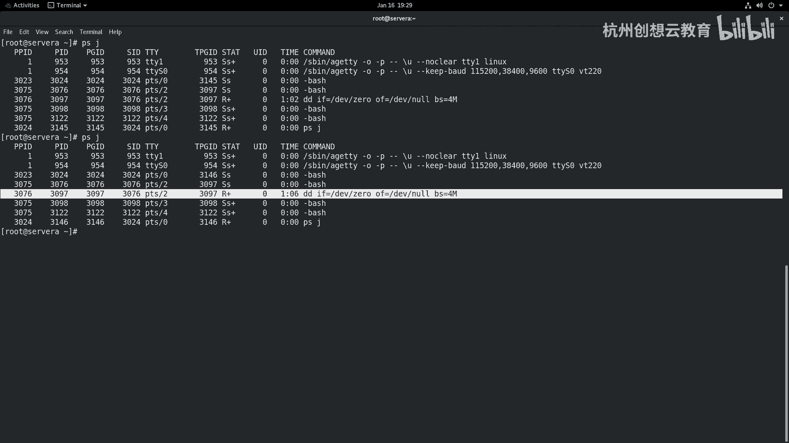

# 红帽认证系列工程师RHCE RH124-Chapter08-监控和管理Linux进程：08-2：监控和管理Linux进程-控制作业

在本节课中，我们将要学习如何在Shell中控制作业和会话。我们将了解如何将任务置于后台运行、如何查看和管理后台作业，以及如何使任务与终端会话分离，从而避免因终端关闭而导致任务意外终止。

## 进程、作业与终端会话的关系

上一节我们介绍了进程的基本概念，本节中我们来看看作业与终端会话的关系。默认情况下，一个终端会话一次只能在前台执行一个任务。只有当前任务执行结束后，才能执行第二个命令。

例如，执行一个长时间运行的命令 `sleep 1000` 后，终端会被占用，此时输入 `ls -l` 命令不会立即执行。

## 将任务置于后台运行

为了解决上述问题，我们可以将任务放入后台运行。方法是在命令的末尾添加一个 `&` 符号。

**代码示例：**
```bash
sleep 1000 &
```
执行此命令后，`sleep 1000` 任务会在后台运行，终端会立即返回并可以接受新的命令，例如 `ls -l`。

一个作业只能属于一个会话。系统中的所有作业和进程都有关联，它们都源于初始进程（如 `systemd`）。我们可以使用 `pstree` 命令查看进程间的树状关系。

**重要概念：** 如果终止了某个终端会话（例如关闭终端窗口），那么在该会话中启动的所有后台作业也会被终止。

## 管理后台作业

以下是管理后台作业的常用命令。

### 查看后台作业

使用 `jobs` 命令可以查看当前会话中的后台作业列表。

**代码示例：**
```bash
jobs
```
输出会显示作业编号、状态（如 `Running` 或 `Stopped`）以及命令内容。

### 将后台作业切换到前台

使用 `fg` 命令可以将指定的后台作业切换到前台继续运行。

**公式：**
`fg %作业编号`

**代码示例：**
```bash
fg %1
```
此命令会将作业编号为1的作业切换到前台。

### 暂停前台作业并置于后台

如果有一个任务正在前台运行，可以按下 `Ctrl+Z` 组合键发送暂停信号。该任务会被停止（Stopped）并放入后台。

此时，该作业消耗资源但不执行。可以使用 `bg` 命令使其在后台恢复运行。

**公式：**
`bg %作业编号`

**代码示例：**
```bash
bg %1
```

### 查看所有用户的后台作业

`jobs` 命令只能查看当前用户当前会话的作业。要查看系统上所有用户的后台作业，可以使用 `ps` 命令。

**代码示例：**
```bash
ps j
```



## 使任务与终端会话分离

如前所述，后台作业会随着终端会话的结束而终止。这对于需要长时间运行的任务（如编译内核）是不友好的。以下是两种使任务与终端分离的方法。

### 使用 `nohup` 命令

`nohup` 命令可以使任务忽略挂断信号（SIGHUP），从而在终端关闭后继续运行。通常结合 `&` 使用。

**代码示例：**
```bash
nohup sleep 1000 &
```
这样，即使关闭启动该任务的终端，`sleep 1000` 命令也会继续在后台执行。

### 使用终端复用器 `tmux`

`tmux` 是一个终端复用工具，它可以在一个终端窗口中创建多个虚拟终端（窗口或窗格）。在 `tmux` 会话中运行的任务，即使关闭了原始的终端窗口，任务也不会终止，因为 `tmux` 会话本身在后台持续运行。

1.  **启动 tmux：**
    ```bash
    tmux
    ```
    进入一个新的 `tmux` 会话，界面底部通常会有状态栏。

2.  **分割窗格：**
    *   `Ctrl+b` 然后按 `"` （双引号）：水平分割窗格。
    *   `Ctrl+b` 然后按 `%` （百分号）：垂直分割窗格。
    这允许你在一个屏幕内同时查看和管理多个任务。



3.  **分离会话：**
    在 `tmux` 会话中，按下 `Ctrl+b` 然后按 `d`，可以分离当前会话并返回原来的Shell。任务会在 `tmux` 后台继续运行。

4.  **重新连接会话：**
    使用以下命令可以重新连接到之前分离的 `tmux` 会话。
    ```bash
    tmux attach
    ```



在 `tmux` 会话中执行的任何任务，都不会因为外部终端的意外关闭而停止，提供了强大的会话持久化能力。



## 总结



本节课中我们一起学习了如何控制和管理Linux中的作业。我们掌握了将任务置于后台运行的方法（使用 `&` 符号），以及使用 `jobs`、`fg`、`bg` 命令来查看和管理这些后台作业。更重要的是，我们了解了后台作业默认依赖于终端会话的局限性，并学习了两种使任务与终端分离的解决方案：使用 `nohup` 命令和功能更强大的终端复用工具 `tmux`。这些技能对于在Linux系统上高效、可靠地运行长时间任务至关重要。