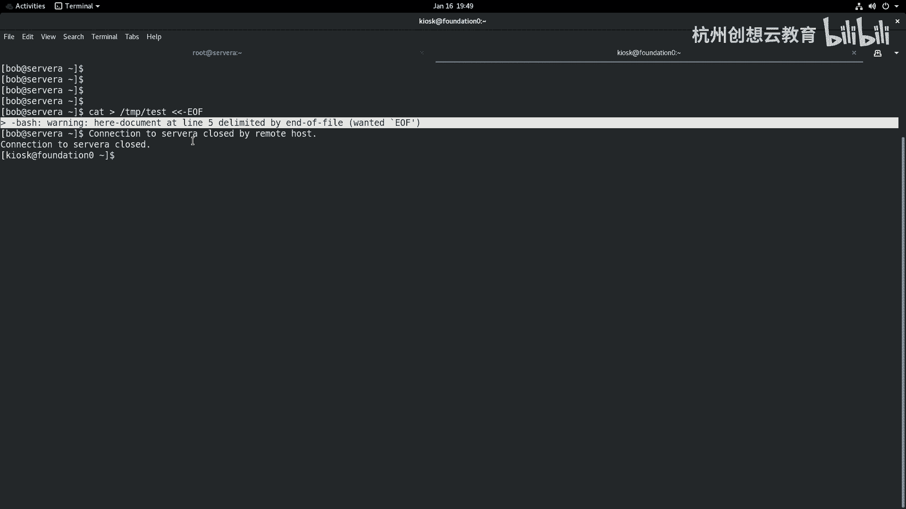

# 红帽认证系列工程师RHCE RH124-Chapter08-监控和管理Linux进程 - P3：08-3-监控和管理Linux进程-中断进程 - 杭州创想云教育 - BV1c14y1x7YQ

第三节啊中断进程啊呃我们知道那么在系统当中啊，终端呢有两种，一个呢是软中断，一个呢是硬中断，对吧？那么对于管理员而言，我们可以通过发送信号的方式来控制软件的一个中断啊，那么最长的方法呢。

就是通过Q类的命令呢进行管理。那么我这里呢有一个表格那这个表格呢把我们常用的几种信号呀给大家列了出来。那么其中啊信号频道里面啊，Q信号一啊，那么它的信号的名称呢叫how啊，那么就是挂起的意思。

那么通过这个信号呀，可以帮助我们把这个进程给它挂起。O挂起。ok那么这个挂起的话呢，一般来说呃也可以干嘛呢？也可以让我们的进程啊重新初始化，有点类似于那个reload。啊。

那么信号二呢则是一个硬盘中断啊，硬盘中断OK那么相当于发送了ctrol C啊发送C啊，通过软件，然后变成这个硬件中断，对吧？那么cttrol C的话呢，在发送的时候，其实也不是完美的。呃。

因为某些应用程序啊，这个不支持conrl C。那这种少数啊非常非常少。O第三种的话呢是通过发送一个这个快子信号，那就是一个呃键盘退出对吧？那么相当于发送了一个cttrol加反斜杠啊，反斜杠。啊。

那么使我们的进程啊在终止的时候呢添加一个进程的一个转储。而C19呢是我们遇到的最猛烈的一个进程的信号，那么就是Q啊是Q本身啊。那么这种进程的信号呢，相当于给进程发送一个。啊。

利益终止的一个一个一个信号啊，那么有可能会导致我们进程还没有保存数据，那么就被终止掉了。所以这个信号呢一定要慎用一定要慎用。OK而15这个信号呢，那么是默认的一个信号。当我们关闭掉一个进程啊。

关闭掉一个服务啊，正常的关机啊，这些呢都是一个15的信号啊，那么18信号呢是一个停止，对吧？我们啊是继续啊，我们可以把停止的进程啊给它继续啊continue一下OK呃19这个我们用的上啊，那么就是。

暂停进程啊暂停进程。但是这个一旦发送呢就立马就终止了。OK那么20这个信号就是我们刚才用到的那个ctl Z啊，那么键盘停止，那这个停止我们也是不建议大家去使用的。因为如果你进程的多，特别是初学者啊。

那么你把这个。呃，终止在后台的作业呢你忘记掉了，那么就会使占用大量资源，而没有办法去使用啊。那么这些信号的这个频道呀都是通用的啊，都是通用通用的。那么我们可以通过Q命令啊。

或者Q的其他命令呢结合在一起去使用啊？如果你忘记掉这个信号怎么办啊？没问题啊。呃我们可以通过一个命令叫Q杠L。

来获得帮助啊，那么信号还是比较多的啊，64个啊，我刚才呢给大家呢是总结一些常用的比较高的一些啊这些。那么无论是哪一个呀，我们都是可以这样来用的啊。那么我这笔间这边呢简单举个例子。

但不执行啊Q比如说以信号一为例。那我就Q杠1，后面跟上某某技能号，比如说技程是123456啊，我就执行就可以就可以了。那么当然了也可以使用什么呀？Q信号叫HUP啊，跟上你的技能号也是没问题，能跑起来啊。

甚至呢还可以使用信号的全名称啊，叫什么呀？SIGHUP。啊，跟上你的技能号也是可以的三种方法都是OK的。但一般我们呀都会用第一种啊，第一种啊，因为这个简洁嘛，对吧？啊。

那么接着呢我们来看看具体的Q到底该啊和Q相关的命令啊，集体的怎么去使用。啊，那么使用的方法呢，我们这里呢先以Q命令本身啊，举个例子。那么刚才呀我们在后台呢跑了一个DD命令的作业啊，然后呢。

我现在呀还在这个7max里面呢去运行程序。我呢去把这个窗口呀，一分为左右两个。然后呢，在右侧干嘛呢？在右侧呢，我来观察我的进程。那么我就使用这个PS啊啊这个PS给这个AOX去筛选一下谁呀。

去筛选一下我们的DD。啊弟DOK啊呃，因为这个屏幕的原因，我把它放大一点，好吧，放大一点啊。哎，那么我们的滴D啊。啊，在哪里啊，在这里啊，还在运行当中。OK好，然后呢我使用conttrol加B。

然后呢释放掉摁一下左向左的方向键，切换我的终端呀，来到左边。然后呢，我呢干嘛呢？我做个命令啊叫ki杠9啊，去去去发送一个猛一点的命令。因为滴滴命令本身也没有什么。没有什么关键的内容，对吧？

所以说呢我这边呀干脆呢跟上谁呀？杠O好了，杠O这个这个PID是吧？还有这个。啊，comment啊去筛选的是我们的这个。谁音在滴滴那。加上1个ON。COMM。啊。样数太少了，我这边。看一下啊。选项太少啊。

太少了啊，那我就简单一点好了。AX呢去筛选我的滴D啊。好，那么我的滴D里面的话呢，现在有两个啊，两个啊，一个呢是在PDS2，一个呢是和后台的。那么我就把后台这个干掉吧，它的技能号呢是3019。

Q-93019会啊3019无车好PS啊G看一下是不是少了一个滴D啊，3019呢没了。剩剩下这个是3097啊，就没有了啊，这是Q命令的用法啊，立即生效，对吧？啊，那么除此之外呢，我们的Q啊。

还有一些其他的用法啊，比如说和它相关的。有一个呢叫PQ。那么PQ的话呢，是用来管理我们进程组的啊，进程组就说某些有些进程啊，它可能运行起来之后呢，又立即分散了很多个子禁程。

那如果我要是这些紫禁城是同名的，并且呢又是属于是一一组啊。那我如果用Q命令来管理的话呢，可能效率特低啊，那我就通过PQ来实间来管理。那么最经典的例子呢就是。啊，阿玛奇的这个外包服务啊啊阿玛奇要服务。好。

现在呢我把这个终端要退出来，好吧，退出来。啊，我用默认的这个啊，那么我现在呀在soA上呢去装一个外包服务。啊，安装一个外包服务。那么这个命令我们后面呢会再学习到啊，我现在先去跑一下，好吧。

ym杠外instore hTTBD安装HTTBD这个软件。啊，那么装完之后呢，我干嘛呢？我就把这个服位呀给它起来啊起来。好，我再起来system CTTL啊，star HTPD。好。

我呢走一个命令叫做sisters啊CTL啊，sters hTTBD那么我们会看到呢对于HTTBD而言，它的主进程的编号呢是3326。但是呢还有一些其他的进程号。哎，切进号。

那么会随着这个客户端的访问的数量的增加呀，那这里也会有一定的变化。OK那现在呢我想把HTPD呢通过Q相关的命令把它给它。干掉啊，把停掉怎么办呢？哎，我们可以使用PQ。那么PQ的话呢，就可以放信号了呀。

比如我发送一个信号9啊，那么因为这些进程啊信号是不唯一的，但是名称却都叫HTTPD那我就跟上进程的名称即合。然后呢，我们再来看一下进程状态是不是被我们干掉了。你看coded cute啊，信号呢是Q啊。

正好是信号9。啊，正好信号9啊，通过PQ啊的方式呢来去管理啊去管理啊，那么接着呢我们再来演示一个，那么同样呢我去找个滴滴命令。啊，弟弟命令。

我只一个然后再争第二个第三个现在的话呢就是我们的这个进程里面呀，有很多个弟弟命令，他们的名字一模一样，但是呢又不属于同一个组。因为这些进程进行之间关呃进程与进程之间是没有任何的关系的啊。

没有没有任何的关系的。那么针对于这种进程啊，我就可以通过另外一个命令来管理啊，叫QO啊，来管理同名的进程。同样这个命令呢只需要关心的是名字，而不是进程号。好，那么我们来敲一个命令。啊，叫Q哦。

我还是九信号，叫DD。回车，然后呢我们去PS杠这一下，那么这里的所有进程啊都在一个一个呢被干掉了，你看都没有了啊，都没有了。这里面运行当中啊或休眠的进程里面都没有滴滴了啊，都已经一干二净啊，一干二净好。

这是三个Q命令的一个延伸啊，那么接着呢我们再来看一个知识点啊，就说我们也可以利用进程的管理方法呢去啊来使某些用户呢身份注销。那么我们最用的方法呢就是用WW命令呢可以帮助我们查看。

那么有哪些用户呀登录在系统上面，然后通过Pgra啊，Pgra命令呢是用来筛选指定的进程的。只查看进程号啊，那么你比如这个例子，哎，我就通过p grab杠1杠Ubob来查看bob相关的进程。

那么我现在呢去试一下，好吧，试一下呃，我先去走个命令啊，叫做W，看看有没有登录bob好吧，现在只有root呀，那怎么办？哎，我这边再打一下新的终端，我去这个呃使用bob的身份，好吧。

来登录到sver a。啊，登了sorry呀，已登上来了，然后呢在这里干嘛呢？比如说我要在这里面。去看个文件好吧啊，看文件啊，哎看的时候。这样这样这这样子吧，我写一个别的啊ite啊。

一个叫做it呃t下面写一个test好吧啊，然后呢这个加上一个信号啊，就是让他一直在在这等着，然后呢我再出一个W啊，X呢就能看到一个用户呢是bo勃了。那么bob他到底干嘛呀，在干嘛干什么事情，是不是哎。

我可以P grab啊，去杠L查看啊，谁呀，查看我们用户啊，叫bo勃的。哎，就能看到和他相关的这些进程。啊，和和相关的这些进程啊好，那么接着呢我们还可以干嘛呢？还可以啊通过一些命令呢给它结束掉。

那么首先我们知道它的终端是分配了1个TDUPDSE我把这个PDSE的关闭掉，怎么关闭呢？那PQ。关闭终端啊，T是这个呃PTS7杠1回车，然后呢再W看一下效果。哎，还没有干掉是吧，还没有干掉啊，呃。

可能是某些哎，现在已经被什么呀？这边已经有有提示了是吧，把它进程啊给它干掉了。看那用户呢并没有登出啊并没有登出。那现在我想把这个用户呀给他这个呃给他干嘛呀？我想把这个用户给他登出，那怎么办，对不对？

那这时候呀我们可以啊可以走一个这样的方法，就是啊我们可以把这个用户呢通过PQ的方式也可以给他干掉一下，好吧，那PQ谁呢？啊，PQ我们可以通过这个。嗯，我跟上一个谁呀，跟上一个用户。

我直接跟上一个用户试一试，好吧。因为它不是命令啊，哎这种方法的话。我们应该换几种命令啊啊PQ啊，然后杠9指定用户杠U谁呢？bo勃回车，我们再来W看一下，哎，发现呢没有谁呀，没有bo勃了。

那么我们的终端呀也被关闭掉了。

