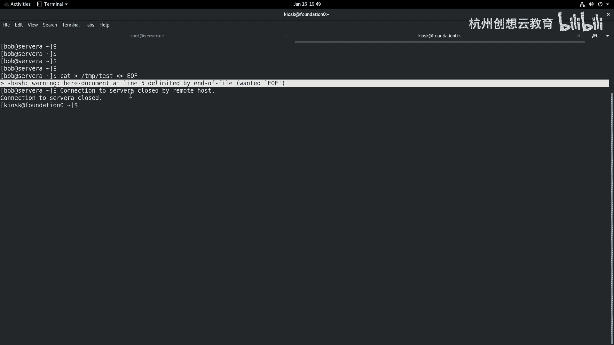

# 红帽认证系列工程师RHCE RH124-Chapter08：08-3：监控和管理Linux进程-中断进程 🛑

在本节课中，我们将要学习如何中断Linux系统中的进程。上一节我们介绍了如何查看进程，本节中我们来看看如何通过发送信号来管理进程的生命周期，包括终止、挂起和恢复等操作。

## 概述

进程是系统中正在运行的程序实例。管理员需要能够控制这些进程，例如在程序无响应时将其终止，或在不重启服务的情况下重新加载配置。这主要通过向进程发送特定的**信号**来实现。

## 常用信号介绍

以下是Linux系统中用于进程管理的一些常用信号。每个信号都有一个编号和名称，可以通过`kill`命令发送。

*   **信号 1 (SIGHUP)**：挂起信号。通常用于让进程重新初始化或重新读取配置文件，类似于重启但不完全终止进程。
*   **信号 2 (SIGINT)**：键盘中断信号。相当于在终端按下 `Ctrl + C`，用于中断前台进程。
*   **信号 3 (SIGQUIT)**：键盘退出信号。相当于按下 `Ctrl + \`，会使进程在终止时生成核心转储文件。
*   **信号 9 (SIGKILL)**：强制终止信号。这是最猛烈的信号，会立即终止进程，不给进程保存数据或清理资源的机会，应谨慎使用。
*   **信号 15 (SIGTERM)**：终止信号。这是`kill`命令默认发送的信号，请求进程正常退出，允许进程进行清理工作。
*   **信号 18 (SIGCONT)**：继续信号。用于让一个被暂停的进程恢复运行。
*   **信号 19 (SIGSTOP)**：暂停信号。立即暂停进程的执行。
*   **信号 20 (SIGTSTP)**：终端停止信号。相当于在终端按下 `Ctrl + Z`，将前台作业暂停并放入后台。

> **注意**：信号9 (`SIGKILL`) 和信号15 (`SIGTERM`) 是最常用的终止信号。应优先使用`SIGTERM`，给进程优雅退出的机会；仅在进程不响应`SIGTERM`时，才使用`SIGKILL`。

## 查看所有信号

如果你忘记了信号的编号或名称，可以使用以下命令查看系统支持的所有信号：

```bash
kill -l
```


该命令会列出所有可用的信号。

## 发送信号的方法

向进程发送信号主要有三种方式，以发送挂起信号 (`SIGHUP`) 为例：

1.  使用信号编号：`kill -1 进程号`
2.  使用信号名称（不带`SIG`前缀）：`kill -HUP 进程号`
3.  使用信号全称：`kill -SIGHUP 进程号`

通常，我们使用第一种方式，因为它最为简洁。

## kill命令家族的使用

`kill`命令不仅可以终止单个进程，还可以通过其衍生命令管理进程组或同名进程。

### 1. 使用kill命令

`kill`命令最基本的功能是向指定进程ID（PID）发送信号。

**示例**：假设我们有一个后台运行的`dd`命令，其PID为3019。我们可以使用以下命令强制终止它：

```bash
kill -9 3019
```

执行后，使用`ps aux | grep dd`命令检查，会发现PID为3019的进程已消失。

### 2. 使用pkill命令管理进程组

`pkill`命令可以根据进程名、用户等属性向**一整组进程**发送信号。这对于管理像Web服务器（如`httpd`）这样会产生多个子进程的服务非常高效。

**示例**：停止所有名为`httpd`的进程。

```bash
pkill -9 httpd
```

此命令会向所有进程名包含“httpd”的进程发送`SIGKILL`信号。

### 3. 使用killall命令管理同名进程

`killall`命令用于终止所有**指定名称**的进程。它与`pkill`类似，但通常更严格地匹配进程名。

**示例**：终止所有名为`dd`的进程。

```bash
killall -9 dd
```

执行后，系统中所有名为`dd`的进程都会被终止。

## 管理用户进程

我们还可以利用进程管理命令来注销用户或结束用户的所有进程。

首先，使用`w`命令查看当前登录系统的用户及其终端信息。

接着，使用`pgrep`命令可以查找特定用户的进程ID。

**示例**：查找用户`bob`的所有进程。

```bash
pgrep -l -u bob
```

若要结束某个用户的所有进程并将其注销，最直接的方法是使用`pkill`命令。

**示例**：强制结束用户`bob`的所有进程。

```bash
pkill -9 -u bob
```

执行后，用户`bob`的所有进程将被终止，其会话也会被关闭。

## 总结



本节课中我们一起学习了Linux进程中断与管理的核心方法。我们了解了常用信号的含义与用途，掌握了通过`kill`、`pkill`和`killall`命令向进程发送信号的操作。我们还学习了如何查看用户进程并将其结束。合理使用这些工具，可以帮助你有效地监控和维护Linux系统的运行状态。记住，在终止进程时，应优先选择允许进程优雅退出的`SIGTERM`信号。