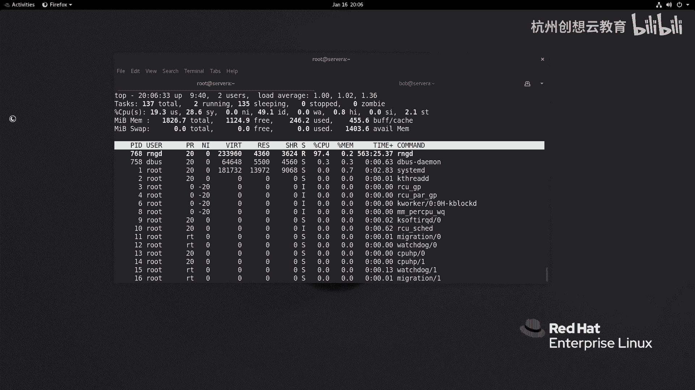
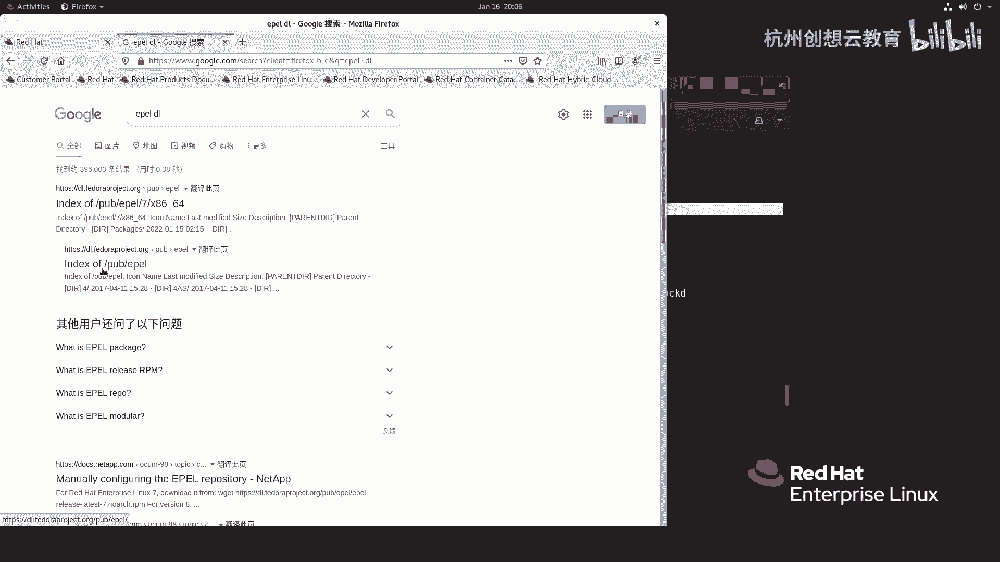
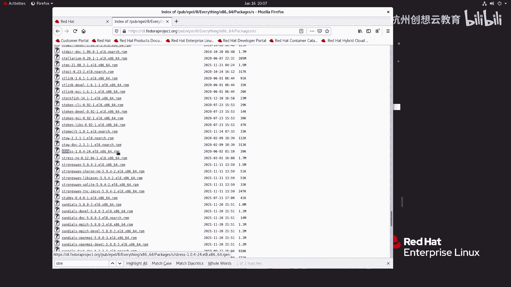
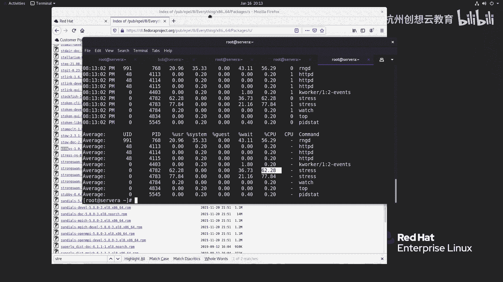
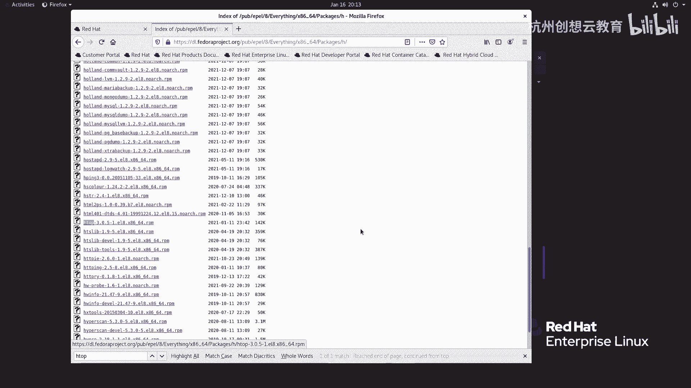
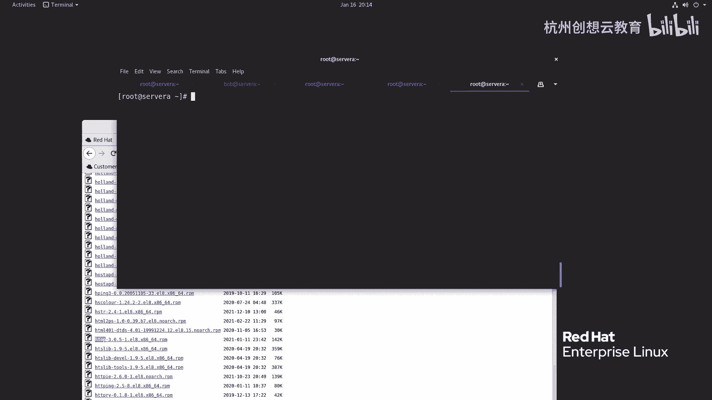
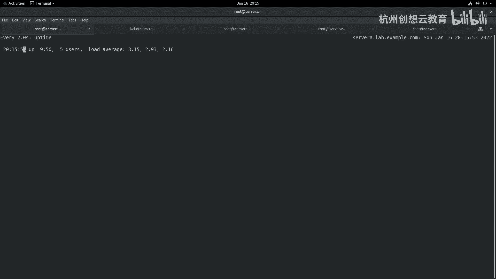

# 红帽认证系列工程师RHCE RH124-Chapter08-监控和管理Linux进程 - P4：08-4-监控和管理Linux进程-监控进程活动 - 杭州创想云教育 - BV1c14y1x7YQ

好，第四节啊，这个监控进程的活动啊。那么在这一小节里面，我们提到了一个新的术语啊，叫做负载平均值啊。负载平均值的话呢是我们在这个查看啊服务器这个啊资源使用率是最重要的一个参考啊值之一啊。

那么它呢是利用了nix内核啊来对我们服务器里面某些这个资源的这个侦探啊，侦探之后呢，得出来一个结果啊。那么什么是平均负载呢？那么简单来说呢，平均负载呢是指在单位时间内啊。

那么系统啊处于这个可运行状态和不可中断状态的一个平均数，也我们平常也可以把它理解为什么呢？叫做平均活跃技能数。所以说呢那么通过这个这个描述呢，我们可以理解啊，就是它和CPU啊并没有直接的关系啊，有关系。

但不是完全的关系，对不对？那么其中我们刚才提到的这个这个可运行的技入状态啊，就指的是我们这个刚才。讲这个PS命令的时候，那么看到R状态的，就说已经处于运行了或者等待运行的啊。

它马上就要使用CPU的资源了。那么还有一种呢就是什么呀不可中断的对吧？那么就是我们上一个内容里面的那个D状态。那么直些进程啊正在处于内核态的关键时期。

那么正在把某些重要的数据呢哎写入到我们的磁盘里面等等，一般都是一些等待硬件的一个IO响应，OK哎，然后呢，所以说呀我们在理解平均负载的时候呢。你不能单单纯纯的去啊看这个CPU。

并且呢你还要考虑到CPU的核心数啊，你的网络的IO和你的磁盘的IO要综合考虑。因此呢我这里总结了一下啊，就是说我们在看这个平均负载的时候呢，除了使用top命令之外，其实我们还要结合一些其他的命令去查看。

以便于分析我们的平均负载值变高是什么原因导致的。因为我们的这个平均负载呢，这个导致它变化的话呢，可能会出现这种情况。比如说。如果啊如果我们跑这个业务。

它属于是CPU密集型的那么我们肯定是最好是只关心这个CPU就可以了。那如果是一个什么呀IO密集型的。那你的CPU可能就很低啊，但是你的IO就很高。你举个例子啊，呃。

如果我们中间的小伙伴呢没有接触过另一个服务器的管理工作的，那么我们这个用过windows也不在少数，对吧？那么windows的话，如果你在你的PC上面啊，你的你的你的这个笔记本啊。

那么是这种比较传统的机械式硬盘，然后呢去安装windows10。啊，专用windows10OK那么那么你会发现啊，这个windows10呢经常会导致磁盘的IO啊，处于是百分之百活跃状态。

但是CPU的使用率啊非常非常低，低到这个看不到这个波动的这种情况啊，基本上没有使用的这种状态。那么这种也会导致你的负载比高是吧？所以说你要综合来考虑。O那么如何去看我们的负载呢？

那如果我们只是单纯的想看我们的负载的话呢，我们只需要在我们的终端上啊执行一个叫做up time的命令就可以了。up time呢可以打印出来当前的系统时间啊，系统运行的时间。

登录系统用户的数量和平均负载值。那么这个负载值呢分别记录了。啊，分别记录了我们的最近啊一分钟啊，5分钟、15分钟啊，我们的负载值的一个变化。如果这个值啊处于是上升的。

那么就意味着我们在我们的服务器在过去的某个时间段内啊，在过去的时间里面啊，我们的负载呀属于是什么呀？属于是下降的。因为你的一前面一分钟这个地方是数值小的，后面是大的，就说明过去的一段时间负载比较高。

现在呢反而降低了。同样相反的，如果我们的数值呀是一个向下趋势，就说第一分钟这个数值呢是偏高的。而中间这个数值呢是偏低的。最后一个数值呢是更低。那就意味着我们当前的服务器的这个资源使用情况。

正在处于什么呀？上升期啊，上升期。那么这个值到底是多少是最为合理的呢？那么要想参考合理啊，我们是去参考CPU啊，比如说我们的soA啊，我们的CPU呢可以通过这个命令啊。

叫LSCPU来查看我们的CPU的数量。在这个指令里面，我们找CPUS，会发现我们的这个机子呢是一个双核心的啊双核心的双核心的话呢，就意味着我们的这个值呀处于是二的时候呢，是最好的。

那么我们的CPU呢正好也不忙，也不够足够忙，也没有闲置，正好百分之百利用。如果低于二了，那就意味着我们的CPU啊在某些情况下呢是闲置的。如果超过二了，就意味着我们的CPU啊就有点什么呀负负重比较高了。

有些任务可能要进行这个过多的这个上下文的这个调度啊什么的，上下文切换啊，就就影响我们的效率。O所以这个是一个参考值。啊，一个参考值。那么除此之外呢，我们还可以使用一个叫做top的命令啊。

来查看我们的这个呃系统的这个啊动态的一个进程的一个使用情况。那么这个命令是在real企我们红帽企业板linkux里面唯一的一个啊就是。正式监控的一个工具啊，它没有像什么呀？它没有像这个sno啊。

这种系统一样啊，也可以装一个谁呀，装一个这个啊叫做一个Htop，对吧？啊，Htop的方式呢去看。因此我们需要自己去安装啊，我们这里呢可以来演示一下，好吧，那么在演示之前呢，我现在干嘛呢？先去这个。

网络上啊去下载一个这个呃一个一个软件啊，我们给他做个压力测试啊，压力测试我们做一个就简单做一个CPU啊，这种负载高的一个演示好了。好，那么我现在呢打开一个浏览器啊，我去搜一个软件呢叫啊stres啊。好。

我搜一下啊，那么从eel源里面就可以了。

然我去下载一个好吧？啊，那么这里呢就有一个链接啊，下面这个公共的啊点开啊。

哎，我们是reo8啊，所以说呢我这里呢准备选择这个real这个8这个。然后找到everything。然后接着呢，我们属于是叉8664个啊。哎，红帽的就业环境呢都是差八64的啊。

没有办法走A那个二个价格的啊。OK找到软件包啊，那么strs的话呢是S开头，因此呢这里找一个S。啊，S然后呢我去搜一下。啊，stress好，我把这个包呀给它把它拿下来啊，我这边呢在本地呢去安装一下好。

那么我我去哪里安装呢？我这边呀就。

我就这样去啊，我再打开新的绘画，好吧，SH rootot atserv a啊，我去给它荡下来。啊，大家之后呢，我去安装啊RPM杠I啊这个strs。好，装上去了，装上去之后呢，我去演示一下。

因为我的CPU是两颗，对吧？我就走一个strs。啊，然后呢杠杠CPU啊，CPU我我全部用两克啊，然后呢，运营的时间呢，我就来个多少呢？来个猛一点的，来个600啊，600秒OK放在后台。

那么这时候呢我的CPU立马就就就那个什么呀，提示一个信息了啊，我暂时不管它。然后呢，这边呢其实已经两个啊str的进程了啊，那么我把这个top呢先个Q退出，然后呢，我组一个这样命叫做watch啊。

杠DD呢之显的动态信息up time。那么那么它位置显示我们这个变化的地方，你看这个数值啊，白色的就是说明我们的这个啊负载啊在发生变化啊，那么与此同时呢，我干嘛呢？我这个。再打开一个终端的绘画。

我去连成到我的server a啊server A。然后呢我去执行一个top命令啊。top命令的话呢，我顺便呢演示一下我们的这个整个情况啊。那么top呢在使用的时候呢，我们可以啊可以使用这个问号啊。

来获得帮助OK问号啊来获得帮助。啊，那么常用的方法呢有，比如说现在啊在这个页面里面我们看到内容有哪些呢？哎，这些内容里面包含的。包含的有这个当前的性时间。啊，运行了多久，对吧？将近10个小时。啊。

登录系统的用户数量啊，我们的这个负载平均值啊，你看。一分钟的已经接近于三了，对吧？啊已经接近三了。那么就意味着我们短时间内啊负载正在上升。哎。

然后呢接着啊接着啊我们现在呢并不知道是是CPU的密集型的还是IO密集型的啊，我们暂时不知道啊，那么接着呢我们的任务数量呢一共是149个四个运行当中的啊，四个运当中的那如果我想把这个任务啊，换成什么线程。

那我可以使用Lsorry啊，我可以使用什么呀？我可以使用这个。唉，我使用什么T啊T啊去去去T还有L以及M。那么这些指令呢来去看我们的这个负这个这个什么线程啊，内存啊等等的一个情况啊。

那么现在我会恢复默认啊，然后呢我把CPU呢裂开啊，CPU选择一啊，把所有CPU呢拿出来，你看我们的CPU现在呢都在飙升啊，正在飙升啊，基本上90%了，对吧？然后呢，我这个干嘛呢？接着呢。

我把这个看哪些是在运行的，我是个B啊，那么被选中的部分啊都是在运行当中的进程啊进程。然后我在干嘛呢？这个。我在我在这个走一个shift的P啊，那么来看一下，按照CPU的使用情况来看一看。

那么最多的三个进程，两个进程啊，一个是stres，一个是2NGD这三个用的CPU最多啊CPU多，那么现在已经能够猜出来个大概了。那么可能就是CPU密集型的，并且是stres导致的。那么我们再来验证一下。

怎么验证呢？啊，我们linkux上面啊有一个做压力测试的一个神奇的工具啊。那么不在我们的课程范围之内，那但是呢我这里呢可以给大家演示一下。呃，有一个有一个包呢是专门用来做。

系统测试这个系能测试的时候一个工具啊，叫sts state。我来安装一下，然后呢，我去看一看到底是什么进程来导致我们的CPU啊这个提高的。其实刚才呢我们总过top啊啊已经能看到是stres了。然后呢。

我想再换一种方法，我用谁呢1个MP啊的那这个呢是专门来看CPU的，那么去看我们所有核心，然后呢，刷新5次。那么接着呢我们能看到这个呃每次的CPU的使用情况下，所有CPU的使用情况。

那么每个CPU0和CPU1的使用情况5次啊，那么能看到，那么这个用户的nice优先级的系统的，对不对？等等啊，都能看到，其中主要是用户，对吧？主要是用户。那么主要用户之后呢。

我们这个已经确定了肯定是用户啊，这个消耗的CPU资源，对吧？然后呀我们现在干嘛呢？现在呢我准备啊这个去找这个进程了啊，找着进程了。怎么找啊？我们可以个这个名字叫PID啊。

stateate啊杠U我去单元显示5次啊，这个间隔是一秒钟啊，我们去去指行一次来看一看看能不能找得着它啊。好，那么采集的样里面就出来了。那么左边呢是UID对吧？进程号啊。

用户的I找那么这里呢有两个比较高的，一个是62，有77。同样这里呢有6277，那么就是s了。经过多方率的对比啊，那么你看这个CPU用的也比较多啊，那么就是一个CPU的密型的一个进程啊。

那么接着呢我们再来稍微扩展一点知识啊，那么刚才呢我们提到了，那如果想我让我们的这个top呀看起来更好看，也可以使用Htop。那么正好呢我们去装一下啊，装一下啊，好，那么我刚才已经搜过了，这个是啊。

我去返回上一级去找一个H开头的。

啊，去搜一下htop。然后呢，我把这个包呀同样给它当下来。

啊。等下来，然后呢去安装准备。啊，叫做H套。哦，sorry，我怎么写个RM呢？RPM啊，杠IH top。好，我们来感受一下H套回车啊，这个看起来就非常的舒服了，对不对？你看CPU啊都红色了，对吧？

还可以呢按照下面的指令呢来来设置。比如说我想看一下我们的技程数F5啊，F5啊，这是我们的进程数的状态对吧？能设状态OK那现在呢这个我们的CPU啊这么多啊，这么多，刚才呢已经知道是谁呀，是stres了啊。

str了，那么str的话，它的进能是多少呢？

啊，我们看看能不能改一下这时间啊，比如说。我现在。啊，去改一下OK。stress啊，走走了一个一个别的指令啊，我com C，然后我去找那个进程啊进程。进程的话呢是进程。

它的进入ID呢是4782和4783啊，其实我们也可以使用什么呀？我们这边走个Q2就可以了，对吧？啊，我走个K哦。Q啊-9啊，这个它是两个啊，那么就Q200啊，杠9啊stres。回车啊，那么我们再来看啊。

那么我们的我们的CPU啊就立马下降了，对吧？立马下降了。那么随着时间的增加呀，我们的负载理论来说应该也在下降啊，也在下降。好，那么这是我们本章节的内容。

