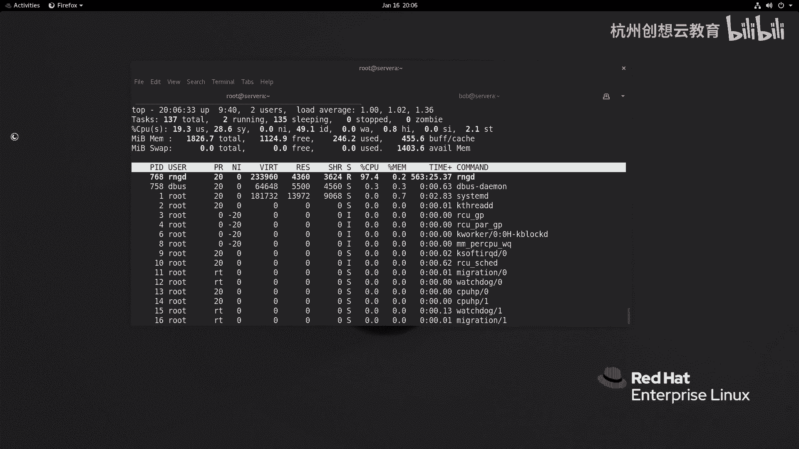
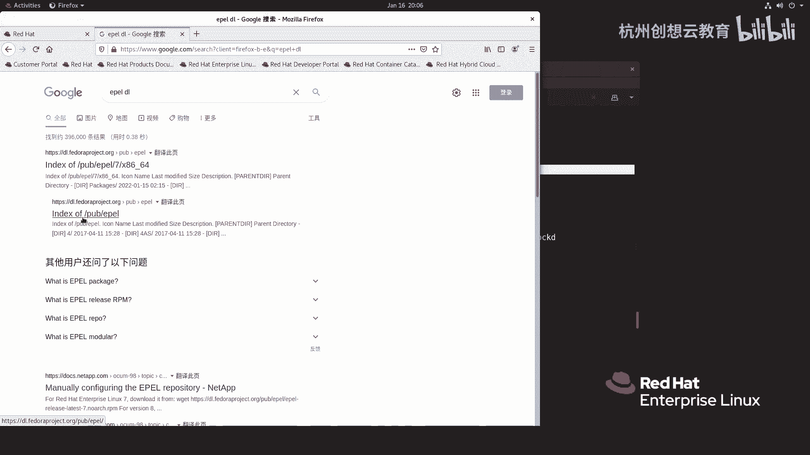
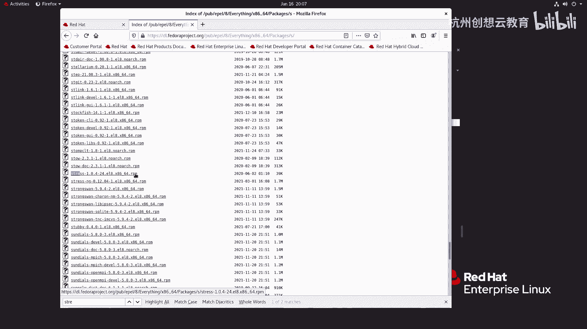
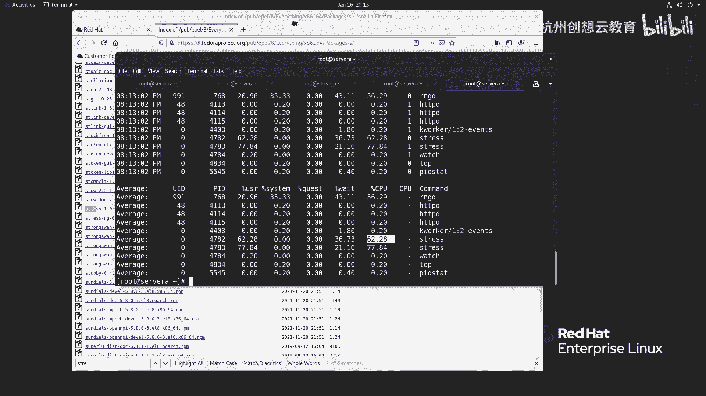
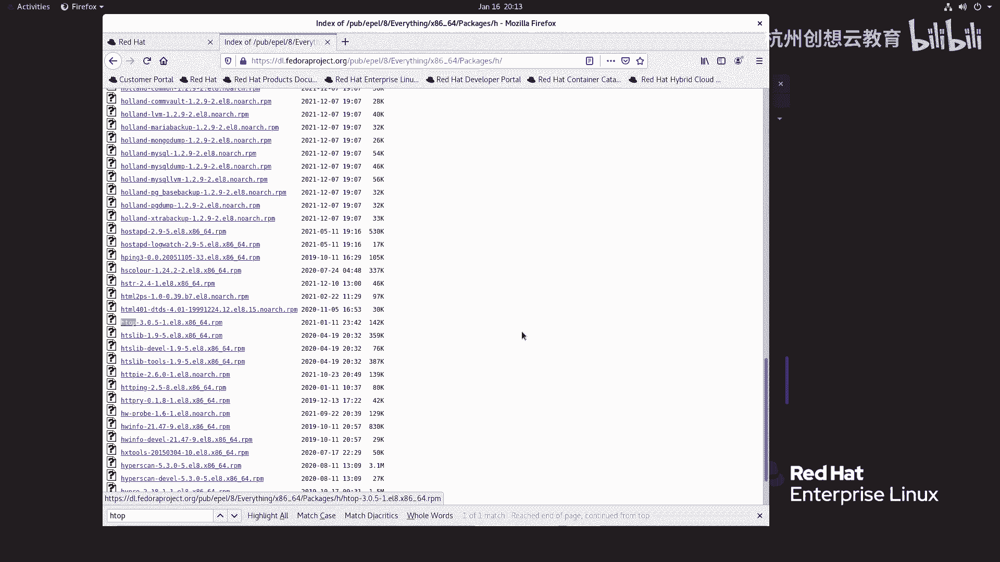
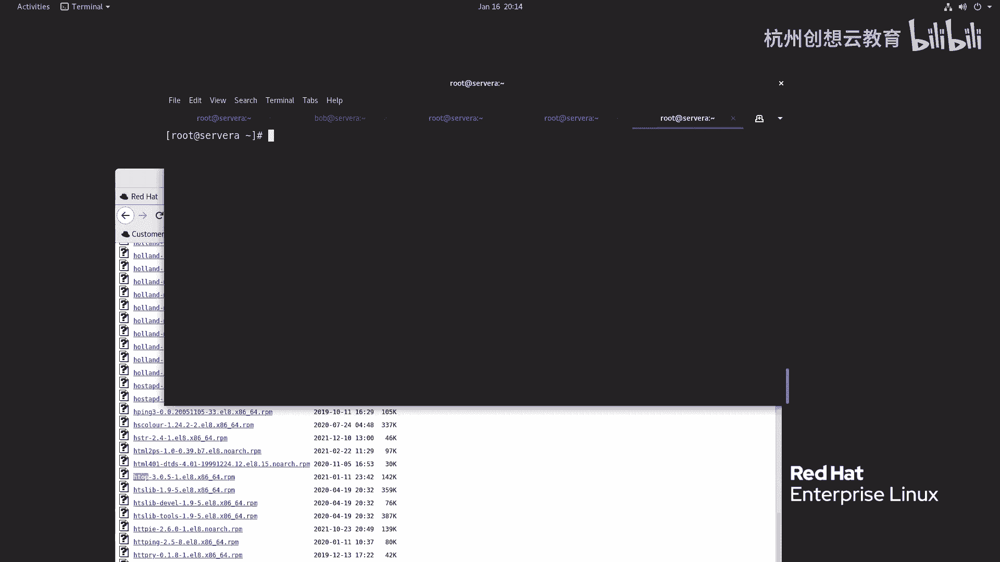
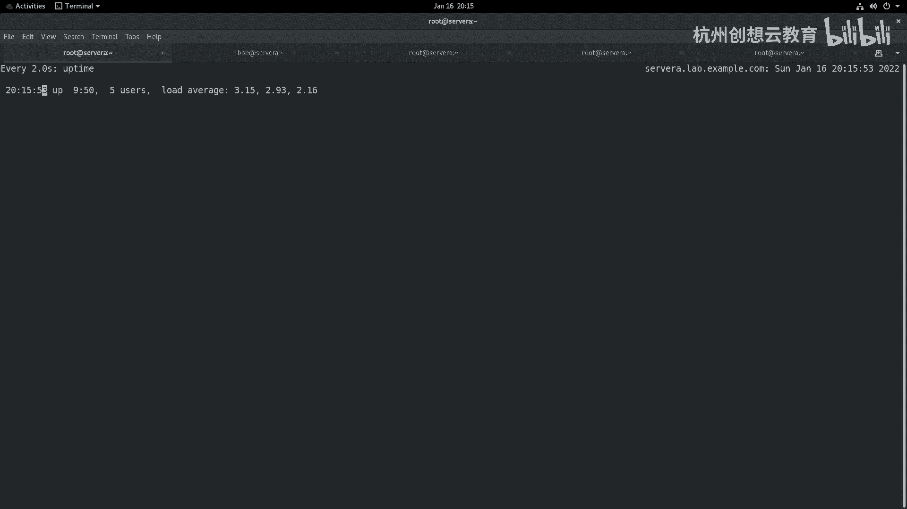

# 红帽认证系列工程师RHCE RH124-Chapter08：监控和管理Linux进程 - P4：08-4-监控和管理Linux进程-监控进程活动 📊

在本节课中，我们将要学习如何监控Linux系统中的进程活动。我们将重点理解一个关键指标——**负载平均值**，并学习使用 `uptime`、`top` 等命令来实时监控系统状态，分析系统资源的使用情况。

## 什么是负载平均值？⚖️

上一节我们介绍了进程的基本状态，本节中我们来看看如何衡量系统的整体繁忙程度。**负载平均值**是评估服务器资源使用率最重要的参考值之一。

它由Linux内核计算得出，反映了系统在单位时间内，处于**可运行状态**和**不可中断状态**的平均进程数。这个数值也可以理解为“平均活跃进程数”。

需要明确的是，负载平均值并不仅仅与CPU使用率直接相关。它综合反映了系统对CPU、内存、磁盘I/O等多种资源的整体需求压力。

*   **可运行状态**：指的是进程已经准备好运行或正在等待运行（即`ps`命令中的`R`状态），它们即将或正在使用CPU资源。
*   **不可中断状态**：通常指进程处于内核态的关键操作中（即`ps`命令中的`D`状态），例如正在等待硬件I/O响应（如向磁盘写入重要数据），此期间进程不可被中断。

因此，在分析负载平均值时，需要结合CPU核心数、网络I/O和磁盘I/O等因素进行综合判断。以下是可能导致负载变化的两种情况：

1.  **CPU密集型任务**：如果运行的是大量消耗CPU的计算任务，负载升高通常伴随着CPU使用率的显著上升。
2.  **I/O密集型任务**：如果运行的是频繁读写磁盘或网络的任务，即使CPU使用率很低，负载也可能因为等待I/O的进程过多而变得很高。

## 如何查看负载平均值？👀

要查看系统的负载平均值，最简单的方法是使用 `uptime` 命令。

```bash
uptime
```

该命令会输出当前系统时间、系统已运行时间、登录用户数以及**最近1分钟、5分钟、15分钟**的负载平均值。

**如何解读这些数值？**
*   **数值呈上升趋势**（如1分钟值 > 5分钟值 > 15分钟值）：意味着系统负载在近期有所下降。
*   **数值呈下降趋势**（如1分钟值 < 5分钟值 < 15分钟值）：意味着系统负载正在上升。

**负载值多少算合理？**
合理的负载值需要参考系统的CPU核心数。可以使用以下命令查看CPU信息：





```bash
lscpu | grep -E “^CPU\(s\):”
```

假设你的系统是**双核心**，那么：
*   负载值在 **2** 左右时，意味着CPU资源被充分利用，没有闲置。
*   负载值**低于2**，意味着CPU有闲置资源。
*   负载值**持续高于2**，意味着有些进程需要等待CPU，系统可能过载，效率会因频繁的进程上下文切换而降低。



## 使用 `top` 命令动态监控进程 🔍

除了 `uptime`，`top` 是Red Hat Enterprise Linux中一个功能强大的实时进程监控工具。

执行 `top` 命令后，界面顶部会显示系统概要信息，包括负载平均值。界面中部是动态变化的进程列表。

在 `top` 界面中，可以使用一些快捷键进行交互：
*   **`?` 或 `h`**：显示帮助信息。
*   **`P`**：按CPU使用率排序进程。
*   **`M`**：按内存使用率排序进程。
*   **`1`**：展开显示所有CPU核心的详细使用情况。
*   **`k`**：终止指定的进程（会提示输入进程PID）。
*   **`q`**：退出 `top` 命令。

## 实践：定位高负载元凶 🕵️♂️

为了更直观地理解，我们可以通过制造一个CPU密集型任务来观察负载变化。

1.  **安装压力测试工具**：
    ```bash
    # 假设已经从YUM仓库下载了stress的rpm包
    rpm -ivh stress-*.rpm
    ```

2.  **启动压力测试**（模拟双核CPU满载）：
    ```bash
    stress --cpu 2 --timeout 600 &
    ```

3.  **使用 `watch` 命令观察负载变化**：
    ```bash
    watch -d uptime
    ```
    白色高亮部分显示了变化的数值，可以直观看到负载在上升。

4.  **使用 `top` 命令定位进程**：
    在另一个终端执行 `top`，按 `Shift+P` 按CPU排序，通常会发现 `stress` 进程消耗了大量CPU资源。

5.  **使用 `mpstat` 工具分析CPU**（需安装 `sysstat` 包）：
    ```bash
    # 查看所有CPU核心的使用情况，每秒刷新一次，共5次
    mpstat -P ALL 1 5
    ```
    输出结果可以详细看到用户态(`%usr`)、系统态(`%sys`)等CPU时间占比，确认高负载主要由用户进程导致。

6.  **使用 `pidstat` 工具**（同样来自 `sysstat` 包）：
    ```bash
    # 查看详细的进程CPU使用情况，每秒一次，共5次
    pidstat -u 1 5
    ```
    这个命令能更精确地显示出是哪个进程ID（PID）消耗了多少CPU。

7.  **终止压力测试进程**：
    在 `top` 界面中按 `k`，然后输入 `stress` 进程的PID，或者直接在终端使用 `kill` 命令：
    ```bash
    killall -9 stress
    ```
    终止后，观察 `top` 或 `uptime`，会发现CPU使用率和负载平均值逐渐恢复正常。

## 扩展：使用 `htop` 增强体验 ✨





`top` 功能强大，但 `htop` 提供了更友好、直观的交互式界面（需要额外安装）。

1.  **安装 `htop`**：
    ```bash
    rpm -ivh htop-*.rpm
    ```



2.  **使用 `htop`**：
    ```bash
    htop
    ```
    在 `htop` 中，可以使用方向键浏览，`F5` 以树状图显示进程，`F9` 发送信号（如终止进程），界面色彩和布局让监控变得更加容易。

## 总结 📝



本节课中我们一起学习了如何监控和管理Linux进程活动。我们掌握了**负载平均值**的概念和解读方法，知道了它综合反映了CPU、I/O等系统资源的压力。我们实践了使用 `uptime`、`top`、`mpstat`、`pidstat` 等一系列命令来监控系统状态、分析高负载原因并定位问题进程。最后，我们还了解了 `htop` 这个更现代化的监控工具。通过本课的学习，你已具备初步的系统性能监控和问题排查能力。