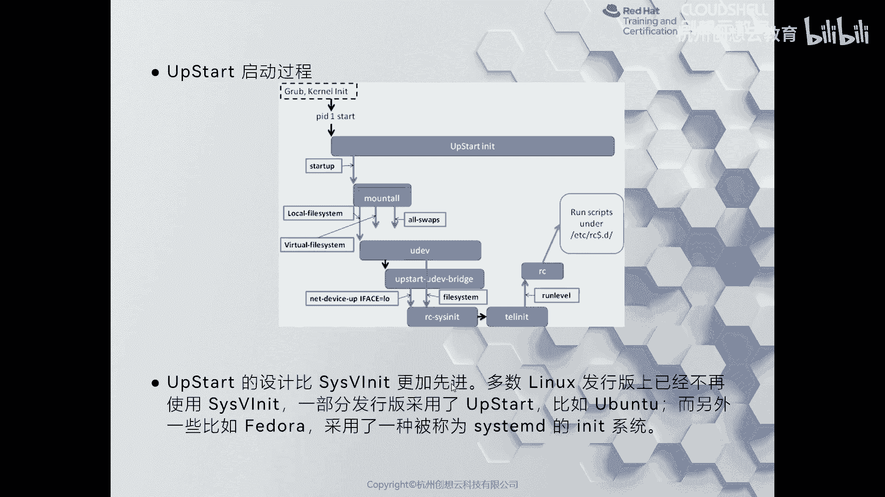
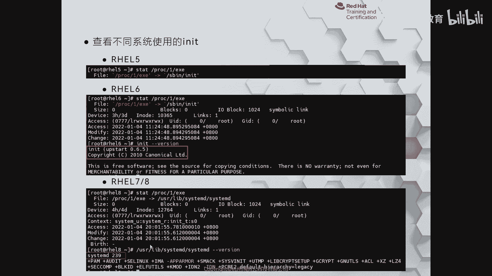
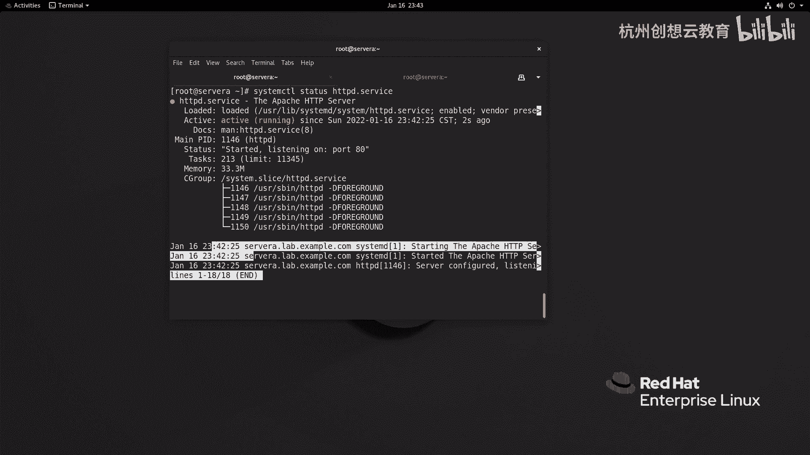
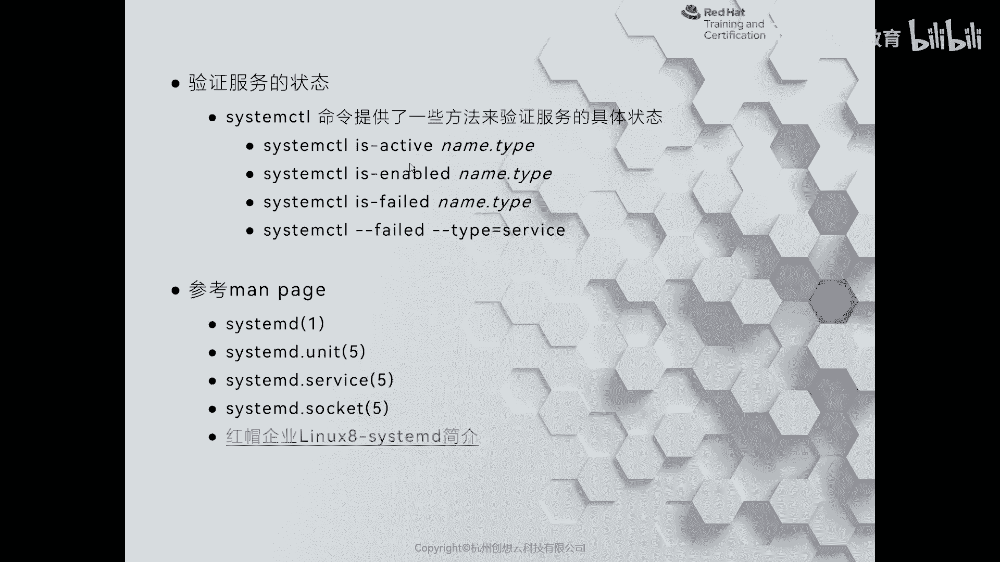
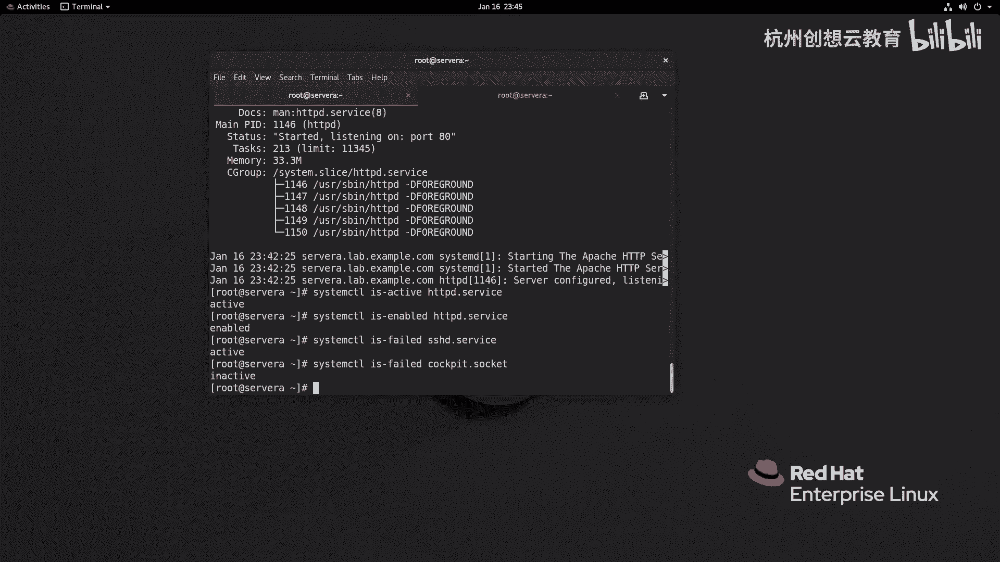
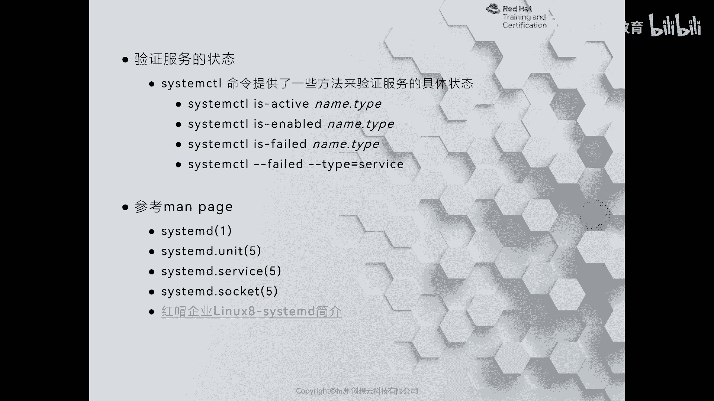

# 红帽认证系列工程师RHCE RH124-Chapter09-控制服务和守护进程 - P1：09-1-控制服务和守护进程-识别自动启动的系统进程 - 杭州创想云教育 - BV1NN4y1c7u4

诶第九章啊控制服务和食物进程啊，那这张的话呢给大家介绍一下在我们的real 8呀啊，一种全新的啊服务管理方式，其实严格意义上来说呢，是从红帽切换器呢就开始使用这种叫做system d的啊服务好。

我们来先看第一节啊，给大家介绍一下什么是cmd，那么要想了解c4 d的话呢，我们这个先来聊一聊啊，在system d之前，那么我们的linux系统啊启动的时候呢都经历了哪些变化啊。

那么在这个无论什么时候呢，那么linux启动，那么首先啊那么我们对服务器进行加电之后啊，那么它会从bios的设置呢来去找第一个启动设备啊，那么找到启动设备之后呢，去加载它的boot leader。

在boleader当中呢有关于启动时所定义的配置文件啊，那么linux里面啊一般用的是grab啊，grab这样的一个文件，ok那么根据grab呢去加入加载这个内核啊，然后呢进行一个内核初始化。

那么在这个阶段呀就特别的像我们什么呢，像我们这个呃使用啊这种windows pe啊，来这个装系统之前的一个过程对吧，那么在早期的时候我们装windows系统很喜欢使用windows pe啊。

哎就非常出名啊，那么这时候呢对于我们lex而言，那么我们的内核初始化完成之后，系统里面就有一个进程是一的，叫做in it，但是此时此刻呀，但但是此时此刻啊，那么虽然有了进程。

但是我们并没有进入真正的进入到系统里面啊，这时候呢你可以简单理解为是一个什么呀，内存状态的一个操作系统，就是说他把内存啊当做我们的系统的根目录，ok然后呢把我们真正的根目录呢作为只读的方式呢来挂载。

ok然后呢接着我们的in it这个进程，那么就需要发挥一个非常大的作用了，为什么呢，因为此时此刻我们运行的系统当中只有内核，只有内核的系统是没有意义的。

所以说呀我们的in it呢就会啊通过switch root，把真正的啊这个系统管理权限呀交给我们系统里面真正的根，然后呢再去加载一个启动进程，是一的叫做cmd来起来，但是呢这个是我刚才聊的呀。

是我们real 7和real 8的过程，主要大部分都还是一样的，ok但是呢在我们的real 7和real 6之前呢，经历了两个时期，这个时两个时期呢我们大家简单了解一下就可以了。

那么最早期的呢就是c4 five in it这个时代，那么这个时代呢就体现在我们的红帽切板五版本上面了，那么比较老的系统了，那么这时候的话呢我们的系统它是借鉴了这个unix上面的啊。

system five这个功能啊，那么并且遵循呢就是一个服务呢有一个啊这个脚本啊，这个来负责啊来负责，因此呢我们在系统启动的时候呢，它会选择检查我们etc有一个文件叫做in it tab啊。

就是初始化表，那么在这个初始发表当中啊，定义了我们的一些默认的运行方式，那么这个运营方式其实对于我们来说并不陌生啊，因为接触过红帽切板六的啊，这个小伙伴们呢应该对这个也是有所了解的，那么在早期的时候呀。

我们的系统是分为不同的run level的啊，run level 01直到run level 6，那么我们通过人为的啊去改这个in tab文件，可以把系统啊设置为什么呀。

这个run level 3模式啊，relevel 5模式啊，其中零代表的是关机啊，一呢代表的是单用户模式，一般用来trouble收听或者是重置密码的时候使用，而六的话呢则是一个重新启动系统啊。

那么这种脚本长什么样子呢，好我们来看一张截图啊，那么这个截图里面的话描述了我们早期的时候的这个啊服务位啊，都是放在哪些位置呢，放在etc r c。d目录下面，在etc的rc。d里面呢。

又根据不同的run level来命名了rcx。d的教目录，在我的这个截图里面呢，则是截截除了什么呀，哎relevel 5的启动项，不同的启动项都是用k开头或者是s开头，然后呢用数字来标示它的启动顺序。

而真正的程序呢则是存放在我们系统的，有一个etc里面，有个in it。d目录下面，这里面的每个文件呢都是一个服务，都有一个服务，所以说呢在启动的时候呀，那么它会按照我们安排的这个数字的编号来启动。

因此它的启动呢我们理解为是一个串行的，那么随着计算机的发展啊，那么我们这个呃硬件的越来越多啊，接口呢越来越丰富，那么就导致啊我们这种啊system five的这种方式呢，在启动系统呢很慢。

并且如果中间啊在系统加载完了之后再增加新的硬件，比如说插拔usb设备，那么就会导致一些问题，因此呢就催生了第二个阶段啊，第二个阶段呢我们称之为叫做upstart up star法。

这个贡献呢主要是右边图啊，优班图的开发人员啊，那么在早期的时候呢，想把这个linux系统啊装在笔记本上面，发现呢特别的不好用，我说大家有没有装过这个在笔记本上装过红帽起玩五啊，我是经历过的。

那么装完之后发现无解啊，很多功能啊，我想这个装在笔记本上了，一些内容啊，在早期的时候却发现呢没有办法去连接无线网络啊，或者说其他一些小小的毛病，那么嗯那么但是呢对于开发人员而言啊，那么在06年的时候呢。

就这个他干脆呀就开发一种新的啊，这个启动方式呢叫做upstart，其实up star相比较system file言呢啊只是说一个呃一步的一个更新啊，而是说在原有的基础之上做了改进啊改进。

那么这样的话呢可以使一些这个嗯是一些我们在试用期之后啊，这个增加的硬件设备啊，可以识别到，为什么呢，因为这个up start呢走的是一个基于事件这个驱动的一种方法，那么当你增加一个设备之后。

哎我们的这个u dv啊，唉就能感知到哎你增加设备，然后呢去启动相关的任务，但是这个cm five啊一个过程，那么cm five的话呢经过改变之后呀，它的优点呢就是什么呀，可以更快地启动系统。

相比较之前的而言啊，那么速度会快一些些啊，那假如说我们把这个cm five当做一个单车道而言，那么up star就相当于在单车道上的某个地方呀，某个地段增加了一个辅助车道啊，相对来说会更快一点。

并且呢这个有新的硬件的时候呀，唉可以干嘛呀，可以这个启动一些动态服务等等啊，呃那么cmm这个ref和up start呢，他们在管理的时候呢是不一样的，哎是不一样的。

那么在对于我们的app start而言啊，那么它是有这个什么任务的啊，这个任务类型的工作啊，还有这个其实这个教育方面应该翻译成作业是吧，哎这个任务类的作业啊，服务类的作业和什么呀。

abstract这种作业，ok那么我这里呢有一张图啊，可以帮助我们来分析一下这个up达启动过程啊，那么你会发现啊，那么我们的upstart音译起来之后呀，啊起来之后呢，那么它会挂在所有的这个文件。

本地的文件系统啊，虚拟的文件系统等等，然后呢去通知udv来发现我们的设备啊，然后呢去加载，看到没传统的什么呀，c4 a一这样的一个脚本啊，然后呢再去这个啊去加载不同的relevel里面的脚本。

然后启动系统，所以说呢这个相比较而言，这个up start呢要比cs win it呢要更好更好用啊，更好用，ok唉但是只是一个改变啊，那么真正啊在这个启动过程和对系统的管理呢，真正发生天翻覆地的变化呢。

还是在我们的c字母d诞生之后，那么大家呢也都在逐渐的去啊选择cmd啊，并且呢选择cmd呢，也曾当时呢也啊这个掀起了一阵这个呃比较大的这个波动啊，那么你像这个比较这个出名的这个打扮啊，deban这个系统。

那么很多人可能没用过啊，但是一定用过谁啊，u盘图对吧，那么右边图的上游呢就是得ban啊，ban也要打边啊，都行啊，ok那么这个系统在决定啊，在这个他们的这个内部啊，会议上在决定是否使用cmd的时候呢。

呃其实也遭到了很多人的反对啊，因为他他们认为呢cmod呢这个违背了啊linux的这个哲学啊，就是说一个服务只关管理一件事情，而cd的话呢却是所有的事情都交给我们cd来管理啊，c我们联合管理。

ok那么cmd的话呢，它在引用之后呢，它兼容我们早期的这种啊脚本啊是支持的，但是在我们的real 8上呢，这个脚本啊就体现了不是特别的明显了啊，那么感兴趣的同学可以安装一下real 7。

那么在real 7里面还有这个传统脚本的影子，在dl l8 里面诶，目前是没找着啊，除非你自己安装了第三方的软件啊，那么cmd的话呢可以通过cm cl这个指令啊，来管理性当中的一个或多个输入进程。

那么经过优化之后呢，cmd啊，可以并行的启动我们的服务，因此它的启动速度是大幅度的提高，注意啊，我说是大幅提高啊，那么我们你会发现啊，就是我们这个装完一个real 7或者real 8之后。

他启动速度的的确确肉眼可见的要比real 5 real 6快太多了，ok并且呢我们还可以干嘛呀，按需去启动我们的守护进程，而不是像脚本一样啊，一个一个的去加载啊，不需要ok那么自动的会处理依赖关系。

还可以使用什么呀，c group就是控制组来跟踪我们进程的内容对吧，听到c group大家应该很熟悉对吧，容器技术就利用了c group好，那么我们来看一张图，好看一张图来看一看斯特d有多么的厉害啊。

那么这个框架图呢能够能够非常直观的啊来看到这个呃cm d啊，在这个管理的这个所有内容，那么从上到下啊，那么最上层的是一些实用的工具，比如说c tc tl啊，这个journal ctrl。

那么这两个指令都是我们后面要经常用到的啊，那么除此之外呢，上面还有一些其他的指令，比如说这个c g l s和cg top，一般我们在做这个从real 7开始呀，有cd啊，作为系统管理的初始化工具之后。

我们通过这个c group来对啊，某些服务啊，这个做一些资源的控制的时候呀，到底他用了哪些资源，唉，我们可以通过cg ios和cg top来去查看什么，还有什么log in c条对吧。

控制用户的这个啊和登录相关的一些配置啊等等啊等等，ok那么再往下的话呢是一些守护进程类的啊，什么journal的呀，什么networked对吧，这个图就稍微略微有一点点老了啊。

你看这里还叫network，你会发现它叫什么叫做network manager，ok然后登录相关的啊目标对吧，那么早期的时候我们分为是run level，然后现在呢叫target啊。

比如这里提到的mute user啊，相当于以前的relevel 3，那么还有退化界面，相当于早期的软那个relevel 5啊等等，那么信用核心的话呢，我们还可以做一些管理一些单元啊。

那么以前的数字叫服务对吧，定制器单元啊，挂载单元，目标单元等等，那么这些单元呢都是以不同的后缀啊来体现的，因此呀我们在管理啊reo 7和real 8的时候啊，如果是以某一个服务。

那么就把这个服务呢最好是写齐啊，什么什么点sources，你说我不写行不行，没问题啊，你不写的话呢，就是以deal service来管理的，这个是走保留了默认。

但是呀在real 8上你会发现有些有一些这个提供食物进程的，不再是thy啊，又不是直接由soc来提供的，而是由谁呢，有socket啊，socket套接字来提供服务的，那不好意思，那你肯定是起错了服务啊。

起错了单元，因此呢除了点sc之外，一定要补全后缀，ok好，那么下面还有一些其他的内容啊，那么cm d的话呢，它属于是我们free desktop的一个项目。

所以大家呢可以去free desktop站点的啊，维基百科里面有一个software system d啊，那么也可以直接去cd啊。

那么如何去判断我们的系统使用的是这个system five这种还是upstart，以及我们刚刚接触的cd啊，那么我们在real在不同系统上啊，可以执行这些命令，那么我为了做了一个对比的效果。

我把这个新的版本啊做了一个对比，ok那么在real 5上呢，我们可以去判断啊进程唯一的一个叫做exe的文件，那么指向的就是因为它除此之外没有别的了啊，没有别的了，那么在real 6上呢。

那么它指向虽然也是in it，但是当我们去看in it版本的时候呢，你会发现啊，他写的谁呀，up start，那么版权呢属于是u盘主的母公司啊，母公司，ok那么从real 7之后呢。

那么我们再去看这个proper，下一啊，except except时候呢，它指向的就是我们的system d啊，那么d那么c那么d目前real 8的版本呢是239啊。

那么司令m t的版本呢也一直在演变啊，在做提升啊，叫做提升。

ok好，那么我们的重点呢就是要求大家呢知道啊，在system d啊这个大环境下啊，是一个趋势啊，也是趋势，ok那么我推荐大家呢一定要好好的研究研究什么是cmd。

以及如何通过cmd实现一些高级的系统管理功能，那么因为这个功能呢在我们整个的课程的范围之内，没有过多深入的去介绍啊，只是给我们介绍了简单的用法，那么我们常见的管理的单元类型啊，有点sources。

比如说阿帕奇对吧，阿帕奇的web服务叫做http d。sources，等到我们后面学到一些外部控制台的时候，你会听到一个一个那个名称呢叫cookie，但是它属于是点socket，那么点pass的话呢。

一般用于在什么打印机服务器上对吧，现在lex做打印机服务其实比较少了，ok然后呢我们可以通过c t m c t l命令呢去管理啊，我们的这些单元，我们可以通过cmc条杠t来查看所有单元啊，t类型啊。

好我们来执行呢，看一下效果，我现在呢在这个上面执行一个命令，叫做sim c t l gt啊gt然后呢help大家看一下，那么这是我们常用的单元啊，什么services socket啊。

tnt devices啊，device啊，mount or tmt等等，那么定制器呢就相当于是个计划任务啊，计划任务啊，sin分片啊，ok好，那么如果呢我们想去列出我们的单元呀。

或者是其他的一些动作也是可以的啊，那么我们可以通过这个a system city list unities啊，后面跟上类型来列出具体的内容，那么我这个图片上呢就是只列出了浮类型的单元。

大家同时呢你还可以通过啊cc啊，然后呢status跟上你的单元名称和单元的类型来查看具体的信息啊，那么我们来看一下，比如说呢我现在呢走一个命令啊，叫做system city list啊，unit啊。

unit，那么加个s所有的回车也非常多对吧，非常非常多，那么我只想看服务类型的啊，那么就是，这个tap啊，那么其实等号呢写不写都无所谓啊，services哎这是我们看的内容，那么左边呢是单元的名称。

中间呢load代表是否已加载，是不是活动的活动的子状态以及描信息，按照信息啊，那么如果我想具体的去看某一个服务，哎我可以通过啊cc tl啊status去看看，比如说我的sohtb d啊。

server since啊，那么这个服务呀当前是什么状态呀，是一加载啊，这是我们的服务单元所在的位置嗯，没有允许开机运行啊，没有允许开机运行，那么现在呢我给它起来好不好啊，让它开机跟随系统启动。

并且立即运行起来啊，立即运行起来啊，我们来看一看啊，那么就这个服务呢就起来了啊，现在呢是active啊，运行当中啊，running状态什么时候运营起来的啊，相关的文档主进程，我们的状态啊。

今天的端口号啊，任务啊，这个又消耗了多少的那个内存啊，这个最多能消耗多少内存啊，那么他转变了单位之后呢，是33。3兆啊，任务数量ok啊，sorry，这个是这个是指的是他的那个任务的绘画术啊。

那么下面的内存，然后呢是它的啊资源的一个限制的啊，相关的情况啊，再往下呢是我们的日志啊，日志，那么我们在通过status的时候呢，看啊c他们的状态呀，一般会看到啊这些内容啊。

比如说loaded啊，代表是我们的单元呢是否加载到内存当中，active呢代表的是服务一是否运行它的主机账号以及其他的内容，那么在这个status的状态当中啊，有区分的什么low地的啊。

那么具体情况具体对待啊，具体情况去对待，ok那么同时呢我们也可以去执行一些别的命令，比如说is active来查看某个服务呢是否在运行啊。

is enable某个服务呀，是否是开机启动的某个服务呢，是否是已经失败了，没有起来，对不对，哪些是失败了的啊，我们来我们来举个例子啊，我们来举个例子，我们来看一下这个效果啊，好我们来看一下这个效果。

那么现在呢走一个命令叫做cm c t l什么呀，is active http d deservices，哎活动的那这个服务有没有开机运行啊，引able的啊，enable。

enable ok运行的那这个服务有没有，那么某些服务是不是失败了的呀，比如说s h d，哎是活动的，我再换一个，比如说socket，ok你看inactive啊，是inactive，没有运行起来啊。

没有用起来，如果遇到问题呢，大家一定要记得啊。

去通过一些帮助来获得，那么我把我们平常用的比较多的帮助呢都拿到这里了啊，我们ppt上呢也有官网上针对于steam的介绍，那么这个来源于红帽的官方网站，ok那是介绍了一下这个cmd啊。

