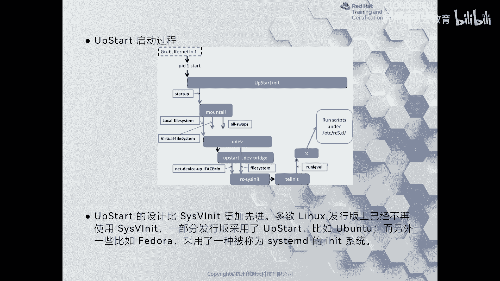
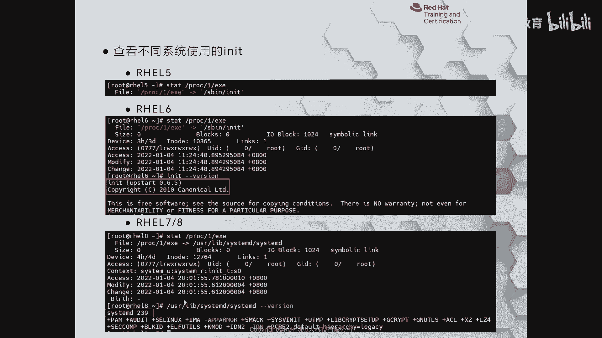
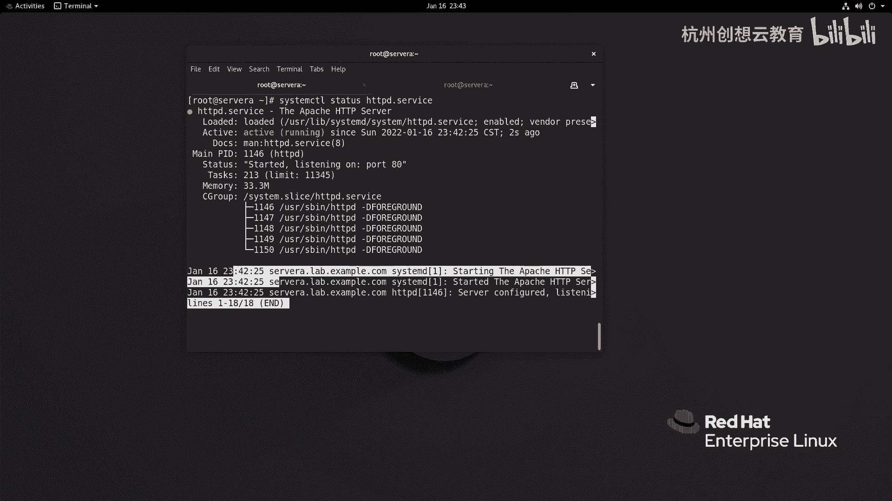
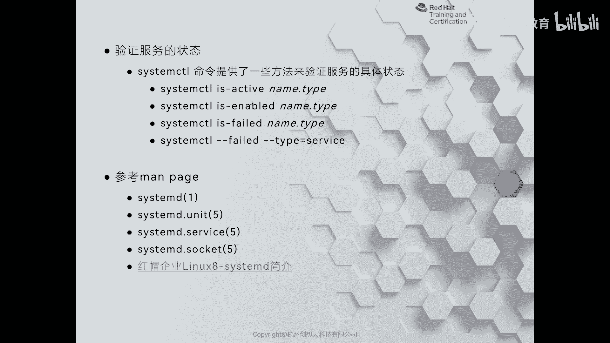
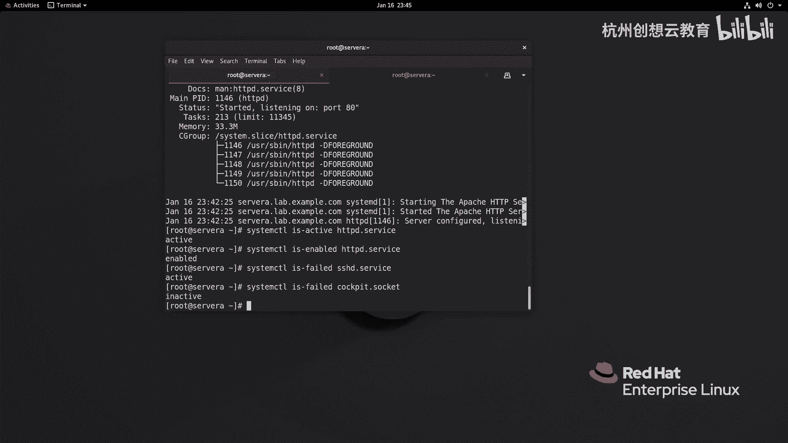
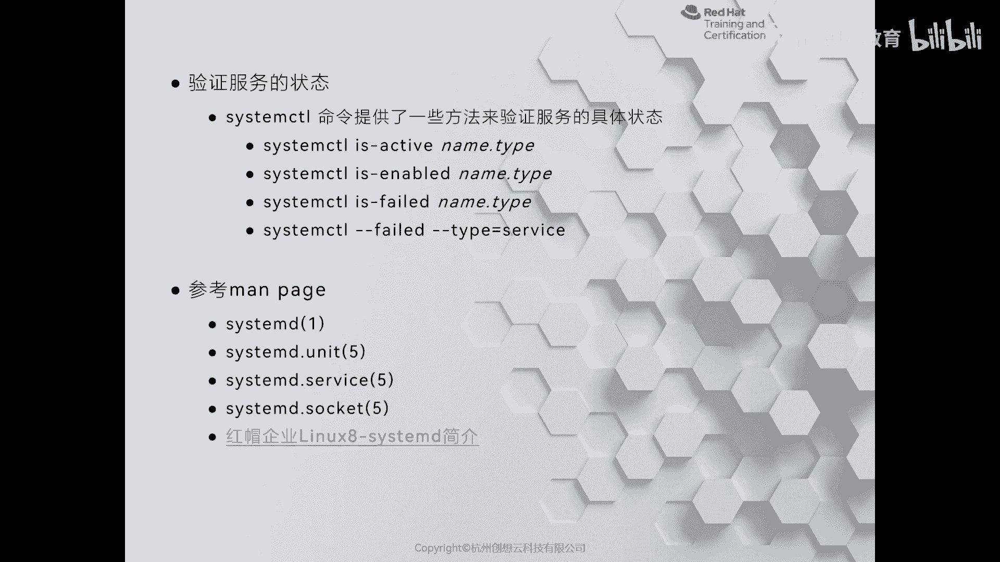

# 红帽认证系列工程师RHCE RH124-Chapter09：控制服务和守护进程 - P1：09-1-识别自动启动的系统进程 🚀

在本节课中，我们将要学习Linux系统中服务管理方式的演变，并重点了解现代Linux发行版（如RHEL 8）中使用的**systemd**系统和服务管理器。我们将从历史背景开始，逐步深入到如何识别和管理由systemd控制的自动启动进程。

## 概述：系统启动与服务管理的演变

在深入了解systemd之前，我们需要回顾一下Linux系统启动和服务管理方式的演变过程。这有助于我们理解systemd出现的背景及其带来的优势。

### 从System V init到Upstart

在systemd出现之前，Linux系统主要经历了两个服务管理阶段。

**System V init**是早期Linux系统（如RHEL 5）采用的方式。它借鉴了Unix System V的功能，其核心是`/etc/inittab`初始化表文件。该系统定义了不同的运行级别（runlevel），例如：
*   **runlevel 0**: 关机
*   **runlevel 1**: 单用户模式（用于故障排查或重置密码）
*   **runlevel 3**: 多用户文本界面
*   **runlevel 5**: 多用户图形界面
*   **runlevel 6**: 重启

服务启动脚本存放在`/etc/rc.d/`目录下，并根据运行级别组织在`rcx.d/`（如`rc3.d/`）子目录中。脚本以`S`（启动）或`K`（停止）开头，后跟数字表示启动顺序。实际的程序则存放在`/etc/init.d/`目录下。这种方式的启动过程是**串行**的，随着硬件增多，启动速度变慢，且难以处理动态硬件插拔。

随后出现了**Upstart**（主要由Ubuntu开发人员贡献）。它在System V init的基础上进行了改进，采用基于事件的驱动方式。当系统检测到新硬件（通过udev）时，可以动态启动相关服务。Upstart相比System V init启动更快，可以理解为在单车道（串行）上增加了辅助车道（并行处理部分事件）。

### Systemd的诞生与优势

尽管Upstart有所改进，但真正带来革命性变化的是**systemd**。它从RHEL 7开始成为默认的系统和服务管理器，并延续到RHEL 8。

systemd的主要优势包括：
1.  **并行启动服务**：大幅提高系统启动速度。
2.  **按需启动守护进程**：并非所有服务都在启动时加载，有些服务在需要时才被激活。
3.  **自动处理依赖关系**：简化了服务管理。
4.  **利用控制组（cgroup）跟踪进程**：为容器技术（如Docker）奠定了基础。
5.  **统一的管理接口**：使用`systemctl`命令管理所有系统资源。

systemd管理的资源被称为**单元（Unit）**，单元文件以不同类型后缀区分，例如：
*   **`.service`**: 系统服务。
*   **`.socket`**: 内部进程通信套接字。
*   **`.target`**: 启动目标组（类似于旧版的运行级别）。



## 识别Systemd管理的自动启动进程

上一节我们介绍了systemd的演变和优势，本节中我们来看看如何在实际系统中识别由systemd管理的、配置为自动启动的进程。

### 检查系统使用的初始化系统

首先，我们可以确认当前系统使用的是否是systemd。执行以下命令查看进程1（init进程）的链接：

```bash
readlink /proc/1/exe
```
在RHEL 8或RHEL 7系统上，此命令通常会返回`/usr/lib/systemd/systemd`，表明正在使用systemd。

### 使用systemctl命令列出和管理单元

`systemctl`是管理systemd单元的核心命令。

**列出所有已加载的单元：**
```bash
systemctl list-units
```

**仅列出特定类型的单元（例如服务）：**
```bash
systemctl list-units --type=service
```
命令输出包含以下几列：
*   **UNIT**: 单元名称。
*   **LOAD**: 单元配置是否已正确加载。
*   **ACTIVE**: 单元的高级激活状态（如`active`， `inactive`）。
*   **SUB**: 单元的低级激活状态（如`running`， `exited`）。
*   **DESCRIPTION**: 单元描述。

**查看特定服务的详细状态：**
例如，查看HTTPD服务的状态。
```bash
systemctl status httpd.service
```
状态信息包括服务是否已加载(`Loaded`)、是否活动(`Active`)、主进程PID、最近日志片段等。

### 检查服务的启用与活动状态



以下是用于检查服务状态的常用命令。

**检查服务当前是否正在运行（活动状态）：**
```bash
systemctl is-active <unit_name>
```
例如：`systemctl is-active sshd.service`

**检查服务是否设置为开机自动启动（启用状态）：**
```bash
systemctl is-enabled <unit_name>
```
例如：`systemctl is-enabled httpd.service`

**检查服务是否处于启动失败状态：**
```bash
systemctl is-failed <unit_name>
```

### 获取帮助

在使用systemd和`systemctl`时，可以随时查阅帮助文档。



**查看systemctl命令的帮助：**
```bash
systemctl --help
```



**查看systemd的官方文档（在线）：**
红帽官方文档和`freedesktop.org`的维基百科提供了详细的systemd信息。

## 总结





本节课中我们一起学习了Linux服务管理从System V init、Upstart到systemd的演变历程。我们了解到systemd通过并行启动、按需激活、依赖管理等功能，显著提升了系统性能和管理效率。我们重点掌握了如何使用`systemctl`命令来识别和管理由systemd控制的系统进程，包括列出单元、查看详细状态以及检查服务的活动和启用状态。理解这些基础知识是后续进行服务控制（启动、停止、启用、禁用）的前提。